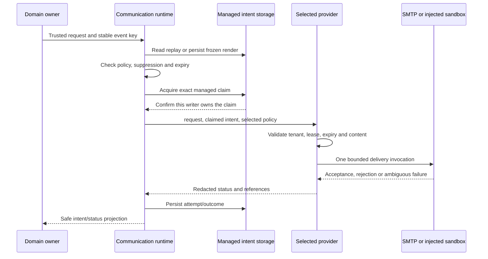

# Communication Provider Runbooks

Beginners should first distinguish a template preview, sandbox acknowledgement,
SMTP server acceptance and an observed customer receipt; they prove different things.

Providers deliver frozen messages; they do not decide whether an order is ready,
an employee is verified or a testimonial has consent. Think of them as delivery
services that receive a prepared envelope. The business domain chooses the
recipient and purpose; Communication renders, persists, claims and supervises
delivery. Email and SMS share this ownership model but have different transport
and qualification requirements.

Functional owner: nodics.communication. Technical owners: smtpCommsProvider and
smsCommsProvider. This guide is for administrators, operators, partner developers,
QA, framework maintainers and AI tools. Business authors should start with
[Email and SMS Templates](email-sms-templates.md) for wording and branding changes.

## Implemented modes and limits

| Mode | Current implementation | Default | What success proves |
| --- | --- | --- | --- |
| Email SANDBOX | Injected credential resolver and send port | Disabled | Selected test port reported acceptance |
| Email SMTP | Real SMTP/MIME through Nodemailer with guarded test policy | Disabled; must explicitly select SMTP | Server accepted the one permitted recipient |
| SMS_SANDBOX | Durable adapter to an injected sandbox service | Disabled; sandbox-only | Selected test port reported acceptance |
| Production SMS carrier | Not supplied by this adapter | Not qualified | Requires a separately reviewed integration and acceptance |

None of these alone proves that a person read a message. SMTP DELIVERED is
transport acceptance, not independently observed mailbox receipt. SMS sandbox
DELIVERED is not a carrier delivery report or handset observation. Do not set a
liveQualified flag to bypass these restrictions: current adapters reject unsupported
live settings. Runtime credentials, recipient authorization and actual acceptance
remain explicit operational gates.

## Source map

| Concern | Framework source |
| --- | --- |
| Durable orchestration | nodics.communication/modules/commsCore/src/service/defaultCommunicationRuntimeService.js |
| Resource rendering | nodics.communication/modules/commsCore/src/service/defaultCommunicationTemplateService.js |
| SMTP configuration and adapter | nodics.communication/modules/smtpCommsProvider/config/properties.js and src/service/defaultSmtpCommunicationProviderService.js |
| SMS configuration and adapter | nodics.communication/modules/smsCommsProvider/config/properties.js and src/service/defaultSmsCommunicationProviderService.js |
| Verification challenge authority | nodics.communication/modules/commsVerification |
| Intent and attempt schemas | nodics.communication/modules/commsSchema |
| Template authoring and overrides | [Email and SMS Templates](email-sms-templates.md) |

## Delivery sequence



Providers receive the durable form `deliver({ request, intent, policy })`.
They consume intent.renderedContent, not a template code requiring provider-side
rendering. The legacy injected three-argument sandbox interface remains for
compatibility. Domain code must call the Communication owner rather than either
provider interface directly.

The runtime checks its own managed write marker and revision before delivery.
A zero-match update, read failure or another writer's claim is not authorization
to send. An expired external-delivery claim can be uncertain because a previous
worker may already have invoked the transport.

## Before configuring any provider

1. Identify the sending runtime and confirm its effective Communication/provider
   modules. A setting in a separate API runtime does not configure the sender.
2. Verify the template owner is discovered, resource selected, source trusted,
   recipient authoritative and business feature enabled by its existing owner.
3. Prepare an approved test recipient, controlled sender identity, private credential
   reference and redacted evidence plan. Do not use arbitrary customer addresses.
4. Verify schema installation and current intent/attempt contracts through the
   normal owner path. Source generation is not database installation.
5. Keep the adapter disabled until the approved test window. Configuration examples
   below show shapes and fake values; they are not deployment instructions to execute
   automatically or proof of production readiness.

## Email: controlled SMTP configuration

The provider type SMTP is registered by the existing provider module. Do not copy
its service name into a new provider registry. The following deployment fragment
selects it, but intentionally leaves delivery disabled:

```js
module.exports = {
  communication: {
    providers: {
      EMAIL: {
        type: "SMTP",
        enabled: false,
        mode: "SMTP",
        sandboxOnly: false,
        testOnly: true,
        liveQualified: false,
        senderReference: "notifications",
        credentialReference: "notification-mail",
        allowedRecipients: ["approved-recipient@example.test"],
        smtp: {
          host: "smtp.example.test",
          port: 587,
          secure: false,
          requireTLS: true
        }
      }
    },
    senders: {
      notifications: {
        address: "notifications@example.test",
        name: "Example Company"
      }
    }
  }
};
```

Replace fake values only in the correct customer/private deployment layer. The
authorized operator enables the selected provider during the controlled test.
Defaults such as timeout and maximum content size remain inherited unless an
intentional difference is required. Never commit a credential value to properties.

### SMTP settings

| Setting | Default or rule |
| --- | --- |
| enabled | false; true required to send |
| mode | SANDBOX by default; select SMTP for the real protocol |
| sandboxOnly | Must be false for SMTP, true for sandbox |
| testOnly | Must remain true for this controlled SMTP implementation |
| liveQualified | Must not be true; no unrestricted production mode is supplied |
| senderReference | Key in communication.senders |
| credentialReference | Key resolved by the existing secure configuration owners |
| allowedRecipients | Explicit non-empty list, at most 100 approved mailbox values |
| maximumContentBytes | Default 65536; bound subject, text and optional HTML |
| timeoutMilliseconds | Default 5000; valid integer 1 through 60000 |
| smtp.host / port | Explicit host, port 1 through 65535 |
| smtp.secure | Implicit TLS when true; port 465 requires true |
| smtp.requireTLS | Required STARTTLS when secure is false, except approved loopback fixture |
| smtp.allowInsecureLoopback | false by default; true allowed only for loopback tests |

TLS certificate verification stays enabled. Remote plaintext, ignoreTLS,
rejectUnauthorized:false and arbitrary SMTP options are not supported overrides.
For a local fixture only, the explicit allowInsecureLoopback option can permit
plaintext on localhost, 127.0.0.1 or ::1. Never carry that exception into a remote
deployment. Nodemailer gets bounded timeouts, no pooling, no transport debug/logging,
no file/URL access and no arbitrary attachment/raw-message options.

### Sender and credentials

communication.senders[senderReference] is either a plain mailbox string or an
object with address and optional name. The approved sender must match the
credential account user in the current controlled-test adapter; alias or delegated
send-as support requires separate qualification. Recipient input is one plain
mailbox, not a display-name expression, recipient list or arbitrary SMTP envelope.

Credentials resolve on every send. runtimeConfiguration.credentials takes precedence
when it owns the reference; otherwise secureConfiguration.credentials is used.
Supported secret object shapes are a login user/pass or OAuth2 type/user/accessToken.
These are descriptions of a protected store, not instructions to add plaintext
secrets to a source file. The existing secret owner supplies/rotates them.
The transport does not refresh OAuth tokens or retain credentials in a pool.

### MIME and content

The provider sends plain text and optional HTML as MIME alternatives. Both come
from frozen private intent content. Plain text remains required. Subjects reject
header injection, all representations are strings, and combined content is bounded.
Private templateIdentity does not become a message header or transport payload.
Providers never fetch a template, render a placeholder or resolve HTML asset URLs.

## Email: injected sandbox mode

Select the SMTP provider type with mode SANDBOX and a trusted
sandboxTransportService exposing resolveCredential and send. The provider also
needs its endpoint, senderReference and credentialReference, enabled:true and
sandboxOnly:true; all are deployment selections, not browser input. Defaults remain
disabled. Do not confuse a sandbox endpoint with smtp.host.

The durable path validates tenant, EMAIL channel, DELIVERING state, future lease
and expiry before ports. It projects bounded subject/body/optional HTML and excludes
private provenance. The injected port owns its sandbox protocol. It is not proof
that the real SMTP path or a mailbox has been exercised.

## SMS: injected sandbox configuration

The existing module registers SMS_SANDBOX. This illustrative selection remains
disabled and names a customer-owned sandbox port that must actually be implemented
through the normal service hierarchy:

```js
module.exports = {
  communication: {
    providers: {
      SMS: {
        type: "SMS_SANDBOX",
        enabled: false,
        endpoint: "https://sms-sandbox.example.test/messages",
        credentialReference: "notification-sms",
        senderReference: "notifications",
        sandboxTransportService: "AcmeSmsSandboxTransportService"
      }
    }
  }
};
```

The fictional service name is not built into Nodics. Compose a trusted exported
service with resolveCredential(reference) and send(envelope) before enabling the
selection in an approved sandbox. Methods are bound to the effective service
receiver so later-layer behavior remains available.

The send envelope contains endpoint, resolved credential, senderReference,
recipientAddressReference, rendered.body, idempotencyKey and timeoutMilliseconds.
The port must apply its own sandbox transport and recipient-resolution policy,
honor the timeout and avoid secret/content logging. Unlike SMTP, the SMS adapter
does not supply a mailbox-style allowedRecipients implementation or a live carrier
client. Provider qualification must establish those channel-specific controls.

The sandbox response needs a nonempty string reference, at most 256 characters;
an optional string code is bounded at 128. accepted:false maps to FAILED.
A valid acknowledgement otherwise maps to sandbox DELIVERED under the compatibility
contract. Port authors should return an explicit accepted:true on positive acceptance.
Malformed replies or transport exceptions after invocation are uncertain, not a
safe reason to send again.

### SMS safety and limits

- Validate matching request/authenticated/intent tenant, SMS channel, DELIVERING
  state, future lease, expiry and bounded identities before transport.
- Use a nonempty literal body only. HTML is rejected and template provenance is
  stripped. Do not pass an entire intent to a gateway.
- maximumContentBytes defaults to 1600 and is validated in the range 1 through
  65536. The bound measures UTF-8 bytes, not carrier segments or character credits.
- sandboxOnly remains true and liveQualified remains false. A real SMS provider,
  authenticated callbacks, opt-out handling, rate/cost controls and delivery-report
  semantics require explicit integration and acceptance.
- A credential/send port is trusted framework/customer implementation, not a
  public extensibility input. It must not be chosen by a submitted browser body.

## Customize and extend safely

Branding and wording changes belong in
[layered resources](email-sms-templates.md#customize-and-extend-safely), not transport
services. Select providers and actual deployment differences through the existing
configuration hierarchy. Do not add credentials, gateways or rendering code to
Kickoff merely because it is the demonstration project.

For a transport-specific requirement, use the existing provider's mergeable
exported service members and documented extension boundary. A later concrete
customer module can supply the sandbox service referenced above; reusable provider
mechanics belong with their framework owner. Do not replace Communication's claim,
idempotency, suppression or uncertainty ledger with a customer-owned queue.

A credential-resolver override must preserve reference-only configuration, least
privilege, rotation and redacted errors. A transport override must preserve tenant,
lease, expiry, content bounds and one-invocation semantics. A change to production
behavior requires its own reviewed contract and evidence; setting flags is not
qualification. Do not invent custom callback handlers that update employee,
order or testimonial status directly.

## Outcomes and recovery

| State | Meaning | Operator action |
| --- | --- | --- |
| UNCONFIGURED | Disabled/missing/invalid provider configuration or credential | Fix configuration through its owner; inspect supported recovery without inventing a new event |
| SUPPRESSED | Recipient/purpose/channel policy or delivery expiry prevents send | Confirm policy; never switch providers to evade it |
| DELIVERED | Selected adapter's positive acceptance evidence | Observe real mailbox/handset separately when required |
| FAILED | Definite rejection or invalid request | Diagnose redacted reason; use only authorized supported recovery |
| RETRY_PENDING | Known retryable rejection with bounded due time | Wait for due time and use the existing authorized retry operation |
| UNCERTAIN | Send may have happened; reply/claim outcome is ambiguous | Reconcile evidence before any resend |
| DEAD_LETTER | Attempt ceiling exhausted | Investigate and reconcile; do not reset counters to bypass policy |

The durable binding does not install an automatic retry scheduler. Authorized retry
checks current status, due time and attempt ceiling. Uncertain recovery requires
current managed revision, reason and an explicit decision: MARK_DELIVERED,
AUTHORIZE_RESEND or CANCEL. Authorization to resend is not itself a send.
Manual MARK_DELIVERED is operator evidence, not an authenticated provider receipt.

If the source-domain operation succeeded but notification failed, retain the domain
success and report notification progress separately. Never replay registration,
approval, password reset or consent capture to force a new message.

## Operations and troubleshooting

Use intent code, source reference, channel, template code/version, attempt count,
redacted provider reference, status and correlation ID to connect business events
with delivery. Do not log bodies, addresses, raw replies, OTPs or credentials.
Health/configuration availability does not imply external delivery readiness.

| Observation | Check | Safe response |
| --- | --- | --- |
| No intent created | Trusted source, command, resource and parameter validation | Correct caller/configuration before trying a new authorized request |
| Provider UNCONFIGURED | Effective sending-runtime settings, mode, refs and ports | Do not alter domain decisions or disable security checks |
| SMTP authentication rejected | Secret owner, account, expiry/rotation | Fix privately; do not paste secrets/provider text into tickets |
| SMTP sender rejected | Sender account binding and provider policy | Qualify alias support rather than bypassing binding |
| TLS connection fails | Host, port, required TLS and certificate trust | Fix endpoint/certificates; never disable validation remotely |
| SMS text rejected | Nonempty plain body and final UTF-8 size | Shorten the template and revalidate without HTML |
| Timeout after possible acceptance | Intent/attempt and provider evidence | Keep UNCERTAIN until authorized reconciliation |
| Template edits do not affect pending intent | Frozen stored render | Expected; no automatic content rewrite |
| Provider reports success but inbox is empty | Spam/quarantine, mailbox routing or carrier semantics | Gather separate observed-receipt evidence, avoid duplicate sends |

Incident handoff should identify mode, runtime, affected intent references,
redacted failure classification, whether transport invocation occurred, retry/
uncertainty state, policy constraints and the authorized next action. Include
residency, consent, rate/cost and rollback owners for any production qualification.

## Common mistakes

- Enabling a provider before verifying the effective sending-runtime policy.
- Treating SMS sandbox acceptance as a carrier delivery report.
- Committing credentials, disabling remote TLS validation or widening recipients.
- Passing templates to providers instead of frozen representations.
- Resetting attempts or changing event keys to bypass uncertain-send reconciliation.
- Updating domain approval or identity state in a provider callback.

## Verification and joint acceptance

Test defaults and customization with fake values first. Exercise disabled mode,
missing ports/credentials, tenant mismatch, expired lease/intent, subject injection,
oversized content, invalid recipient/sender, TLS downgrade refusal, accepted,
rejected and ambiguous outcomes, rotation and frozen replay. Inspect MIME text/HTML
and private-data exclusion. The focused suites live under the two provider test
directories and commsCore/test.

Only then, in a named approved runtime, install current schemas/adoption records,
inspect effective policy, enable one controlled provider and recipient, and observe
actual delivery. Test a real email client separately from Chrome previews.
A carrier test is separate from an injected SMS port test. Confirm domain state
does not change on notification retry and disable the controlled selection after
the agreed window. Record authored, generated, local-tested, runtime-tested and
live-observed states separately.

## Related topics

- [Communication overview](overview.md)
- [Template inventory, configuration and authoring](email-sms-templates.md)
- [SMTP implementation contract](../../../../nodics.communication/modules/smtpCommsProvider/llm/contracts/README.md)
- [SMS implementation contract](../../../../nodics.communication/modules/smsCommsProvider/llm/contracts/README.md)
