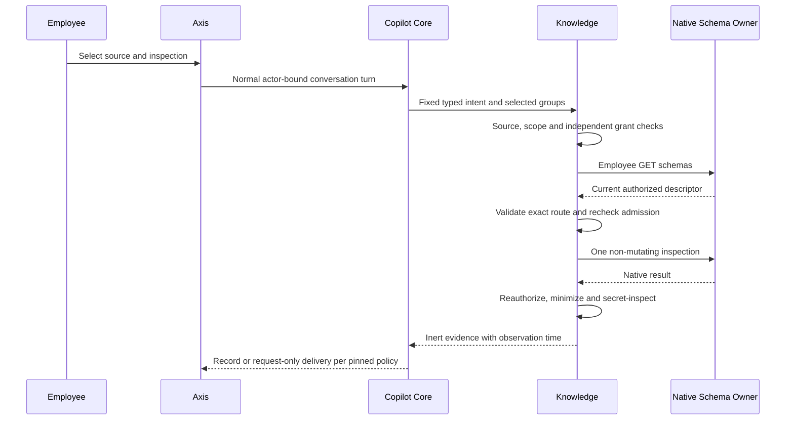

# Collection Inspection In Conversation

Functional owner: `nodics.copilot`. Technical owner: `copilotKnowledge`.
nDatabase and each domain retain schema, permission and reference-integrity
authority. Axis renders the existing conversation; it owns no operation registry.

## Business Outcome

Before requesting a business change, inspect the selected collection's fields
and available native operations without reading business records. Technical
operators can also preview native deletion impact for one exact identity.
These are deterministic, employee-only inspections, not AI-generated queries,
mutations, exports or automatic business-operation planning. They consume no
model tokens and do not send their inputs or results to an LLM.

Beginners should use View fields first and read the observation without proposing
any changes. Developers should follow the fixed owner-call and customization
contracts below; operators should preserve the original turn when investigating
a failed or lost response.

| Inspection | Native owner call | Returned evidence |
| --- | --- | --- |
| List collections | GET `/schemas` | Selected eligible collection names and labels |
| View fields | GET `/schemas/:schema` | Visible field definitions and advertised operations |
| View capabilities | Active GET `/<schema>/capabilities` | Fresh minimized native descriptor |
| Technical deletion impact | Active POST `/<schema>/delete-impact` | Matching target count and blocked flag |

The paths above are owner contracts, not editable form fields. All calls retain
the original employee bearer, tenant and enterprise. Native route availability
does not prove access; advertised operations do not prove that Copilot implements
their mutation journeys. A source's inclusion never grants create/update/delete.

## Administrator Setup

1. Compose Copilot API, Core, Conversation, Policy and Knowledge normally. Enable
   `copilot.api.enabled` through the existing approved configuration layer.
2. Register a DATABASE source under
   `copilot.knowledge.sourceRegistry.definitions`, with explicit module,
   tenant/enterprise/environment scope, classification, groups and exclusions.
   Keep RESTRICTED source policy and required secret inspection. Wildcard
   collection selection includes only current eligible native descriptors;
   exclusions always win. No database corpus is indexed for these reads.
3. Assign active groups within the enterprise source ceiling. Grant existing
   assistant use/read, `copilot.data.query`, restricted-source access and the
   owning schema discovery permissions to the appropriate employees.
4. For technical impact previews, grant `copilot.mutation.prepare` separately.
   The native owner must also advertise deletion to that employee. Read-only
   schema access remains insufficient even when the impact route exists.
5. Deploy the backend adapters before exposing optional UI labels:
   `copilot.core.conversationContext.liveReads.inspectSchema` and
   `inspectCapabilities`. Their defaults are View fields and View capabilities.
   Contracts without these labels retain the previous record-search controls.
6. Configure recording, transcript access and retention independently. Live
   inspection history is point-in-time evidence, not reusable authorization.

## Business User Steps

1. Open **AI & Copilot**, then **Conversation**.
2. Choose permitted active knowledge groups. An explicitly empty selection never
   falls back to every source when group selection is enabled.
3. Select **Read live evidence**, then a Business data source.
4. Select **List collections** to inspect selected metadata without reading rows,
   or choose a collection from the authorized list.
5. Select **View fields** or **View capabilities**. Search text is not required.
   The dialog closes and submits one normal conversation turn.
6. Read the observation timestamp, schema name and visible field definitions.
   `required`, `readOnly` and `primary` describe native metadata at that moment.
   No default/fixed values, business records or related collection names appear.
7. To read records, open the form again and explicitly submit a bounded search.
   An inspection never automatically follows links or executes an operation.

Controls wrap on narrow screens. Loading, missing selection, source errors and
disabled states prevent submission. Offline clicks do not queue for reconnect.

## Technical Impact Steps

There is no deletion form or delete command added by this capability. A technical
operator can submit the following fictional typed command through the existing
conversation after obtaining the exact native identity and required revision:

```json
{"intent":"copilot.data.deleteImpact","sourceCode":"business-data","input":{"schemaName":"address","identity":{"code":"office-address"}}}
```

1. Inspect the native schema contract. Supply the primary field, or the native
   display field when no primary field exists. Do not guess an identifier.
2. If native compare-and-set concurrency requires a revision, include that exact
   field and current value in `identity`. Managed revisions must be non-negative
   safe integers. No raw query operators or extra identity keys are accepted.
3. Submit the command explicitly. Copilot checks both source/read admission and
   mutation-preparation admission, then checks native delete advertisement.
4. Read the result. `targetCount: 0` may mean the supplied identity or revision
   is stale. `blocked: false` is a bounded native technical observation, not an
   authorization, guarantee of later deletion, or complete business-impact report.
5. No records are changed. Relationship names and reference counts are omitted.
   Business cancellation, deactivation, refund, publishing and similar lifecycles
   remain separate native commands with their own reviews and permissions.

For direct clients, the other two new commands are:

```json
{"intent":"copilot.data.schema","sourceCode":"business-data","input":{"schemaName":"address"}}
```

```json
{"intent":"copilot.data.capabilities","sourceCode":"business-data","input":{"schemaName":"address"}}
```

## Authority And Recording Flow



Both sides of each exchange are excluded from subsequent provider history.
Recording enabled: a repeated accepted turn replays original events without
repeating the owner request, including after restart. Recording disabled: results
are delivered only in the active request; lost content is not reconstructed.
Another explicit turn is a new observation, not recovery of a mutation.

## Failure And Recovery

| Observation | Meaning and next step |
| --- | --- |
| Source unavailable | Check current group assignment, source scope and grants; do not change the command's tenant or route. |
| Collection excluded | Ask the administrator to review the exclusion through normal governance. No alternative path is tried. |
| Inspection unavailable | The native contract may be inactive, incompatible or denied. Inspect owner configuration and permissions. |
| Enterprise impact refused | Readable enterprise metadata does not imply delete access. Preserve that boundary. |
| Permission changed in flight | The result is withheld. Refresh context and resolve authority before a new explicit inspection. |
| Invalid identity | Supply the native primary identity and required revision only; no operators or inferred values. |
| Zero impact targets | Identity/revision may be stale. Never report deletion, absence of dependencies or permission to delete. |
| Display limit reached | The response declares omitted rows. It is not a full export. |
| Lost recorded response | Reopen/replay the original turn. Do not infer a business operation occurred. |
| Lost unrecorded response | Original content cannot be reconstructed; another deliberate inspection is a new observation. |

The owner accepts at most 1,000 descriptor fields and a 256 KiB projected result.
Conversation rendering applies its smaller existing event/display budget and
reports omissions explicitly. No automatic page walking or model fallback occurs.

## Customize And Extend Safely

Presentation overrides belong in the existing customer-owned layered
`config/properties.js`, not a framework fork or new UI authority:

```js
module.exports = {
    copilot: {
        core: {
            conversationContext: {
                liveReads: {
                    inspectSchema: 'Inspect fields',
                    inspectCapabilities: 'Inspect native capabilities'
                }
            }
        }
    }
};
```

A later-loaded customer Knowledge extension can narrow `inspectionFields` in
`src/service/defaultCopilotDatabaseSourceService.js`; the default owner invokes
it through the effective mergeable service. Keep `inspect`, `authorizeInspection`,
`reauthorize`, `inspectionOperation`, `inspectionIdentity` and `responseData`
contracts intact. Never add defaults/secrets/related-source metadata, accept
arbitrary endpoints, turn inspection into mutation or weaken permission checks.
Domain-specific semantics belong to the native domain, not a Copilot fork.

Frontend contributors may wrap `CopilotLiveReadComposer` with the same typed
contract. Preserve fixed intents, explicit submission, selection/error/offline
gates and no credential configuration in the browser. Optional labels are
presentation, not authorization.

## Common Mistakes

- Treating an advertised native operation as a Copilot mutation adapter or grant.
- Treating an unblocked impact preview or zero matching targets as deletion proof.
- Copying defaults, relationship names or native routes into model prompts.
- Removing an exclusion or switching enterprise identity inside the command.
- Retrying a failed inspection through another route or an LLM.
- Confusing synthetic UI screenshots with signed-in business acceptance.

## Verification Boundary

Focused source tests cover allowed and denied scope, independent impact grants,
route injection, invalid identities, stale policy, grant revocation, malformed
native envelopes, secret scanning and later-layer field projection. Conversation
tests cover all three intents, recording on/off, replay and no provider fallback.
Axis tests cover explicit metadata actions, source selection, offline behavior
and optional-contract compatibility.

The opt-in native test composes a disposable local runtime with real Profile
authentication. It checks schema/capability inspection, allowed technical address
impact with zero matching targets, refused enterprise impact under read-only
native access, exclusions and recorded replay after restart. Zero-target native
acceptance is not evidence for every domain's populated reference graph.
Synthetic browser layout evidence is not full signed-in Axis acceptance.
These paths do not close the remaining Copilot mutation adapters or checkpoint 22.
