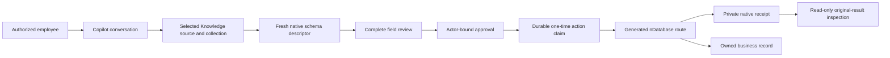
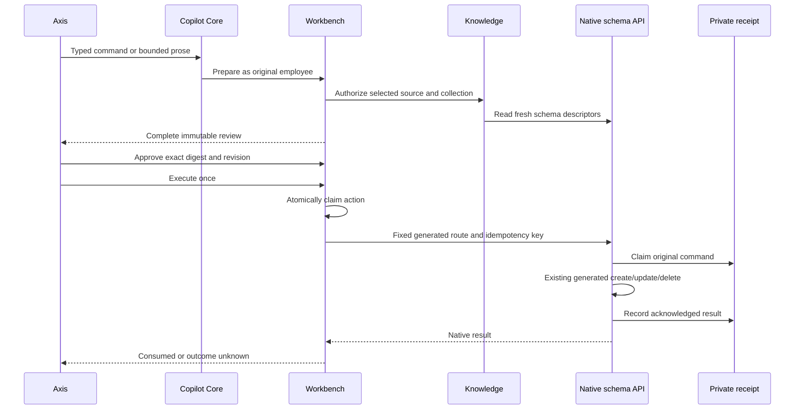

# Governed Selected-Schema Actions in Copilot

## Purpose

Authorized employees can create, update, or delete one record through Copilot
when an administrator has selected the database collection for Knowledge use and
has separately allowlisted that exact source and schema for mutation. nDatabase
remains the schema, authorization, validation, concurrency, persistence, and
receipt owner. Copilot owns clarification, complete review, actor-bound approval,
one dispatch attempt, and original-result recovery.

This feature does not expose arbitrary APIs or every Axis form. It supports only
native `GENERATED_CRUD` schemas with an active generated route, an editable
`code` identity, current Staged authoring permission, and a private native command
receipt. Bulk mutation and business-owned aggregate forms are excluded.

## Audience and First Use

Beginners should start with one disposable record in a non-production Staged
runtime and stop at the review screen before learning execution. Business users
work from the conversation and owning Axis workspace; they do not need database
credentials or runtime URLs. Administrators and operators configure exact source,
schema, permission, and receipt admission. Developers extend the native schema or
add a fixed domain command without moving ownership into Copilot.



## Supported Commands

| Command | Native route | Result required |
| --- | --- | --- |
| `data.record.create` | Descriptor-declared `PUT /{schema}` | Exact created `code` |
| `data.record.update` | Descriptor-declared `PATCH /{schema}` | Exactly one affected record |
| `data.record.delete` | Descriptor-declared `DELETE /{schema}` | Exactly one affected record |

The route, method, API version, module, source policy digest, and descriptor are
captured during review and rechecked before dispatch. A prompt cannot supply or
replace any of them.

## Administrator Setup

1. Register the database source through the existing Knowledge source registry.
2. Assign it to an active Knowledge group and select the intended collection.
3. Enable schema actions and allowlist each exact source/schema pair. Wildcards
   are rejected.
4. Enable native command receipts for the schema-owning module and configure the
   schema's private `commandReceipt.journalSchema`.
5. Grant Copilot preparation/execution permissions and the native schema write
   permission independently. Configuration never grants authority.
6. Qualify the native runtime, private receipt journal, and original-result
   inspection before rollout.

```js
module.exports = {
  copilot: {
    workbench: {
      schemaActions: {
        enabled: true,
        sources: {
          "product-data": ["approvedRecord"]
        },
        timeoutMs: 30000
      },
      receiptRecovery: { enabled: true }
    }
  },
  commandReceipts: {
    enabled: true,
    owners: { product: true }
  }
};
```

The defaults are disabled. `timeoutMs` must be from 1,000 to 120,000 ms. Do not
put framework capability into a customer Kickoff module. Use the normal layered
Nodics configuration owner for the deployment.

## Permission Model

Preparation requires an authenticated employee plus `copilot.data.query`,
`copilot.mutation.prepare`, and `system.schema.manage`. It also requires current
source, group, tenant, enterprise, environment, collection, and native schema
access. Execution additionally requires `copilot.mutation.execute`; original
result inspection requires `copilot.mutation.reconcile`.

nDatabase still checks the current generated write permission, schema access,
ownership, authoring stage, field policy, references, and concurrency on every
operation. Copilot permissions cannot override what the employee can do in Axis
or through the native owner.

## Business User Journey

1. Open **AI & Copilot > Conversation** under the intended enterprise.
2. Identify the exact Knowledge source and collection. Similar labels are not
   guessed, and an excluded collection remains unavailable.
3. Ask for one create, update, or delete, or provide typed JSON.
4. Resolve every clarification. Copilot does not invent required values,
   identity, revision, or fields.
5. Review the operation, source, schema, executing employee, and every command
   leaf. Nothing has changed yet.
6. Approve the current digest and revision, then execute once.
7. Verify the result in the owning Axis workspace.
8. If completion is uncertain, use **Inspect original business results**. Never
   create another action to retry an ambiguous write.

## Command Examples

### Create

```json
{
  "operation": "data.record.create",
  "sourceCode": "product-data",
  "schemaName": "approvedRecord",
  "model": {
    "code": "RECORD-001",
    "name": "Reviewed record",
    "active": true,
    "revision": 1
  }
}
```

Every required editable field must be explicit. Descriptor defaults do not let
Copilot silently omit a required business choice.

### Update

```json
{
  "operation": "data.record.update",
  "sourceCode": "product-data",
  "schemaName": "approvedRecord",
  "identity": { "code": "RECORD-001", "revision": 1 },
  "changes": { "name": "Reviewed record v2" }
}
```

The update cannot change identity or concurrency fields. The native owner rejects
a stale revision.

### Delete

```json
{
  "operation": "data.record.delete",
  "sourceCode": "product-data",
  "schemaName": "approvedRecord",
  "identity": { "code": "RECORD-001", "revision": 1 }
}
```

Use the native delete-impact view before approval when dependencies matter. The
generated owner still enforces reference restrictions and current revision.

## Confirmation and Execution



The executor writes `RUNNING` before dispatch. Only the exact created code or one
affected row proves completion. Transport rejection, malformed acknowledgement,
or a lost persistence acknowledgement produces `OUTCOME_UNKNOWN`; it never causes
an automatic second native call.

## Original-Result Recovery

The native inspection route is:

`POST /nodics/{module}/v0/{schema}/commands/inspect`

Copilot supplies the original operation, exact input, and original idempotency
key from the immutable action. Users cannot choose another module, schema, query,
or receipt. Recovery rechecks actor, tenant, enterprise, source policy,
collection selection, schema authorization, and native permission. A completed
receipt can close the uncertain row; a missing or started receipt remains
uncertain. Inspection never sends the write again.

## Input and Review Boundaries

- One record per action; no bulk create, update, or delete.
- At most 80 submitted fields, 65,536 serialized bytes, depth eight, and 240
  reviewed leaves.
- Review sections contain at most 20 leaves and are not silently truncated.
- Unknown, hidden, read-only, or sensitive fields are rejected.
- Credential-shaped keys such as password, token, secret, authorization,
  private key, credential, or API key are rejected at every nested level.
- Text leaves are at most 2,000 characters and cannot contain control characters.
- Only safe explicit codes identify source, schema, and record.

These limits are a security boundary, not a target to increase for complex
business setup. Add a domain-owned operation for aggregate workflows.

## Deliberate Exclusions

| Exclusion | Reason | Extension path |
| --- | --- | --- |
| Wildcard sources or schemas | Would create broad mutation authority | Add reviewed exact entries |
| Bulk mutation | Needs partial-failure and recovery semantics | Add an owning batch/Workflow contract |
| Business form with `createOperation` | Aggregate owner has stronger invariants | Use that domain command |
| Online/read-only authoring | Native lifecycle forbids generic writes | Use Staged or owner publication flow |
| Arbitrary route/module/method | Would bypass native capability ownership | Add a fixed reviewed adapter |
| Service-token fallback | Would replace the employee's actual authority | Grant the employee through the owner |
| Automatic retry/rollback | Completion may be uncertain | Inspect original receipt; use owner reversal |

## Troubleshooting

| Observation | Meaning | Action |
| --- | --- | --- |
| Configuration required | Feature, source, or exact schema is not allowlisted | Review deployment configuration |
| Permission required | Copilot or native schema permission is missing | Request the narrow missing grant |
| Collection unavailable | Source/group/collection selection excludes it | Review Knowledge assignment |
| Clarification required | A material input is missing | Send a complete corrected command |
| Descriptor changed | Route, lifecycle, fields, or policy drifted | Prepare and review a fresh action |
| Revision conflict | Another write changed the record | Read current state and start a new review |
| `OUTCOME_UNKNOWN` | Native completion is not proven | Inspect original results; do not retry |
| Receipt unavailable | Native journal is disabled or unqualified | Keep unresolved and fix owner setup |

## Common Mistakes

- Selecting a collection for Knowledge reads does not authorize mutation; the
  exact schema action allowlist and current employee permissions are separate.
- A successful review is not a native write. Approval and execution are separate.
- `OUTCOME_UNKNOWN` is not failure evidence and must not be retried.
- A record visible after an uncertain command is not proof that this command
  created it; use the original receipt.
- Enabling command receipts does not make every generated schema eligible.
- Generic CRUD is not a substitute for enterprise onboarding, publication,
  redemption, workflow, or another business-owned aggregate operation.
- Production enablement still requires deployment-specific runtime, permission,
  journal, privacy, and persistence qualification.

## Customization Contract

Add eligible fields and forms through the owning schema's effective Backoffice
metadata. Add sources through the existing Knowledge registry and assignments.
Add permissions through nAuth/Profile governance. Do not add a Copilot-owned
schema registry, duplicate persistence service, generic endpoint executor, or
project Kickoff implementation.

For a business aggregate, implement and document a fixed domain command with its
own native validation, idempotency, receipt identity, reversal policy, and live
acceptance. Then register that bounded capability with Copilot; do not relabel it
as generic CRUD.

## Verification

Local tests cover create, update, delete, source selection, exact allowlists,
descriptor drift, sensitive fields, intent planning, confirmation rendering,
receipt binding, and no-replay execution. Disposable real-runtime acceptance
starts Profile, Copilot, Product, MongoDB, Redis, and Elasticsearch, then proves
denied-reader behavior, create/update/delete, delete-impact, duplicate-execution
refusal, private receipt inspection, and restart persistence.

That acceptance qualifies the synthetic selected schema in the local composition.
It does not claim that every generated schema, customer deployment, permission
set, or business aggregate has been qualified.
