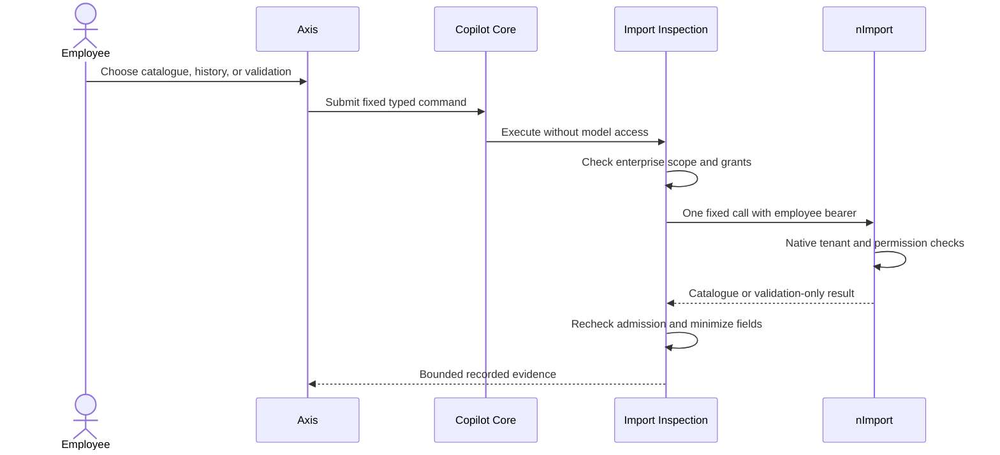

# Data-release inspection

## Purpose

Data-release inspection lets an authorized employee review the current nImport catalogue, recent run summaries, and validation-only plans from the Copilot conversation. It does not install a release, execute an initialization profile, upload a file, or import business records.

The feature is disabled by default. A deployment must bind one Import runtime and explicitly allow release, profile, and history data-type identities for each tenant, enterprise, and environment.

Beginners can use the fixed operation and selection controls without knowing native nImport routes. Business users receive a concise view of the releases or profiles that their enterprise is allowed to inspect. Developers configure exact identities and extend only the typed adapter contract. Operators use the same bounded evidence to diagnose catalogue, validation, and run-history issues without granting conversational installation authority.

## Business journey

1. Open the Copilot conversation and select **Inspect data releases**.
2. Select a catalogue, history, or validation operation.
3. For validation, select one configured release or initialization profile.
4. Select **Inspect**. Axis sends a typed command; it does not send a native route.
5. Review the bounded owner response in the conversation. Validation responses always state that no import was executed.

Catalogue and history lists are bounded display windows, not total counts. Items outside the configured scope are omitted without revealing their identities or count.



## Supported operations

| Copilot operation                 | Native owner call                                                       | Effect                                              |
| --------------------------------- | ----------------------------------------------------------------------- | --------------------------------------------------- |
| `import.release.init.catalogue`   | `GET /nodics/import/v0/init`                                            | Read configured initialization releases             |
| `import.release.core.catalogue`   | `GET /nodics/import/v0/core`                                            | Read configured core releases                       |
| `import.release.sample.catalogue` | `GET /nodics/import/v0/sample`                                          | Read configured sample releases                     |
| `import.profile.list`             | `GET /nodics/import/v0/initialization-profiles`                         | Read configured initialization profiles             |
| `import.run.history`              | `GET /nodics/import/v0/run/history?limit=25`                            | Read bounded tenant run summaries                   |
| `import.release.init.validate`    | `POST /nodics/import/v0/init/validate`                                  | Validate one selected initialization release        |
| `import.release.core.validate`    | `POST /nodics/import/v0/core/validate`                                  | Validate one selected core release                  |
| `import.release.sample.validate`  | `POST /nodics/import/v0/sample/validate`                                | Validate one selected sample release                |
| `import.profile.validate`         | `POST /nodics/import/v0/initialization-profiles/{profileCode}/validate` | Validate one selected profile and its ordered steps |

## Configuration

Configure `copilot.capability.importInspection` through normal Nodics configuration layering. Do not edit framework defaults for a customer deployment.

```js
{
  enabled: true,
  connectionName: "importRuntime",
  targetAuthority: { runtimeRole: "IMPORT" },
  maximumRows: 25,
  scopes: [
    {
      tenant: "default",
      enterprise: "exampleEnterprise",
      environment: "local",
      initReleaseCodes: ["foundation:init-v001"],
      coreReleaseCodes: ["foundation:core-v001"],
      sampleReleaseCodes: ["project:sample-v001"],
      profileCodes: ["foundationSetup"],
      historyDataTypes: ["init", "core", "sample"]
    }
  ]
}
```

Each exact scope must be unique. Empty or duplicate scope values, wildcard identities, unknown history data types, invalid runtime authority, or more than 100 identities in one category make the capability unavailable.

## Authorization and privacy

The employee requires `copilot.data.query` plus the native permission for the selected operation:

| Operation family               | Native permission         |
| ------------------------------ | ------------------------- |
| Catalogue and profile list     | `import.release.view`     |
| Release and profile validation | `import.release.validate` |
| Run history                    | `import.history.view`     |

Copilot forwards the original employee bearer and enterprise header. nImport remains the release authority and rechecks its own route permissions and tenant scope. The adapter performs one transport attempt, rechecks current Copilot configuration and authorization after the owner responds, and rejects the evidence if the binding changed.

The projection excludes source paths, filesystem locations, contribution implementation details, request actors, arbitrary metadata, imported records, and unconfigured identities. Responses are limited to 25 records and 24 KB.

## Why installation is not exposed

Current nImport receipts protect each release attempt, but the public multi-release and profile install commands are not yet bound to one caller idempotency key and immutable whole-command digest. After an uncertain response, Copilot cannot safely prove which steps completed or inspect one original command result. Automatic replay could duplicate writes.

Therefore these routes remain native-only:

- `POST /nodics/import/v0/init/install`
- `POST /nodics/import/v0/core/install`
- `POST /nodics/import/v0/sample/install`
- `POST /nodics/import/v0/initialization-profiles/{profileCode}/install`
- `POST /nodics/import/v0/media`

Before conversational execution can be enabled, nImport must own a durable whole-command receipt that binds actor, tenant, selection, expected versions, command digest, attempt, and original result. It must support inspection without replay and represent partial completion explicitly. Media import additionally requires a reviewed media-upload binding and original-command recovery across staging, parsing, and schema writes.

## Failure and recovery

- A denied Copilot or native grant produces no owner evidence.
- Invalid or foreign release/profile identities are rejected before transport.
- Malformed owner envelopes and any validation response claiming import execution are rejected.
- Transport failures are not retried by the inspection adapter.
- If configuration or authority changes while the call is running, the response is discarded.
- For native installation uncertainty, use nImport catalogue and run-history controls; do not repeat an install from Copilot.

## Troubleshooting

| Symptom                                   | Likely cause                                               | Safe response                                                                  |
| ----------------------------------------- | ---------------------------------------------------------- | ------------------------------------------------------------------------------ |
| Import inspection control is unavailable  | Capability is disabled or no exact enterprise scope exists | Ask an operator to verify the active configuration layer and runtime binding.  |
| A release or profile is not listed        | Its identity is not included in the employee's exact scope | Review the approved scope; do not replace the identity with a wildcard.        |
| Inspection is denied                      | Copilot or native nImport permission is missing            | Grant only the documented permission through the normal authorization owner.   |
| Evidence is discarded after a slow call   | Configuration or authority changed during execution        | Re-open the conversation and submit a fresh read after the change is complete. |
| Validation reports an execution           | Owner response violated the validation-only contract       | Treat the response as invalid and investigate nImport before trying again.     |
| Native installation has an unknown result | No whole-command receipt is available                      | Inspect native history and receipts; never replay the command from Copilot.    |

## Verification

Developers can run the focused backend contract tests from the framework repository:

```bash
node --test nodics.copilot/modules/copilotCapability/test/copilotImportInspection.test.js
```

Run the focused Axis composer tests from the Axis repository:

```bash
npx vitest run test/assistant/CopilotImportInspectionComposer.test.tsx
```

Operators should also verify the active environment with a permitted test employee: confirm that configured identities are visible, foreign identities remain absent, validation states that nothing was executed, and denied grants return no owner evidence. A local unit result verifies the adapter contract; it does not by itself prove a deployed connection, signed-in browser journey, or production authorization configuration.

## Common mistakes

- Enabling the capability without an exact tenant, enterprise, and environment scope.
- Using release labels as identities instead of the configured immutable release codes.
- Granting `copilot.data.query` but omitting the native nImport permission, or bypassing nImport authorization in a project extension.
- Treating a bounded list as the total catalogue or inferring hidden identity counts.
- Adding an arbitrary URL, request body, filesystem path, or wildcard to make configuration easier.
- Presenting validation as installation, or retrying an uncertain native install through the conversation.
- Recording source paths, request actors, raw imported records, or private metadata in conversational evidence.

## Customization contract

Later project or environment layers may narrow scopes, labels, row limits, and target binding. They must not introduce arbitrary URLs, paths, request bodies, wildcard release selection, provider-mediated execution, hidden background reads, or a second import authority. New Import operations require an explicit adapter declaration, bounded projection, native permission, focused tests, documentation, and recovery classification.
