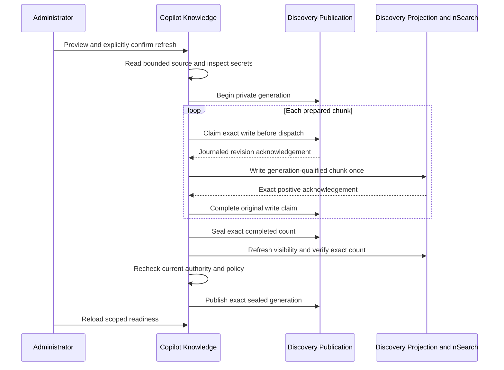
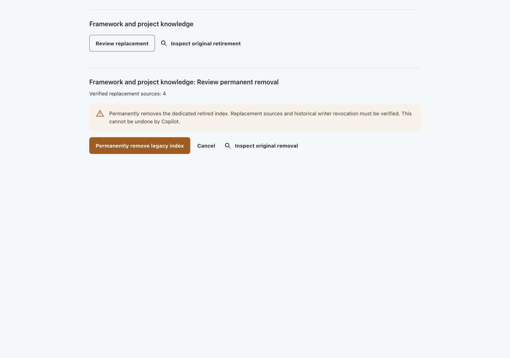
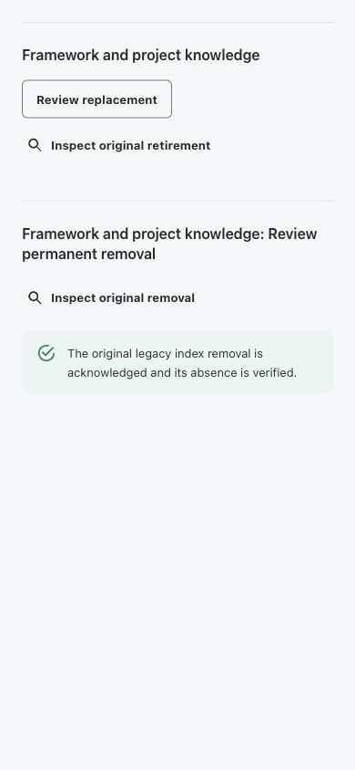
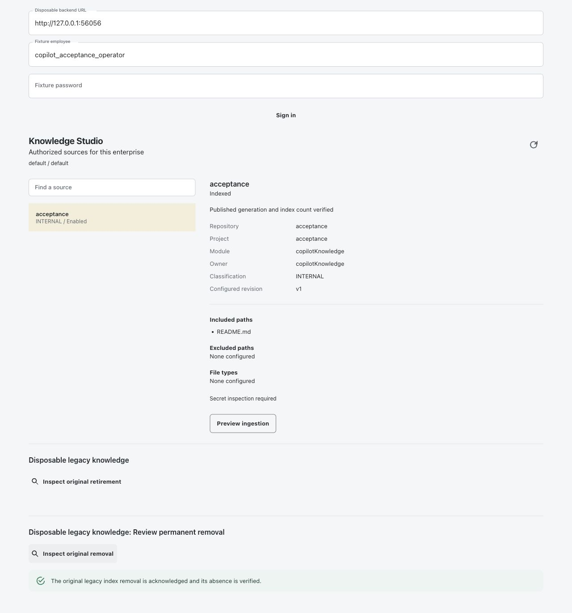
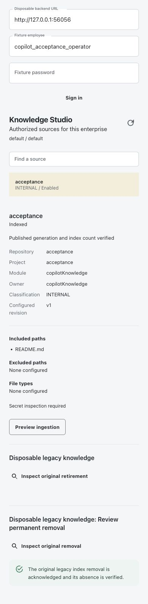
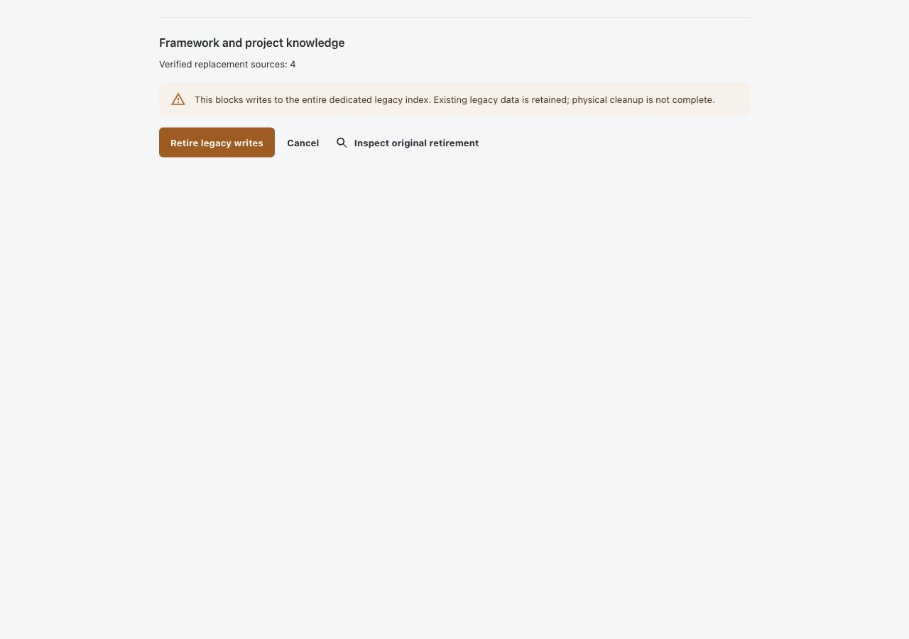
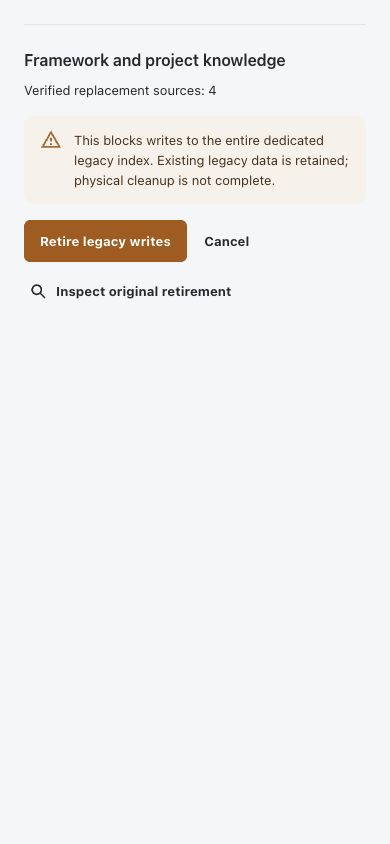
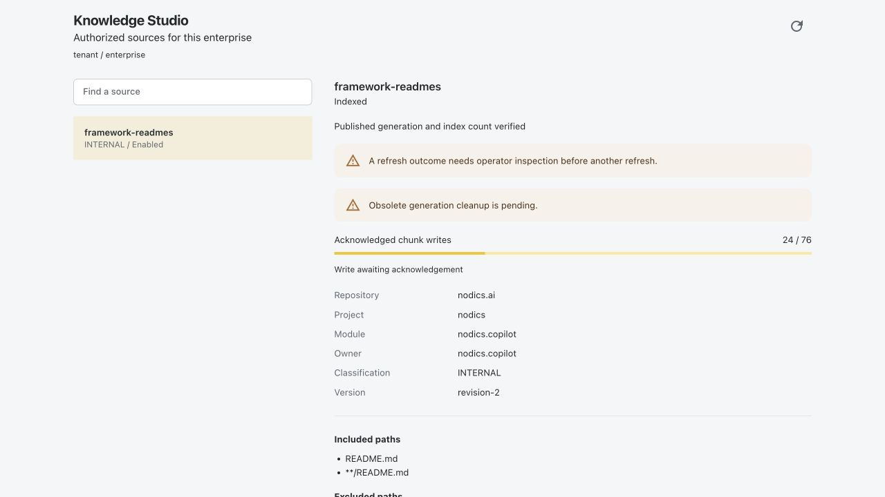
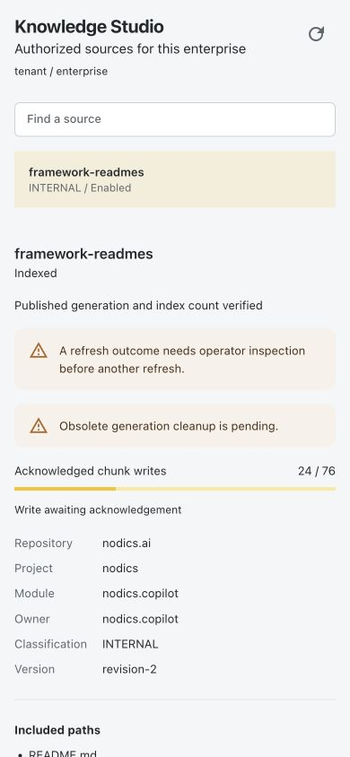

# Copilot Knowledge Progress and Recovery

Functional owner: `nodics.copilot`. Technical owner: `copilotKnowledge`.
Discovery owns publication manifests; nSearch owns physical index operations.
Process owns execution history and Cronjob owns schedules.

## Business Outcome

Knowledge Studio distinguishes the published knowledge used for answers from a
replacement that is still being written. Administrators can inspect progress,
retire a stalled publication and review eligible obsolete-index cleanup without
rerunning ingestion. These operations do not alter the source repository or
business database, invoke a language model, or cancel a provider request.

The controls require separate permissions and current source visibility. A source
hidden by enterprise ceilings, inactive groups or revoked source access is not
represented by an anonymous placeholder or hidden-source count.

Beginners should start with the read-only inventory and progress explanation.
An operator should qualify persistence and provider behavior before enabling
retirement or cleanup; a missing button is not a reason to widen user permissions.

## Before Starting

1. Provision Discovery's private `discoveryGeneration` schema and unique identity
   index through the normal framework lifecycle. Verify generated persistence
   supports the private `DURABLE_JOURNAL` protocol with journaled majority writes.
2. Deploy compatible guarded-write implementations on every ingestion runtime.
   A mixed deployment is not qualified. Unguarded callers cannot modify a manifest
   containing guarded writer evidence. Never remove its private writer fields to
   make an older runtime proceed.
3. Verify the selected nSearch provider's save, refresh, exact-count search and
   query-removal acknowledgements. A returned promise is not proof of a write.
4. Enable `copilot.knowledge.generationPublication.enabled` only through existing
   runtime configuration governance. It defaults off. Verify source registration,
   classification, secret inspection and enterprise/group selection first.
5. Provision the private `copilotKnowledgeMaintenance` receipt schema. Independently
   grant source management, source read, cleanup and recovery permissions to the
   intended operators. Installing source code grants no access.

DATABASE and EXTERNAL_LOG sources are live evidence sources, not static index
refresh or cleanup targets. Existing unqualified legacy chunks are excluded in
generation mode; exclusion is not physical erasure or a completed migration.

## Inspect a Refresh

1. Open **AI & Copilot > Knowledge Studio** and reload the inventory.
2. Select the authorized source. Review its configured version, includes,
   exclusions and runtime provenance before preparing another refresh.
3. Read current index readiness separately from pending-writer progress. A
   published generation remains selected while a replacement is incomplete,
   provided the published source policy still matches current policy.
4. When available, read **Acknowledged chunk writes**, shown as completed writes
   out of the expected number. Reload inventory for a fresh snapshot.
5. Use the phase explanation below. Never infer worker termination from age or a
   lack of progress. An uncertain writer requires inspection before another run.

| Phase | Meaning | What It Does Not Prove |
| --- | --- | --- |
| Waiting for the next write | No physical write is currently claimed | The process is alive or the job has finished |
| Write awaiting acknowledgement | One physical write has a durable claim | The provider committed, failed or stopped |
| Writes complete; publication verification pending | All expected writes were acknowledged and sealed | Visibility, count verification or publication succeeded |
| Indexed with durable evidence | Published policy fingerprint and exact index count matched at inspection | Answer quality, immutable readiness or complete source integrity |

The bar measures acknowledged writes, not overall job completion. Empty sources
have zero expected writes and can still publish an empty replacement after exact
count verification. Private generation tokens, write claims and index predicates
are never browser controls.



## Retire a Stalled Publication

1. Inspect the existing Process attempt and owning runtime. Retirement is a
   publication fence, not process cancellation or proof of physical quiescence.
2. Select the independent writer-recovery review for the selected source. The
   deployment must explicitly enable it and the minimum-age bound must pass.
3. Check the source and expected chunk count. Cancel if the source or operation
   is not the intended target; do not submit private tokens manually.
4. Confirm once. Fresh source policy, routing, permissions and manifest revision
   must match. The authorization receipt must persist before retirement.
5. Reload inventory and inspect the maintenance receipt. A missing completion
   acknowledgement is an unknown outcome, not permission to retry automatically.

Retirement prevents a guarded worker from obtaining another write claim. A write
already dispatched can still finish. Its original confirmed completion is
recorded even after retirement, but the worker cannot adopt another pending
generation or resume dispatch. The previously published generation is unchanged.

## Review Obsolete Cleanup

1. Reload the source after retirement or a successful refresh with cleanup debt.
2. Select **Review cleanup**. A currently pending generation blocks the reviewed
   cleanup journey. Database and log sources have no static cleanup.
3. Compare eligible generations with the separate operator-only count. Eligibility
   comes from Discovery, not from the browser or the age of an operation.
4. Confirm once only when the eligible count is positive. Every removal is scoped
   to the exact tenant, owner, index configuration and obsolete generation.
5. Inspect the acknowledged result and reload inventory. Operator-only debt may
   remain. Never rerun ingestion just to resolve a cleanup acknowledgement.

| Evidence | Cleanup Eligibility |
| --- | --- |
| Former completed published generation | Eligible after replacement |
| Retired guarded IDLE or SEALED writer | Eligible because no write is outstanding |
| Retired guarded WRITING claim | Blocked until original acknowledged completion |
| Legacy or unclassified token | Blocked; no retrospective proof is inferred |
| Lost write-claim or physical response | Blocked; elapsed time is not completion |

Authorization and completion receipts are separate. The maintenance-history
panel requires its own read grant and remains a read even when write gates are
disabled. A receipt that authorized cleanup does not prove deletion completed.
Search-provider timeout, conflicts, malformed counts or negative acknowledgement
preserve uncertainty and do not trigger an automatic retry.

## Retire a Dedicated Legacy Index

Legacy retirement is separate from abandoning one guarded writer. It places a
provider write barrier on an entire old physical index after verifying replacement
generations in a different index. Elasticsearch's modern promise-based client is
the supported native provider. The existing nSearch connection is reused.

This is **retirement with retained data, not physical cleanup**. Unknown legacy
tokens remain ineligible for generation deletion. The workflow never deletes or
recreates the index, removes a block, alters search roles, cancels workers or
copies unscanned legacy chunks. Retaining the blocked index prevents ordinary old
writes from automatically creating it again. Physical erasure uses the separate
qualified workflow below; retirement never implicitly authorizes deletion.

### Administrator Setup

1. Provision private `discoveryIndexRetirementReceipt`, its unique `code` index
   and generated services with `DURABLE_JOURNAL` persistence. Keep generic CRUD,
   search, events and caches disabled.
2. Keep the old logical nSearch binding registered. Its `indexDef.retirement`
   must declare `dedicated: true`, `immutablePhysicalName: true`,
   `ownerType: 'COPILOT_KNOWLEDGE'`, and exact `tenantCode` and `enterpriseCode`.
   These are deployment contracts, not inferred facts. The index administrator
   must establish exclusive ownership and prevent deletion/recreation, alias
   changes or name reuse during and after retirement. Shared indexes, aliases,
   data streams and wildcard names are rejected.
3. Provision a separate replacement logical/physical index through nSearch.
   Repoint the existing Knowledge ingestion/retrieval binding and refresh all
   intended static sources through recorded refresh. A current policy, sealed
   generation, exact physical count and stable manifest revision are required.
4. Configure `copilot.knowledge.legacyMigration.plans` in the owning runtime layer.
   Each stable plan code defines `label`, exact `tenantCode`, `enterpriseCode`,
   `legacyIndexName` and one to 100 unique `sourceCodes`. Include every intended
   replacement. Exclusions remain explicit policy decisions; an old index cannot
   reveal every historical writer or reconstruct deployment topology.
5. Grant `copilot.knowledge.migration.read` separately from
   `copilot.knowledge.migration.execute`, alongside current source-management and
   source-read permissions. The operator must be authorized for every source.
   Hidden plans do not disclose labels or source counts.
6. Qualify whole-index barrier semantics in an isolated deployment, including
   missing shard acknowledgements. Only then enable
   `copilot.knowledge.legacyMigration.enabled`. It defaults false; plans default
   empty. Never place provider credentials in Copilot policy.

| Configuration | Purpose |
| --- | --- |
| `legacyMigration.enabled` | Admits new reviews and retirement commands |
| `legacyMigration.plans.<code>` | Server-owned exact scope, old logical binding and replacement sources |
| `legacyMigration.presentation` | Labels, impact notice and retained/uncertain-result copy |
| `indexDef.retirement` | nSearch-owned dedicated, immutable physical-index qualification |

### Business and Operator Steps

Before starting, sign in to the selected local or deployed Axis environment and
open Copilot Workspace. Knowledge Studio is separately permissioned: workspace
access alone does not grant knowledge access or migration authority. A hidden
Knowledge Studio entry is not evidence of an empty index or completed migration.
Use the existing Profile access-management process to assign the intended
operator's scoped grants, then sign in again and refresh module discovery.
Do not automatically grant permanent removal to every administrator.

If Workspace fails with a confirmation/action lookup error, rebuild the selected
backend from the corrected Copilot route declarations. Route names must be unique
across the entire module; groups do not isolate repeated names such as `get`.
The registered-route regression exercises each HTTP path with its intended
operation, permission and privacy metadata, including the erasure endpoints.

1. Open **AI & Copilot > Knowledge Studio**. Fully authorized plans appear beneath
   the source workspace.
2. Select **Review replacement** on the intended plan. This performs reads only.
3. Review the verified source count and whole-index impact notice. Cancel if the
   plan is wrong. Physical names, UUIDs and provider credentials stay private.
4. Select **Retire legacy writes** once. Current source/routing checks run again,
   then a unique durable original claim precedes one provider barrier with
   transport retries disabled. Completion requires positive index/shard evidence
   followed by an exact-UUID blocked readback.
5. Read the result. **Retired** means the barrier was acknowledged and remains
   present at inspection. It is not a physical-erasure report or a current
   replacement-readiness lease. Legacy bytes remain.
6. After a timeout, select **Inspect original retirement**. Reads remain available
   with new mutation disabled. Missing or STARTED receipts remain uncertain even
   when current metadata says blocked. Metadata alone cannot reconstruct whether
   the original barrier acknowledged completion of in-flight writes.
7. Escalate uncertainty to the index operator. Never clear receipts, replace UUIDs,
   repeat the command, or change actors to bypass the unique claim. A lost response
   after durable completion can be recovered by inspection without another barrier.

```text
source authority + replacement generation/count
                       |
                exact reviewed fingerprint
                       |
              unique durable original claim
                       |
           nSearch whole-index write barrier (once)
                       |
       shard acknowledgement + same UUID blocked readback
                       |
          original receipt RETIRED; old data RETAINED
```

Private POST APIs are `/knowledge/migrations/:migrationCode/preview`, `/retire`
and `/inspect` under the Copilot API base. Preview and inspect accept `{}`. Retire
accepts exactly `{ confirmed: true, reviewDigest }`. Results explicitly include
`retainedLegacyData: true` and `physicalCleanupComplete: false`. See the
[Elasticsearch add-index-block contract](https://www.elastic.co/docs/api/doc/elasticsearch/operation/operation-indices-add-block)
for native acknowledgement semantics. Custom providers must implement equivalent
qualification through nSearch, not optimistic success in Copilot.

## Permanently Remove a Retired Index

This is a separate irreversible operation. The implementation supports dedicated
indexes with an explicitly complete **API-key-only historical writer inventory**.
Unknown writers, password-based/mixed credentials, shared indexes and deployments
without security are not qualified. Do not declare the inventory complete merely
to make the command available. The index administrator must verify it against
deployment/credential records and exclude concurrent manual recreation/name reuse.

Here, physical cleanup means removal of the live index through the provider API.
It does not certify disk sanitization, removal from snapshots/backups, or expiry
of independently retained audit records. Apply the relevant storage-retention
process separately; `ERASED` is not a claim of forensic or backup erasure.

### Operator Prerequisites

1. Complete the acknowledged retirement above. A STARTED or uncertain barrier
   does not qualify, even when current metadata shows a write block.
2. Have the credential owner invalidate every historical writer API key through
   its normal approved security process. Copilot does not revoke or change keys.
   The provider must still return each exact key with `invalidated: true`;
   missing/expired-only keys do not count as revocation evidence. Retention of
   invalidated keys is bounded by Elasticsearch, so qualify before that evidence
   expires. See [Elastic API-key invalidation](https://www.elastic.co/guide/en/elasticsearch/reference/current/security-api-invalidate-api-key.html).
3. Configure the existing nSearch model's `indexDef.retirement.erasure` in its
   owning deployment layer, using IDs only, never API-key secrets:

   ```js
   erasure: {
     writerInventoryComplete: true,
     writerCredentialMode: "API_KEY_ONLY",
     writerApiKeyIds: ["historical_writer_key_id"]
   }
   ```

   One to 100 unique exact IDs are accepted. The declared list must be exhaustive;
   this is a deployment qualification, not automatic discovery of historical users.
4. The effective cluster `action.auto_create_index` must be `false`. The provider
   checks transient, persistent and default precedence without changing settings.
   This conservative supported profile prevents ordinary automatic recreation;
   it does not prevent an administrator from explicitly creating a new index.
   Keep immutable-name ownership in force throughout the migration. See
   [Elastic index management settings](https://www.elastic.co/docs/reference/elasticsearch/configuration-reference/index-management-settings).
5. Keep the original private Discovery receipt and its unique index. Adopt the
   optional `erasure` field through the normal schema build/deployment lifecycle.
   Never remove this receipt or reset its erasure claim to retry a command.
6. Grant `copilot.knowledge.migration.erase` separately, alongside existing
   migration read/execute and current source permissions. Explicitly enable
   `copilot.knowledge.legacyMigration.erasureEnabled` and the existing migration
   gate only after qualification. Both default disabled. Enabling a flag does not
   qualify the provider or grant any user access.

### Business User Steps

1. In **Knowledge Studio**, find the configured migration plan's permanent-removal
   section. Check that the source migration and retirement have been completed.
2. Select **Review permanent removal**. No deletion occurs. Copilot verifies
   current source authority, replacements, original UUID and provider writer evidence.
3. Read the irreversible-impact notice and verified source count. Cancel if this
   is not the intended migration. Index names, keys and receipt identities remain
   backend-private.
4. Select **Permanently remove legacy index** once. The original retirement receipt
   is conditionally claimed before one exact native deletion. Current scope and
   replacement checks run again; transport retries remain disabled.
5. `ERASED` requires native positive acknowledgement, exact absence and durable
   original completion. A timeout or `OUTCOME_UNKNOWN` never authorizes another
   delete. Select **Inspect original removal** instead.
6. Inspection remains available with write gates off. Lost response after durable
   completion can show ERASED. Missing acknowledgement before completion remains
   unknown even if bytes are absent; contact the owner rather than clearing the
   claim. A recreated index with a different UUID is rejected, never deleted.

The following captures show the actual Axis component with synthetic owner
responses, not a signed-in runtime or proof that any live index was erased.





```text
acknowledged retirement + complete revoked writer inventory + replacements
                               |
                     separate reviewed digest
                               |
                    durable erasure STARTED CAS
                               |
                exact blocked UUID delete, no retry
                               |
          native acknowledgement + absence + durable completion
                               |
                  original erasure ERASED receipt
```

Private POST endpoints under the Copilot base:
`/knowledge/migrations/:migrationCode/erasure-preview` and `/erasure-inspect`
accept `{}`; `/erase` accepts exactly `{ confirmed: true, reviewDigest }`.
`ERASED` returns `physicalCleanupComplete: true`, `retainedLegacyData: false`.
Unknown erasure returns `physicalCleanupComplete: false`, `retainedLegacyData: null`:
it asserts neither retention nor completed removal. Reads never retry deletion.

### Customization and Failure Cases

Presentation belongs to `legacyMigration.presentation.erase*` in layered
properties. Axis renders those labels and the existing one-shot review component.
A later nSearch provider can override native qualification/deletion only while
preserving exact scope, immutable UUID, fresh guards, no retry and original durable
evidence. Do not implement provider calls in Axis or Copilot, or substitute a
checkbox for native decommissioning evidence. Test allowed and denied credentials,
scope drift, failed claims, lost acknowledgements, competing attempts and restart
inspection before admitting another provider or credential mechanism.

## Limits and Recovery

### Reproduce Isolated Erasure Qualification

Framework maintainers can run the real-provider acceptance test without changing
an existing Elasticsearch cluster or deleting business data. Prerequisites are
an installed Elasticsearch distribution with its bundled JDK, the framework's
optional Elastic client, and an explicitly selected loopback MongoDB replica set.
The tested local combination is Elasticsearch 7.17.4 with the installed 8.x client;
this is compatibility evidence for these operations, not a production-version
or security-support recommendation.

1. From the framework repository, select the installed distribution's absolute
   home and the loopback replica-set URI. Do not supply a business database name.
2. Run the opt-in test:

   ```bash
   NODICS_ERASURE_LIVE=1 \
   NODICS_ERASURE_ES_HOME=/absolute/path/to/elasticsearch \
   NODICS_ERASURE_MONGO_URI='mongodb://127.0.0.1:27017/?replicaSet=yourReplicaSet' \
   node --test nodics.discovery/modules/discoveryPublication/test/discoveryErasure.live.test.js
   ```

3. The fixture starts a separate loopback-only secured Elastic node on ephemeral
   ports, with generated credentials and its own data/configuration directories.
   It uses HTTP only on loopback for disposable test credentials; it does not
   validate production TLS. Shared Elasticsearch configuration is never altered.
4. MongoDB's provider fixture creates a random `nodics_erasure_test_*` database,
   installs the private receipt's unique identity index and uses the actual
   generated save/read/update initializers and provider model. Receipt writes
   request majority+journal acknowledgement and reads use primary-majority state.
5. Verify every scenario passes: live writer rejection, key invalidation and
   denied subsequent write, acknowledged retirement/removal, concurrent claim
   exclusion, lost claim/delete/completion responses, changed UUID rejection and
   original evidence in a fresh Node process. The fresh inspection process has
   no inherited in-memory receipt state and cannot write through its journal.
6. Normal completion stops the owned node and removes its generated directories
   and disposable database. An externally killed test may require operator
   cleanup of its exact owned resources; never sweep shared data by wildcard.

This runner does not authenticate a Profile employee or exercise signed-in Axis.
Its domain authorization callbacks are explicit test declarations, and replacement
evidence uses disposable provider counts/UUIDs, not a real customer's source
publication. Customer source completeness, exhaustive historical writers,
deployment grants/gates and signed-in acceptance must still be qualified before
using the feature on an existing index. Unit tests additionally exercise Copilot
source/grant and review binding through the actual durable-update initializer.

The generated persistence regression is important: embedded-object or `$exists`
predicates are rejected by the durable journal contract. Erasure uses null/scalar
predicates, and retirement isolates its insert payload from provider-added `_id`.

### Authenticated Runtime and Axis Component Qualification

A second, stronger local workflow now exercises actual Profile employees,
registered Copilot HTTP endpoints, current source policy, generated-schema
publication and a complete runtime restart. Its detailed contributor guide is
`copilotKnowledge/llm/examples/authenticated-erasure-acceptance.md`.

1. Select an installed secured-provider distribution and loopback MongoDB replica
   set using the same explicit fixture variables described above. Add
   `NODICS_COPILOT_RUNTIME_ACCEPTANCE=1` and run
   `node --test nodics.copilot/modules/copilotKnowledge/test/copilotErasureRuntime.live.test.js`.
2. The fixture creates its own runtime composition, Redis process, database,
   operator, reader and synthetic source through the framework's normal owners.
   It must not alter existing administrator grants or shared search settings.
3. Verify the test acknowledges real source publication before retirement,
   denies an active writer, revokes only its fixture key, removes once, and
   recovers the original result after restarting with both write gates disabled.
4. For browser verification, start Axis independently and use the guide's
   `runtimeSession.js` coordinator. Open Axis's
   `/test/assistant/knowledge-migration.live.html` on `127.0.0.1:3100` and sign in
   with the temporary manifest's credentials. Keep that manifest private.
5. Use Preview ingestion, Refresh source index and Confirm source refresh.
   Reload inventory and check published-generation evidence. Review/cancel before
   explicitly retiring. Confirm removal is unavailable before entering `revoke`
   in the backend fixture terminal. Obtain a fresh removal review and confirm.
6. Enter `restart-read-only`, reload, sign in again and inspect original removal.
   Write controls must be absent while the original ERASED result survives.
   The reader must not acquire the operator's original result. Enter `close`
   and await cleanup after capturing sanitized evidence.

The 2026-10-04 browser run used production Axis components and clients, real
Profile sessions, MongoDB persistence and an isolated secured Elastic node. The
captures below show original inspection after runtime restart, with both gates
disabled. The mobile viewport was 390px with no horizontal overflow. These are
authenticated component captures, not synthetic responses and not full Axis
BackOffice bootstrap/navigation acceptance.





This qualification found three integration contracts worth retaining: nAuth must
recognize the three migration permissions without granting them by default;
Discovery's two generation slots must accept explicit null values; and startup
must register historical retirement bindings without recreating their physical
indexes or replacing the active schema's search binding. Retirement success copy
describes that historical step; only separate acknowledged removal reports erasure.

Expected chunks are bounded to 100,000; obsolete tokens and retained writer
evidence are bounded to 100. Reaching the obsolete bound prevents another claim
until eligible cleanup is resolved. Do not enlarge these limits to hide a stuck
writer. No lease expiry, TTL takeover, caller-supplied index selector or broad
source deletion is supported.

Recorded manual refresh uses Process-owned history; legacy mode retains bounded
synchronous ingestion. History does not backfill old manual or legacy runs.
Dedicated legacy retirement and qualified API-key-only erasure have separate
provider-backed original evidence. Unknown/mixed historical writers, a barrier
whose acknowledgement was never recorded and uncertain erasure cannot be repaired
by assuming completion. Provider/source tests are not live deployment acceptance.

## Customize and Extend Safely

Administrators use existing runtime governance for enablement and source rules.
Partner developers can override presentation in their project-owned module's
`config/properties.js`, for example:

```javascript
module.exports = {
    copilot: {
        knowledge: {
            studio: {
                presentation: {
                    progress: 'Confirmed index writes',
                },
            },
        },
    },
};
```

Preserve all sibling defaults through Nodics layering. Axis may customize the
typed progress renderer, but cannot change eligibility, produce write proofs,
invent grants or hold search credentials. Provider changes remain in the existing
Discovery/nSearch owners and must retain exact acknowledgements and scoped
removal. No customer module should copy the framework persistence implementation.

## Common Mistakes

- Treating all acknowledged chunks as published knowledge: visibility, count and
  publication still need to succeed after the writer is sealed.
- Treating retirement as process cancellation: an already dispatched write can
  finish and must retain its original claim until acknowledgement.
- Clearing private writer fields or retrying after a timeout: both discard the
  evidence needed to avoid unsafe dispatch or deletion.
- Deleting by source name alone: cleanup must use exact recorded generation
  predicates through Discovery, never a caller-built search query.

## Verification

The legacy-retirement captures below use the actual Axis panel with synthetic
responses only. Its reviewed whole-index impact, explicit retained-data notice,
confirmation lock and original inspection were checked at 1280x900 and 390x844.
No provider block or deletion was performed during these checks.





Run `copilotKnowledge/test/copilotKnowledgeMigration.test.js` for actual owner
integration with isolated transport/persistence: same-key concurrency, foreign
scope, denied grants, incomplete replacements, stale revisions, UUID changes,
revocation, partial shard acknowledgements and lost claim/completion responses.
Axis migration tests reject foreign or contradictory receipts and never expose
another command after a sent retirement. These checks do not qualify a real
index, search credential or distributed persistence deployment.

The following sanitized Axis captures use the actual Studio renderer with a
synthetic generation-status fixture. They show 24 acknowledged writes out of 76,
not a real ingestion or signed-in acceptance result. Desktop and 390-pixel mobile
checks found no horizontal overflow or browser console errors.





Framework maintainers and AI tools run Discovery generation tests, Knowledge
publication/cleanup/writer-recovery tests and Axis Studio tests. Cover retirement
before dispatch, retirement during dispatch, original late completion, unknown
acknowledgements, negative envelopes, source revocation, stale revision and
another source's preservation. Verify desktop/mobile layouts and private-field
projection. These local fixtures are not deployed multi-node, signed-in or real
index-provider acceptance. Deployment gates remain disabled until qualified.
