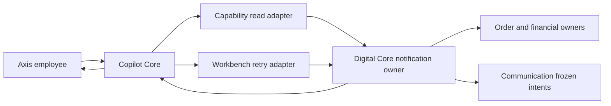

# Order Notification Operations in Copilot

## Business Purpose

Copilot can inspect the original notification evidence for one admitted order and
prepare a retry of an existing frozen notification intent. Digital Core remains
the sole owner of order/financial evidence and notification eligibility;
Communication remains the delivery-intent owner. Copilot does not create a new
recipient, template, channel, message, order, payment or refund.

| Copilot operation                      | Native owner call                           | Effect                                                                         |
| -------------------------------------- | ------------------------------------------- | ------------------------------------------------------------------------------ |
| `commerce.orderNotification.workspace` | `GET /orders/:code/notifications/workspace` | Read current bounded workspace and eligibility hints                           |
| `commerce.orderNotification.inspect`   | `POST /orders/:code/notifications/inspect`  | Read original frozen-intent observations for PURCHASED or REFUNDED             |
| `commerce.orderNotification.retry`     | `POST /orders/:code/notifications/retry`    | Request retry of currently eligible original intents after review and approval |

All three paths are disabled by default. Source availability never grants a user
permission or proves a runtime is qualified.

## Audience and First Use

Beginners should start with workspace inspection for one disposable order in a
non-production enterprise. Confirm that the order reference, revision, event kind
and bounded intent states match Digital Core before enabling retry. Do not begin
with a customer delivery incident or assume that a delivered message proves the
underlying purchase or refund.

Business users inspect current notification evidence and approve only an exact
order/event review. Operators configure qualified connections, exact scopes and
native permissions, then monitor owner evidence without replaying uncertain work.
Developers extend Digital Core owner contracts and fixed Copilot allowlists
together; they do not add caller-selected endpoints or duplicate delivery state.

## Ownership



- Axis renders conversation, review, approval and original-result inspection. It
  owns no business or delivery authority.
- Capability owns bounded read admission and output minimization.
- Workbench owns immutable retry review, confirmation binding, one dispatch
  attempt and no-replay recovery behavior.
- Digital Core owns current staff access, order/enterprise binding, revision,
  financial evidence, eligible events and fixed command contracts.
- Communication owns durable intent status and retry safety.

## Required Configuration

Configure read and retry independently through normal Nodics layering. Do not edit
generated defaults in a customer module.

```js
copilot: {
  capability: {
    orderNotificationInspection: {
      enabled: true,
      connectionName: "commerceRuntime",
      targetAuthority: { runtimeRole: "COMMERCE" },
      scopes: [{
        tenant: "master",
        enterprise: "acme",
        environment: "local",
        orderCodes: ["ORDER-1001"]
      }]
    }
  },
  workbench: {
    orderNotificationTarget: {
      enabled: true,
      moduleName: "digitalCore",
      connectionName: "commerceRuntime",
      targetAuthority: { runtimeRole: "COMMERCE" }
    },
    receiptRecovery: { enabled: true }
  }
}
```

Digital Core must separately enable and qualify notifications, the native
order-notification workspace and API exposure. Copilot configuration cannot
activate Digital Core or Communication.

Each read scope binds one tenant, enterprise and environment to an exact bounded
order-code list. Wildcards, duplicate scope matches, empty actor identity, a
`default` connection, target URL overrides and foreign order codes fail closed.

Reads require `copilot.data.query` and
`commerce.digital.notification.read`. Retry preparation additionally requires
`copilot.mutation.prepare` and `commerce.digital.notification.retry`. Final
execution additionally requires `copilot.mutation.execute`. Digital Core repeats
its current employee, tenant, enterprise, order, revision, financial and
delivery-state checks for every native request.

## Employee Journey

### Inspect in conversation

```json
{
  "intent": "copilot.commerce.notification.inspect",
  "operation": "commerce.orderNotification.workspace",
  "code": "ORDER-1001"
}
```

```json
{
  "intent": "copilot.commerce.notification.inspect",
  "operation": "commerce.orderNotification.inspect",
  "code": "ORDER-1001",
  "kind": "PURCHASED"
}
```

Copilot returns order reference, revision, financial-state label, event summaries
and bounded EMAIL/SMS intent observations. Recipient addresses, templates,
transport configuration and private financial records are excluded. A delivered
message is not presented as payment, purchase or refund success.

### Prepare a retry

Use typed JSON or the bounded sentence form:

```json
{
  "operation": "commerce.orderNotification.retry",
  "orderCode": "ORDER-1001",
  "kind": "PURCHASED"
}
```

`Retry PURCHASED notification for order ORDER-1001`

Preparation reads the fresh owner workspace and succeeds only when the event and
native retry command are currently enabled. The stored plan binds the order code,
event kind, current order revision, count/digest of eligible original intent
identities, executing employee and fixed Commerce target.

The review displays every business value needed for approval but does not display
recipient addresses or allow the user/model to choose a template, channel or
intent identifier.

### Approve and execute

```mermaid
sequenceDiagram
  participant E as Employee
  participant C as Copilot
  participant D as Digital Core
  E->>C: Prepare exact order and kind
  C->>D: GET current workspace
  D-->>C: Revision and eligible original intents
  C-->>E: Immutable review
  E->>C: Approve exact digest and revision
  C->>D: GET fresh workspace
  D-->>C: Fresh revision and eligibility
  C->>D: POST retry with kind revision confirmed true
  D-->>C: REQUESTED plus bounded original outcomes
  C-->>E: Retry requested; delivery not yet proven
```

Execution refuses if target, permissions, revision, eligible intent count or
intent digest changed after review. The native retry receives no arbitrary URL,
recipient, channel, template, provider, amount or intent code. Transport retries
are disabled (`maxAttempts: 1`).

## Uncertain Outcomes

If the native response is lost or malformed after dispatch, the Copilot action
remains `OUTCOME_UNKNOWN`. Original-result inspection sends one fixed Digital Core
inspection request for the same order and event. It reports current observed
intent state but deliberately leaves the original retry unconfirmed: current
delivery state cannot prove which actor or request caused a transition.

Never execute again to discover the result. Never convert `RETRY_PENDING`,
`DELIVERING` or `DELIVERED` into an original command receipt. The adapter does not
replay or optimistically complete the action.

## Rejections

- unconfigured, disabled or ambiguous scope;
- foreign tenant, enterprise, environment or order;
- wildcard order lists or caller-supplied routing;
- missing Copilot or native read/retry grant;
- PURCHASED/REFUNDED values not explicitly supplied;
- unknown fields, path syntax or oversized input;
- disabled native workspace or ineligible event;
- terminal, absent, uncertain or unobserved intent set;
- revision, target, permission, intent count or digest drift;
- malformed/negative owner envelopes or foreign intent identities;
- recipient, template, channel, provider or intent-code input;
- automatic retry after transport uncertainty.

## Common mistakes

- Enabling retry before the read workspace and employee authorization have been
  verified in the same tenant, enterprise and environment.
- Treating a notification state as proof that an order, payment or refund
  completed successfully.
- Adding recipient, template, channel or provider inputs to make the command more
  flexible; those values belong to the native owners and frozen intent.
- Retrying after a timeout instead of inspecting the original evidence and
  preserving an unconfirmed result.
- Using a default connection, wildcard order scope or service credential in place
  of the signed employee authority.
- Customizing Copilot without updating the Digital Core contract, tests, parser
  allowlist and operator documentation in the same change.

## Customization and Extension

Projects may narrow scope lists, choose a qualified connection and override plain
presentation labels. They must not add arbitrary routes, weaken exact-order
selection, treat metadata as permission, copy Digital Core financial logic into
Copilot, add a second notification journal, or turn inspection into retry.

When adding an event kind, extend Digital Core first, then update the owner DTO,
route contract, Copilot fixed allowlists, tests, capability descriptor, Axis parser
and this guide together.

## Verification

```bash
node --test \
  nodics.copilot/modules/copilotCapability/test/copilotOrderNotificationInspection.test.js \
  nodics.copilot/modules/copilotWorkbench/test/copilotOrderNotificationAction.test.js \
  nodics.copilot/modules/copilotCore/test/copilotIntentPlanning.test.js \
  nodics.commerce/modules/digitalCommerce/modules/digitalCore/test/digitalCommerceNotificationContract.test.js
```

Focused tests cover fixed routes, provider exclusion, minimized output, fresh
eligibility, permission denial, malformed evidence, drift, exact retry body and
inspection-only uncertainty. Digital Core tests remain authoritative for
historical commit evidence, workspace qualification and native eligibility.

## Troubleshooting

| Symptom                            | Check                                                                                        |
| ---------------------------------- | -------------------------------------------------------------------------------------------- |
| No inspection choices              | Read adapter enabled, exact scope, both read permissions, qualified non-default connection   |
| Retry not proposed                 | Workbench target, planner, prepare/read/retry permissions and explicit order/kind            |
| Review disappears before execution | Employee, enterprise, target, order revision or eligible intent set changed                  |
| Outcome remains unknown            | Inspect original evidence; do not execute again                                              |
| No eligible intent                 | Digital Core event state, financial proof, observed original intent and terminal-state rules |
| Owner response rejected            | Contract version, order/revision, fixed kinds, intent identity and positive envelope         |

This implementation is source- and unit-verified. Reference-runtime activation,
real Communication delivery and signed-in visual acceptance remain deployment
qualification work and must not be inferred from these tests.
