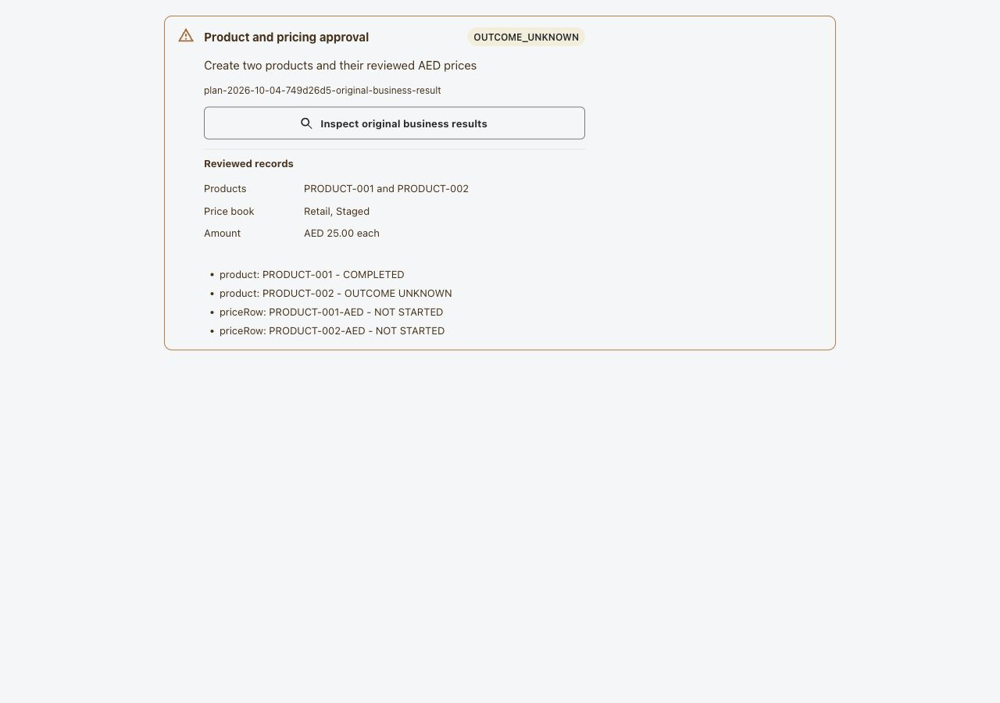
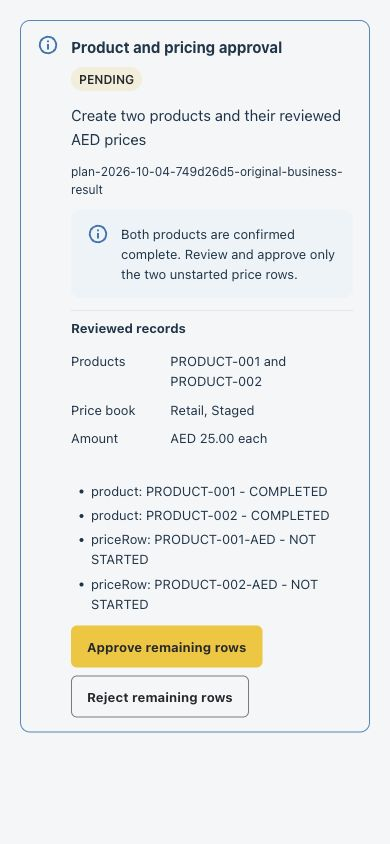
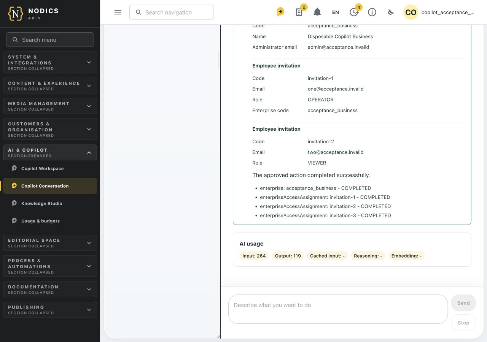
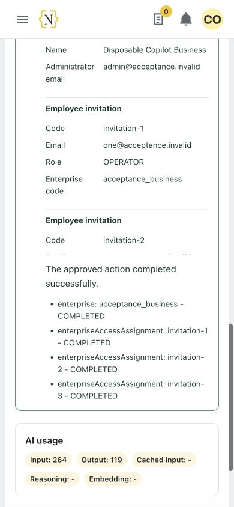
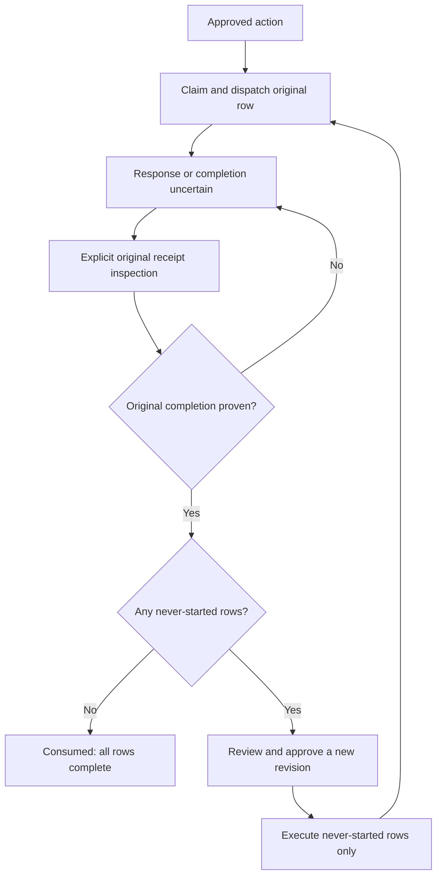

# Original Business Results and Safe Continuation

Functional owner: `nodics.copilot`. Technical owner: `copilotWorkbench`.
Product, Pricing, Waste Collection and Profile own their native command journals.
nDatabase supplies the bounded persistence protocol; Axis renders the result.

## Business Outcome

An interrupted response does not establish whether a business operation failed.
Copilot can inspect the original native acknowledgement without submitting that
operation again. Completed rows remain completed. If every submitted row is
proven complete, a new approval can cover the rows that were never started.

This guide covers Product creation with PriceRows, Profile enterprise creation
with pending employee invitations, standalone existing-enterprise invitations,
standalone price-row creation, and Waste collection-centre creation. Follow
[standalone business actions](standalone-business-actions.md) for their setup,
review and native-owner boundaries. Coupon
fulfillment retains its separate Commerce receipt inspector. This is not a
generic adapter for every Axis operation, and invitations do not activate accounts.





These screenshots use synthetic renderer data, not a signed-in customer runtime.

### Signed-In Local Enterprise Evidence

The following captures are from the complete Axis application with actual
Profile authentication, local Ollama, native enterprise execution and durable
MongoDB receipts. The data is disposable and synthetic.





The tested sequence lost the response after the native enterprise succeeded,
restarted the backend, inspected the original receipt, obtained fresh approval
and executed only the three never-started invitations. Native queries verified
one enterprise and four PENDING invitations including its administrator. A
second conversation recovered its review after a reload during model execution;
rejecting it added no invitation and did not repeat the model charge. This is
local-profile acceptance, not proof of every business adapter, notification
delivery, invitee activation or distributed failover.

Beginners should follow the Employee Journey and preserve the original action
reference when execution is uncertain. Developers should read the API Contract
and Customization and Extension sections before adding another native adapter.

## Administrator Setup

Collection-point creation is insert-only: using an existing centre code in a new
approved create must not edit that centre. If it cannot be confirmed, preserve
the action reference and use **Inspect original business results**. An earlier
record with the same code is not proof that this command succeeded. Use the
native collection-point update journey for an intended edit. This rule applies
even when new receipt recording is disabled; it does not change internal import
or Product/Pricing versioning behavior.

1. Deploy the matching framework owners and Axis client. Keep the implementation
   in framework modules, not customer kickoff modules.
2. Provision `productCommandReceipt`, `pricingCommandReceipt`,
   `wasteCollectionCommandReceipt` and `profileCommandReceipt` in their owning
   modules. Each extends nDatabase's abstract `commandReceipt` schema and has a
   unique code index. Keep generic routes, cache, events, search and BackOffice
   editing disabled for these journals.
3. Qualify the existing `DURABLE_JOURNAL` persistence path, including majority
   primary readback, durable insert-only identity and atomic conditional updates.
   A successful volatile test double is not deployment qualification. Do not
   replace the generated model service with a second storage connection.
   Include the effective service hierarchy in qualification. When `vService` is
   active, its save/update adapters must retain shared database admission and its
   read selector must retain private-read qualification. Confirm that duplicate
   journal creation cannot overwrite the original and stale conditional
   completion matches zero records. Keep journals unversioned even on Staged
   runtimes with versioned Product/Pricing data. The framework's opt-in vService
   MongoDB tests cover this boundary in disposable storage; run native Copilot
   acceptance as a separate authenticated gate. Existing overwritten evidence
   cannot be reconstructed by installing this fix, and uncertainty never permits
   resubmitting the original business operation.
4. On each native owner, explicitly admit recording through layered configuration:

   ```js
   commandReceipts: {
     enabled: true,
     owners: { product: true, pricing: true, wasteCollection: true, profile: true }
   }
   ```

   Defaults are `enabled: false` and no admitted owners. Admit only modules
   composed on that runtime. Once admitted, these wrapped commands require a
   stable original idempotency key; legacy callers without one fail closed.
5. On Copilot, enable `copilot.workbench.receiptRecovery.enabled` through the
   normal reviewed deployment process. Configure `label` and `continuation`
   presentation text. No deployment gate is enabled by source installation.
6. Grant the employee `copilot.mutation.prepare`, `copilot.mutation.execute` and
   independently `copilot.mutation.reconcile`. Preserve native schema write,
   enterprise setup/access, consent and role permissions. Recovery cannot widen
   any of these grants. The original tenant, enterprise and human actor must match.
7. Configure canonical native module names and existing target authority. Product
   and Pricing may have different owning modules. A changed execution target
   invalidates reconciliation; credentials and destinations never come from chat.
8. Validate a disposable test-runtime action end to end before production
   enablement. Include lost response, current access revocation and a competing
   reconciliation request. Do not create or delete customer records for testing.

## Employee Journey

New-write admission is distinct from evidence inspection. Disabling standalone
invitation/price admission, Profile enterprise creation admission or Waste
collection-centre admission does not by itself block non-coupon original-result
reads. The independent recovery gate, current employee/native grants and exact
original target remain mandatory. Removing or changing the native target fails
closed; an alternate route cannot be used to infer the original result.

If inspection proves all submitted rows complete, unstarted rows may receive a
fresh review, but execution still refuses while their journey is disabled. An
approval or caller-supplied `inspection` field cannot bypass the disabled gate.
Administrators can propose the standalone admission, interpretation and recovery
controls through **Copilot Settings > Business action controls**. Independent
runtime governance owns activation; none of these controls erase native receipts.

1. Prepare the supported operation in Copilot and review every primary and related
   record. Resolve missing required information before approving.
2. Approve the displayed action, then explicitly execute it. Keep the action
   reference visible in the conversation.
3. If the response is interrupted, do not submit the same business request as a
   new task. The action shows `OUTCOME_UNKNOWN` or `EXECUTING`; Execute is absent.
4. Select **Inspect original business results**. Axis first reads the current
   original action, then asks the fixed owning APIs for original receipts.
5. When a submitted row is proven complete, its state becomes `COMPLETED`. If any
   submitted row is unresolved, the action remains `OUTCOME_UNKNOWN` and no
   continuation approval is offered.
6. If all submitted rows completed and later rows remain `NOT_STARTED`, review
   the refreshed confirmation. The notice distinguishes completed work from
   remaining work. Approve this new revision, then execute explicitly.
7. Continuation skips all completed rows and submits only never-started rows.
   Another lost response follows the same inspection path. There is no timer,
   automatic retry, compensation or rollback.
8. Reloading a recorded conversation restores its latest owned action from the
   private action journal when recovery is admitted. An older action can still
   be inspected by its exact API reference. Recording-off conversations do not
   acquire transcript history merely because a business journal exists.

## State Diagram



## API Contract

All paths below are relative to the appropriate module's versioned API base.
They are authenticated, sensitive and noncacheable; none accepts a destination,
provider credential, arbitrary query or alternate actor.

| Owner | Method and Path | Body |
| --- | --- | --- |
| Copilot API | `POST /confirmations/:confirmationCode/original-results` | `expectedRevision`, `argumentsDigest` |
| Product | `POST /product/commands/inspect` | `model`, `idempotencyKey` |
| Pricing | `POST /pricerow/commands/inspect` | `model`, `idempotencyKey` |
| Waste Collection | `POST /wastecollectionpoint/commands/inspect` | `model`, `idempotencyKey` |
| Profile | `POST /enterprises/commands/inspect` | `model`, `idempotencyKey` |
| Profile | `POST /enterprises/:enterpriseCode/access-assignments/commands/inspect` | `command`, `idempotencyKey`; original command contains its matching key |

Copilot derives the original key from plan ID, schema and row identity. Native
inspection returns contract version, original scope, command fingerprint,
argument fingerprint and `COMPLETED` or `OUTCOME_UNKNOWN`. Completion includes
only a bounded result identity and result fingerprint, never the full record.

Each receipt is inserted as STARTED before the one native dispatch. COMPLETED is
written only after exact native acknowledgement and current authorization. A
crash between the business write and completion receipt deliberately remains
unknown. This protocol is not a distributed exactly-once transaction.
The journal keeps its original scalar claim predicate separate from the model
passed to generated save. Schema defaults and pipeline metadata must not become
new completion conditions. The native result and exact original claim still
have to match; this does not relax durable-journal validation.

## Troubleshooting

| Observation | Meaning and Action |
| --- | --- |
| Inspection control absent | Verify independent grant, enabled Copilot recovery and supported operation. Do not broaden native access. |
| No receipt for a historical action | Remains unknown. Do not backfill completion from record existence. |
| Recording disabled after execution | Existing native receipts remain inspectable under current native authority. |
| Source action still APPROVED after transport loss | Axis keeps the uncertainty lock; a delayed original execution may still arrive. A read does not authorize retry. |
| Receipt STARTED but record exists | Still unknown: record existence does not prove the original command's entire outcome. |
| Current employee permission or consent revoked | Inspection fails closed even if the original command was allowed. Restore access only through normal owner governance. |
| Revision changed | Reload original evidence. Do not overwrite another claimant or reuse stale approval. |
| Domain write acknowledged but journal response lost | Inspection may recover the retained completion. If completion was not durably recorded, uncertainty remains. |

## Customization and Extension

Extend only native adapters with explicit schema, authorization, route and result
contracts. Do not send model-generated URLs or treat all schema CRUD as supported
business journeys. Keep original intent immutable and bound continuation to its
digest. Do not discard native receipts through transcript or action retention.

## Common Mistakes

- Treating a timeout or a current record as proof of original completion.
- Reusing the old approval or replaying a completed row during continuation.
- Enabling recovery before private schemas, unique indexes and provider durability
  are qualified, or granting native permissions merely to make a button appear.
- Deleting native receipts through transcript retention or inventing receipts for
  historical operations whose result was never acknowledged.

## Verification

Run `modelCommandReceipt.test.js`, `enterpriseCommandReceipt.test.js`,
`copilotActionRecovery.test.js`, existing typed domain action tests, generated
controller/router contracts, and Axis client/presentation/card tests. Browser
checks must cover desktop, mobile, uncertainty lock, new approval and completion.
Live provider, authenticated runtime and deployed schema qualification remain
separate acceptance evidence.
