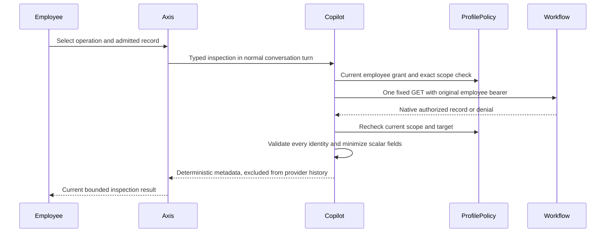
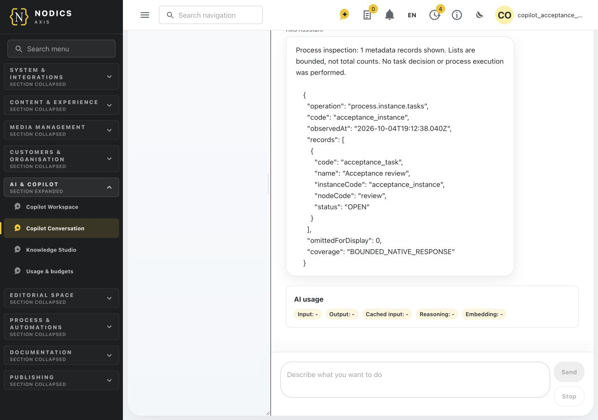
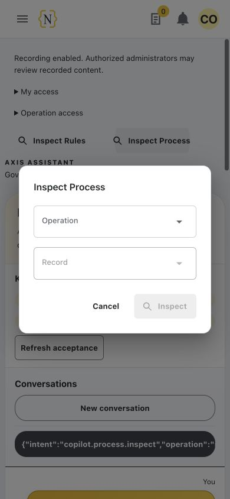
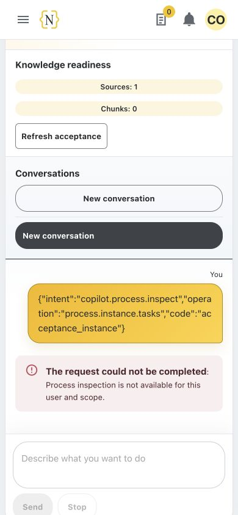
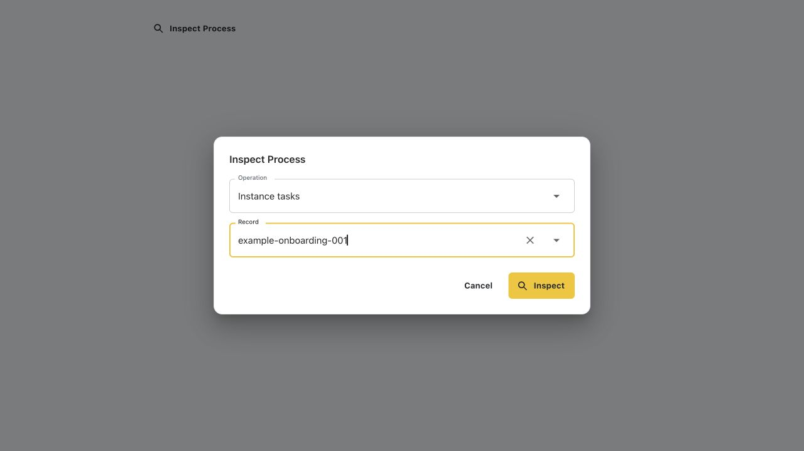
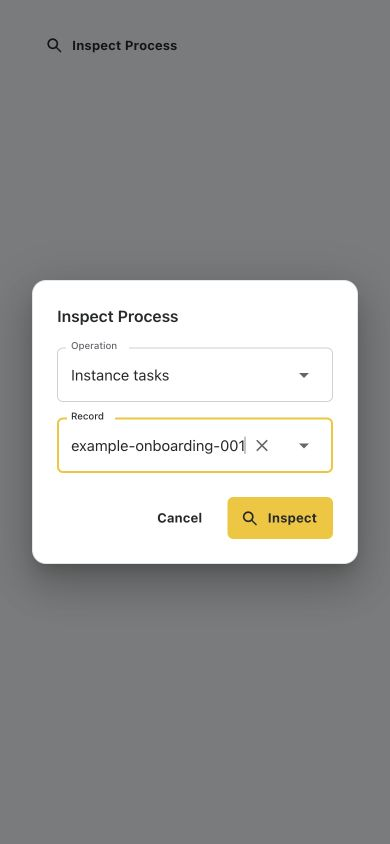

# Process Inspection in Copilot

Canonical owner: **nodics.copilot**. Technical adapter: **copilotCapability**.
Native workflow definitions, tasks, incidents and execution remain owned by
**nodics.process / workflow**. Axis renders the optional conversation controls.

## Business outcome and boundaries

An employee can inspect an admitted workflow record from the conversation page:
which version is published, whether an instance is waiting or failed, its task
status, recent activity, and incident retry metadata. Inspection does not claim,
assign, approve, reject, cancel, retry, compensate, publish or start anything.
Reading a task is not permission to make its decision.

This capability is a deterministic, typed read. It does not require a model to
generate an answer. Natural-language process mutations and arbitrary workflow
queries are not implemented by these adapters. The operation catalogue's
`IMPLEMENTED` label describes source maturity, not deployment readiness.

## Prerequisites and configuration

1. Compose Copilot with Capability, Policy and the normal conversation owner.
   Enable the existing conversation API through `copilot.api.enabled`.
2. Compose the native Workflow owner in the intended Process runtime. Preserve
   its secured routes and registration/activation requirements. Reads do not
   bypass a native denial or unavailable route.
3. Configure an existing named `workflow` connection through nService's normal
   deployment configuration. Do not put a URL or bearer token into a command.
4. Give the employee `copilot.data.query` and the specific native permission in
   the table below through Profile. Existing conversation permissions also apply.
   No default role is broadened by this feature.
5. In the owning deployment's normal layered `config/properties.js`, opt in to
   `copilot.capability.processInspection` and declare an exact scope. Never add
   framework functionality to customer kickoff/startup code.

| Property | Default | Meaning and limits |
| --- | --- | --- |
| `enabled` | `false` | Explicit deployment opt-in; other permissions still apply |
| `connectionName` | `null` | Existing named Workflow transport, not a URL |
| `targetAuthority` | `null` | Exact `{ runtimeRole: "PROCESS" }` binding; no extra target fields |
| `maximumRows` | `25` | Integer 1 through 25 displayed rows; not total matching records |
| `scopes` | `[]` | Up to 1,000 exact tenant/enterprise/environment bindings; exactly one must match |
| `definitionCodes` | Required per scope | Up to 100 unique native definition codes |
| `instanceCodes` | Required per scope | Up to 100 unique native instance codes |
| `taskCodes` | Required per scope | Up to 100 unique native task codes |
| `incidentCodes` | Required per scope | Up to 100 unique native incident codes |
| `triggerCodes` | Required per scope | Up to 100 unique Process trigger codes; Cron jobs remain separate |
| `presentation` | Framework labels | Inert title, field labels, buttons, failure text and fixed-operation labels |

All five code arrays must exist. `[]` admits none of that record kind. There is no
wildcard, prefix, inherited all-records fallback or model-selected scope. Codes
use letters, digits, dot, underscore and hyphen, start with a letter or digit,
and are at most 128 characters. The environment must match Copilot's effective
security context, not an assumed directory name.

Example deployment delta, using synthetic identities:

```javascript
module.exports = {
  copilot: {
    capability: {
      processInspection: {
        enabled: true,
        connectionName: 'process',
        targetAuthority: { runtimeRole: 'PROCESS' },
        scopes: {
          $config: 'replace',
          value: [{
            tenant: 'default',
            enterprise: 'example-enterprise',
            environment: 'local',
            definitionCodes: ['example-onboarding'],
            instanceCodes: ['example-onboarding-001'],
            taskCodes: [],
            incidentCodes: [],
            triggerCodes: [],
          }],
        },
      },
    },
  },
};
```

Replace only actual deployment differences. Use nConfig's explicit replacement
for collections when replacing a prior scope list; a shorter ordinary array
must not accidentally retain prior entries. This does not grant native access
or create records. Credentials remain with the original authenticated employee.

## Step-by-step employee journey

For beginners, start with **Definition summary** for a code supplied by your
administrator. A definition is the workflow design; an instance is one execution
of a published version; a task is a human step; an incident records a failure.
Business users should inspect these states before requesting an operational
decision. The configuration steps above are for the administrator or operator,
not values a business user must enter in each conversation.

1. Sign in to Axis under the intended enterprise.
2. Open **AI > Conversation**, separately from the Workspace dashboard.
3. Open **Inspect Process**. The button is present only when the backend supplies
   valid nonempty choices for this context. Missing choices do not mean no native
   workflow records exist.
4. Choose an operation. List operations use the configured allowlist directly;
   record operations show only configured codes admitted for that operation and
   employee permission.
5. For a record operation, select the record, then choose **Inspect**. A list
   operation has no record selector. Opening the form or changing a selection
   performs no read. Changing operation clears the record selection.
6. Read the returned metadata and observation time. A bounded activity/task list
   is not a global inventory or total count. No action has been approved or run.
7. To see a later state, explicitly request a fresh inspection. Re-delivery of
   the same accepted conversation turn does not cause another owner request.

If the employee becomes offline, the form refuses submission; it does not queue
the read for an eventual reconnect. The conversation controller owns transport
failures and uncertain turn delivery. Closing the dialog discards its selection.
Reloaded owner context discards stale choices.



## Operation and native API contracts

Every row also requires `copilot.data.query`. The table's paths are native API
suffixes; the browser cannot submit them as executable input.

| Operation | Native permission | Workflow GET suffix | Configured identity |
| --- | --- | --- | --- |
| `process.definition.list` | `process.definition.read` | `/definitions` | Filtered to `definitionCodes` |
| `process.definition.inspect` | `process.definition.read` | `/definitions/:code` | `definitionCodes` |
| `process.definition.versions` | `process.definition.read` | `/definitions/:code/versions` | `definitionCodes` |
| `process.instance.list` | `process.backoffice.view` | `/instances` | Filtered to `instanceCodes` |
| `process.instance.inspect` | `process.backoffice.view` | `/instances/:code` | `instanceCodes` |
| `process.instance.detail` | `process.backoffice.view` | `/instances/:code/detail` | `instanceCodes` |
| `process.instance.tasks` | `process.backoffice.view` | `/tasks?limit=25&instanceCode=:code` | `instanceCodes` |
| `process.instance.activity` | `process.backoffice.view` | `/audit-events?limit=25&instanceCode=:code` | `instanceCodes` |
| `process.instance.incidents` | `process.incident.read` | `/incidents?limit=25&instanceCode=:code` | `instanceCodes` |
| `process.task.inspect` | `process.backoffice.view` | `/tasks/:code` | `taskCodes` |
| `process.incident.inspect` | `process.incident.read` | `/incidents/:code` | `incidentCodes` |
| `process.trigger.list` | `process.trigger.read` | `/triggers` | Filtered to `triggerCodes` |

Example equivalent typed conversation input:

```json
{"intent":"copilot.process.inspect","operation":"process.instance.tasks","code":"example-onboarding-001"}
```

Record commands accept only these three fields. Extra permissions, environment, fields,
URLs, methods or authority data are rejected. Fixed API version is `v0`; native
transport permits one attempt and never substitutes an internal service token.

List commands contain only `intent` and `operation`, for example:

```json
{"intent":"copilot.process.inspect","operation":"process.definition.list"}
```

They still require a nonempty configured code allowlist. Copilot removes
unselected owner rows without revealing their content or count.

## Data handling and recording

Definition/version output includes scalar identity, status and revision/version
metadata. Instance output includes status, node, incident/failure codes and times.
Instance detail combines the same minimized instance fields with bounded tasks
and activity; it still excludes decisions, actors and execution context. Trigger
lists expose bounded Process trigger metadata, never Cron job authority.
Tasks expose code, scalar name, instance/node, status and due date. Incidents
expose code, instance/definition/node, status, error code, attempt counts and retry
time. Activity exposes instance/definition, event type, outcome and event time.

Graphs, execution context, actor/assignee identities, decisions, review contexts,
compensation adapters, private receipts and arbitrary metadata are omitted.
Localized name objects are omitted rather than selecting an arbitrary locale.
Every returned row must belong to the requested native identity, including rows
beyond the display limit. Failed envelopes and malformed scalar values reject the
whole result. At most 200 native rows are accepted; the serialized projection is
also capped at 24,000 bytes by removing display rows, never by exposing raw data.

Both the typed command and its answer are excluded from future provider context.
Existing conversation recording controls govern transcript persistence; recording
off retains request-only content under that owner's policy. Required security
and execution evidence is not reclassified as optional transcript content.
No model usage is billed for these deterministic reads.

The post-read recheck compares effective Copilot configuration and the trusted
request identity/headers. It is not an additional live Profile token introspection.
Native credential admission occurs at the secured owner API.

## Failure and recovery

| Symptom or code | Meaning | Safe next action |
| --- | --- | --- |
| Button absent | No valid admitted choices in current context | Check scope, deployment selection and specific grants; do not infer record existence |
| `ERR_CPT_00005` | Invalid typed command | Use a listed operation and exact admitted code |
| `ERR_CPT_00006` | Missing permission or exact scope | Have the owner review actual employee access; confirmation cannot fix it |
| `ERR_CPT_00007` | Native denial/failure, wrong envelope/identity or invalid data | Diagnose through the native owner; do not retry through a model or alternate URL |
| `ERR_CPT_00008` | Identity, target or admission changed during the read | Reload context and explicitly request a fresh inspection |
| Empty bounded list | The native response contained no rows for this filter | Inspect the correct instance; not proof of no records elsewhere |
| Failed instance or open incident | Reported native state only | Use the authorized native Process recovery journey; inspection does not retry or compensate |

## Customize and extend safely

For presentation, override only selected labels in a later project's existing
`modules/<owned-module>/config/properties.js`, for example
`copilot.capability.processInspection.presentation.title`. Keep the six required
labels bounded and nonempty, and retain fixed operation identities. No HTML,
JavaScript, URL, permission or route can be supplied through presentation.

For policy, reduce `maximumRows`, remove admitted codes, or replace the exact scope
array through nConfig. Test empty arrays and foreign enterprise/environment denial.
Do not copy framework defaults wholesale into an environment or customer module.

For a reviewed framework enhancement, add a native read contract in
`copilotCapability/src/service/defaultCopilotProcessInspectionService.js` only
after validating its native owner, input, permissions and minimal projection.
Its mergeable methods remain later-layer customization points. A new mutation
must use governed preparation/approval/execution and cannot be added here as a
GET. Preserve family-specific Axis validation in `copilotInspectionContract.ts`
and the shared `CopilotInspectionComposer`; do not add a second frontend registry.

Developers should test their effective later-layer implementation, not just the
framework defaults. A customized projection must retain the identity check for
every native row and the independent native permission for its operation.

## Common mistakes

- Enabling inspection without a matching named native connection leaves it
  unavailable; a browser endpoint is not a replacement.
- Omitting a code array makes the scope invalid. Use an explicit empty array
  when that kind of record should not be inspectable.
- Selecting an instance does not admit every task by standalone task code.
  Instance task lists remain bound to their admitted instance; a standalone task
  inspection separately requires membership in `taskCodes`.
- Treating an incident's retry count as permission to retry bypasses the native
  decision boundary. Inspection performs no recovery command.
- Sending old answer text back to a model can reintroduce protected history.
  The standard turn path excludes both sides of these inspections from prompts.
- Passing raw database `limit` from a native generated-service customization can
  lose the requested bound. Preserve Workflow's `pageSize`/`pageNumber` contract.

## Signed-in application verification

The actual Axis application was also tested against an owned five-runtime
composition: Platform/Profile/Copilot, Process, Rules, WCMS Staged and WCMS Online.
Normal Axis initialization, CMS publication, human Process approval and module
activation were completed before sign-in; readiness was not mocked.

The operator selected **Inspect Process > Instance tasks > acceptance_instance**
and explicitly submitted. The answer contained the real `acceptance_task` in
`OPEN` state, without private context. A Rules summary was read in the same
conversation. After restarting Copilot and reloading Axis, selecting the saved
conversation restored both original answers. At 390 pixels, document and viewport
widths matched. The successful run had no browser console errors or warnings.

The restricted reader saw neither inspector nor the operator's history. Pasting
the same typed Process command into the ordinary composer returned a native-backed
Copilot authorization refusal, not data. Final native inspection confirmed task
`OPEN`, instance `WAITING` and rule `DRAFT`, unchanged. All disposable runtimes,
databases and temporary frontend resources were closed after testing.







For a maintainer reproducing full-application acceptance, the existing
`copilotKnowledge/test/helpers/runtimeAcceptance/runtimeSession.js` supports
`NODICS_COPILOT_PROCESS_INSPECTION_ACCEPTANCE=1` and
`NODICS_COPILOT_RULES_INSPECTION_ACCEPTANCE=1`, together with its runtime,
registration, Axis and persistent-acceptance opt-ins. The session returns a
private temporary manifest; keep its password out of logs and documentation.
Use the adjacent `initializeAxis.js` helper for governed baseline setup, seed
the native records through employee APIs as in the native test below, and point
a separately owned Axis dev server at that fixture using environment overrides.
Use `http://127.0.0.1:3102`, its admitted CORS origin, not shared runtime edits.
Send `restart` on session stdin for persistence verification and `close` for
owned cleanup; shut down only the frontend server started for this test.

This earlier browser evidence covers the two explicit read journeys above, not every
operation, natural-language intent planning, reference-runtime deployment or
Process mutation. The updated native suite separately covers all twelve fixed reads;
the three list operations and instance detail still require refreshed signed-in
visual evidence.

## Verification: component and native tests

The captures below show the actual shared Axis component with synthetic Process
choices at 1280 by 720 and 390 by 844 pixels. They verify the form's layout and
typed submission, not an authenticated Process request or full signed-in route.





Focused backend tests exercise all twelve operations, original headers,
grant/scope/code denial before transport, immutable binding drift, malformed
envelopes, foreign rows beyond display limits, recording on/off and turn replay.
The native fixture creates published Workflow definitions, a real human task and
an incident caused by a callback lacking completed approval evidence. It reads
their actual persisted state, checks unchanged owner records and restarts Copilot.
Local Ollama availability is checked; inspection intentionally makes zero model
calls. No fixture claims a task or performs a domain publication callback.

Run from the framework checkout:

```bash
node --test nodics.copilot/modules/copilotCapability/test/copilotProcessInspection.test.js
node --test nodics.process/modules/workflow/test/processInspectionPagination.test.js
NODICS_COPILOT_PERSISTENT_ACCEPTANCE=1 \
NODICS_ERASURE_ES_HOME=/opt/homebrew/opt/elasticsearch-full/libexec \
NODICS_ERASURE_MONGO_URI='mongodb://127.0.0.1:27017/?replicaSet=nodicsLocal' \
node --test nodics.copilot/modules/copilotCapability/test/copilotProcessInspectionRuntime.live.test.js
```

Provider coordinates above describe the supported disposable local test profile,
not application defaults. The fixture cleans only its owned resources. Axis's
`CopilotProcessInspectionComposer.test.tsx` covers explicit selection, exact typed
submission, family isolation, stale choice clearing and offline refusal. Re-run
Rules composer tests when changing shared rendering.

This is source implementation, private native acceptance and the scoped signed-in
evidence above, not activation in every reference runtime, published documentation
or complete Copilot coverage of all workflow mutations.
