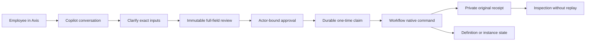
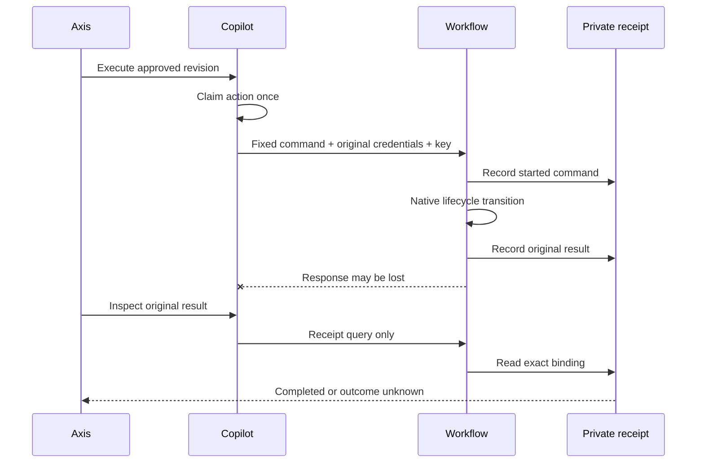

# Process Definition and Instance Actions in Copilot

## Purpose

Authorized employees can review and execute ten fixed Workflow commands through
Copilot: create, update, prepare, validate, publish, and delete/archive a process
definition; start, cancel, retry, and compensate a process instance. Workflow
remains the lifecycle and persistence owner. Copilot collects exact values,
shows every submitted field, records approval, dispatches once, and inspects the
original native receipt when the outcome is uncertain.

This is not an arbitrary API tool. It cannot select another module, URL, method,
permission, tenant, enterprise, employee, or operation. An LLM can propose a
typed command from literal user input, but it cannot authorize or execute one.



## Business Journey

For a beginner, use a disposable definition with a START, TASK, and END node.
Practice review and rejection before enabling execution, then confirm each state
in the Process workspace. A business user should never need database credentials
or a runtime URL to complete the reviewed journey.

1. Open **AI Copilot**, then **Conversation**, under the intended enterprise.
2. Identify the exact definition or instance in the Process workspace. Similar
   names are not resolved by guessing.
3. Submit a typed command or a supported plain-language request. Missing graph,
   context, reason, or incident attempt produces clarification and no mutation.
4. Review the operation, native identifier, executing employee, and every nested
   command leaf. Long graphs are split into review sections rather than hidden.
5. Approve the current digest and revision, then execute it. A changed actor,
   enterprise, permission, target, input, digest, or revision fails closed.
6. Inspect native Process state. A successful instance start is not proof that
   later tasks or domain actions completed.
7. If the reply is lost or ambiguous, choose **Inspect original business
   results**. Do not submit the command again.

## Definition Commands

### Create a Draft

```json
{
  "operation": "process.definition.create",
  "definitionCode": "employee-onboarding",
  "name": "Employee onboarding",
  "graph": {
    "nodes": [
      { "code": "start", "type": "START" },
      { "code": "review", "type": "TASK", "name": "Review" },
      { "code": "end", "type": "END" }
    ],
    "transitions": [
      { "code": "to-review", "source": "start", "target": "review" },
      { "code": "to-end", "source": "review", "target": "end" }
    ]
  }
}
```

Creation is insert-only. Workflow validates the graph, fixes `DRAFT`, version
zero and draft revision one, then reads the stored owner record back before
acknowledging success. Optional `designer`, `policy`, and explicit `active`
values are fully reviewed.

### Update, Validate, and Publish

```json
{
  "operation": "process.definition.update",
  "definitionCode": "employee-onboarding",
  "name": "Employee onboarding v2"
}
```

Only a draft can be updated. Supply at least one of `name`, `graph`, `designer`,
`policy`, or `active`. Workflow binds the status and draft revision read before
the write, requires exactly one affected record, and verifies fresh readback.

Use `validate process definition employee-onboarding` to record graph validation
without publishing. Then use `publish process definition employee-onboarding`.
Publishing creates an immutable version with a checksum and conditionally moves
the aggregate to `PUBLISHED`. A validation acknowledgement is not publication.

### Prepare or Discard a Later Draft

`prepare process definition employee-onboarding` copies the latest immutable
published graph into the next editable draft. It does not modify the published
version. `delete process definition employee-onboarding` has three native
outcomes:

| Current state | Native outcome |
| --- | --- |
| New draft with no published version | `DELETED_DRAFT` |
| Draft prepared from a published version | `DRAFT_DISCARDED`; latest published graph is restored |
| Published definition | `ARCHIVED`; versions are retained as audit evidence |

The review says delete because it is the fixed native route; the final state is
decided by Workflow from fresh lifecycle state.

## Instance Commands

### Start

```json
{
  "operation": "process.instance.start",
  "instanceCode": "employee-onboarding-2026-001",
  "definitionCode": "employee-onboarding",
  "context": {
    "enterpriseCode": "acme",
    "employeeReference": "new-hire-17"
  }
}
```

The new instance code and context are mandatory. Empty context must be supplied
as `{}`; Copilot never invents business context. Optional `version` pins an
immutable version and optional `name` labels the instance. Workflow checks
operational admission and published state, inserts once, enters the graph, and
marks start complete. An exact native replay is owner-controlled; Copilot still
uses original-receipt recovery rather than a second dispatch.

### Cancel

```json
{
  "operation": "process.instance.cancel",
  "instanceCode": "employee-onboarding-2026-001",
  "reason": "Hiring request withdrawn"
}
```

Cancellation is limited to created, running, or waiting instances. Workflow
rejects generic cancellation when the immutable definition contains a governed
actor policy that requires a domain withdrawal contract. Otherwise it uses an
exact-state update, verifies the cancelled instance and confirms that no open
tasks remain before writing audit evidence.

### Retry and Compensate

```json
{
  "operation": "process.instance.retry",
  "instanceCode": "employee-onboarding-2026-002",
  "expectedAttempt": 1
}
```

Retry requires the current non-negative incident attempt. Workflow accepts only
a failed instance with an open retryable ACTION incident, atomically claims the
next attempt, and uses the pinned process version. Failure remains a failure;
Copilot cannot convert a thrown domain error into success.

```json
{
  "operation": "process.instance.compensate",
  "instanceCode": "employee-onboarding-2026-002",
  "payload": { "reason": "Reverse completed external step" }
}
```

Compensation requires a failed node with a declarative domain-owned compensation
adapter. The payload is optional but, when supplied, every leaf is reviewed.
Process coordinates incident state; the domain adapter owns business reversal.
`COMPLETED` means that adapter acknowledged this compensation attempt, not that
unrelated external systems were reconciled.

## Permissions and Configuration

| Command | Native permission |
| --- | --- |
| Create definition | `process.definition.create` |
| Update or prepare draft | `process.definition.update` |
| Validate draft | `process.definition.validate` |
| Publish draft | `process.definition.publish` |
| Delete/discard/archive definition | `process.definition.delete` |
| Start instance | `process.instance.start` |
| Cancel instance | `process.instance.cancel` |
| Retry incident | `process.instance.retry` |
| Execute compensation | `process.instance.compensate` |

Preparation also requires `copilot.mutation.prepare`; final dispatch requires
current `copilot.mutation.execute`. Original-result inspection requires
`copilot.mutation.reconcile`, the original native command permission, and
`process.definition.read` or `process.backoffice.view` for the family.

The target and receipts are default-disabled. Configure them in a deployment-
owned later layer, never in a customer Kickoff module merely to expose framework
functionality:

A production operator must qualify the connection, receipt persistence and
native permissions in each target environment before enabling the target.

```js
module.exports = {
  copilot: {
    workbench: {
      processLifecycleTarget: {
        enabled: true,
        moduleName: "workflow",
        connectionName: "process",
        targetAuthority: { runtimeRole: "PROCESS" }
      },
      processLifecycleTimeoutMs: 30000,
      receiptRecovery: { enabled: true }
    },
    core: { intentPlanning: { enabled: true } }
  },
  commandReceipts: { enabled: true, owners: { workflow: true } }
};
```

The connection must already exist and be qualified by normal nService/runtime
configuration. `default` is rejected. The timeout may be 1,000 to 120,000 ms;
transport attempts remain fixed at one. Configuration never grants permissions.

## Recovery

Definition receipts are inspected at:

`POST /nodics/process/v0/definitions/{code}/commands/{kind}/receipt/query`

Instance receipts are inspected at:

`POST /nodics/process/v0/instances/{code}/commands/{kind}/receipt/query`

The body contains the exact original native `command` and `idempotencyKey`.
These endpoints are for the existing Copilot recovery flow; operators should not
reconstruct keys manually. Inspection checks current employee authority and the
original actor, enterprise, tenant, operation, arguments, target, and result
identity. It never invokes the lifecycle method.



## Input and Review Limits

- Identifiers are explicit safe codes up to 128 characters.
- Unknown top-level fields and arbitrary endpoints are rejected.
- Credential-like nested keys are rejected.
- JSON depth is eight, each object/array has at most 80 entries, reviewed leaves
  are capped at 240, and the native body is capped at 65,536 bytes.
- Individual text leaves are capped at 2,000 characters and control characters
  are rejected.
- Review sections contain at most 20 fields and are never silently truncated.

Large domain payloads or executable callbacks require a separate owner-reviewed
adapter. Do not increase limits to turn this into a generic transport.

## Verification

`copilotProcessLifecycleAction.test.js` covers all ten commands, exact routing,
complete review, missing/invalid input, credential rejection, grant denial and
target drift. `processLifecycleCommandReceipt.test.js` covers native permission,
exact input/result binding and inspection without replay. The opt-in
`copilotProcessLifecycleRuntime.live.test.js` uses disposable Profile, Workflow,
Copilot and MongoDB runtimes plus local Ollama for a representative natural-
language publish journey, restart-safe receipts, denied access and persisted
definition/instance outcomes.

Retry and compensation need a disposable domain ACTION/compensation adapter to
prove their successful native effects. Their deterministic owner tests do not
claim a live customer-domain reversal.

## Troubleshooting

| Symptom | Meaning and response |
| --- | --- |
| Configuration required | Qualify the fixed Workflow connection and effective later-layer settings |
| Permission required | Grant only the needed native and Copilot permissions through Profile ownership |
| Clarification requested | Supply every listed business value and create a new review |
| Concurrent change | Reload current Process state; do not force the stale transition |
| Outcome unknown | Inspect the original receipt; never repeat the command automatically |
| Retry policy exhausted | Resolve the owner incident or use an approved compensation contract |
| Compensation unavailable | The failed node has no domain-owned declarative compensation adapter |
| Definition archived | Create a new governed definition/version; do not reactivate through generic CRUD |

## Safe Customization

Developers extend this capability only through normal later-layer contracts.
Later layers may tighten graph policy, input bounds, permissions, target
qualification, presentation copy, or domain action admission. Preserve Workflow
ownership, exact native routes, create-only insertion, conditional writes,
fresh readback, original credentials, immutable review, receipt privacy, and no
automatic replay. Axis may customize labels and layout but cannot add authority.

## Common Mistakes

- Treating a validated draft as published or a started instance as completed.
- Repeating a command after a timeout instead of inspecting its original receipt.
- Using generic schema CRUD to bypass definition, incident, or compensation policy.
- Putting Workflow authority, service URLs, or credentials in Axis or model input.
- Assuming an administrator role grants every enterprise and native permission.
- Describing deterministic retry or compensation tests as proof of a customer
  domain adapter's live business reversal.

Continue with [Process Task Actions](process-task-actions.md), [Process Trigger
Actions](process-trigger-actions.md), [Process Inspection](process-inspection.md),
and [Original Business Results](original-business-results.md).
