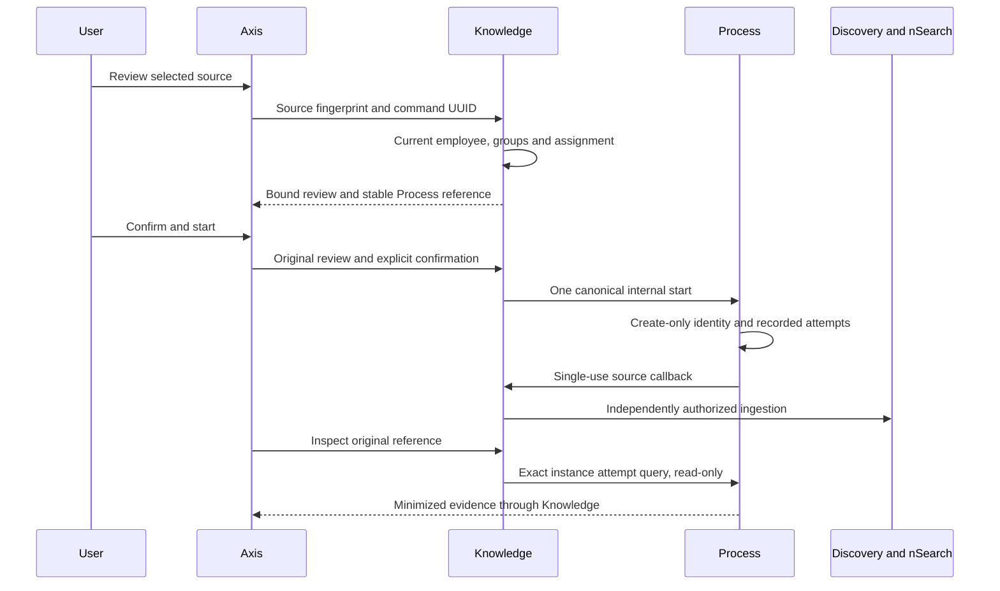
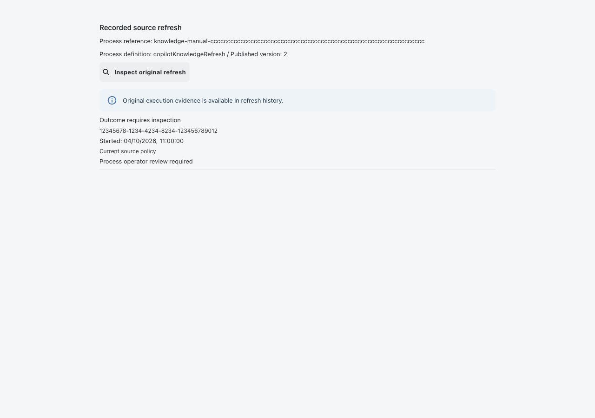
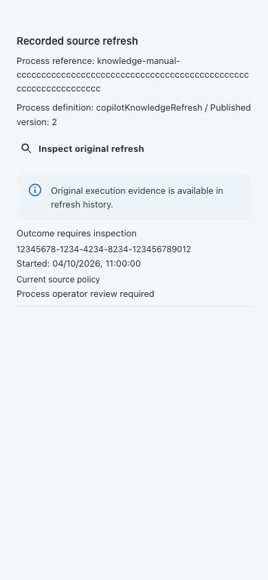

# Recorded Manual Knowledge Refresh

Functional owner: `nodics.copilot`. Technical owner: `copilotKnowledge`.
Process owns starts and execution attempts. Axis renders the authorized journey;
Discovery and nSearch retain publication and physical indexing ownership.

## Business Outcome

A knowledge administrator can review one registered source, explicitly confirm
its refresh, and inspect the original execution after a lost response. Starting
the refresh does not mean the new knowledge is ready. The source inventory still
provides the independent published-generation and physical-count evidence.

This journey covers static runtime code and authored documentation sources.
DATABASE and EXTERNAL_LOG sources remain live, independently authorized queries.
It does not load customer records into an index or invoke a model.

Beginners should first inspect source scope and readiness, then ask a knowledge
administrator to confirm that the source is admitted for recorded refresh.
Developers should read the API and customization sections before extending the UI.

## Administrator Setup

1. Configure the registered source, required permissions, tenant, enterprise,
   customer-project and environment scopes. Activate the intended knowledge
   groups. Admit both EMPLOYEE and SYSTEM channels explicitly; neither channel
   inherits the other's permissions.
2. Install and publish the existing Copilot refresh Process contribution. Enable
   private attempt recording and provision its generated schema/unique index.
   Process action declaration and remote callback admission remain deployment
   responsibilities. This feature does not install or publish definitions.
3. Configure `copilot.knowledge.workflowRefresh.assignments` for the exact
   source and runtime scope. Multiple unique versions of one definition are
   allowed; new manual starts select the highest assigned version. Competing
   definitions or duplicate versions are rejected.
4. Configure `workflowRefresh.actionAuthority` with an explicit, non-default
   connection and runtime role. Use existing nService credential configuration;
   no credential, destination or handler is accepted from Axis.
5. On Process, explicitly admit `copilotApi` and the published owner definition
   through its default-disabled internal-start policy. Qualify current service
   identity, enterprise scope and `process.instance.start.internal` permission.
6. On the callback runtime, qualify the current Workflow service principal,
   source-management and source-read permissions, source SYSTEM admission and
   current enterprise/group restrictions. Employee grants are never copied into
   a service token.
7. Enable `workflowRefresh.enabled` and, separately, `workflowRefresh.manualEnabled`
   through normal runtime governance. Both default to false. No customer module
   implementation is required. When manual mode is enabled, the older synchronous
   refresh endpoint rejects calls, including calls from old clients; there is no
   fallback around the recorded path.
8. Grant authorized employees `copilot.knowledge.internal.read` and
   `copilot.knowledge.source.manage`, plus each source's required permissions.
   Read-only original inspection requires source visibility and internal read,
   not source management. Route security independently requires an access token
   and the employee access group.

| Setting | Owner | Meaning |
| --- | --- | --- |
| `workflowRefresh.manualEnabled` | Knowledge | Opt-in employee Process start journey |
| `workflowRefresh.assignments` | Knowledge | At most 100 exact source/scope/version assignments |
| `actionAuthority.timeoutMs` | Knowledge/nService | Explicit timeout, 1 to 30,000 ms; one attempt |
| Internal start and remote action admission | Process | Published definition/owner and runtime authorization |
| `studio.manualRefreshPresentation` | Knowledge | Inert captions and safe outcome messages |

## Business User Steps

1. Open **Copilot > Knowledge Studio** and select a visible code/documentation
   source. Read its current included/excluded paths, fingerprint and readiness.
2. Under **Recorded source refresh**, choose **Review refresh**. This is read-only:
   no Process instance, file scan, indexing operation or model call occurs.
3. Review the Process reference, selected definition and published version.
   The review also binds the current source fingerprint and verified employee.
4. Select **Confirm source refresh**, then **Start refresh**. Repeated clicking
   cannot dispatch a second start from this mounted view. Offline commands are
   rejected rather than queued for reconnection.
5. A start acknowledgement means Process accepted that exact identity and
   recorded its start; it does not claim callback or index completion.
6. Select **Inspect original refresh** to read attempts for exactly that original
   Process reference. Read the state, start time, policy match and recovery
   indication. Use the source's full **Refresh executions** history for all pages.
7. Reload source inventory to inspect physical readiness. A prior-policy
   completion is not evidence that today's exclusions or source content are ready.

## Execution And Recovery



| Observation | Meaning | Next step |
| --- | --- | --- |
| Review unavailable | Gate, source visibility, permissions or assignment failed | Ask the owner to inspect current admission; do not widen scope blindly |
| Source changed after review | The review is stale | Obtain a fresh review before any new dispatch |
| Start acknowledged | Exact Process start evidence exists | Inspect attempts and current index readiness independently |
| Start response lost or contradictory | The command may already have applied | Inspect original reference; never replay based on timeout |
| No recorded attempts | Process may not yet have prepared the callback, or evidence is unavailable | Outcome remains unknown; inspect the original Process instance |
| Awaiting claim / In progress | Recorded remote-action lifecycle only | Wait or inspect Process; no automatic retry |
| Completed | Process recorded callback completion | Verify the current source policy and physical index readiness |
| Failed / Outcome requires inspection | Recorded failure or expired nonterminal claim | Process operator investigates; do not manufacture a new command as recovery |

The command UUID is bound to tenant, enterprise, project, environment, employee
and source. Its Process identity deliberately excludes mutable version and source
fingerprint. Exact duplicate delivery therefore uses Process's existing start
replay; changing an assignment cannot turn the same command into another run.
The UI never automatically resends it. Post-dispatch errors are conservatively
reported as unconfirmed, including revocation while waiting for acknowledgement.

Original inspection is read-only and remains available at the API when the
manual-start gate is turned off. The underlying history integration, current
source visibility and Process connection must remain valid. Source/identity
navigation discards transient UI state and aborts requests, not backend work.
After leaving the panel, use source execution history and the displayed Process
reference. There is no browser-persistent command queue. The inline inspector
shows at most the newest 25 original attempts; full source history is paginated.

Legacy synchronous refreshes and runs predating attempt recording are not
backfilled. Absence of old history is not proof that no indexing took place.

## API Contract

All public paths are under the existing versioned `copilotApi` owner:

| POST path | Body | Result |
| --- | --- | --- |
| `/knowledge/sources/:sourceCode/refresh/preview` | `requestId`, `expectedPolicyDigest` | V1 REVIEW, minimized identity, definition/version and review digest |
| `/knowledge/sources/:sourceCode/refresh/start` | Same identity plus `reviewDigest`, `confirmed: true` | V1 START_ACKNOWLEDGED with PROCESS_INSTANCE evidence |
| `/knowledge/sources/:sourceCode/refresh/inspect` | Original `requestId` | V1 ATTEMPTS_AVAILABLE or OUTCOME_UNKNOWN, bounded V2 history |

Extra request fields are rejected. Review and start require a lower-case UUIDv4
and the exact 64-character source fingerprint. No body-supplied actor, permissions,
connection, Process context or schedule is accepted. Process history accepts an
optional exact `instanceCode` only in ATTEMPTS mode, binding it in both generated
query predicates and returned-row validation. History never claims an action.

## Customize and extend safely

In a project-owned inherited Copilot configuration module's `config/properties.js`,
override only intended presentation differences, for example:

```js
module.exports = {
  copilot: {
    knowledge: {
      studio: {
        manualRefreshPresentation: {
          title: 'Refresh approved enterprise knowledge',
          start: 'Start approved refresh',
        },
      },
    },
  },
};
```

Existing configuration layering supplies the remaining keys. Changing copy does
not enable the feature, publish a Process definition or grant permission. A
project-owned Axis renderer can wrap `KnowledgeManualRefreshPanel` and the typed
client while preserving explicit review/confirmation, source-scoped teardown,
strict receipt parsing and the sent-command lock. Never copy source authority,
job persistence, retries, credentials or context construction into the browser.

Maintainers run Knowledge event/manual integration tests, Process remote-action
inspection tests, Axis `KnowledgeManualRefreshPanel.test.tsx` and Studio/history
regressions. Tests cover canonical duplicate starts, lost/negative acknowledgement,
stale policy, access revocation, exact returned scope, offline calls and aborts.
Signed-in multi-runtime persistence and actual provider qualification remain
deployment acceptance; synthetic UI and isolated storage do not prove them.

## Common mistakes

- Treating a Process start acknowledgement as completed ingestion.
- Restarting a refresh because the original response timed out.
- Granting SYSTEM source access by copying an employee's credentials.
- Enabling recorded-manual mode without its Process assignment and attempt store.
- Interpreting an empty legacy history as proof that no indexing occurred.

## Verification

The owner tests listed above establish local control flow, isolated persistence
and strict response handling. The responsive fixture establishes renderer behavior.
Before production activation, separately verify actual generated indexes, service
credentials, current employee grants, remote callback recording and physical
publication evidence in the selected runtime. No test result automatically enables
the gates or authorizes a real source refresh.

## Sanitized Visual Evidence

Actual Axis renderer, synthetic response, 2026-10-04. No real employee, customer
source or backend mutation. Desktop 1280px and mobile 390px show original-attempt
inspection after a simulated lost start response, not successful indexing.




