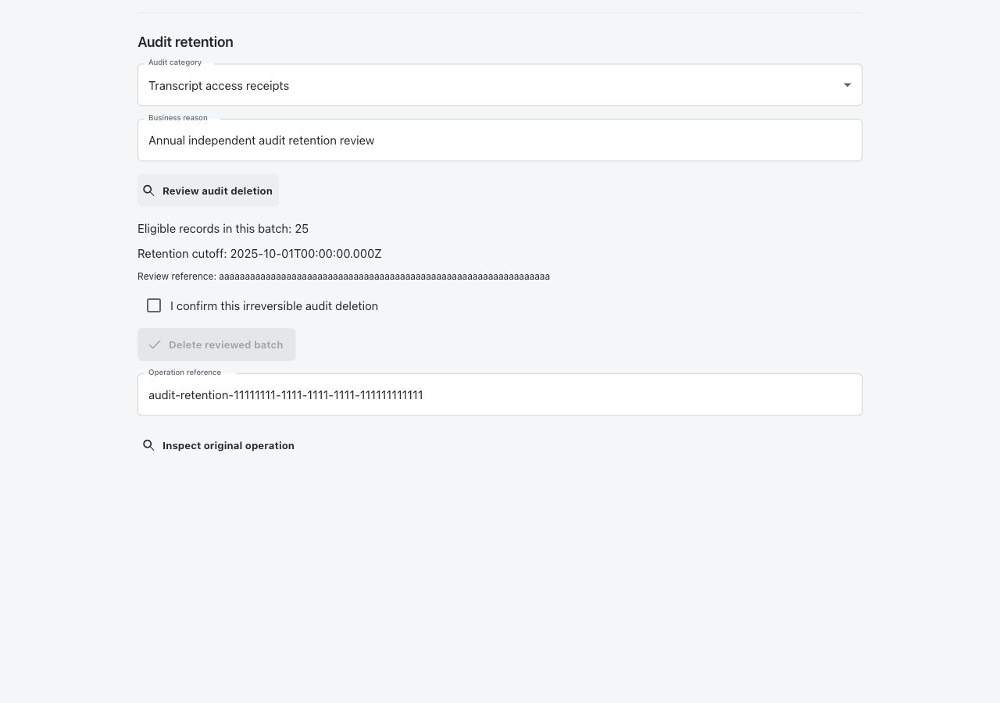
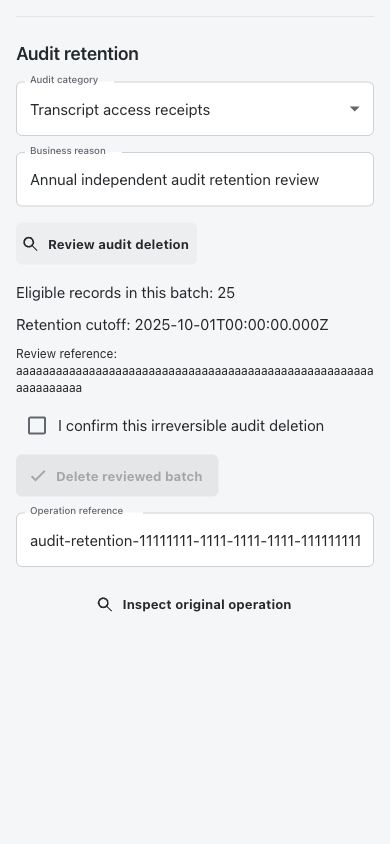
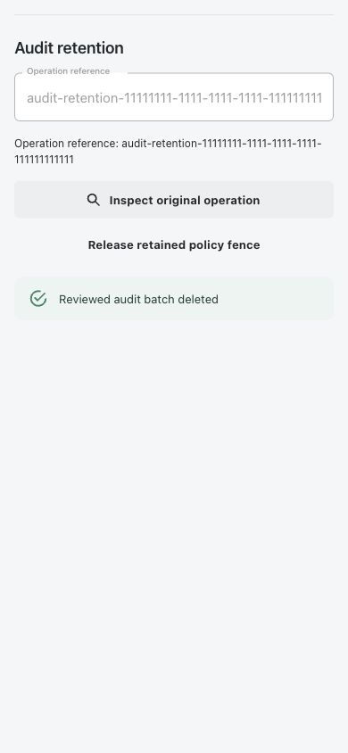
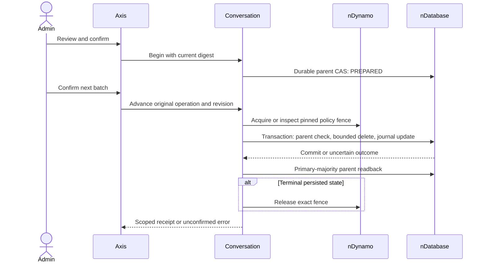
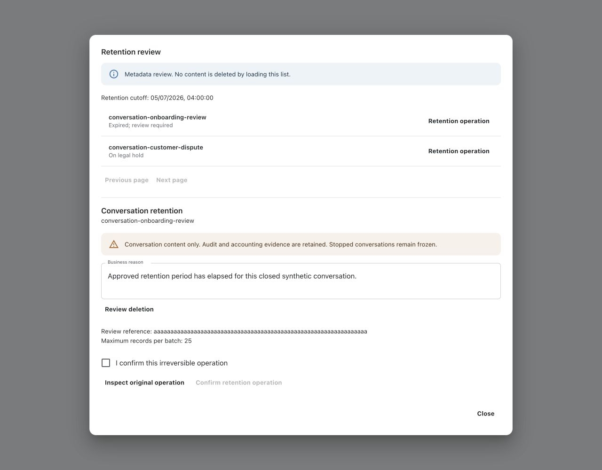
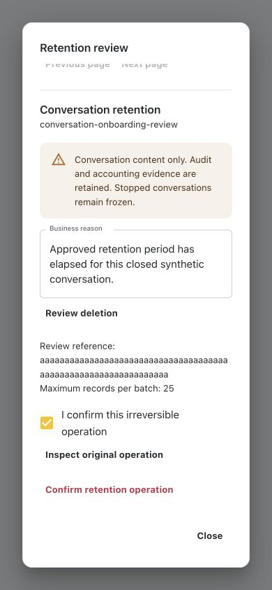

# Bounded Conversation Retention

## Independent Audit Retention

Audit retention is separate from conversation-content deletion. It owns only
`TRANSCRIPT_ACCESS` receipts and terminal `ACTION` records. Provider accounting,
conversation tombstones, retention receipts, active approvals, running commands
and `OUTCOME_UNKNOWN` actions are never selected. Missing enterprise audit policy
means preserve indefinitely; transcript expiry and holds are not audit policy.

### Deployment and Policy

1. Deploy private `copilotAuditRetentionOperation` with its unique code index.
   Qualify journaled persistence and atomic transactions covering this receipt,
   `copilotTranscriptAccess` and `copilotAction`. Keep generic routes, caches and
   events disabled. Standalone nontransactional storage is not enough.
2. Qualify `databaseTransactions.enabled`, `failClosed`, multi-record atomicity
   and journaled commit. Enable the existing nDynamo read fence for owner
   `copilotConversation` with durable governed tenant-property persistence.
3. Grant human operators `copilot.activity.read` and independently
   `copilot.audit.retention.execute`. Configuration additionally needs existing
   configuration-management authority and `copilot.audit.retention.configure`.
   Super administrators may delegate the **Independent audit retention policy**
   section through Enterprise administration. Delegation does not grant the
   independent configuration permission or the execution permission.
4. In AI Configuration, select **Transcript access audit retention** or **Action
   audit retention** for the enterprise. Set independent days, hold-all, held
   audit codes and held conversation codes. Use existing proposal, review and
   activation. New forms default to preserving all audit.
5. After deployment acceptance, explicitly enable
   `copilot.conversation.auditRetention.deletionEnabled`, default false, through
   deployment governance. The business form cannot enable deletion or relax
   persistence qualification. `maximumBatch` defaults 25, allowed range 1-100.

Example `auditRetention.enterprisePolicies` entry, intentionally held:

```json
{"tenantCode":"exampleTenant","enterpriseCode":"exampleEnterprise",
 "kind":"TRANSCRIPT_ACCESS","retentionDays":365,"holdAll":true,
 "recordCodes":[],"conversationCodes":[]}
```

### Operator Journey

1. Open **Copilot > Activity > Audit retention**. The independent capability must
   be admitted. Without policy no deletion category is available, but original
   operation recovery can remain visible.
2. Select a category, enter a business reason, then **Review audit deletion**.
   This bounded read creates no receipt, acquires no fence and deletes nothing.
3. Review count, exact UTC cutoff and reference. Held records are excluded.
   Action candidates must be `EXECUTED`, `CANCELLED`, `REJECTED` or `EXPIRED`;
   missing trustworthy scope or dates never becomes inferred eligibility.
4. Tick the irreversible-deletion confirmation, then **Delete reviewed batch**
   once. The original reference remains visible. Offline commands are not queued.
5. Completion covers only this reviewed batch. Refresh Activity to review another
   batch; there is no automatic drain loop or automatic uncertain retry.
6. After response loss, use **Inspect original operation**. `COMPLETED` and the
   removed count were committed with deletion in one transaction. Missing
   evidence remains `OUTCOME_UNKNOWN`, not proof of rollback.
7. **Stop pending operation** stops `PREPARED`; **Release retained policy fence**
   releases a terminal operation's retained fence. Neither retries deletion. If deletion won a concurrent race,
   it reports `COMPLETED`, not a false stop. A rejected transaction rolls back
   removal and completion together. Recovery works with deletion disabled,
   subject to original actor and qualified storage. No actor takeover is implied.

```text
review -> exact audit identities/hashes + policy revision + cutoff
confirm -> PREPARED journal -> nDynamo policy-revision fence
        -> transaction: recheck originals/holds; delete batch; commit receipt
        -> durable readback -> release original fence
lost acknowledgement -> original inspection -> stop/release only; no delete replay
```

### API and Customization

Authenticated fixed POST routes: `/activity/audit-retention/preview`, `/execute`,
`/inspect`, `/stop`. Preview accepts exactly `{kind, reason}`. Execute adds the
returned `operationCode`, `cutoff`, `reviewDigest` and `confirmed: true`.
Inspect/stop accept only `{operationCode}`. Extra keys and stale reviews fail.
Responses contain bounded counts and original state, never audit content,
private selected-record hashes or fence tokens. Inspection does not release a
fence; the explicit stop/release command does.

Customize `auditRetention.presentation` without dropping required text keys.
Keep policy in the administration owner and rendering in Axis. Do not add direct
database calls, TTL cleanup or a nontransactional fallback. Minimal deletion
receipts are retained indefinitely and cannot erase themselves. Provider
accounting still needs its accounting owner's policy; this operation cannot
erase that ledger. Test holds, policy drift, foreign rows, rollback, lost commits,
terminal-only actions and no-replay UI. Local fixtures are not live deletion or
regulatory approval of a retention period.

### Verified Interface

These captures use the real Axis renderer with synthetic owner responses, not
live audit deletion. Desktop review was checked at 1280x900, and mobile review
and lost-response recovery at 390x844. No horizontal overflow was observed.





Beginners should start with the administrator journey: reviewing metadata never
deletes content. Business administrators decide which expired conversation is
reviewed, while the operator qualifies storage and deployment before production. Developers preserve
the canonical owner contracts when customizing labels or the typed renderer.

## Ownership

Conversation owns reviewed retention and the private `retentionOperation` on its
existing parent record. Generated services own persistence, nDatabase owns opaque
transactions, MongoDB owns snapshot/majority/journal mechanics, and nDynamo owns
committed configuration and its private revision fence. Axis is presentation only.
Conversation-content retention reuses its parent receipt; independent audit
retention uses the private generated receipt described above. No project/Kickoff
implementation or background scheduler is added.

Only bound messages, events and turns of one expired CLOSED/ARCHIVED conversation
are eligible. The parent tombstone, operation reason/actor/counts, transcript access
receipts, action audit and provider accounting remain. Their retention is separate.
This is not backup erasure, export cleanup or a legacy migration. Conversation
closure is a separate non-destructive command in the same lifecycle panel.

## Deployment Steps

1. Deploy every Conversation writer with the transactional parent guard, including
   remote workers. Verify no legacy writer can bypass it. Local tests do not prove
   full writer coverage, and age is not proof that a worker has stopped.
2. Qualify the actual transaction-capable MongoDB replica set or sharded topology.
   Enable `databaseTransactions.enabled` with `failClosed: true`. All participating
   schemas retain transaction eligibility and disabled cache/events. The adapter
   must advertise `journaledCommit` and commit with majority plus journal.
3. Enable canonical nDynamo persistence and
   `runtimePropertyGovernance.persistence.requireDurableJournal: true`. Internal
   generated CAS uses majority/journal; readback uses primary/majority. Unqualified
   providers, broad updates and transaction mixing are rejected.
4. Enable `runtimePropertyGovernance.readFence.enabled` and explicitly admit
   `readFence.owners.copilotConversation: true`. Verify a committed persisted
   property revision exists before preparing retention.
5. Configure `copilot.conversation.storage: 'GENERATED_SERVICE'`,
   `writerFence.enabled: true` and `lifecycle.maximumBatch` between 1 and 100.
   Only after qualification separately enable `lifecycle.deletionEnabled` through
   normal configuration governance. Both writer/deletion gates ship disabled.
6. Grant the original employee `copilot.activity.read`,
   `copilot.activity.lifecycle.read` and `copilot.activity.lifecycle.execute`.
   These grants do not confer transcript access or any cross-enterprise authority.
7. On disposable data qualify two employees/enterprises, competing writers, hold
   activation, rollback, process termination, primary changes and lost responses.
   No automatic deployment, real deletion or topology qualification is performed
   by the source test suite.

## Administrator Journey

1. Select the enterprise, open Activity, then Retention review and Load review.
2. Review age, hold and state; open Retention operation for the conversation.
   Backend capability admission controls whether the command panel is displayed.
3. Enter a business reason and choose Review deletion. This creates no operation
   or fence. The digest binds actor, parent, timestamp, writer token and policy.
4. Check the confirmation and choose Confirm retention operation. PREPARED evidence
   is durably persisted. No content is deleted and no policy fence is acquired yet.
5. Confirm and choose Delete next batch. The owner acquires/inspects its pinned
   property fence, then removes at most one bounded page and advances the journal
   in one transaction. Empty pages advance through messages, events and turns.
6. Confirm each next batch explicitly. There is no auto-run loop or retry. At
   PURGED the content stages are empty, the parent tombstone remains and the exact
   fence is released after durable readback. Never reuse the conversation identity.

## Recovery and Holds

After a timeout, choose Inspect original operation, not Begin or automatic retry.
An empty inspect body retrieves the original actor's operation for that exact
conversation, including after a lost begin response. It returns the stored revision
and counts. A later explicit advance must use that revision; stale ones fail.

Stop and preserve remaining content records STOPPED transactionally and freezes
the parent as RETENTION_STOPPED. Only after primary-majority terminal readback
does it release the fence. It neither restores deleted content nor reopens writers.
STOPPED cannot advance directly. A fresh review can reauthorize the remaining
deletion without restoring content or reopening writers. If terminal acknowledgement or
release is lost, inspect and explicitly repeat terminal stop/release with the
observed revision. That operation cannot delete another page.

Inspection and stopping work with deletion disabled while durable persistence,
writer fencing and original authority remain qualified. If those prerequisites
are disabled, restore qualified deployment before recovery. Never delete a fence
manually. Legacy/foreign child bindings abort the page; stop and escalate to the
migration owner instead of guessing or silently omitting ownership.

### Close an Active Conversation

1. Select the conversation, enter a business reason and choose **Review conversation closure**.
2. Read the closure notice. Closure stops new content writes; it does not cancel
   provider calls or business operations already running.
3. Confirm the reviewed closure. The exact parent revision/write token must still
   match; concurrent conversation activity invalidates the review.
4. The owner records CLOSED and the closure timestamp atomically. No content is
   deleted, and retention age starts at closure rather than an earlier activity.
5. After an uncertain response, choose **Inspect original closure**, never submit
   Close again. Inspection requires the original actor and current independent
   lifecycle authority. Holds remain effective and closure does not remove them.

Closure remains available with the deletion gate off, but requires qualified
durable persistence and the transactional writer guard. Its private receipt is
not exposed in ordinary conversation records.

### Resume a Stopped Retention Operation

1. Inspect the original retention operation and confirm STOPPED.
2. Finish its exact stop/fence release if that acknowledgement was lost.
3. Enter a fresh business reason and choose **Review remaining deletion**.
4. The owner checks the current committed policy, active holds, original content
   cutoff, original actor, exact revision and absence of the prior fence.
5. Confirm the new review. State becomes RESUMING; no content is removed by this
   command. The operation identity, stage and cumulative deletion counts remain.
6. Explicitly delete the next batch. It acquires a fence for the newly reviewed
   policy and continues from retained progress, without repeating deleted pages.

Lost resumption acknowledgement requires original-operation inspection. A stale
review, new hold, longer unelapsed retention period or missing historical cutoff
rejects. At most twenty resumptions are retained; reaching that bound refuses
another resumption rather than truncating prior audit. Old operation journals
without an original cutoff remain inspectable/stoppable but cannot be resumed.
Partner overrides may change presentation, not these identity, fence or recovery
rules. Run retention execution, API routing and Axis retention tests for changes.

The tenant property fence blocks governed property changes, including new holds,
while deletion is in progress. A proposed hold is not active until activation
succeeds. For an urgent hold, stop retention, verify durable STOPPED and fence
release, then activate the hold. The broad fence may delay unrelated settings;
there is no TTL or implicit takeover that could admit deletion under stale holds.

## Secured API

All are sensitive, no-store, employee access-token POSTs below
`/activity/:conversationCode/retention/`. The route owns conversation identity;
the body cannot override tenant, actor, enterprise, storage options or policy.

| Suffix | Exact body | Effect |
| --- | --- | --- |
| preview | reason | Read-only digest and bounded batch size |
| begin | reason, reviewDigest, confirmed: true | Persist reviewed intent once |
| inspect | empty, or operationCode | Read original actor's evidence |
| advance | operationCode, expectedRevision | One transactional bounded page |
| stop | operationCode, expectedRevision | Freeze terminal state and release exact fence |
| resume-preview | operationCode, expectedRevision, reason | Review remaining stopped work under current policy |
| resume | operationCode, expectedRevision, reason, reviewDigest, confirmed | Record resumption without deleting content |
| close-preview | reason | Review ACTIVE conversation closure |
| close | reason, reviewDigest, confirmed | Close without deleting content or canceling external work |
| close-inspect | empty | Read original actor's recorded closure |

Receipts contain contractVersion 1, tenant/enterprise context, conversationCode,
operationCode, revision, state, per-store counts and terminal completedAt. Private
reason, policy, fence token and content are omitted. Stale/foreign/duplicate evidence,
body extensions, contradictory acknowledgements and unqualified storage fail closed.



## Customize and Extend Safely

Customize `lifecycle.executionPresentation` through layered configuration or wrap
the existing typed Axis panel. Preserve grants, scope, explicit confirmation,
no-replay recovery and late-response disposal. No arbitrary transport destinations,
local authority, browser persistence, audit deletion, TTL or batch above 100.

For a project-specific label, extend the existing active project configuration
module's `config/properties.js`; do not duplicate the framework service in a
customer module or change Kickoff to own retention. For example:

```javascript
/** @file Project presentation and bounded batch override; does not enable deletion. */
module.exports = {
    copilot: {
        conversation: {
            lifecycle: {
                maximumBatch: 25,
                executionPresentation: { title: 'Review recorded conversation retention' }
            }
        }
    }
};
```

Inherited presentation keys remain with the framework defaults. Apply through
the project's established configuration lifecycle and inspect the effective
settings. A label or smaller batch must not manufacture execution permission.
Reject a batch above 100; after a failed change, keep the previously effective
configuration and use the existing governance recovery, not browser overrides.

## Verification

Run Conversation retention/writer/persistence suites, API route tests, nDynamo
fence tests, generated durable-pipeline and MongoDB transaction tests. Axis has
`CopilotRetention.test.tsx`, lifecycle tests and synthetic `retention.visual.html`.
These do not prove deployed failover, backup erasure, writer coverage or signed-in
persistent-runtime acceptance. Independent audit retention remains outside this
content-purge operation and must not be claimed as completed by it.

## Common Mistakes

| Mistake | Required response |
| --- | --- |
| Treating an expired row as deletion authorization | Obtain fresh review and independent execution admission |
| Enabling only the deletion flag | Qualify every writer, persisted policy fence and transaction provider first |
| Retrying after a timeout | Inspect the original operation and observed revision |
| Assuming a submitted hold is active | Confirm activation; stop in-progress retention before activating a new hold |
| Deleting private audit or fence records manually | Preserve evidence and recover through the owning service |
| Treating a stopped record as an active session | Keep it frozen; never recreate its identity |

## Axis Capture Evidence

These are real Axis renderer captures from the isolated synthetic fixture at
`/test/assistant/retention.visual.html`, taken 2026-10-03 at 1280 x 1000 and
390 x 844. They contain fictional records and no real credentials or customer
content. The walkthrough verified explicit review, confirmation, one batch,
inspection and frozen stop, with no horizontal overflow or browser errors.
They are renderer evidence, not signed-in persistence or destructive acceptance.





## Source and Publication State

Functional owner: `nodics.copilot`; technical owner: `copilotConversation`.
The service, private schemas, configuration and owner tests are under
`nodics.copilot/modules/copilotConversation`. Secured API mapping belongs to
`copilotApi`; orchestration belongs to `copilotCore`. Axis's typed client and
panel live under its existing `src/assistant` boundary. nDynamo and nDatabase
remain the only policy/persistence coordination owners.

This page is authored and locally generated for the framework content pack.
Generating a release does not import it into Platform, activate documentation
navigation or publish it to a customer. Use the existing governed content-pack
release/import process and verify the rendered page in the target environment.
