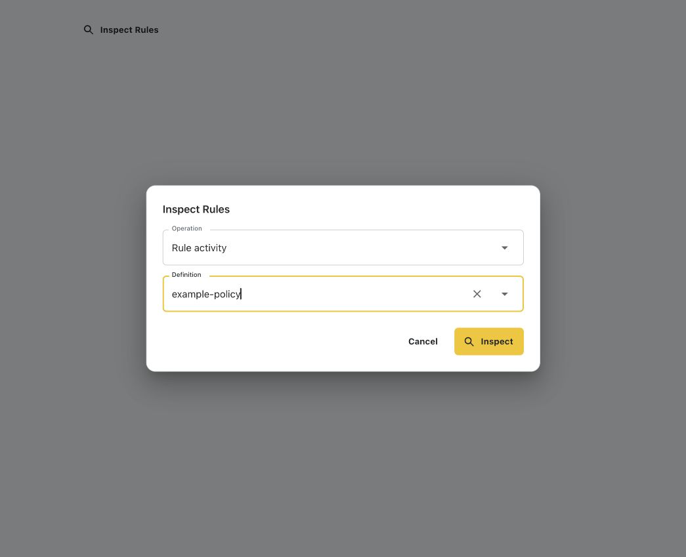
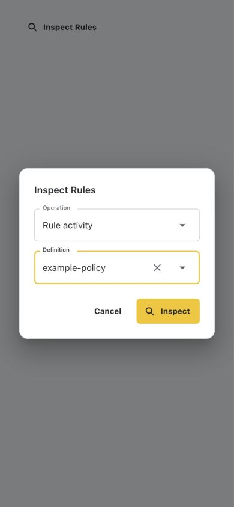
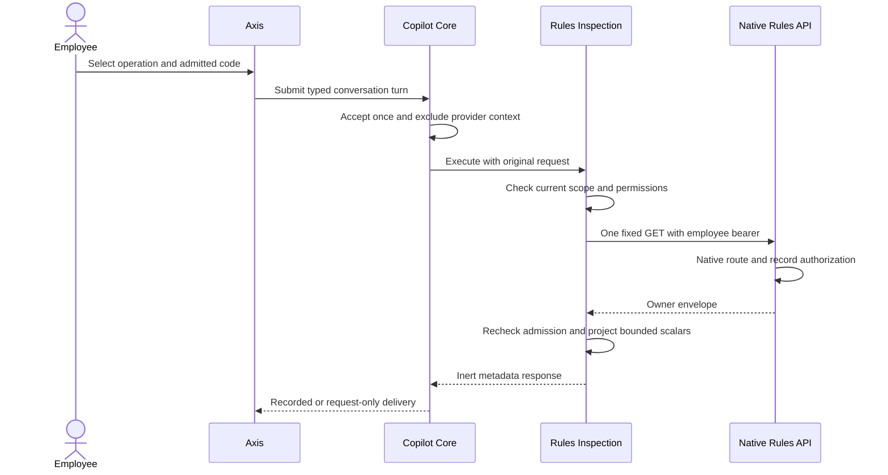
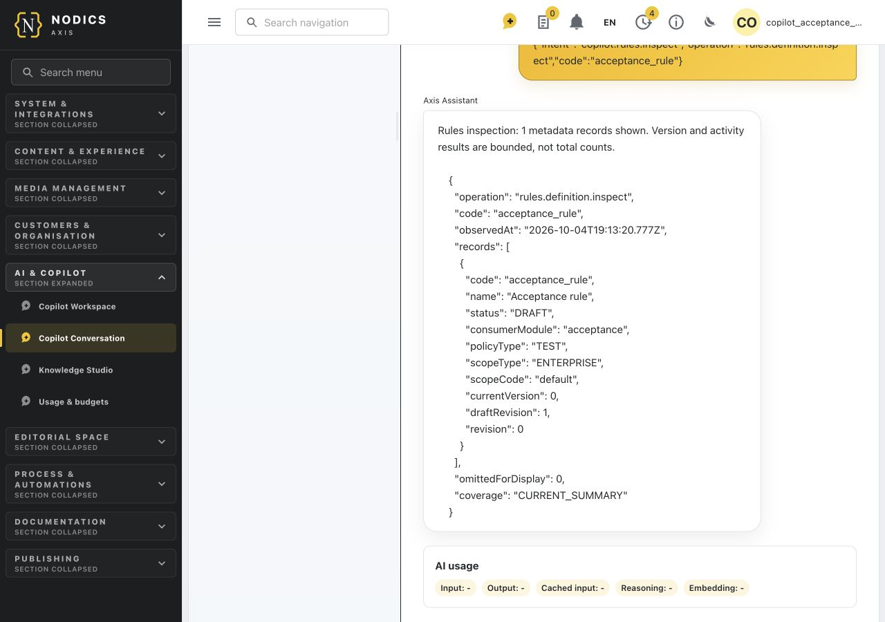
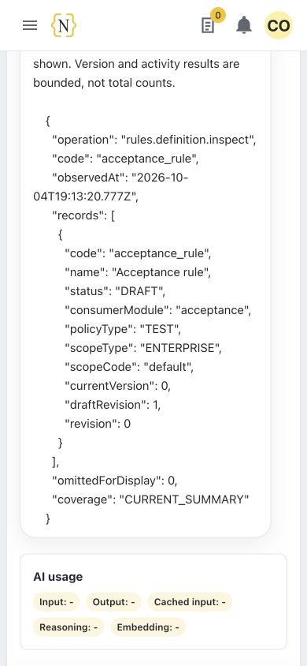

# Rules Inspection in Copilot

Canonical functional owner: `nodics.copilot`. Technical coordinator:
`copilotCapability`. Rules API owns authorization and business records; Rules
Definition owns persistence. Core owns conversation admission and delivery.
Axis presents only the current allowed choices. This feature never evaluates,
simulates, edits, approves or publishes a policy.

Beginners and business users should follow **Inspect a rule** after an
administrator completes setup. Operators own native availability and failure
investigation. Developers should read **Customize and extend safely** before
changing bindings or adding an operation.

## Supported operations

| Choice | Native GET path under the Rules connection | Additional employee permission |
| --- | --- | --- |
| Rule definitions | `/definitions` | `rules.definition.read` |
| Rule summary | `/definitions/:code` | `rules.definition.read` |
| Rule versions | `/definitions/:code/versions` | `rules.definition.read` |
| Rule activity | `/definitions/:code/audit` | `rules.definition.audit` |
| Score-band sets | `/band-sets` | `rules.band.read` |
| Score-band summary | `/band-sets/:code` | `rules.band.read` |
| Score-band versions | `/band-sets/:code/versions` | `rules.band.read` |
| Property catalogue | `/property-catalogues/:code` | `rules.definition.read` |

Every inspection also requires `copilot.data.query`, normal conversation/API
admission, an authenticated employee and an exact configured tenant, enterprise
and environment binding. Native Rules routes independently authorize the original
employee. Viewing a choice is not an execution grant.

Versions and activity are bounded native responses, not collection totals. A
new draft can legitimately have no published versions. Inspection does not prove
that a rule is valid, published, effective or used in a particular customer
journey. Native simulation writes simulation/audit state and is therefore not
included as a read operation.

## Administrator setup

1. Deploy the normal Rules owners and configure their named module connection
   using existing runtime configuration. The transport resolves the module's
   actual URL prefix; the browser does not supply an endpoint.
2. Confirm the intended employee can use the corresponding native Rules read.
   Assign permissions through Profile. Do not add wildcard grants or use a
   runtime service credential as the employee.
3. Decide which exact rule, band and property-provider codes this enterprise can
   inspect. A code allowed for one enterprise is not implicitly allowed for
   another. All three arrays must be present, can be empty, and contain at most
   100 unique codes each.
4. In the project's existing configuration layer, override the default-disabled
   settings. The following is a configuration example, not a new runtime:

   ```js
   module.exports = {
     copilot: {
       capability: {
         rulesInspection: {
           enabled: true,
           connectionName: "rules-owner",
           targetAuthority: { runtimeRole: "RULES" },
           maximumRows: 25,
           scopes: [{
             tenant: "default",
             enterprise: "example-enterprise",
             environment: "local",
             ruleCodes: ["reward-policy"],
             bandCodes: ["reward-bands"],
             propertyProviderCodes: ["eWaste.reward"],
           }],
         },
       },
     },
   };
   ```

5. Use the actual deployed runtime role, named connection and trusted Copilot
   environment. The binding above works only if those values exist. No wildcard
   scopes, duplicate matching bindings, URLs or additional target-authority
   fields are accepted. `maximumRows` must be an integer from 1 through 25.
6. Reload the conversation context after applying configuration. Confirm the
   employee sees only permitted operations and admitted codes. Test a denied
   actor and an unadmitted code before enabling a wider set.

The scope binding is an additional Copilot restriction, not an alternate Rules
permission system. It cannot grant native access. No Kickoff startup code or
customer-specific adapter is needed.

## Inspect a rule

1. Open the separate Copilot conversation page for the intended enterprise.
2. Select **Inspect Rules**. Opening this form makes no Rules read.
3. Select an operation, such as **Rule activity**. List operations use the
   configured allowlist and do not show a record selector.
4. For a record or property-catalogue operation, select a definition/provider
   from the allowed choices. Changing operation clears the previous selection.
   There is no free-form endpoint or arbitrary code field.
5. Select **Inspect** once. Axis submits a typed command through the ordinary
   conversation controller. Offline submission is refused, never queued.
6. Read the metadata response in the conversation. It shows the requested code,
   operation, observation time, coverage and returned records. An explicit
   `omittedForDisplay` count identifies rows removed by the display limit.
7. To request another current observation, explicitly submit another inspection.
   Replaying the same accepted turn does not issue a second native read. Restored
   conversation history is historical evidence, not a fresh Rules query.

The typed command for technical callers is:

```json
{
  "intent": "copilot.rules.inspect",
  "operation": "rules.definition.audit",
  "code": "reward-policy"
}
```

Record commands accept only these three fields. A tenant, enterprise, endpoint, HTTP
method or handler in the command causes rejection. Unknown operations cannot
fall through into model-selected API execution.

List commands omit `code`, for example:

```json
{"intent":"copilot.rules.inspect","operation":"rules.definition.list"}
```

The native list is filtered to configured codes without exposing excluded rows
or their count. Property catalogue output retains bounded property names, data
types, allowed operators and scalar allowed values; provider implementation,
resolvers and arbitrary nested metadata are excluded.

## Owner flow

The following captures show the actual Axis component with synthetic choices,
at desktop and 390-pixel mobile width. They verify form layout, selection and
typed command composition, not a signed-in Rules journey.







There is no LLM call in this flow. Both request and response are excluded from
subsequent provider history. Rule graphs, band definitions, arbitrary metadata, audit actor
identities, reasons and credentials are not included in the response projection.
Audit output contains only the rule reference, event type, outcome, version,
draft revision and creation time. Other responses contain explicitly allowed
summary/version metadata. Owner errors are replaced with a stable generic error,
not exposed with native URLs or secrets.

Conversation recording follows the existing recording configuration. With
recording enabled, authorized transcript administrators can inspect retained
content through the existing transcript owner. With recording disabled, content
is delivered only for the current request and is not reconstructable from
history. Turn lifecycle metadata still exists. This feature does not create a
separate read-audit database or override retention policy.

## Failure and recovery

| Symptom | Meaning | Action |
| --- | --- | --- |
| No Inspect Rules control | Disabled, no matching scope, insufficient grants, empty code lists or unavailable context | Administrator checks effective settings and native access; refresh context |
| Desired code absent | Code not admitted for that operation and scope | Request an administrator review; do not use another enterprise's binding |
| `ERR_CPT_00001` | Invalid typed command | Correct only the operation/code; remove extra fields |
| `ERR_CPT_00002` | Current user/scope/configuration refused | Recheck grants and effective binding; no automatic retry |
| `ERR_CPT_00003` | Native transport or envelope could not establish valid evidence | Inspect owner health and native operation; do not treat an empty/error result as success |
| `ERR_CPT_00004` | Identity or routing changed while reading | Obtain a new context and explicitly request a fresh read |
| No versions | Native bounded result may be empty for an unpublished draft | Check the normal Rules lifecycle; inspection does not publish |
| Recording-off response lost | Transient answer was not retained | A new explicit read is possible; the original content cannot be recovered |

Admission is rechecked after the native response against effective settings and
the current trusted request. Changes visible there prevent delivery; this is not
a second Profile token introspection. Wrong rule identities, malformed scalar
fields and failed envelopes
are refused, including mismatched rows beyond the display limit. No original
credential, connection routing or native definition graph is placed in browser
context metadata.

## Customize and extend safely

Use the project's existing layered `config/properties.js` or configured external
properties file. For example, narrow `maximumRows` to 5 and replace one scope's
`ruleCodes` with the two policies this enterprise operates. Keep all three code arrays
and the exact tenant/enterprise/environment triple. Duplicate matching bindings
are configuration errors, not union rules. Permissions remain Profile-owned.

Presentation strings are configurable under
`copilot.capability.rulesInspection.presentation`: `title`, `operation`, `code`,
`submit`, `cancel`, `failure`, and `operations` labels keyed by the eight fixed
operation codes. Keep all fields present and use short business labels. This
customization changes wording, not the command vocabulary or permission rules.

For a new native read, extend the framework-owned operation contract and scalar
projection with matching owner authorization, route evidence and denial tests.
Extend the Axis typed parser only for that reviewed code. Do not configure URLs,
service names or arbitrary methods as operations. Mutations must use the existing
governed preparation/approval/execution architecture and native receipt contract;
they cannot be added to this GET-only path.

Verify changes with `copilotRulesInspection.test.js`, the recording/history
regressions, Axis `CopilotRulesInspectionComposer.test.tsx`, and the opt-in native
suite `copilotRulesInspectionRuntime.live.test.js`. The latter creates only
disposable unpublished drafts, reads all eight paths and checks native denial,
no model usage and restart persistence. Empty draft-version responses do not
qualify published-version lifecycle behavior. Unit tests cover nonempty bounded
version projection. Component screenshots, where present, are synthetic UI
evidence, not signed-in Rules authorization or production acceptance.

## Common mistakes

- Treating a visible operation as permission to execute it. Both Copilot and
  native Rules check the current employee again when the request runs.
- Sharing a wildcard code list between enterprises. Bind exact admitted codes
  to one tenant/enterprise/environment triple and test negative access.
- Treating a draft summary or empty version list as publication evidence.
  Use the native lifecycle for validation, approval and publication.
- Asking the LLM to interpret raw rule graphs from this tool. This metadata-only
  path excludes graphs and never invokes a model.
- Retrying a lost recorded turn under another identity. Reopen only owned
  history; use a new explicit read when a current observation is needed.

## Verification

Full signed-in Axis acceptance also covers **Inspect Rules > Rule summary >
acceptance_rule** in an owned five-runtime composition. The actual native DRAFT
summary was returned through the conversation lifecycle, persisted after a
Copilot backend restart and restored from history on a 390-pixel viewport.
The restricted employee saw no Rules inspector and no operator conversation.
Native inspection confirmed the rule remained DRAFT. Browser console checks on
the successful journey had no warnings/errors; disposable resources were closed.
This is one qualified browser read journey, not published-version lifecycle,
all Rules operations or reference-runtime deployment.





See [Process inspection](process-inspection.md#signed-in-application-verification)
for the shared browser acceptance setup and test-session switches.

From the framework root, with the existing local Mongo replica set and owned
Elasticsearch fixture available:

```sh
env NODICS_COPILOT_PERSISTENT_ACCEPTANCE=1 \
  NODICS_ERASURE_ES_HOME=/opt/homebrew/opt/elasticsearch-full/libexec \
  NODICS_ERASURE_MONGO_URI='mongodb://127.0.0.1:27017/?replicaSet=nodicsLocal' \
  node --test nodics.copilot/modules/copilotCapability/test/copilotRulesInspectionRuntime.live.test.js
```

Use the provider paths appropriate to the machine. The test manages private
databases, ports and runtime processes and closes only its owned resources.
It does not alter shared runtimes, production records or customer startup files.
