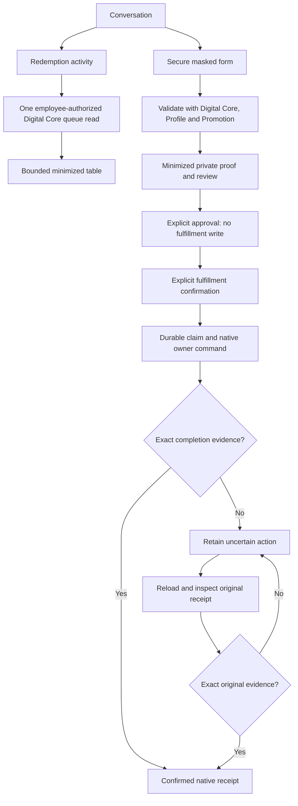

# Secure Coupon Fulfillment

Canonical functional owner: `nodics.copilot`. Technical coordinator:
`copilotWorkbench`. Digital Core owns merchant validation and fulfillment
receipts; Promotion owns coupon eligibility and redemption; Profile owns staff
identity, permissions and issuer/outlet scope. Axis displays these contracts.

Beginners and business users should follow **Complete a redemption** after an
administrator has enabled the capability. Operators own setup and uncertain
result investigation. Developers should use **Customize and extend safely**
before changing configuration or integrating another native provider.

## Availability and prerequisites

This optional capability is disabled by default. It does not grant employee
permissions, create a merchant, settle an external POS transaction or enable a
provider merely because its form appears.

| Requirement | Owner and configuration |
| --- | --- |
| Copilot route admission and private action storage | Copilot API/Policy/Workbench and generated persistence |
| Operational Commerce connection | Existing named `digitalCore` connection with `COMMERCE` authority |
| Secure adapter | `copilot.workbench.couponTarget.enabled: true` |
| Preparation | `copilot.mutation.prepare`, `commerce.coupon.pos.redeem`, `profile.scope.read` plus normal route admission |
| Redemption activity | `copilot.data.query`, `commerce.coupon.pos.redeem` plus current Profile staff scope |
| Execution and original receipt inspection | Additionally `copilot.mutation.execute` |
| Issuer and outlet access | Live Profile scope assignment, independently checked by Digital Core |
| Bounded issuer display lookup | Commerce runtime credential with `profile.enterprise.reference.read` |
| Native merchant readiness | Digital Core merchant provider, Promotion eligibility and any selected outlet/pricing prerequisites |

The runtime credential is only for Profile's bounded reference lookup. Human
fulfillment continues with the original employee identity. An employee's
authenticated partition is not automatically an issuing merchant scope.

## Configure and open

1. Deploy the normal owner modules and generated private action persistence.
   Keep sensitive-request logging protection enabled.
2. Configure the operational Commerce connection through existing runtime
   configuration. Do not reuse a Staged product-authoring target.
3. Enable the adapter through the project's existing external configuration
   layer. The example connection must already exist:

   ```js
   module.exports = {
     copilot: {
       workbench: {
         couponTarget: {
           enabled: true,
           moduleName: "digitalCore",
           connectionName: "commerce-owner",
           targetAuthority: { runtimeRole: "COMMERCE" },
         },
       },
     },
   };
   ```

4. Assign the approved employee permissions and actual enterprise/outlet scope
   through Profile. Never substitute a browser flag or service credential.
5. Qualify native provider readiness separately. `MERCHANT_SCREEN` is staff
   fulfillment attestation; `LOCAL_SAMPLE` is test evidence. Neither proves an
   unintegrated external POS has settled a purchase.
6. Reload Axis and open AI & Copilot, then the conversation page. The fresh
   context response advertises **Redeem a coupon** only when configured and
   authorized. The Workspace dashboard remains separate from conversation.

## Complete a redemption

1. Select **Redeem a coupon**. Opening the form only loads authorized input
   metadata; it does not validate or redeem a code.
2. Enter the customer-presented code in the masked field and the original
   transaction/receipt reference. Select an authorized outlet when required.
   For priced benefits use the source-reference label supplied by the owner.
3. Select **Validate and review**. The transient code clears immediately. The
   sensitive request goes to native validation, not a language model or chat.
4. Review the issuer, benefit, receipt, outlet, proof expiry and entitlement
   revision. Supported priced benefits include the original source revision,
   currency and amounts. Unsupported benefit shapes are rejected, not hidden.
5. Select **Approve reviewed fulfillment**. Approval binds the exact plan digest
   and revision. It neither performs fulfillment nor grants missing authority.
6. Only after providing the benefit, select **Confirm fulfilled benefit and
   redeem**. One durable action claim precedes the original employee command.
7. Keep the action reference. After navigation, **Open existing action** reloads
   it with current backend ownership checks. Never use a new action as a retry
   for an uncertain original fulfillment.

## Review redemption activity

1. Open **Redeem a coupon**, then select **Redemption activity**. Axis requests
   the current Digital Core queue only when this tab is selected.
2. Review the product, claim status and receipt reference. The table is bounded
   to 100 owner records and shows an explicit recovery marker when the original
   receipt requires investigation.
3. Select **Refresh activity** for a new owner read. Refresh never validates,
   claims, confirms or retries a coupon.
4. Treat the list as current enterprise-scoped operational evidence, not a
   ledger total or customer history. Coupon tokens, customer identities and
   native command keys are excluded from the Copilot and Axis contracts.

## Screen and owner flow



## Recover an uncertain result

A timeout or lost acknowledgement is not evidence that the benefit was not
provided. Copilot stops further fulfillment and retains the original action.

1. Select **Reload action**. `EXECUTING` and `OUTCOME_UNKNOWN` actions can expose
   **Check original receipt**.
2. Inspect the original receipt. This is read-only at the native owner; it does
   not invoke confirm, redeem, claim, a provider or a new command key.
3. Only native `REDEEMED` state plus the exact original committed receipt can
   complete the existing action. Current permissions, target, staff scope and
   evidence are rechecked before the action revision is advanced atomically.
4. Missing evidence, incomplete commits, changed outlets or lost scope remain
   unconfirmed. An authorized Commerce operator must investigate the original
   command through its owner workflow. Do not create a replacement fulfillment.

Approval expiry prevents new execution, not inspection of an old completion.
Concurrent inspection cannot produce two action completions.

| Symptom | Interpretation and next step |
| --- | --- |
| Secure form absent | Check adapter target, current context and preparation grants; do not widen default roles |
| Validation denied | Check current employee merchant/outlet scope and native eligibility |
| Proof expired or review changed | Obtain fresh native validation and explicitly review again |
| Stale action revision | Reload the existing action; never overwrite a newer decision |
| Outcome unknown after restart | Inspect the original receipt, not a second confirmation |
| Receipt mismatch or owner unavailable | Preserve uncertainty and investigate with the owner |

## API and privacy contract

| Entry | Purpose |
| --- | --- |
| `GET /copilotApi/v0/coupons/workspace` | Authorized form metadata |
| `GET /copilotApi/v0/coupons/redemptions` | Bounded, minimized merchant redemption activity |
| `POST /copilotApi/v0/coupons/prepare` | Sensitive validation and private review |
| Existing confirmation approve/reject/execute/get | Revision/digest-bound action lifecycle |
| `POST /copilotApi/v0/confirmations/:confirmationCode/coupon-receipt` | Reconcile the original receipt |
| `POST /digitalCore/v0/merchant/redemptions/:code/receipt/query` | Current employee-scoped native evidence |

Deployment prefixes follow normal module exposure. Preparation accepts only
`couponToken`, `merchantReceiptReference` and optional `storeCode`. Inspection
accepts `expectedRevision` and `argumentsDigest`; callers cannot replace the
target, command key or receipt. Private actions retain minimized proof/review,
not the raw token or customer identity. Native business `deliveredAt` is distinct
from framework-owned persistence `created`/`updated` timestamps.

Recognized coupon-redemption messages are redirected before provider invocation
or conversation persistence. Only neutral guidance is retained and excluded
from future provider context. This is not universal secret detection or
historical cleansing: never paste codes into ordinary chat, titles, receipt
references or free-form review fields.

## Customize and extend safely

Use the project's existing external properties file loaded by `nConfig`, not a
new customer kickoff service or edits to generated framework defaults. A project
may name that file `config/properties.js`; its deployment must select the file
through the existing configuration contract. Framework defaults live at
`nodics.copilot/modules/copilotWorkbench/config/properties.js` and are reference
material, not the project's customization destination.

For example, merge these labels into the existing project configuration:

```js
module.exports = {
  copilot: {
    workbench: {
      couponPresentation: {
        open: "Redeem customer coupon",
        redemptionsTab: "Recent fulfillment activity",
        refreshRedemptions: "Refresh fulfillment activity",
        receipt: "Original till receipt reference",
        execute: "Confirm benefit provided and redeem",
      },
    },
  },
};
```

Keep all effective labels bounded and nonempty. Preserve the remaining default
labels and re-run context/UI tests after applying the layered configuration.
Changing labels cannot disable review, approval, native authority, sensitive
logging, revision checks, token minimization or original-command recovery.
Changing a target invalidates old plans and requires new validation/review.

New providers or benefit shapes require native domain qualification, strict DTO
parsing and regression tests before UI support. There is no supported generic
API executor or direct coupon-status database override. Verify malformed labels,
revoked permissions, expired proofs, stale revisions, mismatched receipts and
uncertain outcomes; each must reject safely or retain uncertainty.

## Common mistakes

- Treating approval as execution: approval only records the reviewed decision.
- Using enterprise identity as merchant access: Profile staff scope is separate.
- Pasting raw codes into ordinary chat or receipt fields: use the masked form.
- Retrying a timeout by creating another action: inspect the original receipt.
- Treating staff attestation as external POS settlement: qualify that provider
  separately before making a settlement claim.
- Treating the activity table as a complete ledger or retry control: it is a
  bounded read and never repeats fulfillment.
- Updating coupon status directly or bypassing the native owner: no supported
  customization permits this.

## Verification

From the framework root, with a local MongoDB replica set, Elasticsearch binary
and Ollama available:

```sh
NODICS_COPILOT_PERSISTENT_ACCEPTANCE=1 \
NODICS_ERASURE_ES_HOME=/opt/homebrew/opt/elasticsearch-full/libexec \
NODICS_ERASURE_MONGO_URI='mongodb://127.0.0.1:27017/?replicaSet=nodicsLocal' \
node --test nodics.copilot/modules/copilotWorkbench/test/copilotCouponRuntime.live.test.js
```

The fixture owns private namespaces, ports and Platform/operational Commerce
processes. It creates a synthetic campaign and real native reservation, sale,
entitlement and delivery records; its paid-order reference is a prerequisite,
not payment-checkout acceptance. Cleanup removes only fixture-owned resources.

The focused unit and Axis suites additionally prove the fixed merchant queue,
independent read permission, post-read policy recheck, strict 100-row bound,
private-field minimization and uncached UI transport. The three live scenarios
prove authorized fulfillment, actual native response loss
with read-only recovery after restart, and a recognized coupon conversation
with local Ollama availability but zero model calls/raw-token persistence.
They also check reader denial, an employee with no merchant scope, approval
without fulfillment, stale revisions and exactly one native confirmation.

This qualifies the local `MERCHANT_SCREEN` profile without outlet or monetary
benefit selection. It does not qualify external POS, activated pricing,
publication, production deployment or a new signed-in browser journey. Axis
component/visual fixtures are separate UI evidence. Documentation pack generation
is not publication or visual acceptance.
