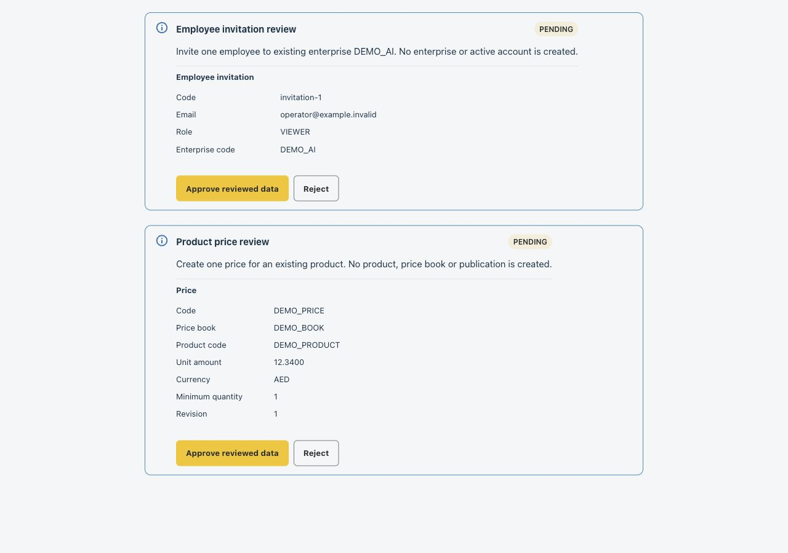
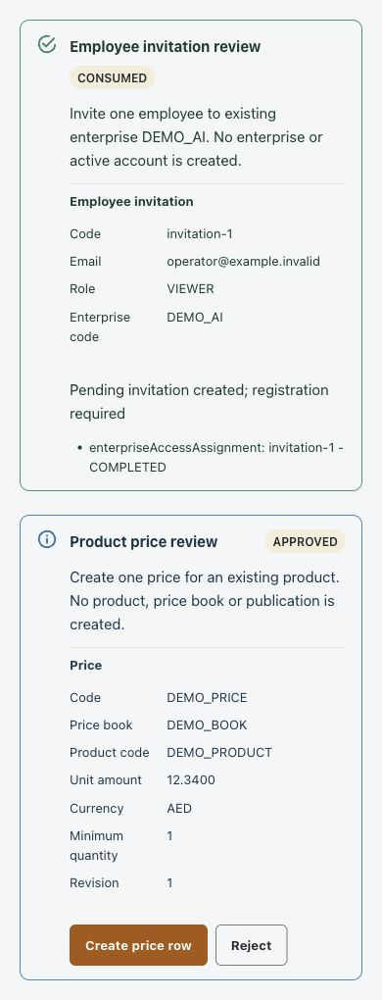
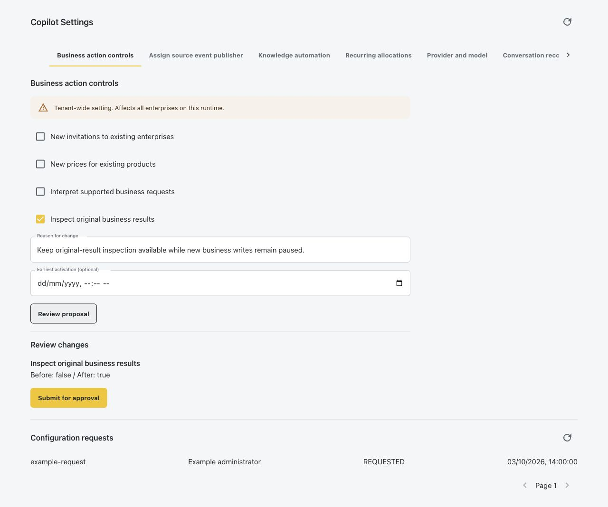
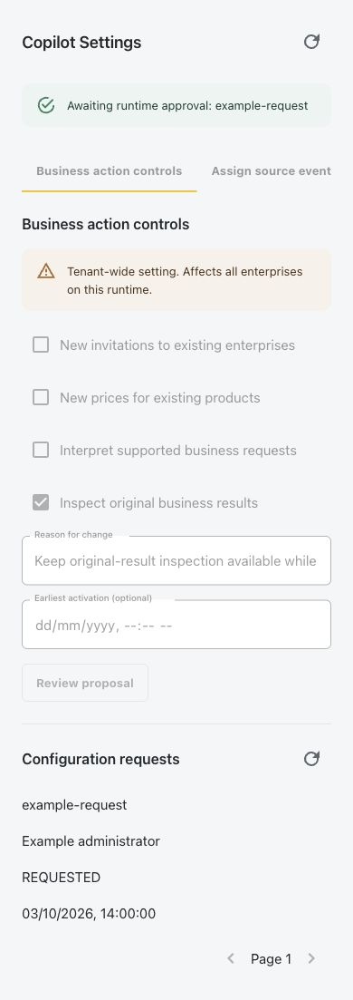
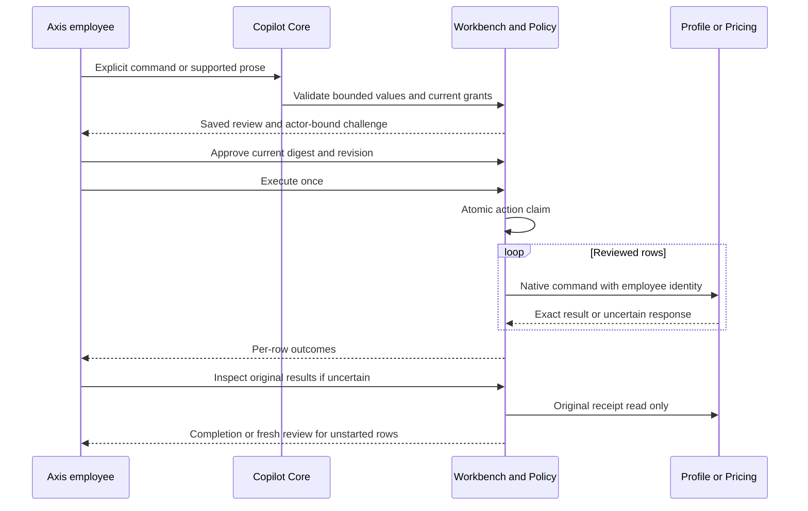

# Existing Enterprise Invitations and Product Prices

Functional owner: `nodics.copilot`. Technical owner: `copilotWorkbench`.
Profile owns invitations and access; Pricing owns price rows and authoring policy.

## Business Outcome

Use the conversation to invite employees into an enterprise that already exists,
or create prices for products that already exist. Neither journey creates an
enterprise or product as a side effect. Invitations remain pending registration.
Creating a price row does not activate a price book or publish a customer price.

Both journeys follow **prepare, review, approve, execute, inspect**. Preparation
and approval save only the Copilot action. Execution makes the native owner calls.
At most 20 invitations or 20 price rows are accepted in one standalone action.

Beginners should start with the step-by-step journey for their task and stop at
review until every value is correct. Developers should read the native execution
contract before extending fields. An operator should preserve the original action
reference and follow the recovery table whenever completion is uncertain.



Capture context: local Axis real confirmation renderer, synthetic data,
1280x900 desktop and 390x844 mobile. These are not signed-in customer records.



## Administrator Setup

1. Compose existing Copilot API, Core, Conversation, Policy and Workbench modules.
   Keep generated private `copilotAction` persistence enabled with atomic revision
   claims. Do not add customer kickoff orchestration or a second action store.
2. Configure the native Profile target and existing Product/Pricing workbench
   target through the approved Nodics configuration layer. The connection names
   below are placeholders for already registered deployment connections.
3. Enable only the new journey needed. Both flags default to `false`:

   ```js
   copilot: {
     workbench: {
       standaloneInvitationsEnabled: true,
       standalonePricesEnabled: true,
       enterpriseTarget: {
         enabled: true,
         moduleName: 'profile',
         connectionName: 'registered-profile-owner',
         targetAuthority: null
       },
       target: {
         pricingModule: 'pricing',
         connectionName: 'registered-commerce-owner',
         targetAuthority: null
       }
     }
   }
   ```

   Preserve existing `target.productModule` and other settings when applying a
   partial change. Standalone prices do not require a Product module target.
4. Grant `copilot.mutation.prepare` and `copilot.mutation.execute` independently.
   Invitations additionally require `profile.enterpriseAccess.assign`, but not
   `profile.enterprise.create`. Profile still checks administrator rights,
   consent, destination enterprise and allowed invitation roles on every request.
   Pricing still checks native schema write access and authoring/publication
   policy. A Copilot permission does not imply either native permission.
5. Preserve the employee bearer and initiating enterprise header. Explicitly
   naming a different destination enterprise does not switch the initiating
   identity or bypass Profile's destination authorization.
6. For optional natural-language extraction, enable
   `copilot.core.intentPlanning.enabled` and configure the existing provider,
   model and budget owners. Explicit JSON works without a model call. Never send
   secrets or coupon tokens through these commands.
7. For native original-result inspection, provision the Profile/Pricing private
   receipt journals and enable the reviewed recording/recovery prerequisites in
   [Original Business Results](original-business-results.md). Grant
   `copilot.mutation.reconcile` independently. Source installation changes no gates.

| Setting | Default | Effect |
| --- | --- | --- |
| `standaloneInvitationsEnabled` | `false` | Admits invitation-only preparation and execution |
| `standalonePricesEnabled` | `false` | Admits standalone price-row preparation and execution |
| `enterpriseTarget` | Disabled, unconfigured | Existing Profile routing, never a caller URL |
| `target.pricingModule/connectionName` | Deployment-owned | Existing native Pricing routing |
| `core.intentPlanning.enabled` | `false` | Optional permission-filtered extraction through accounted provider |
| `workbench.receiptRecovery.enabled` | `false` | Exact native inspection and reviewed unstarted-row continuation |

## Manage Admission in Axis

Beginners should ask an authorized administrator to configure these controls;
business users do not need elevated configuration permissions to use an admitted
journey for which they already have native access.

1. Open **AI & Copilot > Copilot Settings > Business action controls** with
   `copilot.configuration.read`, `copilot.configuration.manage` and the separate
   `copilot.configuration.admin` grant. Enterprise delegation cannot supply the
   elevated grant or expose this section.
2. Read the **tenant-wide** notice. All enterprises sharing the runtime are
   affected, although each operation still requires its own current permissions.
3. Choose new invitation admission, new price admission, supported request
   interpretation and original-result inspection independently. Each defaults
   off. These controls expose no endpoint, credential, native journal or grant.
4. Enter the reason, select **Review proposal**, check every before/after value,
   then **Submit for approval** once. Keep the request reference. No checkbox
   change or proposal submission immediately activates a feature.
5. Follow the existing independent runtime approval/activation journey. Reload
   Settings after activation to inspect the effective revision. Native targets
   and durable receipt prerequisites must already be configured by their owners.

To stop new standalone writes, propose clearing the invitation/price controls.
You may leave **Inspect original business results** enabled. Non-coupon original
inspection can then resolve already-submitted commands even when their new-write
gate is off. Original routing, identity and native permissions must still match.
Completed rows are never replayed. A fresh review of unstarted rows does not
override disabled execution; independently re-enable the journey before executing.

Turning off interpretation affects new provider planning, not explicit JSON
commands or native write permissions. Turning off inspection removes that Copilot
recovery surface; it does not delete receipts. A gate change is not cancellation
or rollback of a native command already in flight. Coupon recovery remains separate.

### Reviewed Controls on Desktop and Mobile

These screenshots use the real Axis Settings renderer with synthetic descriptors
and responses. They demonstrate layout and proposal-only behavior, not signed-in
deployment acceptance or a real configuration change.



Desktop review shows only the changed inspection value. The other three controls
remain off; the tenant-wide notice remains visible before submission.



The mobile result is a request awaiting approval, not an active setting. Inputs
are locked after submission to prevent duplicate requests. Use the existing
runtime approval process, then reload Settings to retrieve effective values.

## Invite Employees Step by Step

1. Open **AI & Copilot > Copilot Conversation** under the correct initiating
   enterprise. The Workspace prerequisites show invitation admission separately
   from enterprise creation. Prerequisites are not an execution authorization.
2. Supply the existing destination enterprise code and every email and role:

   ```json
   {
     "operation": "profile.enterprise.invite",
     "enterpriseCode": "DEMO_AI",
     "employees": [
       { "email": "operator@example.invalid", "roleCode": "VIEWER" }
     ]
   }
   ```

   With intent planning enabled, the equivalent prompt is: `Invite employee
   operator@example.invalid with role VIEWER to existing enterprise DEMO_AI.`
   Supported roles are `ENTERPRISE_ADMIN`, `CONTENT_MANAGER`, `OPERATOR`, and
   `VIEWER`; actual Profile policy may refuse a role for the current employee.
3. Resolve missing fields by submitting the complete corrected command. Copilot
   does not silently merge previous messages. Empty invitation lists, duplicate
   emails after case normalization, extra authority fields and unknown roles fail.
4. Review every email, role, destination enterprise and generated invitation row
   identity. No native invitation has been sent at this point.
5. Approve the current revision, then explicitly execute once. Each row goes to
   `POST /enterprises/:enterpriseCode/access-assignments` with the employee bearer
   and a stable idempotency key. No enterprise-create call occurs.
6. Read each outcome. Native acknowledgement must identify the exact destination,
   email, role and `PENDING` status. Invitees must still complete Profile's existing
   registration process. A pending invitation is not an active employee account.

## Create Prices Step by Step

1. Confirm that the product and price book already exist in the intended native
   authoring context. This adapter does not discover or create missing references.
   The review explicitly says that reference existence has not been verified.
   The current native draft schema accepts identifier strings; successful draft
   creation does not establish that a Product or PriceBook with that code exists.
2. Supply a new price-row code and all six explicit fields:

   ```json
   {
     "operation": "commerce.price.create",
     "prices": [{
       "code": "DEMO_PRICE",
       "priceBookCode": "DEMO_BOOK",
       "productCode": "DEMO_PRODUCT",
       "unitAmount": "12.3400",
       "currency": "AED",
       "minQuantity": "1"
     }]
   }
   ```

3. Keep monetary and quantity values as strings. Numbers, exponents, negative
   values and a zero minimum quantity are rejected. Amounts allow up to 24 integer
   digits and 12 decimal places. Currency must be three uppercase letters; the
   native owner remains responsible for business-valid currencies and references.
4. Review the exact amount, currency, product, price book, minimum quantity, code
   and generated initial revision `1`. Precision and trailing zeroes are preserved.
5. Approve, then execute. Each row uses the native generated `PUT /pricerow`
   creation contract with one transport attempt and the original employee.
6. Inspect outcomes. Use the existing Pricing and publication workflows for any
   later activation/publication. Copilot does not directly alter lifecycle status.

## API and Execution Contract

Preparation endpoints are `POST /v0/invitations/prepare` and
`POST /v0/prices/prepare` under the normal Copilot API exposure. They use the same
bodies as conversation commands, require secured employee access tokens, declare
sensitive request handling and return `Cache-Control: no-store`. They return a
clarification or the normal immutable confirmation, never a business record.
Approval, execution and original-result inspection reuse existing confirmations
routes; no new client-side execution registry exists.



Every executed field is in the displayed review and plan digest. Added record
fields, changed targets, stale revisions and foreign action scope fail closed.
Permissions and target configuration are checked before each native dispatch.
There is no automatic replay, compensation, service-token fallback or publication.

## Troubleshooting and Recovery

| Observation | Meaning | Next step |
| --- | --- | --- |
| Configuration required | Journey flag or native target is missing | Administrator reviews the correct configuration layer |
| Permission required | Independent Copilot or Profile grant is missing | Request an authorized policy review, not a broad wildcard |
| Clarification | Material values are absent or cannot be grounded in the human message | Send a complete explicit corrected command |
| Native refusal | Owner validation, consent, references or authoring policy refused the operation | Correct through the native owner; do not bypass it |
| `OUTCOME_UNKNOWN` | A native write may have happened, but completion is not proven | Preserve action reference and inspect original results |
| `NOT_STARTED` after another uncertain row | Later rows were deliberately not submitted | Continue only after all started rows are proven and a new approval is issued |
| Original receipt remains unknown | No exact completion evidence is available | Keep locked; current record existence is not receipt proof |

Do not create a replacement action to evade an uncertain row. Native original
inspection uses `POST /enterprises/:enterpriseCode/access-assignments/commands/inspect`
or `POST /pricerow/commands/inspect`; it never sends the original write again.

## Customize and Extend Safely

Use normal project-owned configuration files, such as your project's existing
`config/properties.js`, for the flags and registered routing names. Use the
existing later-layer override mechanism for presentation text under
`copilot.core.conversationContext.journeys`; verify the effective property
path in Core's defaults before applying deployment overrides. Do not put framework
behavior in custom kickoff modules or configure a browser-supplied endpoint.

A worked safe customization is to keep `standalonePricesEnabled: false` while
admitting invitation-only use with `standaloneInvitationsEnabled: true`, preserving
the existing Profile target and separate invitation grant. The Workspace then
explains price configuration as unavailable; no source edits or new permissions
are needed to display that state. Tests must verify it remains unavailable both
in explicit JSON preparation and provider-advertised forms.

New fields or owner operations require a framework adapter change, complete
digest-bound review, native permission/validation contracts and exact receipt
mapping. The hard bounds, explicit review, employee credentials, immutable target,
atomic claim and no-uncertain-replay guarantees are not configurable shortcuts.

## Common Mistakes

- Requesting enterprise-create permission for an invitation-only task. Use the
  independent invitation permission and let Profile evaluate destination access.
- Sending a decimal as a JSON number. Use an exact string to avoid rounding.
- Treating preparation as proof that a product, enterprise or price book exists.
  Native permissions/schema/authoring policy are enforced at execution, but
  current PriceRow draft authoring does not establish referenced-record existence.
- Treating an invitation as an activated employee or a price row as published.
  Registration and publication remain separate native-owner journeys.
- Starting a fresh command after a lost response. Inspect the original receipt;
  unknown completion must remain locked rather than duplicated.

## Verification

Run the isolated contract suite and the opt-in local synthetic inference test:

```sh
node --test nodics.copilot/modules/copilotWorkbench/test/copilotStandaloneActions.test.js
node --test nodics.copilot/modules/copilotCore/test/copilotIntentPlanning.test.js
NODICS_COPILOT_LOCAL_ACCEPTANCE=1 node --test nodics.copilot/modules/copilotCore/test/copilotLocalOllama.acceptance.test.js
```

The opt-in test pins loopback `127.0.0.1:11434`, uses the existing Ollama adapter,
and defaults to `gemma3:4b`. `NODICS_COPILOT_LOCAL_MODEL` selects another installed
local model. It sends fictional values only, performs no business writes and
validates actual extraction and measured model usage. Its test-only provider
bridge does not verify deployed usage persistence, authenticated APIs or budgets.
Without opt-in, these two network tests skip.

Axis verification uses `test/assistant/AssistantConfirmationCard.test.tsx` and
`test/assistant/standalone-actions.visual.html` at desktop/mobile sizes. Signed-in
acceptance still requires deployment-owned permissions, private receipt storage,
native authoring targets and disposable approved business records. Authored and
generated documentation is not automatically imported or published to a runtime.

### Native Authoring Acceptance

The framework includes independent disposable live tests for standalone prices
and products with linked prices. They authenticate real employees through Profile,
start an owned Commerce Staged runtime with CURRENT versioned MongoDB storage,
and use real native APIs and private command receipts. No test writes to the
customer project's databases or starts a frontend.

1. Start the local MongoDB replica set and Ollama using the deployment's existing
   service configuration. Install/select a local model through the provider guide.
2. Set `NODICS_ERASURE_ES_HOME` to the installed Elasticsearch home used by the
   shared isolated fixture, and `NODICS_ERASURE_MONGO_URI` to the local replica-set
   URI. Despite the historical variable name, these tests do not erase customer
   indexes; the fixture creates and cleans its own provider resources.
3. From the framework root run each test below with those variables exported:

   ```sh
   NODICS_COPILOT_PERSISTENT_ACCEPTANCE=1 node --test nodics.copilot/modules/copilotWorkbench/test/copilotPriceRuntime.live.test.js
   NODICS_COPILOT_PERSISTENT_ACCEPTANCE=1 node --test nodics.copilot/modules/copilotWorkbench/test/copilotProductRuntime.live.test.js
   ```

4. Each suite must pass all three scenarios: direct preparation, controlled loss
   of a successful native price response, and real Ollama prose extraction.
   Without opt-in the tests skip; a skip is not live acceptance.
5. Inspect failures at the native owner first. Do not widen native grants,
   bypass CURRENT versioned authoring, or replace a failed owner with a stub.
   Teardown runs after success or failure and closes only owned resources.

Both suites prove denied-reader boundaries, no native writes during review or
approval, stale-revision refusal, exact native values, persisted confirmation and
native-owner restart. In the two-product lost-price case, completed products and
the first price remain intact; inspection makes no writes, and renewed approval
creates only the unstarted second price. Diagnostics assert the exact number of
native completions. Duplicate conversation-turn submission adds no model charge.

The fixtures use synthetic catalogue and price-book identifiers rather than
published catalogues. This is native draft authoring/recovery acceptance, not
reference resolution, price-book activation, publication, storefront pricing,
full Axis browser acceptance or coverage of every operation in Commerce.
