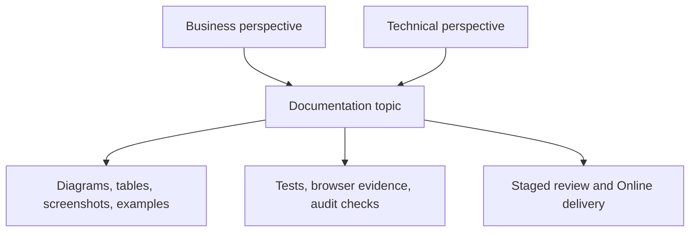

# Documentation Principles

Nodics documentation is part of the framework contract. It is not a one-time
project clean-up activity. Every new capability, configuration option,
provider, workflow, API, data pack, Axis journey, Nexus page, Agora storefront,
or project-layer extension must carry documentation that helps business users,
developers, operators, QA owners, and AI tools understand what changed and how
to use it safely.

The principle is direct: README files stay thin and source-adjacent, while
real documentation under the backend-owned documentation content model stays
deep, visual, publishable, permissioned, searchable, and governed.

## README and real documentation split

Module README files help a GitHub visitor, developer, or AI tool identify what
the module owns. They should be crisp. They should not become full training
manuals, production runbooks, provider migration guides, or long business
journeys. Installer README and the `nodics.ai` root README are exceptions
because they are public entry points into the whole workspace.

| Location | Purpose | Detail level |
| --- | --- | --- |
| Module `README.md` | State module responsibility, boundaries, warnings, and links to deep docs. | Thin and module-specific. |
| Module `docs/` | Explain implemented capability details owned by that module. | Deep, visual, testable, and customization-focused. |
| `nodics.docs` | Framework-wide product documentation and navigation source. | Enterprise hierarchy with business and technical journeys. |
| Generated content pack | Publishable documentation data imported into Staged and Online. | Backend-owned records with access, workflow, search, and checksums. |

## Required topic depth

Each detailed topic must explain the business problem first, then technical
ownership. It should not be only a list of files. A business user should know
what decision the page supports. A developer should know where to extend. An
operator should know runtime impact. QA should know what to validate. AI tools
should know which source owner to inspect before suggesting changes.

Required detail includes data models, configuration keys, APIs, events,
extension points, project-layer override paths, validation, troubleshooting,
security, access policy, publication state, and operational impact wherever
those are applicable.

## Visual contract

Documentation must not become boring blocks of text. The page should use
visual explanation where it helps the reader understand flow, ownership,
sequence, comparison, schema, or state. Diagrams, data-flow visuals,
state-flow diagrams, module hierarchy diagrams, tabular comparisons, schema
tables, screenshots, and code snippets are expected for serious capability
pages.

## Configuration and customization principle

Low-level configuration details are important because they change application
behavior. If a project can switch from local cache to Redis, change a provider,
extend a schema, add a service, override business logic, add a navigation
item, or configure a content area, the documentation must explain the exact
path. The same rule applies across cache, search, commerce, WCMS, workflow,
events, media, localization, profile, and every other capability.

Business users may configure governed records in Axis when the capability is
designed for administration. Developers extend from project modules when code
is required. Framework source changes are reserved for reusable framework
capabilities.

## Publishing and access principle

Real documentation is content. It must be modeled through content catalog
records, not hardcoded frontend JSON. Axis is the management and preview
experience. Staged holds the working copy. Approval governs Online publication.
Nexus and public links consume Online content only when the access policy
allows it. Some pages are public; some require authentication, roles, groups,
or permissions.

| Governance area | Documentation requirement |
| --- | --- |
| Access | Public, authenticated, role-based, group-based, or permission-based behavior. |
| Workflow | What edit triggers review, approval, publishing, and audit. |
| Search | Keywords, topic metadata, and future index readiness. |
| Evidence | Source path, generated record, checksum, browser proof, and validation command. |

## Common mistakes

- Writing only technical implementation notes and skipping the business
  decision or operational journey.
- Keeping detailed provider or configuration guidance only in README files.
- Adding screenshots without explaining the data or permission model behind
  the screen.
- Publishing documentation navigation from frontend constants instead of the
  backend content catalog.
- Forgetting that generated documentation must be updated every time source
  documentation changes.

## Verification

Documentation is acceptable when it passes the generator and validation
contract, imports as governed content, supports Staged and Online lifecycle,
and helps a beginner complete the journey without hidden tribal knowledge. A
developer should be able to identify the owning module, configuration path,
extension point, test command, and browser verification from the page itself.
