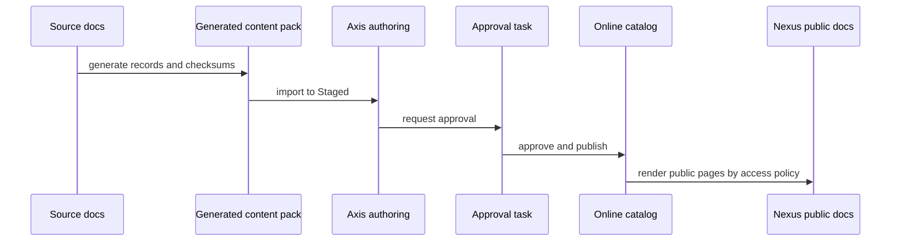

# Documentation Publishing Model

Nodics documentation is managed as publishable content, not static text that a
frontend hardcodes. Source Markdown and catalogue metadata generate a
documentation content pack. Axis imports that pack into Staged, authors and
administrators review it, Process manages approval tasks, and Online delivery
becomes visible only after governed approval and publishing. Nexus can expose
public documentation links, while Axis can show authenticated or role-based
pages when access policy requires login.

This model matters because documentation is part of the product. It carries
business guidance, implementation contracts, configuration behavior,
customization rules, visual evidence, and support instructions. If that
content changes, it deserves the same lifecycle discipline as other enterprise
content.

For a beginner, the safe mental model is: source documentation is prepared by
the owning module, Axis imports and reviews the Staged copy, approval promotes
the release to Online, and public readers only see what Online access policy
allows.

## Source to Online flow

The publishing model has a clear sequence. Developers update source
documentation and catalogue metadata. The generator creates content catalog
records, navigation nodes, pages, routes, access policies, search metadata,
publication state, and checksums. Axis imports the pack to Staged. Approval
decides whether the Staged release becomes Online. Public apps read Online
only.

Generation is intentionally one-way. `docs:generate` reads authored Markdown
and catalogue metadata, then updates the generated content pack. It does not
rewrite authored pages, delete detailed sections, or recreate mature topics as
basic scaffolds. Existing source detail is preserved in Git and reviewed like
implementation code; generated records are refreshed from that source so Axis,
Staged, Online, search, workflow, and checksums stay current.

## Content catalog authority

Navigation, page content, summary areas, dashboards, access policy, and search
metadata belong in the content catalog. Axis should let business users manage
these records through components such as navigation, groups, subgroups, and
pages. A user should be able to reorder navigation, update labels, change
visibility, and submit for publication from Axis where permissions allow.

The current implementation may render directly from content catalog records.
Future Elasticsearch indexing can improve search and retrieval, but indexing
does not replace content catalog ownership. The content catalog remains the
source of truth.

For customization and extension, a project should add or override
documentation structures through backend-owned content catalog records,
project-owned documentation packs, access policies, and renderer metadata.
Developers should avoid frontend-only documentation trees because those cannot
participate in Staged review, Online publishing, permission checks, search
metadata, or audit history.

## Access and workflow

Each page must declare whether it is public, authenticated, role-based,
group-based, permission-based, or restricted. Public pages may appear on Nexus
after Online publication. Authenticated pages should remain available inside
Axis or an authenticated documentation surface. Workflow triggers must exist
for page edits, navigation edits, dashboard changes, access policy changes,
source evidence changes, and search metadata changes.

| Record changed | Workflow impact | Verification |
| --- | --- | --- |
| Page body | Content review and Online publication. | Compare Staged and Online page revision. |
| Navigation item | Navigation review and browser refresh. | Axis left navigation updates after mutation. |
| Access policy | Security review before Online exposure. | Public and authenticated routes enforce expected access. |
| Search metadata | Search preview and indexing readiness. | Keywords and facets return the expected page. |

## Axis and public experience

Axis is both a documentation management surface and a documentation reading
surface for authenticated users. It should show available updates, trigger
approval, display approval tasks, and allow authorized users to approve or
reject from the same business journey. The user should not need to jump across
multiple confusing pages to complete a documentation release.

Nexus and other public surfaces should not show Staged content. If Online
content is missing, they should show a professional customer-friendly
maintenance or waiting-for-publication message. Swagger/OpenAPI is separate:
it is generated API reference and does not require CMS documentation approval.

## Developer and operator responsibilities

Developers must update documentation source whenever implementation behavior
changes. They must bump the content pack release when generated content
changes after an Online release, run generation and validation, and provide
source evidence. Operators must verify imports, approval tasks, Online state,
browser routes, logs, audit evidence, and rollback candidates.

This responsibility is ongoing. Documentation generation happens with current
implementation and future implementation updates.

Before merging a generated pack, reviewers should check two things: the
authored source diff explains the real change, and the generated data diff
matches that source. A generated data-only change is acceptable for checksum or
record-shape updates, but a source page disappearing, shrinking to a template,
or losing code examples is a release blocker.

## Common mistakes

- Treating generated documentation as a one-time seed rather than a recurring
  release.
- Hardcoding documentation cards or left navigation in Axis or Nexus.
- Blocking Swagger/API reference behind CMS documentation approval.
- Updating Staged content without incrementing the content pack release after
  Online publication.
- Forgetting access policies for pages that should be authenticated or
  role-based.

## Verification

The publishing model is correct when a fresh schema can import documentation
to Staged, submit approval, approve or reject through authorized actions,
publish Online, refresh Axis navigation without manual confusion, and open
public Nexus documentation only for pages whose access policy permits public
viewing. Generated content checks, validation reports, browser evidence, and
audit records must all agree on the same release.
