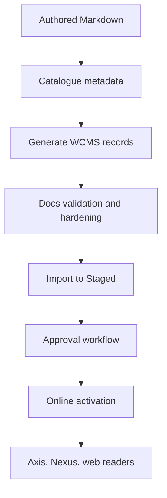

# Documentation Publishing Runbook

Nodics documentation has two lanes. Repository guidance lives in module
`README.md` and `AGENTS.md` files for developers and AI tools. Publishable
documentation lives as authored Markdown plus catalogue metadata in
`nodics.docs`, is generated into WCMS content-pack records, imported into
Staged, reviewed, and then activated Online. Axis manages the business and
operator journey. Nexus or other public consumers read Online content after
approval.

## Source map

| Capability | Source location |
| --- | --- |
| Authored pages | `docs/pages/` |
| Catalogue metadata | `docs/catalogue.json` |
| Content-pack generator | `scripts/generate-content-pack.mjs` |
| Documentation validation | `scripts/validate.mjs`, `scripts/audit-hardening.mjs` |
| Source coverage audit | `scripts/audit-source-coverage.mjs` |
| Generated WCMS data | `data/core-v001/headers/documentation/`, `data/core-v001/records/documentation/` |
| Documentation manifest | `data/manifest.json` |
| CMS publication services | `../nodics.wcms/modules/cms/src/service/publication/` |
| CMS documentation governance | `../nodics.wcms/modules/cms/src/service/documentation/` |

## Publishing model



For beginners, the Markdown file is the human-readable source, the catalogue
is the navigation and access contract, and generated records are the importable
data. Business users should not edit generated files directly. Developers
change authored pages and metadata, regenerate the content pack, and run the
validation gates. Operators prove that Staged and Online are aligned before
production readers see a page.

## Authoring steps

1. Create or edit an authored Markdown page under `docs/pages/`.
2. Add catalogue metadata with id, title, section, group, navigation order,
   access mode, source owner, related pages, source evidence, keywords, and
   visual requirements.
3. Include enough detail for business users, developers, operators, QA, and AI
   tools.
4. Include source maps, how-to guidance, customization and extension rules,
   common mistakes, and verification.
5. Run the generator and validation commands.
6. Review generated records and manifest checksums.
7. Import `core-v001` documentation data into Staged.
8. Request approval and publish Online.
9. Open Axis and public consumers to verify the page and navigation.

## Generated data contract

```text
nodics.docs/data/
  core-v001/
    headers/documentation/
    records/documentation/
  manifest.json
```

Generated files include documentation site, product, navigation, nodes,
dashboards, page records, routes, components, page metadata, access policies,
publication state, and search metadata. The generator owns these records so
all pages share the same hierarchy, access, workflow, rendering, and search
contract. Developers should update the Markdown and catalogue, then regenerate
data rather than hand editing generated record files.

## Review and Online activation

Documentation should flow through Staged before Online. Staged lets
administrators and reviewers inspect hierarchy, access, rendering, source
evidence, and search metadata. Online activation should validate the
publication manifest, preserve approved checksums, activate delivery pointers,
and keep rollback evidence. A production page should never be served from a
developer working file or from generated data that bypassed approval.

## Customization and extension guidance

Developers can extend documentation by adding new pages, navigation sections,
metadata fields, validation checks, generated record types, or renderer
components. Keep custom validation in scripts or tooling services and keep
business content in Markdown. A customer project can add documentation packs
using the same release structure as other data packs, while Axis remains the
review and publication journey.

If a capability page documents a module, add `sourceEvidence` paths to the
module package, schema, service, router, data, and test files where possible.
When source changes introduce a user-visible or extension-visible behavior,
update the authored page in the same release batch.

## Common mistakes

- Editing generated documentation records instead of the authored page.
- Adding a page without catalogue metadata or source evidence.
- Publishing directly to Online without Staged review.
- Treating README files as the complete business documentation.
- Showing references as copied designs instead of standards for comparison.

## Verification

Run the documentation generator, validator, source coverage audit, and
hardening audit. Then import generated documentation data into a fresh Staged
schema, request approval, publish Online, and open Axis plus the public
consumer route. The work is complete when business users see the page in the
right journey, developers can trace source evidence, operators can verify
publication state, QA can repeat the commands, and production readers receive
Online content only.
