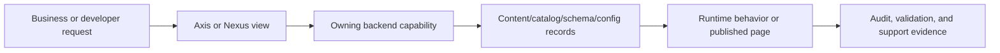

# Documentation Roadmap and Reader Journey

How business users, developers, operators, QA owners, and AI tools navigate the governed Nodics documentation set. This page is intentionally written for beginners, business users, developers, operators, architects, QA owners, and AI tools. It explains the business problem first, then the technical ownership model, then the exact customization and verification responsibilities so nobody has to guess where a change belongs.

Large enterprise platforms fail when readers cannot tell where to start, which page is authoritative, or whether a topic is business guidance, project customization, runtime operation, or source reference. The roadmap separates high-level understanding, module capability pages, extension guidance, operational runbooks, and reference material while keeping all pages backend-owned, publishable, searchable, and governed by content catalog metadata.

## Business context

For a business user, this topic answers what decision can be made, which operational journey is supported, and what risk is reduced. The practical value is faster delivery without losing governance: teams can understand the current capability, decide whether it applies to their project, and know when Axis, Nexus, content catalog, workflow, or runtime services are involved.

For beginners, the mental model is simple: the page title is the business capability, the table identifies who owns each part, and the diagram shows how a request or change flows. A reader should not need source-code knowledge to understand the journey, but the developer path is still available when customization is needed.

| Business question | Answer for this topic |
| --- | --- |
| What problem does it solve? | Large enterprise platforms fail when readers cannot tell where to start, which page is authoritative, or whether a topic is business guidance, project customization, runtime operation, or source reference. |
| Who uses it? | Business users, administrators, developers, operators, QA owners, implementation partners, and AI-assisted delivery tools. |
| What changes can it support? | The roadmap separates high-level understanding, module capability pages, extension guidance, operational runbooks, and reference material while keeping all pages backend-owned, publishable, searchable, and governed by content catalog metadata. |
| What must be governed? | Permissions, validation, source ownership, publication state, runtime impact, audit evidence, and rollback boundaries. |

## Journey and ownership

Nodics Docs owns the public documentation product, publication metadata, navigation hierarchy, and generated content pack records; Axis edits and previews through backend APIs, and Nexus consumes Online public pages. This keeps the reader-facing name friendly while preserving exact source ownership for developers and AI tools. Axis may render management screens or authenticated documentation, Nexus may render public Online content, and the backend content catalog remains authoritative for navigation, pages, access policies, and publication state.



| Responsibility | Owner | Notes |
| --- | --- | --- |
| Business capability name | Documentation Roadmap | Used in navigation and dashboards so readers are not exposed to raw module names first. |
| Source owner | nodics.docs | Carries exact implementation, documentation, and validation evidence. |
| Technical module | documentation | Holds the relevant schema, service, router, data, or contract detail where applicable. |
| Axis experience | Backend-declared workspace | Axis renders metadata and actions but does not become the authority. |
| Public experience | Online content delivery | Nexus renders only records approved for public access. |

## Data and configuration detail

Every topic must explain the data that changes behavior. Some topics are schema-driven, some are configuration-driven, some are publishable content, and some are operational records. The documentation must say which category applies before showing code. That keeps production operators and developers aligned on whether a change needs publication, restart, event propagation, approval, or only a project-layer override.

| Detail area | What to document | Verification signal |
| --- | --- | --- |
| Model or record | Type code, catalog, tenant, enterprise, state, owner, and lifecycle. | Schema contract or generated model test. |
| Configuration key | Default value, override location, environment scope, and runtime impact. | Config validation and runtime refresh evidence. |
| API or event | Route/event name, payload boundary, permission, idempotency, and failure mode. | Route, service, event, and authorization tests. |
| Publication and access | Staged/Online state, access mode, roles, groups, and permissions. | Content-pack validation and access-policy test. |

```js
documentationNavigation: { product: "nodicsDocumentationProduct", expandable: true, source: "contentCatalog" }
```

## Customization and extension

Developers should customize from the project layer first. A customer project may add properties, services, validators, pipelines, renderers, data packs, or provider configuration when the extension respects the owning capability. Business users may update governed records in Axis when the record is designed for administration. Framework source changes are reserved for improving the reusable product capability itself.

| Customization type | Recommended path | Avoid |
| --- | --- | --- |
| Business label, navigation, or content area | Axis-managed content catalog item with publication workflow. | Hardcoding labels or page trees in the frontend. |
| Runtime setting | Module configuration with validation and governed runtime propagation. | Editing node-local files on each server by hand. |
| Domain behavior | Extension service, validator, pipeline step, or provider adapter. | Forking the standard module for customer-only logic. |
| Public visibility | Access policy with public/authenticated/role-based state. | Exposing internal or draft pages through Nexus. |

## Operations and governance

Operators need production-safe evidence, not only implementation notes. Each page must call out logging, tracing, permission checks, event propagation, data import/export, publication status, rollback behavior, and troubleshooting. If a capability affects multiple nodes, the documentation must explain how changes reach every node and how a partial failure is detected.

| Operational concern | Required documentation detail |
| --- | --- |
| Security | Authentication mode, permission code, role/group, tenant and enterprise isolation. |
| Audit | Actor, timestamp, source record, checksum, approval, route/event, and result. |
| Resilience | Retry, idempotency, compensation, fallback, cache invalidation, and rollback. |
| Observability | Logs, metrics, dashboard cards, health checks, and support evidence. |

## README segregation contract

README files are source-adjacent entry points. They help a developer, AI tool,
or GitHub visitor identify what a module owns and where to continue reading.
They are not the place for full business journeys, screenshots, long provider
matrices, configuration tutorials, migration guides, or operator runbooks.
Those details belong in the backend-owned documentation content catalog under
`nodics.docs` or the owning module `docs/` area so they can be published,
permissioned, searched, approved, localized, and rendered through Axis and
Nexus.

| README section | Required purpose | What must move to real docs |
| --- | --- | --- |
| Title and one paragraph | Name the module and its capability boundary. | Long product positioning and full business journeys. |
| Responsibility | State what the module owns and what it does not own. | Full schema tables, API matrices, and lifecycle runbooks. |
| Developer Notes | Give crisp source-adjacent implementation cautions. | Provider tutorials, customization walkthroughs, and production operations. |
| Documentation | Link to the authoritative deep docs pages. | Duplicated public documentation content. |
| Verification | List the focused validation path. | Complete troubleshooting guides and release evidence matrices. |

Installer and the `nodics.ai` root README are exceptions because they are
direct GitHub entry points. All other module README files should stay below
the thinness threshold and continue readers into real documentation. When a
future implementation adds functionality, the documentation generator or the
developer must update the real docs page, source map, access policy, visual
evidence, and validation commands. The README should only add or adjust the
short pointer if the module responsibility or deep documentation location
changed.

## Common mistakes

- Treating a friendly navigation label as the technical source owner.
- Writing only developer details and skipping the business decision that the page supports.
- Updating Axis or Nexus code when the content catalog, schema, or backend capability should own the change.
- Forgetting access rules for public, authenticated, role-based, group-based, or permission-based pages.
- Skipping diagrams, comparison tables, source maps, or troubleshooting matrices because the topic feels obvious.
- Changing runtime behavior without explaining production impact, cluster propagation, and rollback.
- Leaving generated documentation without source evidence, validation commands, and maturity state.

## Verification

Verification starts with the document itself: it must include business context, technical ownership, a visual flow, data or configuration tables, customization guidance, common mistakes, and validation evidence. Developers then run the documentation generator and content-pack validator so the page becomes backend-owned data with checksum, lifecycle, navigation, access policy, publication state, and search metadata.

For implementation verification, run the owning module tests and any Axis or Nexus renderer tests that consume the page. Operators should confirm that production-like runtime behavior matches the documentation: permissions reject unauthorized access, Online pages do not expose Staged data, runtime changes propagate through governed events, and troubleshooting evidence is available without exposing secrets.
