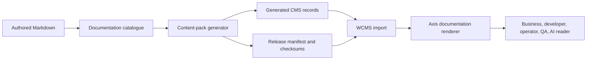

# Nodics Docs overview

`nodics.docs` is the standard Nodics framework documentation module. It owns
framework documentation content that is imported into WCMS and rendered by
Axis. It is not a frontend, not a runtime server, and not a dumping ground for
every page a user can see. Its job is narrower and more important: preserve
the reusable framework story, generate governed CMS records, and make that
content available through the same backend-owned content-pack lifecycle used
by other Nodics capabilities.

For a beginner, think of `nodics.docs` as the framework library. Axis is the
reading application. WCMS is the library catalogue and delivery desk. The docs
module owns the books about the framework. Axis can display those books, but
Axis does not own them.

## What this is

This page explains the documentation module as a functional capability. It is
written for business evaluators who want to understand how Nodics teaches its
platform, developers who need to add or change framework documentation,
operators who need to import documentation content safely, testers who need to
verify release integrity, and AI tools that must not place documentation in the
wrong repository.

`nodics.docs` owns framework-level documentation such as:

- what Nodics is and what business problem it solves;
- modular architecture and ownership;
- local quick start and verification;
- customization and extension;
- runtime and DevOps guidance;
- Core, Platform, WCMS, Media, Cron, Docs, and additional standard module
  explanations.

It does not own Axis product documentation, customer project documentation,
customer-specific setup, or frontend renderer code.

## Why it exists

Enterprise frameworks fail adoption when the product can run but nobody can
explain it. A new business user needs to understand the problem being solved.
A new developer needs to know what to clone, which commands to run, and where
to customize safely. An operator needs to know which servers, imports,
properties, logs, and rollback paths matter. An AI tool needs a durable
authority that survives beyond one chat.

Without a documentation module, framework guidance tends to scatter across
README files, old project notes, frontend pages, temporary migration folders,
and generated data. That creates a second authority problem. `nodics.docs`
keeps framework documentation in one backend-owned module and publishes it as
an immutable content release that WCMS can validate and import.

## Business value

Documentation is part of the product, not an afterthought. Good framework
documentation reduces onboarding cost, sales friction, partner confusion,
support time, and customization risk. It helps a business evaluator understand
why Nodics exists before asking a developer to inspect code. It helps a
partner developer avoid unsafe shortcuts. It helps an operations team rebuild
an environment from source-controlled content instead of relying on manually
edited database records.

The business value is strongest when documentation is governed the same way as
other enterprise content:

| Business concern | `nodics.docs` answer |
| --- | --- |
| First-time adoption | Guided pages explain what Nodics is, how to run it, and what to inspect first. |
| Partner customization | The customization guide explains configuration-first and customer-module-first extension. |
| Operational confidence | Runtime and verification pages explain servers, imports, registry, and recovery. |
| Governance | Generated CMS records and manifests prevent silent content drift. |
| Multi-project clarity | Framework docs, Axis docs, and customer docs remain separate even when Axis renders them together. |

## Beginner mental model

Imagine a company library. The library has books, a catalogue, shelves, access
rules, and a reading room. In Nodics:

- `nodics.docs` writes and owns the framework books.
- The generator converts those books into WCMS records.
- WCMS imports the records and delivers pages.
- Axis is the reading room where employees open documentation.
- Customer projects write their own customer/project books in their own
  repository.

That separation matters because a book about the framework should not be
rewritten by a customer project, and a customer-specific guide should not be
published as if every Nodics adopter used the same project.

## How it works

The module starts from authored Markdown and a catalogue. The generator reads
the catalogue, parses each page, embeds governed local images as safe data
payloads, creates CMS catalogs, sites, page records, component records, route
records, renderer mappings, and a release manifest. WCMS then validates and
imports the release. Axis renders the delivered documentation pages through
its documentation renderer.

The generated data is committed because the runtime import contract needs
deterministic records and checksums. The generated data is not the source of
truth. If a page title, body, route, image, or navigation entry is wrong, fix
the Markdown or catalogue and regenerate.

## Documentation ownership map

| Documentation product | Source owner | Runtime delivery | What must not happen |
| --- | --- | --- | --- |
| Framework docs | `nodics.ai/nodics.docs` | WCMS imports framework docs pack and Axis renders `/docs/framework` routes. | Do not store framework docs in the frontend repository. |
| Axis product docs | `nodics.ai/nodics.platform/modules/axis` | WCMS imports Axis docs pack and Axis renders `/docs/nodics-axis`. | Do not put Axis product docs in `nodics.docs` just because Axis displays them. |
| Customer project docs | Owning customer project | WCMS imports the project docs pack and Axis renders the project docs source. | Do not hardcode a customer project into framework docs. |
| Swagger/API docs | Registered runtime modules | Axis groups API references by runtime/module discovery. | Do not invent API groups in the browser without backend evidence. |

This matrix is one of the most important documentation contracts in Nodics.
Navigation may group products together for a nice user experience, but source
ownership remains separate.

## Step-by-step usage

To update framework documentation:

1. Edit the authored Markdown page under `nodics.docs/docs/pages`.
2. If you add a new page, add it to `nodics.docs/docs/catalogue.json`.
3. If the page uses an image, place the image under
   `nodics.docs/docs/pages/assets/images` and reference it with a relative path.
4. Bump the documentation release when generated output or release content
   changes.
5. Run the documentation generator.
6. Run the documentation tests.
7. Import the release through WCMS in a local or fresh bootstrap environment.
8. Open Axis documentation and verify the page renders with headings, tables,
   diagrams, and images.

For example, if you add a Commerce capability overview, the page belongs in
`nodics.docs` only if it explains reusable framework Commerce behavior. If a
customer project adds customer-specific Commerce setup, that guide belongs in
the customer project.

## Configuration and source map

Important source files are:

| Artifact | Purpose |
| --- | --- |
| `docs/catalogue.json` | Authored list of framework documentation pages, owners, routes, summaries, and release version. |
| `docs/pages/**/*.md` | Human-authored canonical documentation source. |
| `docs/pages/assets/images` | Governed images used by documentation pages. |
| `scripts/generate-content-pack.mjs` | Converts source documentation into generated CMS data and manifest files. |
| `scripts/validate.mjs` | Enforces release, ownership, depth, structure, image/table/diagram, and unsafe-reference checks. |
| `data/core/data/documentation` | Generated CMS records imported by WCMS. |
| `data/manifest.json` | Aggregate module data manifest with generated documentation release and checksum evidence. |

Generated output must be recreated from source definitions. Do not repair a
checksum by editing generated files directly.

## Customization and extension

Partners should not customize framework documentation inside `nodics.docs`
unless the change improves reusable framework guidance. A customer project can
add its own documentation content pack to explain project modules, local setup,
sample data, customer-specific business rules, or environment-specific
operations. Axis can display that customer documentation alongside framework
documentation after BackOffice and WCMS advertise it.

The safe extension ladder is:

1. improve the existing framework page when the guidance is reusable;
2. add a new `nodics.docs` page when a standard framework module needs public
   explanation;
3. add Axis product docs in the Platform Axis backend module when the topic is
   Axis behavior;
4. add customer docs in the customer project when the topic is project-owned;
5. add frontend renderer behavior in `nodics.axis` only when presentation code
   is required.

## DevOps and production notes

Documentation releases are operational artifacts. A production environment
should import them through WCMS, preserve import history, reject changed
checksums under the same version, and make rollback possible by installing a
known previous release. Images should remain governed content payloads or safe
media references rather than copied frontend files.

Operators should monitor documentation import status, checksum failures,
route delivery, missing renderer errors, and image rendering. A documentation
page that is correct in Git but not imported into WCMS is not live. A page
that is imported but points to missing images is not acceptable for business
onboarding.

## Security, tenant, and governance notes

Documentation should never expose credentials, private URLs, local machine
paths, provider secrets, database passwords, tokens, or customer-private
configuration. It may explain where secrets belong, but it must not publish
secret values. Public documentation should also avoid implying that one
reference project name is mandatory for all customers.

Tenant and enterprise behavior should be described carefully. If a behavior is
implemented, say so. If it is a design direction, mark it as concept,
design-contract, partial implementation, or operational.
Do not invent runtime behavior to make documentation look complete.

## Troubleshooting

| Symptom | Likely cause | Safe recovery |
| --- | --- | --- |
| Documentation release is invalid | Markdown, catalogue, or generated manifest changed without regeneration or version bump. | Fix source, bump release when needed, regenerate, rerun tests. |
| Axis documentation page shows recovery | WCMS has not imported the pack, route is missing, or WCMS is unavailable. | Check WCMS, import status, generated route data, and page route. |
| Image displays as text or broken link | Markdown image path or generator image embedding failed. | Verify image exists under `docs/pages/assets/images`, path is relative, and generated component contains an image block. |
| Page appears under wrong product | Documentation source ownership or BackOffice documentation registry is wrong. | Move source to the owning module/project and regenerate the correct pack. |
| Customer-specific setup appears in framework docs | Ownership drift. | Move the project-specific guide to the customer project documentation pack. |

## Common mistakes

- Writing short summaries when the page needs beginner-level explanation,
  examples, operations notes, and verification.
- Creating a new page when an existing canonical page should be expanded.
- Putting customer project documentation into the framework docs module.
- Putting Axis product documentation into the frontend repository.
- Editing generated data or manifests by hand.
- Forgetting to bump the release after changing generated content.
- Importing docs without opening the rendered Axis page to verify diagrams,
  tables, images, and navigation.

## Verification

Run the documentation generator and validator from `nodics.docs`. Then run the
framework quality checks that cover documentation and AI guidance. For runtime
proof, import the generated release through WCMS and open the Axis
documentation routes. The live result should show Framework documentation as a
separate documentation product with rendered pages, headings, tables, diagrams,
and images.

For a fresh local proof, run the customer project's local acceptance script
after database reset. The evidence should show documentation releases current,
WCMS record counts healthy, Axis documentation routes returning HTTP 200, and
images embedded as renderable documentation blocks. If only the Markdown file
looks correct but the generated pack, import status, or Axis route fails, the
documentation change is not complete.

## Related pages

Read **What is Nodics?** for the product story, **Modular architecture and
ownership** for the source-ownership model, **Local quick start** for the
first runnable setup, **Customization and extension guide** before moving
documentation between owners, and **WCMS content management** to understand
how generated documentation records become delivered pages.
