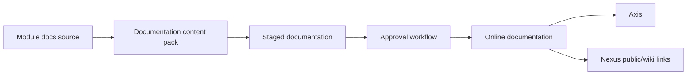

# Docs Overview

Docs Overview explains how Nodics documentation is authored, generated,
published, searched, and rendered. It is the entry point for documentation
management, not the only page that describes the entire system.

## Documentation model

| Area | Ownership |
| --- | --- |
| Thin README | Module-specific developer and AI context. |
| Detailed docs | Content-pack documentation with diagrams, tables, examples, and journeys. |
| Navigation | Backend content catalog, editable through Axis. |
| Publication | Governed Staged-to-Online flow with approval and audit. |

## Business perspective

Documentation should help business users understand the capability, the
problem it solves, who uses it, what decisions it supports, what can be changed
in Axis, and what risks or approvals apply. Public pages may appear in Nexus;
role-scoped pages may remain inside Axis.

## Developer perspective

Developers and AI tools should treat the documentation contract as framework
law for every current and future implementation. A generated page must include
business perspective, technical perspective, extension points, configuration,
schemas or data model, APIs/events where relevant, project-layer override path,
visual explanation, troubleshooting, and verification.

## Continue with

- **Documentation Principles** for the reusable generation contract.
- **Reader Journey and Coverage** for business, developer, operator, QA, and
  AI-tool reader requirements.
- **Documentation Publishing Model** for Staged, approval, Online, and
  visibility.
- **Capability Documentation Maturity Pattern** for quality expectations.

## Operational evidence

Documentation evidence should prove both content quality and publication behavior. Include generated page count, release version, validation report, hardening audit, source evidence, visual requirements, role visibility, Staged state, approval task, Online state, Axis route, Nexus route where public, and search/navigation result. This is especially important because documentation is not a one-time artifact. Every new capability must bring its own updated documentation evidence before it is treated as complete.

## Reader and implementation contract

A beginner should understand where documentation lives and why README files are intentionally thin. A business user should know how published pages explain business value, risks, approval, and operations. A developer should know how generated documentation is tied to module contracts, source evidence, configuration, APIs, events, schemas, and extension points. An operator should know how publication state, visibility, roles, and search affect what users can see.

Every future documentation generation must follow this contract. It should not produce flat, text-only pages. It must include visual explanation, tabular comparison where useful, business and technical perspectives, project-layer customization guidance, validation, troubleshooting, and links to adjacent journeys.

## Documentation maintenance rule

Keep this topic current whenever implementation, configuration, Axis workflow, publication behavior, or customer-facing rendering changes. The page should remain small enough to scan, but it must still carry enough business context, technical ownership, customization guidance, visual structure, operational evidence, and verification detail for a reader to act without guessing. When the detail becomes too large, create a sibling topic and link it from this page instead of turning the overview back into a long mixed article.

## Common mistakes

- Treating documentation generation as a one-time cleanup.
- Putting detailed enterprise documentation only in module README files.
- Hardcoding documentation navigation in Axis.
- Publishing text-heavy pages without diagrams, tables, examples, and
  verification evidence.

## Verification

Verify docs by running generation checks, validating the content pack,
publishing Online, opening Axis and Nexus views, checking role visibility, and
using search/navigation to find topics without guessing package names.
