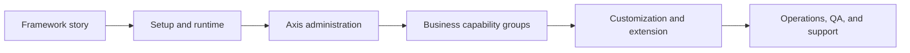

# Reader Journey and Coverage

Nodics documentation must serve multiple readers at the same time without
making any of them feel lost. A business user wants to know what the capability
does and which decision it supports. A developer wants exact ownership,
configuration, extension, API, and testing detail. An operator wants runtime,
publishing, logs, rollback, and support evidence. A QA owner wants acceptance
criteria. An AI tool needs source boundaries so it does not edit the nearest
file and create the wrong authority.

The reader journey is therefore not a decorative navigation choice. It is a
framework contract for how capability knowledge is organized.

## Audience paths

Each page should make the entry path clear. A beginner can start from the
business story, then move into the running product, then into ownership and
customization. A specialist can jump directly to the capability page and still
find the tables, diagrams, and validation evidence they need.

| Reader | First question | Page must provide |
| --- | --- | --- |
| Business user | What problem does this solve? | Outcome, supported operation, risk, approval, and impact. |
| Administrator | What can I do in Axis? | UI journey, permissions, workflow state, and next action. |
| Developer | Where do I extend safely? | Owning module, schema, service, configuration, API, event, and project path. |
| Operator | What changes at runtime? | Server graph, logs, health, event propagation, rollback, and support evidence. |
| QA owner | How is this accepted? | Data setup, browser path, API checks, tests, and failure cases. |
| AI tool | What is authoritative? | Source owner, generated artifacts, source map, and forbidden shortcuts. |

## Coverage map

The documentation hierarchy should be broad enough that users recognize the
business capability before they see raw implementation names. WCMS and Content
Management, Product Catalog and Discovery, Cart and Checkout, Payments,
Shipping, Order Management, Returns and Refunds, Users and Enterprise
Management, Stock, Pricing, Process Workflows, Cron and Scheduled Automation,
Search and Discovery Providers, Accelerators and Industry Templates, and
Solution Use Cases are examples of business-friendly groups.

## Topic composition

Every capability page should be predictable. Readers should not have to guess
whether a page contains only technical notes or the full business journey.
When a capability is backend-owned but rendered in Axis, the page must explain
both. When public content is visible in Nexus or Agora, the page must explain
Staged, approval, Online delivery, and access policy.

Recommended sections include business context, journey and ownership, data and
configuration detail, customization and extension, operations and governance,
common mistakes, and verification. Topic dashboards at section, group,
subgroup, and page level should summarize child navigation so users can scan
before opening every page.

## Navigation behavior

Navigation should be hierarchical, expandable, searchable, and backend-driven.
However, hierarchy should not punish the reader. A group with one page should
be avoided or flattened by splitting the content into meaningful sibling pages.
Groups should exist when they help compare or choose between multiple topics.
The left navigation should use business-friendly labels; exact technical
module names should appear in the body, source map, or technical reference.

Search should work across keywords, topics, module names, business phrases,
configuration names, and API terms. The current implementation can use content
catalog data directly. Future indexing can push the same content catalog into
Elasticsearch without changing the authoring principle.

## Business and technical balance

The same topic should answer two levels of questions:

| Perspective | Required content |
| --- | --- |
| Business | Problem solved, who uses it, decisions supported, Axis/runtime behavior, risks, approvals, and impact. |
| Technical | Owning module, data model, configuration keys, APIs/events, extension points, project-layer override path, validation, and troubleshooting. |

This balance is what makes documentation useful for an enterprise customer
and still detailed enough for developers and AI-assisted implementation.

## Common mistakes

- Creating a deep hierarchy where a user opens two containers to reach one
  page.
- Naming top-level groups from package names instead of business capabilities.
- Hiding business impact in developer-only implementation notes.
- Forgetting operator, QA, and AI-tool needs when writing only happy-path
  tutorials.
- Making search depend on frontend-only metadata instead of backend-owned
  content records.

## Verification

Reader journey coverage is proven when a new user can use navigation, search,
topic dashboards, and page content to move from a business question to the
correct technical owner. Validation should include generated documentation
checks, content-pack import, Axis navigation rendering, public/authenticated
access checks, and browser verification for the workflows described by the
page.
