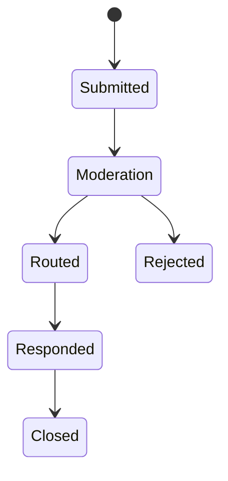

# Contact Submission Operations

Contact Submission lets public or authenticated users send business enquiries
that can be reviewed, moderated, routed, and answered. Engagement owns the
submission lifecycle. Communication providers may send notifications, Process
may run workflows, and Axis may show moderation queues, but those consumers do
not own the submitted content. For beginners, a contact form creates a
governed record that needs safety, routing, and audit.

## Source map

| Area | Source location |
| --- | --- |
| Contact Submission module | `../nodics.engagement/modules/contactSubmission/package.json` |
| Engagement overview | `docs/pages/nodics.engagement/unified-operations.md` |
| Governance docs | `docs/pages/nodics.engagement/governed-automation.md` |
| Communication providers | `docs/pages/nodics.communication/provider-runbooks.md` |
| Nexus form data | `../../nodics.kickoff/modules/nexus.web/data/sample-v001/content/records/engagement/` |

## Lifecycle



The business problem is safe response management. Business users need to know
which enquiries are new, which are waiting, and which require follow-up.
Developers need form and version contracts. Operators need spam controls,
workflow evidence, notification status, and recovery steps for production.

## Data contract

Form definitions, form versions, submission fields, consent, source page,
locale, and routing rules should be explicit. Submission records should store
only necessary data and should respect privacy and retention policies.

```js
module.exports = {
  nexusContactForm: {
    code: 'nexusContactForm',
    active: true,
    fields: ['name', 'email', 'message'],
    moderationRequired: true
  }
};
```

## Customization and extension guidance

Developers can add field validators, moderation rules, routing adapters,
workflow callbacks, notification templates, and retention policies. Business
users should manage form configuration, queue decisions, and response status
through Axis. AI tools can help with response drafts only after respecting
privacy and review rules.

## Implementation handoff

Each contact-submission change should identify the public form, versioned
fields, validation rules, consent text, moderation queue, workflow route,
notification template, and retention policy. Business users see a manageable
journey, developers keep form contracts stable, operators can recover failed
routing in production, and QA owners can prove unsafe submissions are blocked.

## Evidence checklist

Submission evidence should include form code, version, source route, locale,
field validation result, consent flag, moderation status, assigned queue,
notification state, retention class, and correlation id. Operators should be
able to trace a missing response from browser submission to queue assignment
and communication receipt. Developers should avoid storing unnecessary personal
data just to make reporting easier.

This keeps public contact journeys useful without turning them into unmanaged
data collection. Business users get enough context to respond, while security
and production support keep retention and privacy boundaries visible.

Production evidence should also show duplicate detection and abuse controls.
That lets operators separate genuine customer enquiries from noisy traffic
without blocking the business team from responding to valid messages.

## Common mistakes

- Treating a frontend contact form as the authority.
- Accepting submissions without validation, consent, or spam controls.
- Sending notifications before moderation policy allows it.
- Keeping personal data longer than required.
- Hiding failed routing or notification evidence from operators.

## Verification

Import form definitions into a fresh schema, submit a browser form, confirm
validation, moderation, routing, notification, audit, and retention behavior.
Production readiness requires business queue visibility, developer tests,
operator failure evidence, and QA proof that rejected or unsafe submissions do
not create outbound communication.
