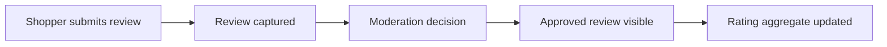

# Customer Reviews and Ratings

Customer Reviews and Ratings is the overview for capturing shopper feedback,
moderating it, publishing approved reviews, and maintaining aggregate rating
correctness. The detailed moderation and recovery topics live beside this
page.

## Review lifecycle

| Stage | Business question | Technical question |
| --- | --- | --- |
| Capture | Who can submit feedback? | Which API, identity, and product reference are required? |
| Moderate | Who approves or rejects? | Which roles, queues, and state transitions apply? |
| Publish | Where does the review appear? | Which site, catalog, channel, and visibility rules apply? |
| Aggregate | Are ratings accurate? | Which recalculation and recovery path validates totals? |

## Business perspective

Reviews influence product trust, merchandising, search, and customer service.
Business users need to know which reviews are waiting, which were rejected,
which are public, and whether aggregate ratings are trustworthy. Documentation
must describe the operational journey without hiding it behind API language.

## Developer perspective

Developers need the data model, public submission behavior, moderation
workflow, aggregate update logic, events, permissions, and extension points.
Projects may add fraud checks, syndication, review requests, moderation
policies, or downstream search indexing, but those changes must stay inside the
governed engagement model.

## Continue with

- **Review Moderation and Governance** for Axis queues, approval, rejection,
  permissions, and business audit.
- **Review Aggregation and Recovery** for aggregate correctness, recalculation,
  failure recovery, and search or product-page impact.

## Operational evidence

A review feature is only trustworthy when the visible customer experience and the administrative queue agree. Evidence should include submitted review record, product relation, moderation state, reviewer decision, final public visibility, aggregate rating result, and any downstream search or discovery update. Project documentation should also say whether reviews are enabled by site, catalog, channel, product type, or customer segment. This helps a business user understand why reviews appear in one experience and not another.

## Reader and implementation contract

A beginner should understand the simple journey: a shopper submits feedback, a reviewer makes a governed decision, and only approved content affects public experience. A business user should know how reviews affect trust, merchandising, service response, and product discovery. A developer should understand the submission contract, moderation state, aggregate update, events, permissions, and extension points. An operator should know which queues, logs, and recalculation tools prove the feature is healthy.

Every review topic must include shopper journey, Axis moderation journey, public visibility, security and privacy rules, aggregate correctness, recovery path, and browser verification. If a project customizes rating rules, review requests, syndication, or moderation policy, this page must link to the project-specific implementation and tests.

## Documentation maintenance rule

Keep this topic current whenever implementation, configuration, Axis workflow, publication behavior, or customer-facing rendering changes. The page should remain small enough to scan, but it must still carry enough business context, technical ownership, customization guidance, visual structure, operational evidence, and verification detail for a reader to act without guessing. When the detail becomes too large, create a sibling topic and link it from this page instead of turning the overview back into a long mixed article.

## Common mistakes

- Showing reviews publicly without a moderation state.
- Updating aggregate ratings without a recovery path.
- Documenting submission APIs but not the business approval journey.
- Forgetting privacy, abuse, and role-based access rules.

## Verification

Verify reviews by submitting a review, moderating it, checking public
visibility, recalculating aggregate ratings, and confirming audit evidence.
Browser checks should cover shopper-visible pages and Axis moderation screens.
