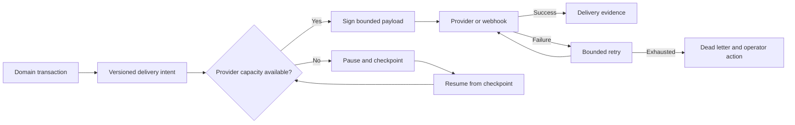

# Enterprise scale, resilience, and ecosystem operations

Enterprise Engagement must remain safe when volumes rise, providers slow down, regions fail, contracts evolve, and privacy obligations require deletion. This beginner-friendly guide turns those expectations into operational controls and a release acceptance journey. It covers the framework contract and clearly separates it from deployment-specific proof.

The business value is continuity with trustworthy evidence: customers can still submit and receive service, operators can recover interrupted work, and leaders can understand capacity and risk without sacrificing privacy or domain ownership.

`engagementCore` supplies common bounds and evidence. Domain modules retain customer records and lifecycle authority. `engagementApi` supplies secured versioned interfaces. Provider adapters transport bounded events or requests but never become the source of truth. Axis exposes operational evidence without storing payloads, secrets, or an alternate status.

## Production journey

## Capacity and pagination

All lists use a bounded page size and stable cursor order. The default upper bound is 100 records. Clients do not request every customer record and paginate in the browser. Stable ordering includes a unique tie-breaker so records are neither skipped nor duplicated when timestamps match.

Batch commands, exports, projection rebuilds, provider delivery, archive, and privacy propagation each need an explicit limit. In-flight delivery capacity produces `AVAILABLE` or `BACKPRESSURE`; it does not discard work. A production release defines expected peak arrival rate, sustained throughput, storage growth, index growth, queue age, projection lag, and p95/p99 response budgets.

## Regional residency and recovery

Every workload resolves an allowed region from tenant policy. A request cannot select an unapproved region through its payload. Multi-region replication must distinguish recoverable derived projections from authoritative customer evidence and must respect legal residency and deletion requirements.

Recovery checkpoints store workload, partition, region, cursor, source hash, processed/failed counts, status, timestamps, and correlation ID. They do not copy domain payloads. After interruption, a worker resumes from durable evidence and applies idempotency and source-revision checks.

The default framework policy records a 15-minute recovery point objective and a 60-minute recovery time objective. Those numbers are configuration targets, not proof. Each deployment must demonstrate backup restoration, regional failover, provider outage recovery, search/index rebuild, dead-letter reconciliation, and deletion propagation within its approved objectives.

## Provider and webhook delivery

Provider delivery records event type/version, idempotency key, payload hash, region, safe endpoint reference, attempt count, next attempt, response code, delivery time, and correlation. Payload content and credentials stay outside operational evidence.

Webhooks use a timestamped HMAC signature. Verification compares signatures safely and rejects messages outside the replay window. Key rotation, endpoint verification, TLS, network policy, provider authentication, and secret storage remain deployment responsibilities. Retries use bounded exponential delay and stop at dead letter; operators reconcile external state before replaying ambiguous timeouts.

## Axis operator journey

Open **Customer Experience → Provider Deliveries** to filter pending, retrying, delivered, suppressed, and dead-letter attempts. Inspect provider, event version, region, attempt budget, and correlation—not raw customer payload. A retry action, when later published, must use the backend-owned delivery operation and idempotency key.

Open **Recovery Checkpoints** during a projection rebuild, archive, import, privacy propagation, or disaster-recovery exercise. Confirm the correct tenant partition and region, compare processed and failed counts, and resume only through the owning worker contract.

Open **Contract Compatibility** before deploying an API, event, export, or provider contract change. A record identifies current, backward-compatible, deprecated, breaking, or retired posture, successor, notice dates, and evidence. Axis displays that decision; it does not calculate compatibility.

## Compatibility and deprecation

Contracts use explicit versions. A supported major version is current; a breaking major requires migration planning. Deprecation records a successor and a minimum notice window, currently 180 days by default. Emergency security retirement requires explicit exception evidence and communication.

Compatibility tests cover request/response fields, status/error codes, permissions, event consumers, replay, export columns, and provider mappings. Adding an optional field is not automatically safe if older consumers reject unknown data. Removing or changing meaning is breaking even when the JSON type stays the same.

## Privacy, security, and accessibility

Privacy operations must reach domain data, projections, search indexes, exports, delivery evidence, analytics references, automation decisions, caches, backups according to retention policy, and provider copies. Deletion is evidenced without retaining deleted content. Tenant isolation is tested under concurrency, cache reuse, batch work, retry, export, and failover.

Security acceptance includes authentication and authorization matrices, abuse/rate controls, replay protection, signature validation, input size limits, injection testing, dependency review, secret scanning, audit integrity, and penetration testing appropriate to the deployment.

Axis and customer experiences require keyboard navigation, visible focus, semantic labels, error association, screen-reader announcements, contrast, zoom/reflow, reduced-motion support, and usable timeout/recovery messages. Accessibility verification combines automated checks with keyboard and assistive-technology journeys.

## Developer and DevOps release journey

Developers define backward-compatible contracts, bounded algorithms, deterministic tests, idempotency, and provider-neutral adapters. DevOps engineers supply topology-specific capacity, load, soak, failover, backup/restore, monitoring, alerting, and runbook evidence. Neither group may claim a configuration target is a measured result.

Before release:

1. Generate schemas, OpenAPI, governance, and documentation from the effective server graph.
2. Run unit, integration, security, tenant-isolation, migration, compatibility, and Axis journey tests.
3. Exercise representative load and a sustained soak against production-like infrastructure.
4. Inject provider, database, search, event, and region failures and prove bounded recovery.
5. Restore backups and reconcile counts/hashes against authoritative domains.
6. Verify privacy deletion and consent withdrawal across every derived surface and provider.
7. Complete keyboard, screen-reader, responsive, and automated accessibility checks.
8. Record capacity, RPO/RTO, performance, security, residual risk, rollback, and approvers.

## Monitoring and runbooks

Monitor request latency/error rate, queue depth/age, projection lag/drift, provider capacity and retry, dead letters, checkpoint age, regional routing, duplicate prevention, archive/delete lag, contract-version use, and accessibility/customer-impact incidents. Alerts must link to a runbook and use codes rather than customer content.

Runbooks cover provider outage, signature failure, replay attack, rate spike, poison message, projection drift, data-store failover, regional evacuation, stuck privacy request, incompatible consumer, and emergency rollback. Each describes detection, containment, authority, safe commands, evidence, communication, and exit criteria.

## Common mistakes

- Calling a configured RPO, RTO, or latency budget a proven production result.
- Retrying indefinitely or immediately until a provider and the Engagement runtime both fail.
- Logging webhook payloads or secrets for easier troubleshooting.
- Allowing request bodies to choose data residency.
- Rebuilding derived content from a stale copy after the authoritative source was deleted.
- Shipping a version change because schema generation succeeded without consumer compatibility tests.
- Treating automated accessibility scanning as complete accessibility acceptance.
- Running load tests without tenant-isolation and data-integrity assertions.

## Verification

Framework verification proves bounded pagination, stable ordering contract, region rejection, signature and replay checks, backpressure, exponential retry, dead-letter limits, restart-safe checkpoint evidence, supported-version decisions, deprecation windows, generated schemas, permission-scoped Axis workspaces, and canonical documentation. Deployment acceptance additionally proves measured capacity, soak stability, failover, backup/restore, RPO/RTO, provider recovery, no lost or duplicated domain evidence, privacy propagation, penetration testing, accessibility journeys, compatibility, monitoring, and rehearsed rollback.

This completes the current Engagement implementation baseline. Communication integration and commerce-domain work use the same ownership, evidence, security, Axis, documentation, and release-acceptance pattern.

## Customization and extension

Enterprise deployments may customize capacity policy, provider adapters,
regional routing, retention windows, compatibility gates, accessibility
acceptance, and monitoring dashboards. Each extension must name the owning
capability, record measured evidence, protect customer content, preserve
tenant and region boundaries, and keep rollback or evacuation runbooks current
for operators.
