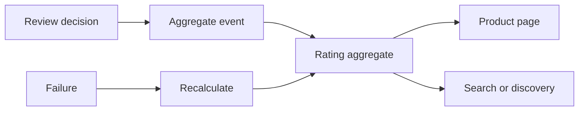

# Review Aggregation and Recovery

Review Aggregation and Recovery explains how Nodics keeps average ratings,
review counts, and review-derived signals correct after moderation decisions,
imports, failures, retries, or project customizations.

## Aggregate flow

| Aggregate | Why it matters | Recovery signal |
| --- | --- | --- |
| Review count | Merchandising and shopper trust. | Count differs from approved review query. |
| Average rating | Product ranking and conversion. | Stored average differs from recalculated value. |
| Distribution | Filtering and analytics. | Bucket totals do not match approved reviews. |
| Derived search field | Discovery and sorting. | Search index differs from Online data. |

## Business perspective

A business user should not have to trust a number blindly. If a product shows
4.7 stars, the system should be able to explain which approved reviews created
that value and how it can be recalculated. This matters for customer trust,
marketplace quality, and commercial decisions.

## Developer perspective

Developers should keep aggregation idempotent and recoverable. Moderation,
imports, deletes, retire actions, or syndication updates can all change the
aggregate. The implementation should expose recalculation APIs or jobs,
document events, and keep search synchronization separate from the source of
truth.

## Operator perspective

Operators need a way to detect drift, rerun aggregate calculation, inspect
failed events, and validate the product page after recovery. If an aggregate
update is asynchronous, documentation must state where pending and failed work
is visible.

## Operational evidence

Aggregate recovery evidence should compare source reviews with stored totals. Include approved count, rejected count, rating distribution, computed average, stored average, recalculation run id, event status, and storefront verification. If search consumes the aggregate, include the indexed value and refresh behavior. This lets a business user trust the number on the page and lets a developer or operator quickly decide whether the problem is source data, event delivery, calculation logic, or index synchronization.

## Reader and implementation contract

A beginner should understand that aggregate ratings are derived evidence, not hand-authored content. A business user should know why aggregate accuracy affects product confidence, sorting, and commercial decisions. A developer should document the source query, update event, recalculation job, idempotency model, and search synchronization. An operator should know how to detect drift, rebuild safely, and validate the storefront after recovery.

Every aggregate topic must include successful update, rejected review behavior, deleted or retired review behavior, failed event recovery, recalculation acceptance, and browser verification. If downstream search or analytics consumes aggregate ratings, link those dependencies so the business impact is visible.

## Documentation maintenance rule

Keep this topic current whenever implementation, configuration, Axis workflow, publication behavior, or customer-facing rendering changes. The page should remain small enough to scan, but it must still carry enough business context, technical ownership, customization guidance, visual structure, operational evidence, and verification detail for a reader to act without guessing. When the detail becomes too large, create a sibling topic and link it from this page instead of turning the overview back into a long mixed article.

This extension guidance must stay linked to the owning project or capability page whenever a customer customizes the behavior.

## Common mistakes

- Treating aggregate values as manually editable content.
- Updating search before the source review state is final.
- Recalculating without an idempotency or audit contract.
- Testing a single approved review but not rejection, deletion, or retry.

## Verification

Verify aggregation by creating approved and rejected reviews, recalculating the
aggregate, comparing stored values to source queries, and checking browser
output on product or discovery pages. Include failure and retry evidence for
production readiness.
