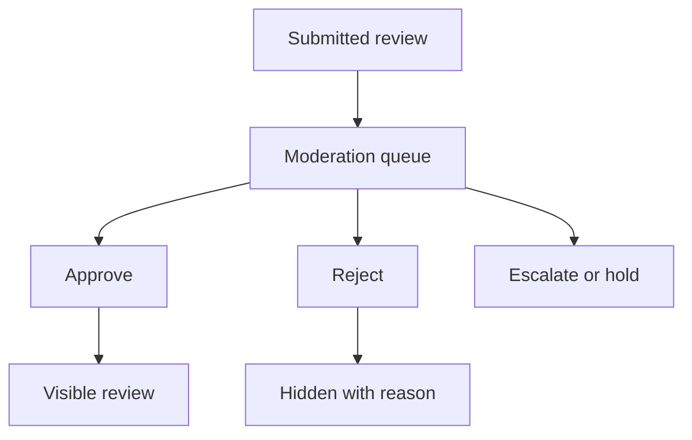

# Review Moderation and Governance

Review Moderation and Governance explains how submitted reviews become
approved, rejected, hidden, or escalated. It is written for business moderators,
administrators, developers, operators, QA owners, and AI tools that need a
clear lifecycle contract.

## Moderation flow

| Decision | Required evidence |
| --- | --- |
| Approve | Reviewer, timestamp, review id, product id, and visibility target. |
| Reject | Reviewer, timestamp, reason, notification rule, and audit state. |
| Hold | Owner, reason, due date, and next action. |
| Escalate | Queue, role requirement, and business risk. |

## Business perspective

Moderators need a clear queue, filters, review context, product context,
customer context, and one obvious decision area. The UI should not make a user
open unrelated pages to understand what can be approved. Documentation should
explain how review decisions affect product pages, customer trust, search
ranking, and compliance.

## Developer perspective

Developers should expose moderation through explicit state transitions and
permissions. The requester or submitter identity is audit data, not the only
approval rule. Approval should be controlled by role, permission, and workflow
policy. Projects can add custom checks, but every added rule must be visible in
Axis and covered by tests.

## Operator perspective

Operators need to see stuck reviews, failed moderation actions, event delivery
failures, and aggregate update status. If moderation emits events to search,
notification, analytics, or product services, the documentation must explain
retry and recovery behavior.

## Operational evidence

Moderation evidence should be visible without requiring the reviewer to interpret raw records. The queue should show item context, current state, allowed actions, decision history, and next outcome. The backend evidence should include role or permission evaluation, workflow transition, rejection reason, audit user, and timestamps. This is important because moderation is a governed business operation; the user journey must make the correct action obvious while still preserving enough detail for compliance and debugging.

## Reader and implementation contract

A beginner should understand that moderation is a business decision with audit, not an edit button on a record. A business reviewer should see what must be reviewed, why it matters, and what each decision changes. A developer should document permissions, workflow policy, state transitions, validation, events, and rejection reasons. An operator should know where blocked, stale, or failed moderation tasks appear and how they are retried.

This page must be updated when approval policy changes globally, because the rule is permission-based and should not be hardcoded around requester identity. Documentation should show the queue and decision flow visually so reviewers are not forced through disconnected pages to complete one task.

## Customization and extension guidance

Projects can customize review moderation with additional decision states, abuse checks, escalation queues, notification rules, or role policies. Document the workflow change, permission rule, state transition, Axis queue behavior, audit fields, and browser verification. Approval should remain governed by policy and permission, not by hardcoded assumptions about who created the request.

## Common mistakes

- Blocking approval only because the same user submitted the request, while
  ignoring actual permissions.
- Hiding rejection reasons from the audit trail.
- Making moderation depend on frontend-only state.
- Updating public visibility before the workflow decision is complete.

## Verification

Verify moderation with success, rejection, permission-denied, escalation, and
retry scenarios. Browser evidence should show the queue, selected review,
decision controls, confirmation state, and final visibility.
