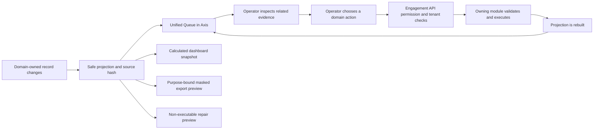
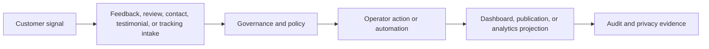

# Unified engagement operations

Unified Engagement Operations gives business teams one place to discover customer work across contact requests, testimonials, reviews, feedback, moderation, publication, consent, and integrations. This beginner-friendly guide explains what the shared view does, what it deliberately does not own, and how an operator can use Axis without accidentally bypassing a domain workflow.

The most important rule is simple: the unified queue is a projection, not a new case-management database. `contactSubmission`, `testimonial`, `customerReview`, and `customerFeedback` remain authoritative for their records and lifecycle commands. `engagementCore` creates safe operational projections and calculated snapshots. `engagementApi` authenticates the operator, checks permission and tenant scope, and returns bounded DTOs. Axis renders only the navigation and capabilities published by the backend.

## Who uses it and why

| Reader | Primary outcome |
| --- | --- |
| Business operator | Find assigned, urgent, overdue, or related engagement work in one queue. |
| Team lead | Understand workload and SLA pressure without joining domain databases manually. |
| Administrator | Govern permissions, limits, masking, export fields, and saved operational views. |
| Developer | Add a domain projection without transferring that domain's command ownership. |
| Reliability or security operator | Detect projection drift, preview repairs, trace exports, and investigate safely. |

## End-to-end journey

## Axis operator journey

1. Sign in to Axis with an employee account that belongs to an authorized Engagement operator group.
2. Open **Customer Experience → Unified Queue**. The page lists only records allowed for the active tenant and context.
3. Filter by domain, status, queue, assignee, priority, due date, or another backend-supported field. A saved view stores a search preference; it does not create business state.
4. Open an item and inspect its domain code, safe summary, related-record references, consent flags, integration state, due time, projection time, and source revision. Sensitive customer text remains in the protected domain detail and is shown only when a separate permission allows it.
5. Follow the domain workspace or action published by the backend. A review moderation action still goes to Review; a complaint resolution still goes to Feedback; testimonial publication still goes to Testimonial.
6. After the action succeeds, reload the queue. The projection must converge from the authoritative source rather than trusting browser state.

Use **Engagement Dashboards** to inspect total, overdue, by-domain, and by-status measurements. Every snapshot records its policy version, calculation time, filters, and source hashes, so a number can be explained and rebuilt. Dashboards are operational indicators, not financial or legal systems of record.

## Batch actions

Batch work is intentionally a two-step operation. The operator selects a bounded set of queue items, chooses an action, and supplies a business reason. The preview returns one command per item with domain type, domain code, expected source revision, and reason. It also states that approval is required and that no direct mutation occurred.

A later approved execution must route every command to its owning domain. Mixed-domain selection does not authorize Engagement Core to invent a universal status or update records directly. Failed items must retain individual evidence and be safe to retry; success for one item must not hide failure for another.

## Export journey

An export begins with a stated purpose, filters, and requested fields. The backend intersects those fields with the policy allow-list, applies the configured masking policy, and caps the number of records. The preview records requester, purpose, filters, accepted fields, masking policy, record count, maximum limit, status, and correlation ID.

The preview is evidence, not a downloadable data file. Production delivery requires a later governed exporter, destination policy, retention rule, and audit event. Customer messages, contact details, internal notes, consent evidence, provider secrets, raw model prompts, and hidden hashes must never appear merely because they are visible to a privileged database administrator.

## Repair and reconciliation

Projection drift can occur after an interrupted event, index outage, deployment, or policy change. A repair starts by comparing the recorded source hash with a fresh deterministic projection. The Repair Console captures domain type, domain code, repair type, expected hash, observed hash, reason, requester, and correlation ID.

Previewing a repair does not change the source or projection. Approved execution rebuilds only the derived record from its domain authority. If the source is missing because retention or privacy policy deleted it, reconciliation removes or anonymizes the projection instead of recreating protected content from logs.

## Security and ownership boundaries

The read, batch, export, and repair operations have separate permissions. Authentication alone is insufficient. The facade applies tenant checks to queue, dashboard, batch, export, and repair responses. Generated operational schemas allow authorized employee operators, administrators, and service accounts, while public and customer routes cannot query them.

The projection stores identifiers and bounded summaries needed for work discovery. It must not become a copy of complete review bodies, feedback messages, contact details, attachments, or testimonial source material. Media remains Media-owned, process tasks remain Process-owned, communication delivery remains Communication-owned, and each engagement domain owns its business actions.

## Configure and extend safely

Projects may replace projection search, dashboard calculation, or export adapters in a later-loaded module. Preserve deterministic source hashing, bounded retrieval, allowed export fields, masking, tenant isolation, correlation, expected revision, preview-before-execution, and domain command routing. Add a new domain by defining its safe projector and related-record links, then prove rebuild and deletion behavior with focused contracts.

Do not add a writable `status` transition to the unified queue, copy protected source content into summaries, let Axis calculate permission, or let a search provider become authoritative. A provider outage must reduce search convenience, not lose or corrupt a customer record.

## Operations and recovery

Monitor projection lag, drift count, overdue workload, rebuild duration, batch preview and execution outcomes, export volume, denied fields, repair rate, and cross-tenant denial. Logs use codes and correlation IDs rather than customer text.

| Failure | Safe response |
| --- | --- |
| Queue projection is stale | Read the domain source, compare hashes, and rebuild the derived item. |
| Search or dashboard provider is unavailable | Continue domain operations; retry projection delivery with backpressure. |
| Operator submits a stale batch | Reject through expected revision and let the operator refresh and preview again. |
| Export requests prohibited fields | Omit or reject them under policy and retain evidence of the decision. |
| Repair source is missing | Respect retention/deletion state; remove or anonymize derived data. |
| One batch item fails | Preserve per-item outcome and retry only eligible failed commands idempotently. |

## Common mistakes

- Treating the unified queue as the owner of customer engagement status.
- Putting full customer messages or private evidence into a convenient search index.
- Applying a mixed-domain batch by updating projection records directly.
- Allowing an export because the requester can read a page, without separate purpose and export permission.
- Rebuilding deleted personal data from stale events, logs, caches, or provider copies.
- Letting Axis invent fields, transitions, actions, masks, or limits that the backend did not publish.
- Repairing a hash mismatch without recording the expected source evidence and reason.

## Verification

Prove deterministic projection and rebuild results, changed and removed drift detection, tenant isolation, permission denial for each operation, bounded list and batch sizes, required batch reason, expected revisions, non-executable preview semantics, dashboard source hashes, export purpose and field allow-list, masking and maximum records, repair expected/observed hashes, source deletion behavior, provider outage fallback, and cross-tenant denial. Run the generated schema contracts, Engagement API route and security contracts, module metadata contract, Axis Customer Engagement regression, documentation generation and validation, and the effective engagement-server build.

Next: Governed Automation and AI adds optional decision support while keeping every customer-impacting outcome explainable, reversible, and under existing domain authority.

## Contact, testimonial, and analytics coverage

Unified engagement operations also covers the 50-item batch topics that do
not need a separate top-level page yet: contact operations, testimonials, and
tracking or analytics capture. These are documented here because they share
the same governance rules: tenant ownership, customer privacy, source
evidence, bounded exports, permissioned Axis operations, and rebuildable
projections.

| Capability | Records | Business outcome |
| --- | --- | --- |
| Contact operations | ContactRequest, ContactAttempt, ContactCorrespondence, ContactHandoff, ContactResolution, ContactVerification. | Route customer contact to the right owner and preserve recovery evidence. |
| Testimonials | TestimonialCandidate, TestimonialConsent, TestimonialVersion, TestimonialProjection. | Publish approved customer advocacy only with consent and withdrawal support. |
| Engagement automation | AutomationDecision, AutomationEvaluation, BatchRun, Assignment, UnifiedQueueItem. | Assist operators without letting automation become unexplained authority. |
| Analytics capture | Tracking events and engagement activity records. | Record customer or operational signals without leaking protected content. |

Developer extension should add domain-specific forms, handoff providers,
testimonial publication adapters, analytics projections, or automation
evaluators through the owning module. The documentation must state what data
is captured, whether it is personal data, how consent or purpose is enforced,
which records are publishable, how deletion propagates, and how operators
verify a failed handoff or projection rebuild.
