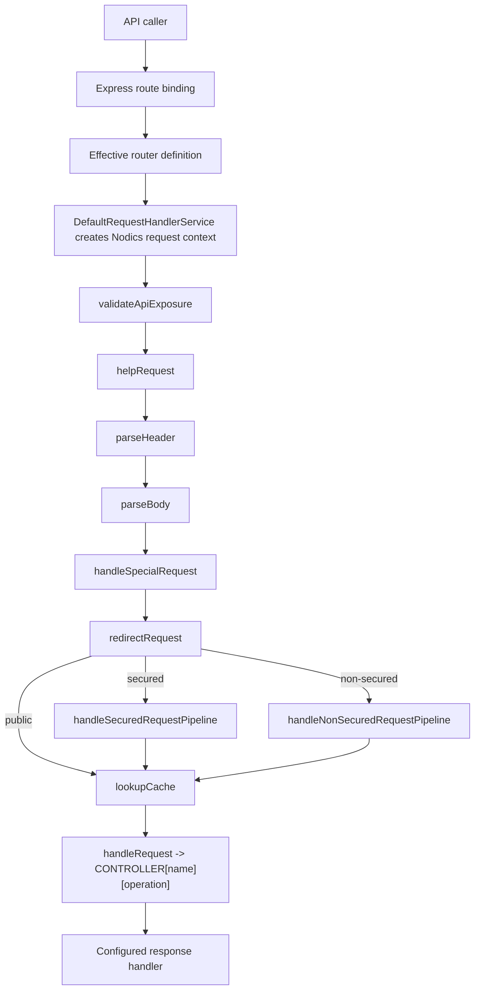

# API Request Lifecycle and Handler Pipeline

Every Nodics HTTP API request enters a governed request lifecycle before it
reaches a controller. This page explains that lifecycle from the first Express
route binding to the final response handler. It is written for beginners,
business users, developers, operators, architects, QA owners, and AI tools that
need to understand how a request is accepted, enriched, authorized, dispatched,
cached, and returned without moving business logic into the wrong layer.

The business value is predictable API behavior. A customer action, Axis
operation, public Nexus request, integration call, or internal runtime request
should be handled by the same contract every time: route metadata selects the
operation, the handler pipeline builds trusted request context, authorization
checks run before the controller, and response handlers return a standard
success or error shape. Developers customize the pipeline only through owning
modules or project layers, not by bypassing controller dispatch or adding
hidden Express middleware.

## Source map

| Runtime area | Source location | Responsibility |
| --- | --- | --- |
| Route definitions | `../nodics.foundation/modules/nRouter/src/router/routers.js` | Declares common generated CRUD routes, special routes, controller names, operations, security, cache, help, and exposure metadata. |
| Express bridge | `../nodics.foundation/modules/nRouter/src/service/router/defaultRouterOperationService.js` | Binds effective router definitions to Express methods and delegates calls to the request handler. |
| Request entry point | `../nodics.foundation/modules/nRouter/src/service/defaultRequestHandlerService.js` | Creates the internal request context, sets request/correlation headers, starts `requestHandlerPipeline`, and selects the response handler. |
| Pipeline definition | `../nodics.foundation/modules/nRouter/src/pipelines/pipelines.js` | Defines `requestHandlerPipeline`, `handleSecuredRequestPipeline`, and `handleNonSecuredRequestPipeline`. |
| Main pipeline handlers | `../nodics.foundation/modules/nRouter/src/service/request/defaultRequestHandlerPipelineService.js` | Handles API exposure, help, headers, body enrichment, branch selection, API cache, and controller dispatch. |
| Secured branch | `../nodics.foundation/modules/nRouter/src/service/request/defaultSecuredRequestPipelineService.js` | Validates secured calls, API key, bearer token, request data, and access. |
| Non-secured branch | `../nodics.foundation/modules/nRouter/src/service/request/defaultNonSecuredRequestPipelineService.js` | Resolves enterprise and tenant context for approved non-secured routes. |
| Response handlers | `../nodics.foundation/modules/nRouter/src/service/handlers/response/` | Converts success or error pipeline output into JSON, text, or file responses. |
| Contract tests | `../nodics.foundation/modules/nRouter/test/requestPipelineResponseContract.test.js` | Proves success, controller error, missing credentials, public routes, API exposure, and response sanitization. |

## End-to-end flow

For beginners, think of the handler pipeline as the controlled doorway between
the web server and business behavior. Express receives a request, but Nodics
does not immediately call a controller. Nodics first converts the route and
HTTP request into an internal request object, then runs ordered pipeline nodes.



The request context contains the selected router definition, HTTP request and
response, request id, parent request id, protocol, host, original URL, method,
request body, module name, security flag, and a special-route flag. The
response receives `X-Request-Id` and `X-Correlation-Id`, so operators can trace
one call through logs, downstream module calls, and error evidence.

## Main pipeline nodes

`requestHandlerPipeline` starts at `validateApiExposure` and ends at
`successEnd` when the controller succeeds. Each node has one narrow job.

| Node | What it does | Safe customization |
| --- | --- | --- |
| `validateApiExposure` | Blocks route categories disabled for the current runtime, such as an API group hidden from a public node. | Add or tighten exposure categories in route metadata and runtime configuration. |
| `helpRequest` | Returns route help metadata when the URL ends with `?help`. | Extend route help content from the owning module. |
| `parseHeader` | Normalizes modern and legacy auth headers into `request.auth`, `request.apiKey`, `request.authToken`, and `request.entCode`. | Add an enterprise-specific credential type only when the security owner accepts the contract. |
| `parseBody` | Placeholder hook after body parser handlers have run. | Add bounded body normalization or request-context enrichment. |
| `handleSpecialRequest` | Runs special handler routes that use `handler` instead of `controller`. | Reserve for framework-level utilities such as ping or help behavior. |
| `redirectRequest` | Chooses secured, non-secured, or public branch by route metadata and credentials. | Change branch rules only through route/security ownership. |
| `handleSecuredRequest` | Runs the secured nested pipeline. | Extend security checks in security-owned services or project security modules. |
| `handleNonSecuredRequest` | Runs enterprise and tenant resolution for approved non-secured calls. | Extend enterprise/tenant lookup without exposing private routes. |
| `lookupCache` | Reads API cache when the route cache policy allows it. | Customize cache policy, key generation, or cache provider behavior. |
| `handleRequest` | Calls `CONTROLLER[router.controller][router.operation]` and optionally writes cacheable success. | Replace the controller operation or owning service, not the dispatcher itself. |

## Route metadata contract

The route definition is the request contract that the pipeline obeys.
Developers should document every route with method, path, module owner,
controller, operation, security mode, permission policy, exposure category,
request body shape, response handler, cache behavior, and help text.

```js
module.exports = {
  customerProductSearch: {
    key: '/products/search',
    method: 'POST',
    controller: 'DefaultProductSearchController',
    operation: 'search',
    moduleName: 'product',
    secured: false,
    publicAccess: true,
    apiExposure: {
      category: 'storefront'
    },
    responseHandler: 'jsonResponseHandler',
    cache: {
      enabled: true,
      ttl: 300
    },
    help: {
      summary: 'Search published storefront products.'
    }
  }
};
```

This metadata does not contain business decisions such as price calculation,
inventory reservation, approval, publication, or refund policy. Those belong
in services, pipelines, workflows, and owning module validation. The route
only declares how the API is exposed and where the request should be handed
off.

## Secured, non-secured, and public branches

The request pipeline distinguishes three cases:

| Branch | When used | Required context |
| --- | --- | --- |
| Secured | `router.secured` is true and the route is not explicitly public. | API key or bearer token, valid request data, resolved access policy, tenant, and enterprise context. |
| Non-secured | Route is configured as non-secured but still needs enterprise and tenant context. | Enterprise code and valid tenant resolution. |
| Public | Route is an explicit public probe, public access route, or OpenAPI contract route. | No secret credential is required, but exposure policy and optional tenant context still apply. |

Public does not mean unmanaged. Public routes still use route metadata,
exposure categories, response handlers, bounded payloads, cache rules, and
standard errors. Non-secured routes must never be used as a shortcut for
private data. A business user may see a friendly action in Nexus or Axis, but
the backend route metadata remains the authority for whether the request is
allowed.

## Response and error handling

The request handler chooses the configured response handler before the
pipeline runs. A JSON route normally uses `DefaultJsonResponseHandlerService`;
plain text and file download routes use dedicated handlers. A controller
success becomes the response payload. A controller error, authorization
failure, disabled exposure category, broken pipeline, or cache failure flows
through the same error path.

The important rule for developers is low disclosure. Public API responses
must not leak internal pipeline contexts, service stacks, router metadata, or
raw implementation details. The contract test verifies that internal pipeline
contexts are not returned in public JSON errors. Operators should still be
able to trace the request through logs using request id, correlation id,
route, module, tenant, and sanitized error code.

Use `Error Handling and Status Codes` when defining the actual error code,
HTTP status, public message, localization metadata, and project override. This
request-lifecycle page explains where the error is caught; the error guide
explains the payload contract that must be returned to callers.

## Customization and extension

Developers should customize the request lifecycle at the smallest responsible
point.

| Need | Recommended extension | Avoid |
| --- | --- | --- |
| Add a new API | Add route metadata in the owning module and implement controller/facade/service behavior. | Registering a frontend-only URL or raw Express handler outside the module graph. |
| Add request validation before controller handoff | Add a pipeline node or secured-branch validation in the owning module. | Putting reusable validation in every controller. |
| Add tracing or correlation metadata | Extend `DefaultRequestHandlerService` or a pipeline node in a project layer. | Mutating global HTTP state in unrelated middleware. |
| Add tenant-specific header normalization | Override `normalizeAuthHeaders` or `parseHeader` in a security-approved project module. | Accepting unbounded custom headers in controllers. |
| Change response shape | Add or select a response handler with a stable route contract. | Returning arbitrary controller payloads that bypass standard errors. |
| Cache a safe API | Configure route cache and cache policy. | Caching private or mutation responses without policy evidence. |

A project module may override a pipeline definition in a later module layer,
but it must preserve route ownership, security, response shape, and test
coverage. If the change affects authorization, tenant resolution, or public
data visibility, treat it as a security and production behavior change.

## Developer example

Suppose a customer project needs to require a storefront channel header before
public product search. The correct shape is a small pipeline node and a route
contract update.

```js
module.exports = {
  requestHandlerPipeline: {
    nodes: {
      validateStorefrontChannel: {
        type: 'function',
        handler: 'CustomerStorefrontRequestPipelineService.validateChannel',
        success: 'lookupCache'
      }
    }
  }
};
```

```js
module.exports = {
  validateChannel: function (request, response, process) {
    const channel = request.httpRequest.get('x-storefront-channel');
    if (!channel || !['web', 'mobile'].includes(channel)) {
      process.error(request, response, new CLASSES.NodicsError('ERR_REQ_00010'));
      return;
    }
    request.channel = channel;
    process.nextSuccess(request, response);
  }
};
```

The project must also adjust the effective success transition so the node is
actually used, add route help metadata explaining the header, and test valid,
missing, invalid, and unauthorized requests. The product controller should
receive a normalized `request.channel`; it should not parse the raw HTTP
header again.

## Operator troubleshooting

| Symptom | Likely layer | First check |
| --- | --- | --- |
| `404` or route not found | Router registration | Confirm the module is active and the route exists in effective router metadata. |
| `401` before controller logs | `parseHeader` or secured branch | Check `Authorization`, `x-api-key`, `x-enterprise-code`, route `secured`, and public flags. |
| `403` for a previously visible API | API exposure or access check | Inspect `apiExposure`, permission config, profile groups, and runtime category enablement. |
| Controller did not run | Branch, special route, or cache | Check pipeline branch, cache hit evidence, and controller name/operation spelling. |
| Different nodes behave differently | Runtime route or pipeline drift | Compare active modules, persisted runtime records, checksums, and propagation events. |
| Raw technical error leaks to caller | Response handler or error mapping | Check response handler, status definitions, and sanitized `NodicsError` mapping. |

## Common mistakes

- Adding business logic to the request handler pipeline when it belongs in the
  domain pipeline, workflow, service, or validator.
- Parsing credentials in controllers instead of relying on normalized request
  auth and secured pipeline checks.
- Treating `secured: false` as a public-data guarantee.
- Exposing a route in Swagger without proving runtime API exposure and
  permission policy.
- Copying generated CRUD routes into a project module instead of changing the
  schema-owned route configuration.
- Returning raw service or pipeline errors directly to public callers.
- Editing framework `nRouter` source for a customer-specific request rule that
  belongs in a later project module.

## Verification

Request lifecycle changes require focused tests before wider runtime testing.
At minimum, verify route registration, successful secured request, successful
non-secured request, public request, missing credentials, disabled exposure
category, controller success, controller error, response handler output,
request/correlation headers, cache hit/miss behavior, and sanitized error
payloads. Existing evidence starts with
`nRouter/test/requestPipelineResponseContract.test.js`,
`nRouter/test/routeActionAuthorization.test.js`,
`nRouter/test/openapiContractGeneration.test.js`, and any controller or facade
contract tests owned by the changed module.

After changing documentation, regenerate and validate the documentation pack:

```bash
npm --prefix nodics.docs run docs:generate
npm --prefix nodics.docs run docs:check
npm --prefix nodics.docs run validate
```

For production-like evidence, start a fresh local runtime, call the affected
API with valid and invalid credentials, confirm the expected response shape,
check logs by request id, and confirm Axis or Nexus does not invent a parallel
route authority.
