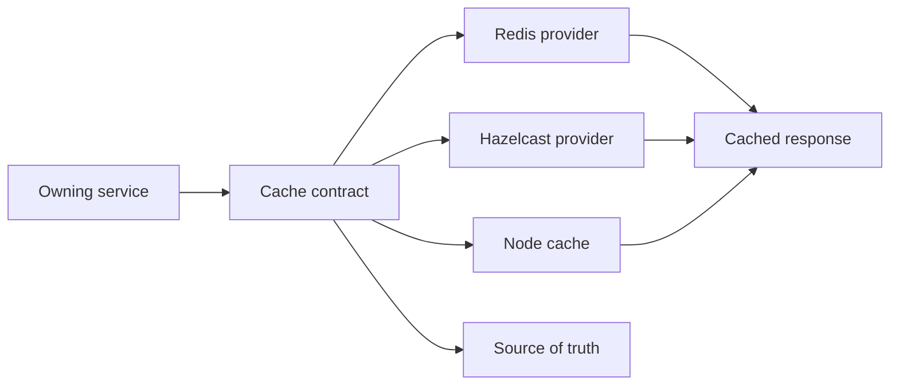

# Cache Provider Runbooks

Caching gives Nodics speed without changing the source of truth. Redis,
Hazelcast, node-local cache, and virtual cache behavior are provider choices
behind a common contract. For beginners, the cache is a temporary copy used to
serve reads faster. The database, publication manifest, or owning service
remains the authority. A cache miss should be recoverable; a cache hit should
never make stale business data look correct after a governed change.

## Source map

| Area | Source location |
| --- | --- |
| Cache group | `../nodics.foundation/modules/nCache/package.json` |
| Core cache contract | `../nodics.foundation/modules/nCache/cache/package.json` |
| Redis provider | `../nodics.foundation/modules/nCache/redisCache/package.json` |
| Hazelcast provider | `../nodics.foundation/modules/nCache/hazelcastCache/package.json` |
| Node cache provider | `../nodics.foundation/modules/nCache/nodeCache/package.json` |
| Cache overview page | `docs/pages/nodics.foundation/cache-runtime-state.md` |

## Provider flow

The business problem is freshness with performance. Business users expect a
published page, price, stock state, or permission change to become visible
without confusing delays. Developers need clear key strategy and invalidation
contracts. Operators need provider health, eviction behavior, and recovery
commands for production incidents.

## Configuration contract

| Configuration | Purpose | Production note |
| --- | --- | --- |
| Provider code | Selects Redis, Hazelcast, node cache, or virtual provider. | Must match deployed infrastructure. |
| Key prefix | Separates tenant, runtime, and schema scopes. | Prevents cross-tenant leakage. |
| TTL | Bounds staleness. | Use capability-specific values. |
| Invalidation event | Removes stale records after write or publication. | Must be tested with runtime change. |
| Fallback mode | Defines behavior when cache is unavailable. | Prefer degraded reads over unsafe writes. |

## Runbook

When a cache incident happens, confirm whether the source record is correct,
whether the cache key maps to the expected tenant and runtime, whether the
provider is reachable, whether invalidation fired, and whether the consumer is
reading the right cache layer. Do not fix stale data by editing frontend code.
Do not clear all production caches unless the affected scope cannot be isolated.

For Redis, check connection, selected database, key prefix, expiry, and memory
pressure. For Hazelcast, check cluster membership, partition health, and
serialization compatibility. For node-local cache, check process restarts and
single-node assumptions. Each provider should return a safe degraded state
that business users can understand and operators can investigate.

## Customization and extension guidance

Developers can add providers, key strategies, invalidation hooks, metrics, and
health checks. Business logic should remain in owning services. Cache keys
should be deterministic and include tenant or runtime scope when needed. Tests
should cover hit, miss, expiry, invalidation, provider failure, and fallback.

## Common mistakes

- Treating cached values as authority.
- Using one key namespace across Staged and Online.
- Forgetting invalidation after import, publish, or configuration change.
- Hiding provider outages behind generic business errors.
- Adding custom cache behavior without production observability.

## Verification

Run cache provider tests for Redis, Hazelcast, and node cache where available.
In a fresh schema, import data, warm the cache, change or publish the source
record, and prove invalidation refreshes the browser or API result. Operators
should see provider health, key scope, hit or miss evidence, and safe fallback
behavior.
