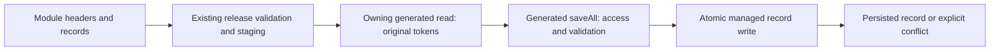
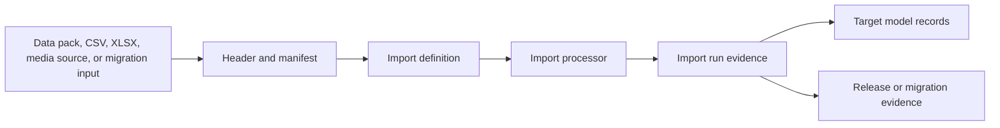

# Data Import, Export, and Migration

## Module data files and managed revisions

Canonical owner: `nodics.foundation`, with nImport owning file execution and
nDatabase owning managed technical counters. For schemas explicitly declaring
`backoffice.concurrency.managed: true`, developers omit technical counters from
`data/core-v001/records`, `data/init-v001/records`, and sample data. The existing
header still declares the module, schema, `saveAll` operation and stable-code
query. No new configuration layer or file format is needed.

For example, a Point of Service record can retain its normal business fields:

```js
module.exports = {
    record0: {
        code: 'project-web-pos', tenant: 'default',
        storeCode: 'project-store', name: 'Web service point',
        status: 'ACTIVE', timezone: 'UTC', active: true
    }
};
```

Supply every other field required by the effective project schema. This example
illustrates omission of `revision`, not a replacement for project validation.
An old source `revision: 1` is ignored only for an explicitly managed field.
Business `version`, publication `versionId`, release version and checksums are
not interchangeable with that technical counter and are not stripped.



### Repeated import and failure recovery

An absent record is created at revision 1. A changed existing record advances
once from its observed counter. A row identical to persisted business fields is
a no-op, so re-importing it does not advance the counter. If another writer edits
after the import captures a token, the import fails that write with a conflict.
Retries of the same model-import request retain the first snapshot, rather than
fetching a new token to overwrite the intervening change.

The snapshot cache is request-local, not a durable job ledger. A partially
completed file is not atomic. Inspect existing import-run results and completed
records before starting a deliberate new run; that new run captures fresh tokens
under the existing release/update policy. Do not promise automatic rollback or
unconditional retry. Non-`saveAll` import operations for managed schemas are
explicitly rejected; use approved owning operations for deletion or bulk changes.

Generated `data/manifest.json` checksum entries remain audit evidence. Runtime
discovery derives current files/checksums from headers and source folders, so
developers do not hand-edit hash maps. Changing an installed stable release
still requires a new release version according to existing policy. Counter
management does not bypass immutable release validation or publish content.

### Customize and extend safely

Use the existing project module's schema overlay, headers, processors and record
files. A project-owned plain master-data model can select another integer/long
counter through `backoffice.concurrency.field`; the importer reads that effective
field automatically. Audit all writers before setting `managed: true` and keep
tenant/authorization context on generated reads and writes. Domain-owned counters
and versioned models retain their existing import contracts until separately
reviewed; do not enable managed concurrency on `versionId`.

Prove a fresh record, unchanged re-import, changed re-import, concurrent edit,
legacy source counter, project-selected counter field, denied access, and stable
release checksum rejection. The Store core-reference files and
`nDatabase/database/test/modelConcurrencyContract.test.js` provide source-backed
examples. Review per-record results rather than treating file dispatch as proof
that all records were saved.

Import definitions, data installation, exports, migration registers, release evidence, rollback boundaries, and customer onboarding. This page is intentionally written for beginners, business users, developers, operators, architects, QA owners, and AI tools. It explains the business problem first, then the technical ownership model, then the exact customization and verification responsibilities so nobody has to guess where a change belongs.

A customer cannot trust a platform if data arrives through ad hoc scripts, undocumented dumps, or direct database writes with no validation or recovery evidence. Nodics treats data movement as governed operations: import definitions, staged validation, execution receipts, migration registers, redaction, and rollback boundaries are documented and tested.

## Business context

For a business user, this topic answers what decision can be made, which operational journey is supported, and what risk is reduced. The practical value is faster delivery without losing governance: teams can understand the current capability, decide whether it applies to their project, and know when Axis, Nexus, content catalog, workflow, or runtime services are involved.

For beginners, the mental model is simple: the page title is the business capability, the table identifies who owns each part, and the diagram shows how a request or change flows. A reader should not need source-code knowledge to understand the journey, but the developer path is still available when customization is needed.

| Business question | Answer for this topic |
| --- | --- |
| What problem does it solve? | A customer cannot trust a platform if data arrives through ad hoc scripts, undocumented dumps, or direct database writes with no validation or recovery evidence. |
| Who uses it? | Business users, administrators, developers, operators, QA owners, implementation partners, and AI-assisted delivery tools. |
| What changes can it support? | Nodics treats data movement as governed operations: import definitions, staged validation, execution receipts, migration registers, redaction, and rollback boundaries are documented and tested. |
| What must be governed? | Permissions, validation, source ownership, publication state, runtime impact, audit evidence, and rollback boundaries. |

## Journey and ownership

Foundation data tooling owns generic import/export behavior. Functional modules own their seed data, schema validation, lifecycle, and migration meaning. This keeps the reader-facing name friendly while preserving exact source ownership for developers and AI tools. Axis may render management screens or authenticated documentation, Nexus may render public Online content, and the backend content catalog remains authoritative for navigation, pages, access policies, and publication state.


| Responsibility | Owner | Notes |
| --- | --- | --- |
| Business capability name | Data Import, Export, and Migration | Used in navigation and dashboards so readers are not exposed to raw module names first. |
| Source owner | nodics.foundation | Carries exact implementation, documentation, and validation evidence. |
| Technical module | nImport | Holds the relevant schema, service, router, data, or contract detail where applicable. |
| Axis experience | Backend-declared workspace | Axis renders metadata and actions but does not become the authority. |
| Public experience | Online content delivery | Nexus renders only records approved for public access. |

## Data and configuration detail

Every topic must explain the data that changes behavior. Some topics are schema-driven, some are configuration-driven, some are publishable content, and some are operational records. The documentation must say which category applies before showing code. That keeps production operators and developers aligned on whether a change needs publication, restart, event propagation, approval, or only a project-layer override.

| Detail area | What to document | Verification signal |
| --- | --- | --- |
| Model or record | Type code, catalog, tenant, enterprise, state, owner, and lifecycle. | Schema contract or generated model test. |
| Configuration key | Default value, override location, environment scope, and runtime impact. | Config validation and runtime refresh evidence. |
| API or event | Route/event name, payload boundary, permission, idempotency, and failure mode. | Route, service, event, and authorization tests. |
| Publication and access | Staged/Online state, access mode, roles, groups, and permissions. | Content-pack validation and access-policy test. |

```js
importRun: { definition: "cms.site.seed", source: "content-pack", lifecycle: "staged", checksum: "sha256" }
```

## Two data creation lanes

Nodics has two legitimate ways to create business data. Both must converge on
the same backend module contracts.

| Lane | Who uses it | Where it starts | What it is for | Authority |
| --- | --- | --- | --- | --- |
| Module release data | Developers, AI tools, release owners | Module `data/` folder | Bootstrap, core capability data, samples, accelerators, migrations, repeatable customer setup | Owning backend module and `nImport` |
| Business-created data | Business users, administrators, operators | Axis BackOffice | Day-to-day catalogue, product, price, inventory, page, component, media, workflow, and operational maintenance | Owning backend module APIs, validation, workflow, audit, and publication |

Axis handles the business user journey, but Axis does not become the data
authority. Axis renders forms, actions, imports, uploads, approvals, and
status from backend contracts. The owning backend module still owns schema,
validation, permission, workflow, persistence, publication, and audit.

Module release data and Axis-created data should use the same schemas and
validators. A product created from a module release and a product created from
Axis should land in the same Product/Commerce contract. A CMS component created
from a module release and a CMS component created from Axis should use the same
WCMS contract. Import must not bypass validation just because the source is a
release file.

## Module release data authoring

Module release data travels with code. It is reviewed with the module, imported
through `nImport`, and tracked through generated release evidence. Developers
and AI tools should author release folders; Nodics tooling should generate the
technical manifest.

The target authoring structure is:

```text
modules/<module>/
  data/
    init-v001/
      headers/
      records/

    core-v001/
      headers/
      records/

    sample-v001/
      commerce/
        headers/
        records/
      content/
        headers/
        records/

    manifest.json
```

The folder name is the release identity:

| Folder | Meaning |
| --- | --- |
| `init-v001` | Initial/bootstrap setup data for a module or runtime boundary. |
| `core-v001` | Standard module capability data needed by the module. |
| `sample-v001` | Demo, reference, accelerator, or customer-project sample data. |

During a fresh-schema startup, Nodics imports active module `init-v001` data
only when the runtime sets `NODICS.initRequired`. The full trigger sequence is
documented in `Framework Startup Lifecycle`; this page owns the release folder,
header, record, validation, and import processing contract.

The prefix before `-` is the data type. The `v001` suffix is the release
sequence. When one release contains multiple business areas, use named
subfolders inside the release, such as `sample-v001/commerce` and
`sample-v001/content`, so developers and reviewers can understand the purpose
without reading every record.

## Header files

Headers are the import routing contract. They tell `nImport` which module and
schema should receive a record file.

```js
module.exports = {
  profile: {
    defaultAddresses: {
      options: {
        enabled: true,
        schemaName: 'address',
        operation: 'saveAll',
        tenants: ['default'],
        dataFilePrefix: 'defaultAddressesData'
      },
      query: {
        code: '$code'
      }
    }
  }
};
```

Header fields mean:

| Header part | Meaning |
| --- | --- |
| Top-level key, for example `profile` | Target module where the schema exists. |
| Header key, for example `defaultAddresses` | Logical import unit within the header file. |
| `schemaName` | Target schema inside the target module. |
| `operation` | Persistence action such as `saveAll`, `saveOrUpdate`, `update`, or `remove`. |
| `dataFilePrefix` | Name used to find the matching record file. |
| `query` | Idempotent lookup key for existing records. |
| `tenants` | Optional tenant selection for tenant-specific data. |
| `userGroups` | Optional import execution authority for schema access policy. |
| `macros` | Optional relation resolution rule for referenced records. |
| `finalizeData` | Optional finalization control for the import pipeline. |

The target module, schema, operation, and query belong in headers. Do not
duplicate them in a separate release metadata file. The release folder tells
Nodics which release is being imported; the header tells Nodics where each
record goes.

## Record files

Record files live under `records/`. They contain the data that will be
imported.

```js
module.exports = {
  defaultEmployeeAddress: {
    code: 'defaultEmployeeAddress',
    addressLine1: 'Nodics',
    city: 'Dubai',
    active: true
  }
};
```

Use stable business keys when practical. Stable keys make customer overrides,
review diffs, and AI-assisted changes easier because one record can be targeted
directly. Existing files that use `record0`, `record1`, and similar positional
names may be migrated gradually, but new release data should prefer meaningful
keys.

Record files may use small local constants or helper functions to reduce
duplication. They should not call runtime services, read private filesystem
paths, use random values, depend on current timestamps, call external networks,
or hide deployment-specific decisions. If data needs secrets or environment
values, use configuration or the owning runtime service instead of embedding
them in release records.

## Generated files

Developers and AI tools create:

| File or folder | Required | Created by | Purpose |
| --- | --- | --- | --- |
| `data/<dataType>-vNNN/headers/*.js` | Yes | Developer or AI | Import routing metadata. |
| `data/<dataType>-vNNN/records/*.js` | Yes | Developer or AI | Actual records. |
| Domain subfolders such as `sample-v001/commerce` | Optional | Developer or AI | Keep one release understandable when it has multiple business areas. |
| `README.md` inside a release folder | Optional | Developer or AI | Human explanation for complex releases. |

Nodics tooling generates:

| File or folder | Created by | Purpose |
| --- | --- | --- |
| `data/manifest.json` | System | Technical release index, checksums, lifecycle, destination, sensitivity, publication, and removal policy. |
| Compatibility projection under `data/init`, `data/core`, or `data/sample` | System during migration only | Allows current import runtime to keep working until it reads release folders directly. |
| Validation report | System | Explains missing headers, missing records, checksum drift, unsupported operations, malformed release folders, and lifecycle conflicts. |

`data/manifest.json` should be reviewed but not hand-authored during normal
data work. It is the technical contract that proves exactly which files belong
to a release and how the release may be imported.

For documentation content packs, `docs:generate` follows the same source versus
generated boundary. Authored Markdown pages and `docs/catalogue.json` are source
inputs. The generator creates or updates missing and changed release records
under `data/core-v001` and refreshes manifest evidence. It must not overwrite a
detailed authored page with a basic generated page, remove examples, or
downgrade mature documentation. If a topic is missing, create the source page
and catalogue entry first, then generate the release data from that source.

## Release lifecycle

Current framework and reference application data is still pre-production. Until
the first production release is accepted, `v001` is the mutable baseline. Teams
may keep correcting and improving `init-v001`, `core-v001`, and `sample-v001`
while the framework and reference applications are being qualified.

At the first production release, accepted `v001` folders become immutable. Any
later data change must create a new release folder:

```text
data/
  core-v001/   # frozen production baseline
  core-v002/   # next production change
  sample-v001/ # frozen sample baseline
  sample-v002/ # next sample change
```

Do not silently edit an already accepted production release. A new release
folder gives operators and customers a clear answer to what changed, why it
changed, which files were imported, and how to retry or roll back.

## Lifecycle and destination

The release folder determines the data type. The generated manifest records the
technical lifecycle and destination policy.

| Concept | Meaning |
| --- | --- |
| `dataType` | Category of data: `init`, `core`, or `sample`. |
| `lifecycle` | Whether the release is `PUBLISHABLE`, `OPERATIONAL_VERSIONED`, or `REFERENCE`. |
| `destinationRole` | Runtime role allowed to import the release, such as `PLATFORM`, `WCMS_STAGED`, `COMMERCE_STAGED`, `CRON`, `PROCESS`, or `ENGAGEMENT`. |
| `publicationPolicy` | Whether Staged-to-Online publication is required. |
| `removalPolicy` | What should happen when records are retired, unpublished, retained, or replaced. |

Publishable data imports into Staged runtimes such as `WCMS_STAGED` or
`COMMERCE_STAGED`. It reaches Online only through `nPublish`. Operational data,
such as Cron schedules or Engagement operational configuration, stays in the
owning runtime and does not enter the Staged-to-Online publication path.

## Developer workflow

1. Choose or create the release folder, for example `core-v001` before
   production or `core-v002` after the production baseline is frozen.
2. Add or update header files under `headers/`.
3. Add or update record files under `records/`.
4. Run the data generator so `data/manifest.json` and any compatibility
   projection are updated.
5. Run validation so missing headers, missing records, checksum drift,
   duplicate headers, schema mismatches, unsupported operations, and lifecycle
   errors fail before import.
6. Run import preflight before install.
7. Import into the correct runtime.
8. If the release is publishable, use `nPublish` for Online activation.

This keeps the authoring experience simple while preserving enterprise
evidence: the developer writes headers and records, the system generates the
technical release index, and `nImport` remains the execution authority.

## Guided initialization profiles

Guided initialization profiles turn technical release lists into an operator
journey. Axis displays the journey, but the executing backend runtime declares
the profile under `data.dataReleases.initializationProfiles`. This keeps Axis
friendly without making it the data authority.

```js
data: {
  dataReleases: {
    allowedDestinationRoles: ['COMMERCE'],
    initializationProfiles: {
      localCommerceFoundation: {
        enabled: true,
        label: 'Local Commerce foundation',
        description: 'Install required operational Commerce core releases.',
        completionMessage: 'The Local Commerce foundation is ready.',
        steps: [{ dataType: 'core' }]
      }
    }
  }
}
```

Profile rules:

| Rule | Contract |
| --- | --- |
| Backend ownership | Declare the profile in the runtime that can validate and execute the releases. Axis only discovers and renders it. |
| Friendly purpose | Use a label and description that explain the business capability, not just the module name. |
| Destination alignment | The profile must use releases compatible with the runtime `allowedDestinationRoles`. |
| Ordered steps | Use explicit `init`, `core`, and `sample` steps in the order the operator should run them. |
| Sample intent | Include `sample` only when the profile is clearly for local, demo, reference, or accelerator setup. |
| Optional narrowing | Use `releaseCodes` when a profile should initialize a precise subset instead of every release for a data type. |
| Completion message | Tell the operator what is now possible after the profile completes. |
| Validation evidence | Add or update tests, acceptance checks, and documentation in the same change as the profile. |

The principle is simple: whenever a new runtime capability requires a
first-time operator to install more than one release, or to choose a release
sequence that has business meaning, add or update a guided initialization
profile. Do not leave that knowledge only in a developer note, manual runbook,
or UI assumption.

Examples of local profiles:

| Profile | Runtime owner | Typical steps | Purpose |
| --- | --- | --- | --- |
| Local Platform foundation | `PLATFORM` | `init`, `core` | Sign-in, module lifecycle, catalog, profile, authorization, and localization foundation. |
| Local WCMS foundation | `WCMS_STAGED` | `init`, `core` | Staged content authoring and publication preparation. |
| Local Documentation foundation | `WCMS_STAGED` | narrowed `init` | Prepare WCMS prerequisites before documentation packs are reviewed and published. |
| Local Commerce foundation | `COMMERCE` | `core` | Operational Commerce services and shared reference data. |
| Local Commerce Staged catalog foundation | `COMMERCE_STAGED` | `sample` | Agora storefront catalog, product search, prices, inventory, and preview data. |
| Local Process and Workflow foundation | `PROCESS` | `init` | Publication approval and governed operator workflow definitions. |
| Local Engagement foundation | `ENGAGEMENT` | `core`, `sample` | Communication, feedback, review, and notification validation data. |

A full local project foundation must not be hard-coded in Axis by combining
screens or release arrays. It should be exposed as a backend orchestration
contract that coordinates several runtime-owned profiles, preserves validation
and audit evidence per runtime, and can fail or retry safely at each boundary.

## Provider-specific documentation rule

The import/export topic owns the generic contract, but provider implementations
must still be documented with practical detail. JavaScript, JSON, CSV, Excel,
media-backed import, and generated export all have different authoring and
operator concerns. Each provider section or child topic must explain:

| Provider concern | Required detail |
| --- | --- |
| Input shape | Whether the source is an object map, JSON document, CSV rows, workbook sheets, binary assets, or generated runtime export. |
| Header binding | How `dataFilePrefix`, schema, index, tenants, macros, and operation map to the source. |
| Parser behavior | How rows or objects become models, what validation runs, and how row-level errors are reported. |
| Customization | Parser override, validator, mapping service, field allow-list, provider adapter, and project-layer extension points. |
| Safety | Idempotency, checksum, path validation, secret handling, size limits, masking, and rollback boundary. |
| Validation | Unit tests, import run evidence, generated manifest checks, and fresh-schema import proof. |

This applies to every data topic, not only product creation. If a module has
seed data, import providers, generated export, media assets, migration
registers, or publication manifests, its documentation must connect back to
this import/export contract and then explain the module-specific data shape.

## Media assets

Media follows the same ownership principle as other module release data, but it
has a physical file step before the media record is persisted. A module or
project may carry binary source files under a release-owned `assets/` folder
and media records under `records/`. The media record references the source
asset location; the import pipeline copies the physical file into the
runtime-owned Staged media location, updates the media object's stored path or
artifact reference, and then saves the media schema record through the normal
module validator.

```text
modules/<module>/
  data/
    sample-v001/
      content/
        assets/
          media/
        headers/
        records/
```

The header still declares the target module, schema, operation, query, and data
file prefix. The media record still declares business metadata such as code,
folder, usage, MIME type, alt text, and the release asset reference. The record
must not copy files itself, call storage APIs, generate delivery URLs, or embed
business logic. Physical staging, path normalization, checksum checks, provider
selection, and persistence are importer/runtime responsibilities.

When a publishable media record moves Online, `nPublish` promotes the physical
media from Staged-owned storage into Online-owned storage, performs any
configured replication such as disaster-recovery copy, updates the Online media
artifact reference, and then activates the Online metadata or content pointer.
Online clients must read Online media coordinates only; they must never resolve
or reuse Staged physical paths.

## Customization and extension

Developers should customize from the project layer first. A customer project may add properties, services, validators, pipelines, renderers, data packs, or provider configuration when the extension respects the owning capability. Business users may update governed records in Axis when the record is designed for administration. Framework source changes are reserved for improving the reusable product capability itself.

| Customization type | Recommended path | Avoid |
| --- | --- | --- |
| Business label, navigation, or content area | Axis-managed content catalog item with publication workflow. | Hardcoding labels or page trees in the frontend. |
| Runtime setting | Module configuration with validation and governed runtime propagation. | Editing node-local files on each server by hand. |
| Domain behavior | Extension service, validator, pipeline step, or provider adapter. | Forking the standard module for customer-only logic. |
| Public visibility | Access policy with public/authenticated/role-based state. | Exposing internal or draft pages through Nexus. |

## Operations and governance

Operators need production-safe evidence, not only implementation notes. Each page must call out logging, tracing, permission checks, event propagation, data import/export, publication status, rollback behavior, and troubleshooting. If a capability affects multiple nodes, the documentation must explain how changes reach every node and how a partial failure is detected.

| Operational concern | Required documentation detail |
| --- | --- |
| Security | Authentication mode, permission code, role/group, tenant and enterprise isolation. |
| Audit | Actor, timestamp, source record, checksum, approval, route/event, and result. |
| Resilience | Retry, idempotency, compensation, fallback, cache invalidation, and rollback. |
| Observability | Logs, metrics, dashboard cards, health checks, and support evidence. |

## Common mistakes

- Treating a friendly navigation label as the technical source owner.
- Writing only developer details and skipping the business decision that the page supports.
- Updating Axis or Nexus code when the content catalog, schema, or backend capability should own the change.
- Forgetting access rules for public, authenticated, role-based, group-based, or permission-based pages.
- Skipping diagrams, comparison tables, source maps, or troubleshooting matrices because the topic feels obvious.
- Changing runtime behavior without explaining production impact, cluster propagation, and rollback.
- Leaving generated documentation without source evidence, validation commands, and maturity state.

## Verification

Verification starts with the document itself: it must include business context, technical ownership, a visual flow, data or configuration tables, customization guidance, common mistakes, and validation evidence. Developers then run the documentation generator and content-pack validator so the page becomes backend-owned data with checksum, lifecycle, navigation, access policy, publication state, and search metadata.

For implementation verification, run the owning module tests and any Axis or Nexus renderer tests that consume the page. Operators should confirm that production-like runtime behavior matches the documentation: permissions reject unauthorized access, Online pages do not expose Staged data, runtime changes propagate through governed events, and troubleshooting evidence is available without exposing secrets.

## Current implementation coverage

Data import, export, migration, and seed packs cover how framework, content,
commerce, profile, media, localization, and customer-project data enter or
leave the runtime with evidence. The implementation includes import
definitions, import runs, data installation services, data pack manifests,
headers, processors, media import source staging, migration registers, release
evidence, and generated checksums. This topic is also where data installation
and seed packs from the 50-item batch are covered.



| Data movement area | Business purpose | Required documentation |
| --- | --- | --- |
| Data pack and manifest | Prove exactly what seed data is included. | File list, checksum, owner, layer, and lifecycle. |
| Header | Describe target model and import behavior. | Schema, columns, tenant, references, and validation. |
| Import definition | Govern repeatable import behavior. | Source, parser, processor, permissions, idempotency, and failure policy. |
| Import run | Capture execution evidence. | Actor, tenant, counts, errors, correlation, and rollback notes. |
| Migration register | Explain source-to-target movement. | Source classification, mapping, reconciliation, and retirement evidence. |
| Export | Move data out safely. | Purpose, field allow-list, masking, retention, and audit. |

Developers should add new processors, validators, headers, and data-pack
entries in the owning module or project layer. Business users should see
whether a run is draft, approved, failed, partially imported, published, or
ready for retry. Operators should verify that an import can be replayed
idempotently and that failed rows do not silently become successful records.

Implementation evidence comes from import definition tests, model import
process services, file import process services, tenant import interceptors,
media import staging and finalization tests, data manifest services, release
services, migration registers, and generated schema contracts for
ImportDefinition, ImportRun, and DataInstallation.

DEAP, the Data Engineering and Analytics Platform solution use case, should
link back to this page whenever a data flow imports source records, validates
them, stages media, exports governed data, publishes searchable projections,
or records migration evidence. This page explains the data movement contract;
DEAP explains how several framework capabilities compose into a customer
solution.

## Stable JavaScript source keys

Within one logical dataset and owning target, exported keys identify source
records. A later project file can override only the fields it changes:

```js
// Base dataset
module.exports = {
  record0: { code: 'primary', name: 'Base name', tags: ['one', 'two'] }
};
// Later contribution to the same dataset and target
module.exports = {
  record0: { name: 'Project name', tags: ['three'] }
};
```

The merged record inherits `code: 'primary'`, uses the new name, and replaces
the complete tags array. Two different exported keys remain distinct even if
they declare the same business code. Keep keys stable; new records get new keys.
Changing a source code does not rename or delete persisted data. Header queries
and operations retain database identity and mutation authority.

The JavaScript processor merges its supplied ordered file list. System import
qualifies header identity by target module and header name. It restricts each
header to files from the release roots that contributed that header, so identical
filenames and `record0` keys in Inventory and CMS do not collide. A later header
may customize options but cannot silently change the schema/index of the same
layered dataset. A contribution includes its explicit routing header; filenames
alone do not authorize a target.

## Framework and project release composition

Release execution follows category, versioned directory order, module index and
then section order. For example, base `core-v001`, project `core-v001`, base
`core-v002`, project `core-v002` apply in that order on a fresh installation.
A caller reversing release selectors does not reverse this dependency order.

A project JavaScript delta inherits from current lower-module releases with the
same release root, matching logical record filename and explicit header target.
The lower release must already be current or be selected earlier in the same
validated plan. Missing/running baselines and altered installed stable checksums
block the override. Import headers retain operation and query authority.

Only exported keys authored by the executing delta reach persistence. If the
base file defines `record0` and `record1`, and the project overrides `record0`,
`record1` is a source-only input and is not rewritten by the project release.
This preserves unrelated application-managed changes. A changed `code` still
does not rename an old database record; the declared header decides persistence.

Each release receives its own installation result. Existing current releases
are skipped on later runs. Different version directories remain separate delta
executions; a new project delta must provide complete records or have a matching
current lower release for that version. Custom installers and non-JavaScript
formats retain their owning execution contracts and do not acquire implicit
source-key inheritance.

## Required startup releases and recovery

Startup evaluates active-module `init` releases every time through nImport's
release service. It skips current releases and applies new deltas before
readiness, independently of whether an operator may invoke the Init route.
`data.dataReleases.types.init.startupExecution` controls this startup trigger.
Editing an applied Init release without changing its version fails startup;
even a mutable development baseline is not silently replayed on restart.

A running installation blocks another attempt. A failed release retains its
failed receipt and may be retried through the existing operation; successful
earlier releases remain current. Installation claims now use the database's
managed revision and a unique attempt identity. Two runtimes cannot both claim
the same absent or previously failed receipt, and a losing or stale attempt
cannot record another attempt as failed or complete. Storage errors reject the
operation before import rather than becoming an empty installation history.

For example, if release A completes and release B fails, A remains current, B
becomes failed, and release C has no new receipt. Retrying starts with B. If the
process disappears while B is running, an operator must first establish that
its importer has stopped before governed recovery changes B's state. There is
no automatic timeout takeover. The receipt counter fences installation status;
it does not cancel business writes already in flight or make partial data
imports transactional. Provider-side atomic writes and crash recovery remain
part of deployment qualification.
