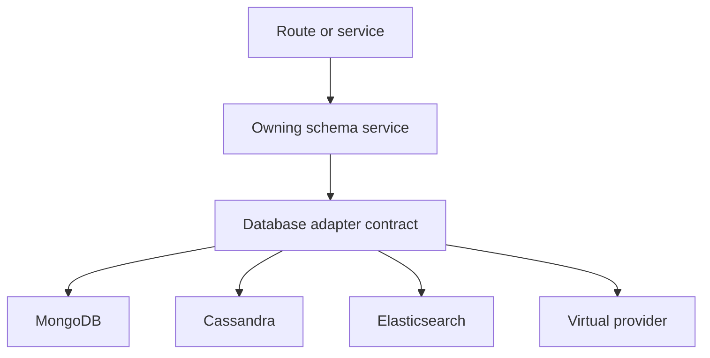

# Database Provider Boundaries

Database providers let Nodics run the same schema and service contracts on
different persistence implementations. MongoDB, virtual MongoDB, Cassandra,
Elasticsearch, and virtual database modules are infrastructure choices behind
the owning schema services. For beginners, the database stores records, but
the module schema and service decide what records mean.

## Source map

| Area | Source location |
| --- | --- |
| Database group | `../nodics.foundation/modules/nDatabase/package.json` |
| Core database contract | `../nodics.foundation/modules/nDatabase/database/package.json` |
| Virtual database | `../nodics.foundation/modules/nDatabase/database/vDatabase/package.json` |
| MongoDB provider | `../nodics.foundation/modules/nDatabase/mongodb/package.json` |
| Virtual MongoDB | `../nodics.foundation/modules/nDatabase/mongodb/vMongodb/package.json` |
| Cassandra provider | `../nodics.foundation/modules/nDatabase/cassandradb/package.json` |
| Elasticsearch provider | `../nodics.foundation/modules/nDatabase/elasticdb/package.json` |
| Provider overview | `docs/pages/nodics.foundation/provider-data-access-layer.md` |

## Boundary model



The business problem is portability and reliability. A customer should be able
to run a capability in the right infrastructure without changing product,
content, payment, or profile logic. Developers need provider boundaries.
Operators need connection, index, migration, backup, and recovery evidence for
production.

## Contract rules

Schema definitions, validation, interceptors, and services own business
semantics. Providers own connection, query translation, transaction behavior,
index operations, pagination, and persistence-specific failure mapping. A
provider must not invent fields or bypass schema validation. A schema service
must not depend on provider-only behavior unless it declares that dependency.

Provider errors should be mapped into consistent Nodics outcomes. A duplicate
key, missing index, connection timeout, write conflict, and search shard issue
are different technical failures, but business users need clear messages and
operators need enough evidence to recover production without reading provider
internals first.

```js
const persistenceContext = {
  schemaName: 'product',
  provider: 'mongodb',
  tenant: 'default',
  operation: 'saveAll'
};
```

## Provider comparison

| Provider | Use | Watch point |
| --- | --- | --- |
| MongoDB | Primary document persistence. | Validate indexes and tenant filters. |
| Virtual MongoDB | Development and generated behavior tests. | Do not treat as production storage. |
| Cassandra | Large distributed persistence cases. | Model queries before data shape. |
| Elasticsearch | Search and discovery projections. | Search index is projection, not authority. |
| Virtual database | Contract testing and fallback stubs. | Keep capabilities clearly labelled. |

## Customization and extension guidance

Developers can add database providers, transaction wrappers, query builders,
index managers, and error mappers. They should add contract tests proving
create, update, read, search, delete, pagination, tenant isolation, and failure
mapping. Business users should see database impact only as capability
readiness or safe error messages in Axis. Operators should see connection
health, migration state, index state, backup evidence, and recovery steps.
These signals should be available before customer traffic depends on the
provider.

## Common mistakes

- Letting provider-specific query behavior leak into business services.
- Treating Elasticsearch projection as product or content authority.
- Running production without tenant-index checks.
- Hiding connection failures as generic setup issues.
- Reusing development virtual providers as production evidence.

## Verification

Run database provider tests and owning module schema tests. For production,
verify connection configuration, tenant filters, indexes, migration status,
backup and restore procedure, and failure mapping. A fresh-schema check should
prove import, read, update, search projection, and rollback behavior through
the selected provider.
