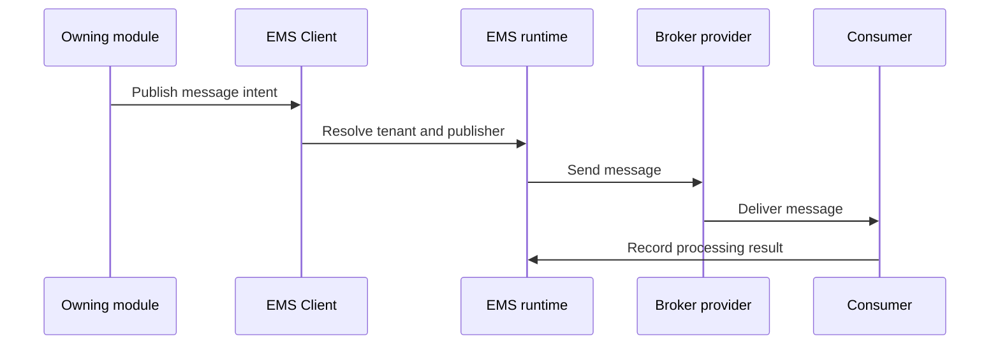

# EMS Runtime and Client Runbook

EMS coordinates event and message behavior across Nodics modules. The EMS
runtime owns message contracts, listeners, publisher selection, retry, tenant
resolution, and provider coordination. EMS Client gives modules a controlled
way to publish and process messages. For beginners, EMS is the delivery path
for system events; the business module still owns why an event exists and what
it means.

## Business problem

The business problem is reliable coordination between services. Import,
publication, cache invalidation, communication, workflow, and monitoring can
all depend on events. Business users do not need broker details, but they need
confidence that a governed operation did not disappear between modules.
Developers need stable message contracts. Operators need production evidence
for published, consumed, retried, failed, and tenant-scoped messages.

## Source map

| Area | Source location |
| --- | --- |
| EMS module | `../nodics.foundation/modules/nEms/` |
| EMS Client module | `../nodics.foundation/modules/nEms/emsClient/` |
| Kafka provider | `../nodics.foundation/modules/nEms/kafka/` |
| ActiveMQ provider | `../nodics.foundation/modules/nEms/activemq/` |
| EMS tests | `../nodics.foundation/modules/nEms/emsClient/test/`, `../nodics.foundation/modules/nEms/kafka/test/` |
| Existing event docs | `docs/pages/nodics.foundation/events-messaging-cluster.md` |

## Message flow



## Contract

Messages should include contract code, tenant, correlation id, source module,
event type, bounded payload, retry policy, and processing result. Providers
own broker-specific connection and delivery. Business modules own payload
meaning and follow-up behavior.

```js
const event = {
  contract: 'cms.publication.completed/v1',
  tenant: 'default',
  sourceModule: 'cms',
  correlationId: 'publication-1001'
};
```

## Customization and extension guidance

Developers can add message contracts, listeners, providers, publisher
selection, retry handling, tenant resolvers, and dead-letter processing.
Business users should see event impact as operation state, not broker details.
Operators should inspect provider health, queue depth, retries, failed
messages, tenant routing, and consumer lag. QA should test publish, consume,
retry, duplicate handling, tenant isolation, and unavailable provider behavior.

## Operating rules

Each message contract should define producer, consumer, payload shape, tenant
scope, idempotency key, retry limit, and failure evidence. EMS Client should be
the normal entry point for module code so provider details remain replaceable.
Provider modules can tune Kafka or ActiveMQ delivery, but they should not
change business meaning. Axis and NMS should surface message health as
operation readiness, lag, retries, and failed-message evidence.

Decision makers should read EMS evidence as operational confidence, not as a
separate business workflow. A publication, import, or notification journey is
healthy only when the owning module state and message evidence agree. That
keeps broker details technical while still proving cross-module reliability.

## Common mistakes

- Putting business decisions inside generic EMS provider code.
- Publishing messages without tenant or correlation id.
- Treating broker acknowledgement as business completion.
- Dropping failed messages without dead-letter evidence.
- Showing provider errors directly in business setup pages.

## Verification

Run EMS Client route, service, active publisher, message process, tenant
resolution, and provider tests. In a fresh local runtime, publish a controlled
event, consume it, force a provider failure, and verify retry and evidence.
Production readiness requires business-safe operation state, developer message
contracts, operator broker evidence, and QA proof of tenant isolation.
