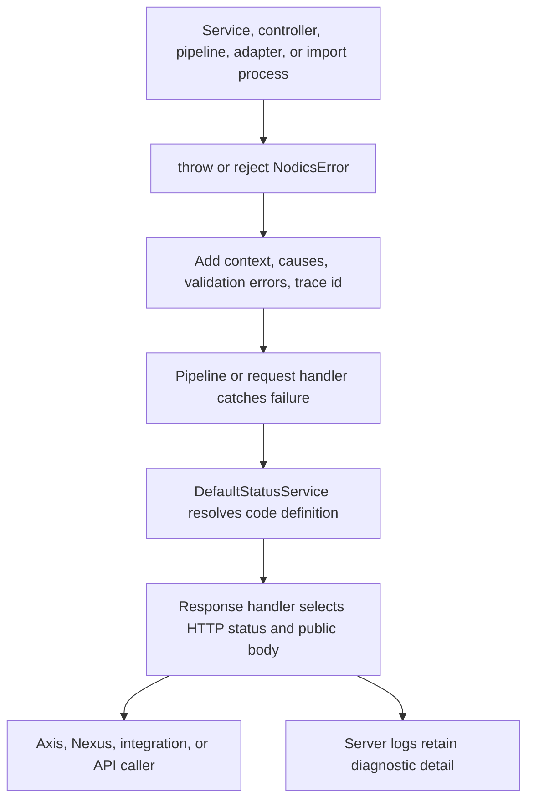

# Error Handling and Status Codes

Error handling is a framework contract in Nodics. It decides what a developer
throws, what a pipeline propagates, what an API caller receives, what Axis can
display safely, and what an operator can use for troubleshooting. This page is
for beginners, business users, developers, operators, architects, QA owners,
and AI tools that need one clear model for errors, success responses, HTTP
status codes, localization, and customization.

For beginners, think of a Nodics error as two things travelling together: a
stable product code such as `ERR_PROCESS_00004`, and a safe message/status
definition that explains how the caller should understand it. The backend logs
may contain deeper context. The public response should remain predictable and
safe.

## Business context

Business users should never see raw framework exceptions as the main message.
Axis and Nexus need friendly messages such as "Content catalog pending setup"
or "Process graph validation failed", while developers and operators still
need request id, error code, tenant, module, pipeline node, schema, and source
evidence to diagnose the problem.

| Business need | Error contract answer |
| --- | --- |
| Friendly user messages | Response handlers project safe messages and hide server internals by default. |
| Developer traceability | `NodicsError` carries code, contexts, causes, validation errors, and trace id. |
| API consistency | Status definitions map every `SUC_*`, `ERR_*`, and `RSN_*` code to an HTTP status and message. |
| Operator support | Logs keep enriched context while API responses stay bounded. |
| Project customization | Later modules can add status definitions, default error-code mappings, and response handlers. |

## Runtime ownership

| Runtime area | Source location | Responsibility |
| --- | --- | --- |
| Error class | `../nodics.foundation/modules/nCommon/src/lib/nodicsError.js` | Normalizes strings, Error objects, plain objects, nested causes, validation errors, context, trace id, and safe JSON serialization. |
| Default error config | `../nodics.foundation/modules/nCommon/config/properties.js` | Defines `returnErrorStack` and default error-code mappings such as `defaultErrorCodes.NodicsError`. |
| Status catalogue | `../nodics.foundation/modules/nService/src/service/status/defaultStatusService.js` | Loads active module `src/utils/statusDefinitions.js` files and validates code/message/localization metadata. |
| Baseline statuses | `../nodics.foundation/modules/nCommon/src/utils/statusDefinitions.js` | Defines shared fallback success and error definitions. |
| JSON response | `../nodics.foundation/modules/nRouter/src/service/handlers/response/defaultJsonResponseHandlerService.js` | Converts success and error objects into HTTP responses and public JSON envelopes. |
| Request dispatch | `../nodics.foundation/modules/nRouter/src/service/defaultRequestHandlerService.js` | Selects the configured response handler after `requestHandlerPipeline` succeeds or fails. |
| Contract tests | `../nodics.foundation/modules/nCommon/test/errorTraceability.test.js`, `../nodics.foundation/modules/nService/test/statusDefinitionCatalog.test.js` | Validate traceability, safe serialization, and status-definition coverage. |

## End-to-end flow



The same principle applies to success responses. A service can return
`SUC_*` codes, and the response handler resolves message and HTTP status from
the status catalogue.

## Error code format

Nodics status codes are stable business/runtime identifiers. They are not the
same thing as HTTP status numbers.

| Part | Example | Meaning |
| --- | --- | --- |
| Prefix | `ERR`, `SUC`, `RSN` | Error, success, or reason-classification code. |
| Domain segment | `SYS`, `PROCESS`, `IMP`, `EXP`, `AUTH`, `RTR` | Owning capability or technical module vocabulary. |
| Number | `00004` | Stable numeric identity inside the owner namespace. |

Examples:

```text
SUC_SYS_00000      Successfully processed
ERR_SYS_00001      Validation error
ERR_PROCESS_00004  Process graph validation failed
ERR_EXP_00001      Export request invalid or dependency unavailable
ERR_RTR_00004      HTTP rate limit exceeded
```

Use one code for one stable condition. Do not reuse a code for unrelated
failures because Axis, integrations, tests, and documentation may make
decisions from that code.

## Status definition contract

Each active module may contribute status definitions from
`src/utils/statusDefinitions.js`. `DefaultStatusService.loadStatusDefinitions`
loads those files during startup and stores the effective map.

```js
module.exports = {
  ERR_PRODUCT_EXPORT_00001: {
    code: '422',
    message: 'Product export filters are invalid'
  },
  ERR_PRODUCT_EXPORT_00002: {
    code: '409',
    message: 'Product export target is not ready'
  },
  SUC_PRODUCT_EXPORT_00000: {
    code: '202',
    message: 'Product export workflow accepted'
  }
};
```

Status definition rules:

| Field | Required | Meaning |
| --- | --- | --- |
| Object key | Yes | Stable Nodics status code, normally `ERR_*`, `SUC_*`, or `RSN_*`. |
| `code` | Yes | HTTP status as a number or numeric string from 100 to 599. |
| `message` | Yes | Default safe English message. |
| `type` | Required for `RSN_*` | Must be `reason` for reason-classification codes. |
| `messageKey` | Optional | Stable localization key when browser localization is needed. |
| `parameters` | Required when `messageKey` is present | Exact scalar parameter names allowed into the public response. |
| `exposure` | Required when `messageKey` is present | One of `PUBLIC`, `AUTHENTICATED`, `OPERATOR`, or `INTERNAL`. |

Localized public messages can be declared like this:

```js
module.exports = {
  ERR_AUTH_00001: {
    code: '401',
    message: 'Authentication failed',
    messageKey: 'auth.invalid_credentials',
    parameters: [],
    exposure: 'PUBLIC'
  }
};
```

The JSON response handler exposes localization metadata only when the status
definition declares `messageKey`, the parameter names are allowed by the
definition, and the exposure is permitted by response-handler policy.

## Throwing errors

Use `CLASSES.NodicsError` for expected business/runtime failures.

```js
throw new CLASSES.NodicsError(
  'ERR_PRODUCT_EXPORT_00001',
  'categoryCode is required when target marketplace is selected'
);
```

When wrapping a lower-level error, preserve the stable owner code and add
context.

```js
try {
  await SERVICE.DefaultProductDiscoveryService.search(request);
} catch (error) {
  throw CLASSES.NodicsError.enrich(error, {
    layer: 'product-export',
    moduleName: 'product',
    target: request.target,
    tenant: request.tenant
  }, 'ERR_PRODUCT_EXPORT_00003', 'Unable to aggregate product data');
}
```

Use `NodicsError.ensure` when a catch block can receive either a plain Error,
a string, a plain object, or an existing Nodics error.

```js
catch (error) {
  throw CLASSES.NodicsError.ensure(
    error,
    'Product export delivery failed',
    'ERR_PRODUCT_EXPORT_00004'
  );
}
```

## Aggregated validation errors

Use child errors when one request has multiple field-level or record-level
failures.

```js
const error = new CLASSES.NodicsError(
  'ERR_PRODUCT_EXPORT_00001',
  'Product export request has validation errors'
);

if (!request.catalogCode) {
  error.add(new CLASSES.NodicsError(
    'ERR_PRODUCT_EXPORT_00005',
    'catalogCode is required'
  ));
}

if (!Array.isArray(request.targets) || request.targets.length === 0) {
  error.add(new CLASSES.NodicsError(
    'ERR_PRODUCT_EXPORT_00006',
    'At least one export target is required'
  ));
}

if (error.getErrors().length > 0) {
  throw error;
}
```

`DefaultJsonResponseHandlerService.publicError` returns a bounded list of
validation errors. The default public policy limits validation details so one
bad request cannot flood the response.

## Success response format

Success responses should also use stable codes.

```js
return {
  code: 'SUC_PRODUCT_EXPORT_00000',
  data: {
    instanceCode: 'product-export-summer-2026',
    acceptedTargets: ['marketplace', 'erp', 'analytics']
  }
};
```

The JSON response handler fills missing fields from `DefaultStatusService`:

```json
{
  "code": "SUC_PRODUCT_EXPORT_00000",
  "responseCode": "202",
  "message": "Product export workflow accepted",
  "data": {
    "instanceCode": "product-export-summer-2026",
    "acceptedTargets": ["marketplace", "erp", "analytics"]
  }
}
```

The HTTP response status is numeric. The Nodics payload `responseCode` may
remain string-based because it comes from module status definitions.

## Error response format

A public JSON error response has this shape:

```json
{
  "responseCode": "422",
  "code": "ERR_PROCESS_00004",
  "name": "NodicsError",
  "message": "Process graph validation failed",
  "traceId": "request-abc",
  "errors": [
    {
      "responseCode": "422",
      "code": "ERR_PROCESS_00018",
      "name": "NodicsError",
      "message": "Unsupported process runtime node type"
    }
  ]
}
```

Server-side logs may contain context, causes, and stack traces. Public API
responses should not expose stack traces, secrets, request bodies, provider
responses, raw database errors, or filesystem paths.

## HTTP status guidance

Use normal HTTP semantics. The Nodics code explains the product/runtime
condition; the HTTP status explains how the API caller should treat the
response.

| HTTP status | Use for | Example Nodics condition |
| --- | --- | --- |
| `200` | Successful read, update, or completed action. | `SUC_PROCESS_00000` |
| `201` | Resource or runtime instance created. | `SUC_PROCESS_00007` |
| `202` | Accepted for asynchronous execution. | Export workflow or trigger accepted. |
| `400` | Malformed request or unsupported request option. | Invalid export module/schema/format. |
| `401` | Missing or invalid authentication. | Invalid login or token. |
| `403` | Authenticated but not allowed. | Action adapter not registered or permission denied. |
| `404` | Requested definition, task, route, or record not found. | Process definition not found. |
| `409` | State conflict or lifecycle transition not allowed. | Draft/published state mismatch. |
| `422` | Structurally valid request failed domain validation. | Workflow graph validation failed. |
| `429` | Rate limit exceeded. | Router rate-limit policy. |
| `500` | Unexpected server failure. | Unclassified internal error. |
| `503` | Required dependency or service unavailable. | Trigger service unavailable. |

## Response handler selection

Routes normally use `jsonResponseHandler`. A route can declare another handler,
such as text or file download, through route metadata.

```js
module.exports = {
  nSystem: {
    swaggerUi: {
      key: '/swagger',
      method: 'GET',
      controller: 'DefaultSystemController',
      operation: 'swaggerUi',
      secured: false,
      responseHandler: 'textResponseHandler'
    }
  }
};
```

`DefaultRequestHandlerService` resolves the response handler from:

```js
const responseHandler =
  CONFIG.get('responseHandler')[routerDef.responseHandler || 'jsonResponseHandler'];
```

The selected service receives success or error:

```js
SERVICE[responseHandler].handleSuccess(request, response, success);
SERVICE[responseHandler].handleError(request, response, error);
```

## Configuration

Baseline configuration is intentionally conservative.

```js
module.exports = {
  returnErrorStack: false,
  defaultErrorCodes: {
    NodicsError: 'ERR_SYS_00000'
  }
};
```

Project or environment layers may change defaults:

```js
module.exports = {
  returnErrorStack: false,
  defaultErrorCodes: {
    NodicsError: 'ERR_SYS_00000',
    ProductExportError: 'ERR_PRODUCT_EXPORT_00000'
  },
  responseHandler: {
    publicError: {
      maskServerErrorMessages: true,
      includeValidationErrors: true,
      maximumValidationErrors: 20,
      includeLocalizationMetadata: true,
      permittedLocalizationExposures: ['PUBLIC', 'AUTHENTICATED']
    }
  }
};
```

Do not enable stack traces in production-like environments. Use logs,
correlation ids, and enriched contexts for diagnosis.

## Project customization

Developers can customize error behavior safely from a project module.

| Need | Extension point | Avoid |
| --- | --- | --- |
| Add capability-specific errors | Add `src/utils/statusDefinitions.js` in the owning module or project overlay. | Throwing codes that are not defined in the status catalogue. |
| Change fallback error code for a custom error class | Add `defaultErrorCodes.<ClassName>` in layered `config/properties.js`. | Mapping every failure to `ERR_SYS_00000`. |
| Add safe business context | Use `NodicsError.enrich` or `error.addContext`. | Appending raw payloads, secrets, tokens, or provider responses to messages. |
| Return localized metadata | Add `messageKey`, `parameters`, and `exposure` to the status definition. | Letting the browser infer localization keys from error messages. |
| Change public envelope | Override or configure `DefaultJsonResponseHandlerService` through route/response handler configuration. | Making one controller handcraft a different error shape. |
| Add file/text behavior | Use dedicated response handlers. | Returning files through JSON error/success envelopes. |
| Show better Axis setup errors | Map backend error codes to safe UI headlines and evidence. | Rendering raw `ERR_SYS_00000` as the primary business message. |

Example project status definitions:

```js
module.exports = {
  ERR_ACME_PRODUCT_EXPORT_00000: {
    code: '500',
    message: 'ACME product export failed'
  },
  ERR_ACME_PRODUCT_EXPORT_00001: {
    code: '422',
    message: 'ACME product export target filter is invalid',
    messageKey: 'acme.product_export.invalid_filter',
    parameters: ['target'],
    exposure: 'AUTHENTICATED'
  },
  SUC_ACME_PRODUCT_EXPORT_00000: {
    code: '202',
    message: 'ACME product export was accepted'
  }
};
```

Example custom error class:

```js
module.exports = class ProductExportError extends CLASSES.NodicsError {
  constructor(error, message) {
    super(error, message, CONFIG.get('defaultErrorCodes').ProductExportError);
  }
};
```

Example project response handler override:

```js
module.exports = {
  handleError: function (request, response, error) {
    error = CLASSES.NodicsError.ensure(error);
    const publicBody = SERVICE.DefaultJsonResponseHandlerService.publicError(error);
    publicBody.support = {
      requestId: response.getHeader && response.getHeader('X-Request-Id')
    };
    response.status(Number(publicBody.responseCode) || 500).json(publicBody);
  }
};
```

Keep the public shape compatible unless a versioned API contract intentionally
changes it. Axis and integrations should not need a different parser for every
module.

## Operator troubleshooting

| Symptom | Likely cause | First check |
| --- | --- | --- |
| API returns `ERR_SYS_00000` | Unknown error was wrapped by default fallback. | Check logs for contexts, causes, request id, and module layer. |
| API response status is `500` for a validation issue | Missing or wrong module status definition. | Add or correct `src/utils/statusDefinitions.js`. |
| `Invalid error code` during runtime | Code was thrown but not loaded into status map. | Confirm module is active and status definition file exports the code. |
| Axis shows technical text | UI consumed raw exception message instead of mapped safe message. | Add backend-safe status or Axis mapper with evidence. |
| Stack trace appears in API response | `returnErrorStack` enabled or custom handler leaked stack. | Disable stack exposure outside local debugging. |
| Localized message missing | Status definition lacks `messageKey`, allowed parameters, or permitted exposure. | Check status definition and response handler `publicError` policy. |

## Common mistakes

- Throwing plain strings from business services.
- Reusing one error code for unrelated conditions.
- Defining a code in source but not in `statusDefinitions.js`.
- Returning HTTP `200` with an `ERR_*` payload.
- Exposing raw stack traces, request bodies, tokens, provider responses, or
  database errors to the browser.
- Putting business-specific error mapping only in Axis.
- Changing one controller response shape instead of the shared response
  handler contract.
- Using `500` for expected validation, permission, not-found, or lifecycle
  conflicts.

## Verification

Verify error handling at five levels:

1. Unit tests prove `NodicsError` wraps Error objects, strings, causes,
   validation children, contexts, circular values, and trace ids safely.
2. Status catalogue tests prove every used `SUC_*`, `ERR_*`, and `RSN_*` code
   has a valid definition with HTTP code and message.
3. Request-pipeline tests prove controller errors reach the configured response
   handler.
4. API tests verify HTTP status, payload `responseCode`, public message,
   localization metadata, and no stack/secret leakage.
5. Axis browser tests verify user-safe messages, technical evidence for
   administrators, retry guidance, and request/correlation id visibility.

Run the focused framework checks after changing this contract:

```bash
node nodics.foundation/modules/nCommon/test/errorTraceability.test.js
node nodics.foundation/modules/nService/test/statusDefinitionCatalog.test.js
npm --prefix nodics.docs run docs:generate
npm --prefix nodics.docs test
```
