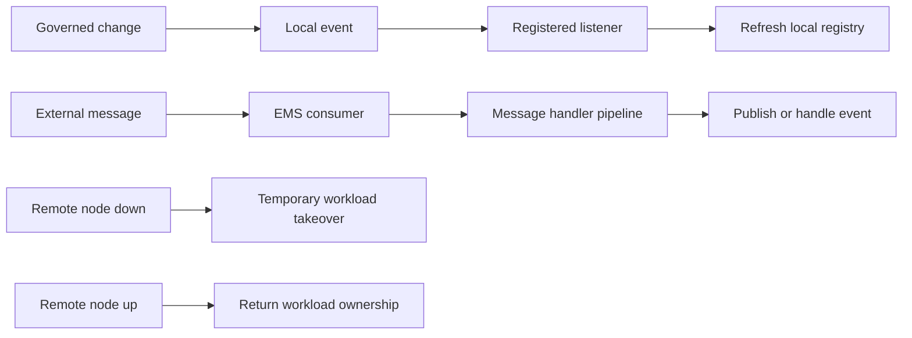

# Events, Messaging, and Cluster Coordination

Events and messaging are the Nodics capabilities that keep local behavior,
runtime change, workload ownership, and cross-module notifications coordinated
across the platform. They are related but not identical. The local event
capability registers listeners and handles in-process events. The messaging
capability publishes and consumes messages through configured providers such
as Kafka or ActiveMQ and can coordinate responsibilities when nodes go down or
come back online.

This page is for beginners, business users, developers, operators, QA owners,
architects, and AI tools. Business users should understand why runtime changes
or scheduled responsibilities do not need to be repeated manually on every
node. Developers should understand where to add events, listeners, message
handlers, provider configuration, tenant validation, and node handoff logic.
Operators should understand how to verify that clustered behavior is
consistent in production.

## Business context

The business problem is clustered consistency. A platform can run on several
nodes, and every node may hold local runtime state such as pipeline
definitions, router configuration, event listeners, API keys, consumers,
publishers, or cron responsibilities. When one node is down, work still needs
to continue. When it returns, responsibilities should move back cleanly. When
a configuration or business-logic change is approved at runtime, every
affected node must refresh safely.

| Business need | Event and messaging answer |
| --- | --- |
| Keep runtime changes consistent | Publish events that refresh local registries and caches. |
| Avoid manual node updates | Let consumers, publishers, and listeners react to a single governed change. |
| Continue work during node failure | Temporarily start remote publishers or consumers on an available node. |
| Restore ownership after recovery | Shut down temporary responsibilities when the original node returns. |
| Support external integrations | Use provider adapters for broker-specific publish and consume behavior. |

## Runtime model

The local event capability loads listener definitions from module files and
from persisted listener records when a listener model is available. It
registers common and module-specific listeners, respects active state, and can
bind listeners to the current node id. Event errors are enriched with layer,
phase, event name, tenant, source, target, module, and state so support teams
can trace what failed.



The messaging capability manages broker clients, publishers, and consumers.
`DefaultEmsClientService` publishes single or batch payloads, resolves
publishers by queue, registers consumers and publishers, and delegates
provider operations to the configured handler. `DefaultMessageProcessService`
validates the queue and message, resolves the message-handler pipeline, checks
tenant rules, and either handles a local event or publishes it onward when the
target module is not active locally.

| Capability area | Main responsibility | Current implementation detail |
| --- | --- | --- |
| Local event registry | Load and register event listeners. | File listeners plus persisted listener records, active flag, and node id filtering. |
| Message publication | Send messages to configured queues. | Single and batch publish with queue-to-publisher resolution. |
| Message consumption | Receive broker messages and process them. | Consumer calls a configured message-handler pipeline. |
| Tenant handling | Decide which tenant the message belongs to. | Header tenant, message tenant, tenant restriction, system queue, and default fallback rules. |
| Node coordination | Move temporary work during failure and restore it on recovery. | Remote consumers and publishers can be started with temporary node ownership. |

## Provider detail

Messaging providers stay behind adapters. The Kafka provider builds broker
lists, retry options, message lists, producers, and consumers through
`kafkajs`. The ActiveMQ provider uses STOMP failover connections, publishes to
queue destinations, registers consumers through channels, and handles
reconnect or error conditions through the provider layer.

```js
emsClient: {
  messageHandlers: {
    commerceRuntimeEvent: 'jsonMessageHandler'
  },
  queues: {
    runtimeConfigurationChanged: {
      options: {
        messageHandler: 'commerceRuntimeEvent',
        tenantRestricted: true
      }
    }
  }
}
```

Provider configuration must explain which broker is used, which queues are
enabled, which publisher or consumer owns the queue, what node normally owns
the workload, and whether temporary takeover is allowed. Documentation should
also state whether payloads are business events, integration messages,
operational control messages, or runtime refresh instructions.

## Cluster coordination

Node handoff is one of the most important parts of this topic. When a remote
node goes down, the node-down handler can start publishers and consumers that
were configured to run on that remote node. It marks them with a temporary
node so the current node can operate the workload and records the temporary
data under the remote node runtime state. When the remote node comes back up,
the node-up handler closes those temporary consumers and publishers so
responsibility can return to the original owner.

| Cluster scenario | Business result | Technical behavior |
| --- | --- | --- |
| Runtime configuration changed | Operators update once, cluster refreshes. | Event listener updates local configuration or registry. |
| Pipeline changed | Business logic changes consistently. | Pipeline update event refreshes effective pipeline definitions. |
| Remote node down | Workload continues on available node. | Temporary publishers/consumers are configured with current node as `tempNode`. |
| Remote node up | Ownership returns cleanly. | Temporary consumers and publishers are closed from remote runtime data. |
| Target module inactive locally | Event reaches another active owner. | Message process publishes the event instead of handling it locally. |

## Customization and extension

Developers should add new listeners in the owning capability and new message
flows through queue, publisher, consumer, provider, and pipeline
configuration. A customer project can add an event listener for a project
rule, define a message handler pipeline, add a provider adapter, or configure
node-specific workload ownership. Each change must document tenant behavior,
payload shape, retry or error policy, idempotency, and operational evidence.

| Customization goal | Recommended path | Required documentation |
| --- | --- | --- |
| Add local runtime refresh | Event listener in owning capability. | Event name, payload, source, affected registry, and node propagation expectation. |
| Add broker message flow | Queue, publisher, consumer, and handler pipeline. | Provider, queue, tenant rules, payload contract, retry, and dead-letter handling. |
| Add provider support | Provider client adapter. | Connection, publish, consume, close, retry, readiness, and failure behavior. |
| Add node-specific workload | Run-on-node configuration. | Normal owner, temporary owner, handoff trigger, restoration behavior, and monitoring. |

## Operations and governance

Events and messages can change application behavior, trigger publication,
invalidate caches, move workloads, or call downstream integrations. They need
explicit security and observability. Every operational page must explain who
can trigger the event, which tenant and enterprise it affects, whether the
payload contains sensitive data, how retries work, how idempotency is
achieved, and where support teams can see the result.

| Failure mode | Symptom | Troubleshooting step |
| --- | --- | --- |
| Listener not registered | Event is emitted but no local behavior changes. | Check listener active state, node id, module event map, and registry load. |
| Tenant missing | Message processing rejects the payload. | Confirm tenant header, message tenant, system queue flag, and default fallback rules. |
| Publisher not available | Publish call fails or batch item reports failure. | Check queue mapping, configured publisher, provider client, and runtime handle. |
| Temporary workload not restored | A recovered node does not regain ownership. | Inspect remote runtime data and node-up shutdown of temporary consumers/publishers. |
| Provider-specific failure | Kafka or ActiveMQ consumer stops. | Review provider adapter logs, reconnect behavior, broker availability, and lifecycle hooks. |

## Common mistakes

- Treating local events and broker messages as the same mechanism.
- Adding a listener without documenting payload shape, tenant scope, and source
  ownership.
- Sending runtime-change messages that are not idempotent.
- Forgetting node ownership rules when a consumer or publisher is configured
  for a specific node.
- Handling a target event locally when the target module is not active on the
  current node.
- Adding a provider adapter without readiness, close, retry, and error
  documentation.
- Skipping operational proof that every active node refreshed the expected
  runtime state.

## Verification

Verification must prove local event behavior, broker messaging behavior, and
cluster handoff behavior. Documentation checks must confirm the business
context, implementation source map, flow diagram, configuration table, code
example, troubleshooting matrix, customization guidance, common mistakes, and
validation commands. Implementation checks should cover event listener
registration, listener update and removal, message validation, tenant
resolution, local versus remote event dispatch, publisher and consumer
registration, batch publish failures, provider adapter behavior, lifecycle
drain and shutdown, node-down takeover, and node-up restoration.

Useful focused checks include event service tests, EMS client service contract
tests, EMS message process contract tests, runtime lifecycle tests, pipeline
runtime change tests, cron lifecycle tests, and documentation content-pack
validation. Production-like validation should also include a multi-node
scenario where a runtime configuration change, a pipeline change, and a
temporary workload takeover are each observed from the operator view.
