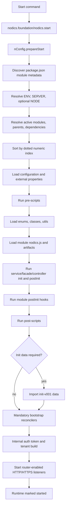
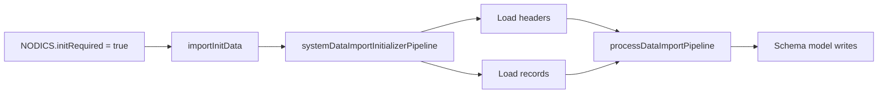

# Framework Startup Lifecycle

Framework startup explains what happens after a Nodics runtime is launched and
before the server begins accepting API traffic. This page is for beginners,
developers, operators, architects, QA owners, and AI tools that need to
understand how modules, configuration, services, pipelines, schemas, initial
data, authentication, tenants, and HTTP listeners become one running Nodics
server.

The short mental model is: a start command selects a runtime, nConfig discovers
loadable modules, the selected modules are sorted by index, layered files are
merged into runtime registries, lifecycle hooks run, required initial data is
imported, internal identity is prepared, and only then router-enabled modules
start HTTP and HTTPS listeners.

## Business context

Startup is a business concern because the first few seconds decide whether the
application is safe to use. If the wrong module loads first, a project override
may not apply. If properties are loaded from the wrong layer, a server can
connect to the wrong database. If init data is skipped on a fresh schema, Axis
login, module registry, publishing, and content journeys may fail.

| Business need | Startup answer |
| --- | --- |
| First setup should be predictable | Fresh schema detection imports required `init-v001` data before users operate the system. |
| Customer projects should be customizable | Project, environment, server, node, and later module layers can extend framework defaults. |
| Operators need confidence | Logs show selected paths, configuration precedence, module order, and server listeners. |
| Developers need safe extension points | `nodics.js`, `config/prescripts.js`, and `config/postscripts.js` provide controlled hooks. |

## Entry point

In a deployed or generated project, `npm run start` should be a thin wrapper
around the Nodics launcher. The launcher ultimately calls
`nodics.foundation/nodics.js` and its `start(options)` method.

```js
const path = require('path');
const nodics = require('./nodics.foundation/nodics');

nodics.start({
  NODICS_HOME: path.resolve(__dirname, 'nodics.foundation'),
  CUSTOM_HOME: __dirname,
  MODULE_ROOTS: [
    path.resolve(__dirname, 'nodics.foundation'),
    __dirname
  ],
  defaultEnvironment: 'local',
  defaultServer: 'platformServer'
});
```

`NODICS_HOME` points to the framework foundation root. `CUSTOM_HOME` points to
the project or runtime root. `MODULE_ROOTS` tells Nodics which independently
versioned roots to scan for loadable packages. `defaultEnvironment` and
`defaultServer` are fallback selections; command-line or environment variables
can still select a different runtime.

```bash
ENV=local SERVER=platformServer node server.js
S=platformServer E=local node server.js
SERVER=platformServer NODE=platformNode01 node server.js
```

The framework root package `nodics.ai` is intentionally not a runtime module.
It is a repository boundary and tooling owner. Runtime startup begins from
concrete functional modules and project/server composition.

## Full startup flow



| Step | Runtime action | Source owner |
| --- | --- | --- |
| 1. Start | Project script or process calls `nodics.start(options)`. | Project runtime wrapper |
| 2. Prepare globals | `NODICS`, `CONFIG`, `SERVICE`, `PIPELINE`, `FACADE`, `CONTROLLER`, `CLASSES`, `ENUMS`, and `TEST` are created or reset. | `nConfig` |
| 3. Discover modules | `MODULE_ROOTS` are scanned recursively for loadable `package.json` metadata. | `nConfig` utility |
| 4. Resolve topology | `ENV`, `SERVER`, and optional `NODE` select project, environment/server-root, server, and node paths. | `nConfig` |
| 5. Load base server properties | Project, environment, server, and optional node properties are merged to decide activation. | `nConfig` |
| 6. Resolve active modules | Configured groups/modules, selected runtime modules, parent modules, and required modules become the active list. | `nConfig` |
| 7. Sort index | Active modules are sorted by dotted numeric `index`; duplicate indexes fail startup. | `nConfig` |
| 8. Load metadata | Active module metadata is copied into `NODICS.modules`. | `nConfig` |
| 9. Load configuration | Active `config/properties.js` files and external property files merge into `CONFIG`. | `nConfig` |
| 10. Run pre-scripts | Active `config/prescripts.js` functions execute after configuration and before utilities/modules load. | Active modules |
| 11. Load utilities | Enums, classes, and shared utils are loaded from active modules. | `nConfig` |
| 12. Load module artifacts | Module `nodics.js.init`, services, pipelines, facades, and controllers load in index order. | Active modules |
| 13. Init entities | Loaded services, facades, and controllers run `init`. | Active modules |
| 14. Post-init entities | Loaded services, facades, and controllers run `postInit`. | Active modules |
| 15. Post-init modules | Module `nodics.js.postInit` runs in index order. | Active modules |
| 16. Run post-scripts | Active `config/postscripts.js` functions execute after modules/entities are ready. | Active modules |
| 17. Import init data | If `NODICS.initRequired` is true, active module `data/init-v001` releases import. | `nData` import |
| 18. Reconcile mandatory records | Configured mandatory bootstrap services create or repair required platform records. | Owning modules |
| 19. Prepare identity | Internal service token is issued locally or fetched from remote profile. | `profile`, `nAuth`, `nService` |
| 20. Build tenants | Enterprise and tenant context is built for request processing. | `profile` |
| 21. Start listeners | Router-enabled modules attach routers and start HTTP/HTTPS listeners. | `nRouter` |
| 22. Mark ready | Runtime lifecycle is marked started and readiness contributors can report healthy state. | `nConfig`, `nSystem` |

## Module discovery contract

Startup discovers modules by scanning each configured module root for
`package.json`. A package participates in Nodics runtime loading only when it
has canonical Nodics metadata and is not explicitly excluded.

```json
{
  "name": "profile",
  "index": "100.20",
  "nodics": {
    "kind": "capability",
    "displayName": "Profile",
    "owns": ["identity", "tenant", "employee"],
    "runtime": {
      "router": true,
      "publish": false,
      "web": false
    }
  },
  "requiredModules": ["nDatabase", "nRouter"]
}
```

| Metadata | Meaning |
| --- | --- |
| `name` | Runtime module identity. Server and node names may be scoped when duplicate names exist in different environments. |
| `index` | Dotted numeric load order. Earlier indexes load first; later indexes can override merge-friendly artifacts. |
| `nodics.kind` | Package role such as `application`, `group`, `environment`, `server`, `node`, or `capability`. |
| `nodics.runtime` | Declares runtime surfaces such as router, publish, and web. |
| `runtimeModule: false` or `nodics.loadableByNodicsModuleLoader: false` | Excludes a package from runtime loading. |
| `requiredModules` | Declares local in-process dependencies that must be active and load earlier. |

Do not use package dependency order as startup order. `package.json`
dependencies make code available to npm; Nodics module `index` and active
runtime composition decide runtime order.

## Active module resolution

Active modules come from several sources:

| Source | How it participates |
| --- | --- |
| Selected runtime hierarchy | The selected environment/server-root, server, and optional node are activated explicitly. |
| `activeModules.groups` | Group modules can be activated and may include selector syntax for explicit child activation. |
| `activeModules.modules` | Concrete capability/project modules are activated explicitly. |
| Parent hierarchy | Parent modules inside the selected runtime boundary are added when required. |
| `requiredModules` | Required local dependencies are added and validated. |
| Publish-enabled modules | Publish modules may load when publication support is enabled. |
| Always-loadable modules | Foundation modules needed by the runtime load when their metadata allows it. |

After activation, `DefaultFrameworkInitializerService.loadModuleIndex` builds a
map keyed by module index and sorts it numerically. This sorted map is the
contract used by file loading, module initialization, service precedence,
pipeline precedence, class loading, and controller/facade registration.

## Configuration loading

Configuration is loaded in two important passes.

The first pass loads selected runtime properties so startup can determine
active modules:

```text
project config      <project>/config/properties.js
environment config  <environment-or-server-root>/config/properties.js
server config       <server>/config/properties.js
node config         <node>/config/properties.js
```

The second pass loads every active module's `config/properties.js` in module
index order, then external property files.

```js
module.exports = {
  activeModules: {
    groups: ['nodics.foundation', 'nodics.platform'],
    modules: ['axis', 'profile', 'backoffice']
  },
  servers: {
    default: {
      endpoint: {
        httpHost: 'localhost',
        httpPort: 3010
      }
    }
  },
  externalPropertyFile: [
    '/secure/local/private-properties.js'
  ]
};
```

Keep committed properties declarative. Secrets and machine-specific values
belong in private local or environment-specific property files.

## File and artifact loading

`DefaultFilesLoaderService` loads matching files from indexed active modules.
Most registries use merge behavior, so later modules can extend or override
earlier definitions.

| Artifact | Location | Runtime registry |
| --- | --- | --- |
| Properties | `config/properties.js` | `CONFIG` |
| Pre-start scripts | `config/prescripts.js` | `NODICS.preScripts` |
| Post-start scripts | `config/postscripts.js` | `NODICS.postScripts` |
| Enums | `src/utils/enums.js` | `ENUMS` |
| Classes | `src/lib/**/*.js`, excluding `classes.js` | `CLASSES` |
| Class generalizers | `src/lib/classes.js` | Mutates or extends `CLASSES` |
| Utilities | `src/utils/utils.js` | `UTILS` |
| Services | `src/service/**/*Service.js` | `SERVICE` |
| Pipelines | `src/pipelines/*Definition.js`, `src/pipelines/pipelines.js` | `PIPELINE` |
| Facades | `src/facade/**/*Facade.js` | `FACADE` |
| Controllers | `src/controller/**/*Controller.js` | `CONTROLLER` |
| Routers | `src/router/routers.js` and generated schema routes | Module routers |

Later modules should override through the same artifact type they are
customizing. For example, do not change a controller just to alter business
logic that belongs in a service or pipeline node.

## Module-level lifecycle hook

Every module can define `nodics.js`. The module loader calls `init` before
loading that module's services, pipelines, facades, and controllers. It calls
`postInit` later, after all entities have loaded and their own init/postInit
hooks have run.

```js
module.exports = {
  init: function (moduleObject) {
    return new Promise((resolve, reject) => {
      // Runs while this module is being loaded.
      // Use this for lightweight module-level preparation.
      resolve(true);
    });
  },

  postInit: function (moduleObject) {
    return new Promise((resolve, reject) => {
      // Runs after services, pipelines, facades, and controllers are available.
      // Use this when the hook needs SERVICE, PIPELINE, FACADE, or CONTROLLER.
      resolve(true);
    });
  }
};
```

Use `nodics.js.init` when the behavior belongs to the module itself and must
run before that module's artifacts are loaded. Use `nodics.js.postInit` when
the behavior needs other loaded services or must register runtime contributors.
Profile uses module `postInit` to decide whether bootstrap data is required
when a fresh schema has no enterprise or bootstrap employee data.

## Pre-scripts

Every active module may contribute `config/prescripts.js`. nConfig loads
pre-scripts after effective configuration is available and before enums,
classes, modules, services, pipelines, facades, and controllers are loaded.

```js
module.exports = {
  verifyLocalMediaPath: function () {
    const media = CONFIG.get('media') || {};
    if (!media.localRoot) {
      throw new Error('media.localRoot must be configured before startup');
    }
  },

  prepareDiagnosticContext: function () {
    NODICS.LOG && NODICS.LOG.info('Preparing local diagnostic context');
  }
};
```

Pre-scripts are useful for validation or environment preparation that must
happen before module artifacts load. They should be quick, deterministic, and
idempotent. They should not call business services because `SERVICE` has not
been loaded yet.

## Post-scripts

Every active module may contribute `config/postscripts.js`. nConfig loads
post-scripts during `config.start`, then the framework coordinator executes
them after module and entity post-initialization is complete.

```js
module.exports = {
  verifyRuntimeContracts: function () {
    if (!SERVICE.DefaultRouterService) {
      throw new Error('Router service must be available before server startup');
    }
    if (!PIPELINE.systemDataImportInitializerPipeline) {
      throw new Error('System data import initializer pipeline is not available');
    }
  },

  registerSupportBanner: function () {
    const support = CONFIG.get('support') || {};
    if (support.enabled) {
      SERVICE.DefaultLoggerService
        .createLogger('StartupSupport')
        .info('Support profile active: ' + support.profile);
    }
  }
};
```

Post-scripts can read loaded services, pipelines, facades, controllers, enums,
classes, and configuration. They still run before startup init data import and
before HTTP listeners start, so they are a good place for runtime contract
checks that should block an unsafe server from becoming reachable.

## Entity lifecycle hooks

After all active module artifacts are loaded, Nodics initializes entities in
this order:

```text
services.init
facades.init
controllers.init
services.postInit
facades.postInit
controllers.postInit
module nodics.js.postInit
```

Service `init` should register providers, lifecycle contributors, health
checks, and in-memory policy defaults. Service `postInit` should run only when
the service needs all services/facades/controllers to be available first.

```js
module.exports = {
  init: function () {
    if (SERVICE.DefaultRuntimeLifecycleService) {
      SERVICE.DefaultRuntimeLifecycleService.registerContributor('myProvider', {
        order: 700,
        shutdown: () => this.close()
      });
    }
    return Promise.resolve(true);
  },

  postInit: function () {
    return this.verifyProviderCanServeCurrentTenant();
  }
};
```

Do not start unmanaged timers or background jobs directly from arbitrary
service init hooks. Scheduled work should normally be represented by cron job
data and executed through the Process/Cron module lifecycle.

## Fresh schema and init data

Startup imports initialization data only when `NODICS.initRequired` is true.
In the current profile-owned bootstrap path, profile module `postInit` checks
the profile database. It treats startup as requiring init data when collections
are missing, enterprise records are missing, or the default bootstrap employee
is missing.

When init is required, the framework coordinator calls:

```js
SERVICE.DefaultImportService.importInitData({
  tenant: CONFIG.get('defaultTenant') || 'default',
  modules: NODICS.getActiveModules()
});
```

`DefaultImportService.importInitData` sets `request.dataType = 'init'`, runs
`systemDataImportInitializerPipeline`, and then dispatches finalized records
through `processDataImportPipeline`.



The release data involved here lives under active module folders such as:

```text
data/
  init-v001/
    headers/
    records/
```

This startup import is for mandatory initialization. Core and sample data are
governed data release operations and should be triggered intentionally through
the import/release process.

## Mandatory bootstrap reconcilers

After init data import, Nodics runs configured mandatory bootstrap services.
These are ordered, idempotent services declared through
`mandatoryBootstrapServices`. They are intended for records that must exist
for the runtime to remain operable even if a data release is incomplete.

```js
module.exports = {
  mandatoryBootstrapServices: {
    defaultIdentity: {
      enabled: true,
      order: 100,
      service: 'DefaultMandatoryIdentityBootstrapService'
    }
  }
};
```

Each configured service must expose `reconcile(request)`.

```js
module.exports = {
  reconcile: function (request) {
    return SERVICE.DefaultEmployeeService.saveOrUpdate({
      tenant: request.tenant,
      model: {
        loginId: 'admin',
        active: true
      }
    });
  }
};
```

Reconcilers must be idempotent. They should create or repair required records,
not blindly insert duplicates.

## Internal identity and tenant context

After bootstrap reconciliation, startup prepares internal service identity. If
profile is active locally, Nodics verifies the default employee by API key and
issues a service token through `DefaultServiceTokenService`. If profile is
remote, Nodics fetches an internal token from the configured profile endpoint.

Then `DefaultEnterpriseHandlerService.buildEnterprises()` builds active
enterprise and tenant context. That is why init data and identity bootstrap
must complete before the server is marked ready.

## Router startup and readiness

Only after the framework lifecycle completes does `DefaultRouterService` start
HTTP and HTTPS listeners. It loops over active modules, checks whether each
module is router-enabled, attaches the prepared module router, and starts the
configured ports.

```js
SERVICE.DefaultRouterService.startServers().then(() => {
  NODICS.setEndTime(new Date());
  SERVICE.DefaultRuntimeLifecycleService.markStarted({ reason: 'startup' });
});
```

If listener startup fails, runtime lifecycle transitions to `failed` and the
process exits with the configured error code.

## Operations and governance

Operators should treat startup output as runtime evidence, not console noise.
The startup log should identify the selected `NODICS_HOME`, environment path,
server root, server path, optional node path, log path, configuration loading
contract, and the active module order from top to bottom. Those lines are the
first proof that the process is running the intended project and not a stale
checkout, wrong environment, or wrong server composition.

| Operator check | Evidence to collect |
| --- | --- |
| Correct runtime selected | `NODICS_ENV`, `SERVER_ROOT`, `SERVER`, optional `NODE`, and port bindings. |
| Correct module graph | Active module list with dotted numeric indexes and no duplicate indexes. |
| Correct configuration | Logged configuration precedence and expected external property files. |
| Fresh schema handled | Init-required log, `init-v001` import result, and mandatory bootstrap reconciler result. |
| Identity ready | Internal service token creation or remote profile token retrieval. |
| Tenant context ready | Enterprise/tenant build result and readiness health contributor state. |
| Server reachable | HTTP/HTTPS listener logs and runtime lifecycle `started` state. |

If startup fails, preserve the first meaningful error and the selected runtime
paths before retrying. Retrying without checking the selected environment,
module index, database, and init data state can hide the real cause and create
partial bootstrap data.

## Customization decision guide

| Need | Use | Why |
| --- | --- | --- |
| Validate local files or environment before services load | `config/prescripts.js` | Configuration exists, but services are not loaded yet. |
| Prepare lightweight module state before its artifacts load | Module `nodics.js.init` | The behavior belongs to that module's load boundary. |
| Register health, lifecycle, provider, or service-owned startup state | Service `init` | The service owns the runtime contributor. |
| Verify loaded registries before HTTP starts | `config/postscripts.js` | Services and pipelines are available, but traffic is not open. |
| Decide whether first startup needs mandatory data | Module `nodics.js.postInit` or an owning bootstrap service | The check needs loaded models/services. |
| Create or repair required records idempotently | `mandatoryBootstrapServices` | Keeps safety-critical bootstrap repair governed and repeatable. |
| Change business behavior | Service, pipeline, validator, provider, or data release | Avoids putting business logic into startup glue. |

## Safe pre-module-load customization

Use `config/prescripts.js` when you need a hook before module artifacts load.
This is the closest supported extension point to "pre module load".

Good pre-script responsibilities:

- validate required property values;
- ensure a local folder exists when the folder path is configured;
- register simple diagnostic markers;
- fail fast when the selected runtime is unsafe.

Avoid in pre-scripts:

- calling `SERVICE` methods;
- starting servers or timers;
- importing business data;
- mutating active module lists after they have already been resolved;
- hiding tenant or security defaults outside properties.

## Safe post-module-load customization

Use `config/postscripts.js` or module `nodics.js.postInit` when the behavior
needs loaded services or registries.

Good post-module-load responsibilities:

- verify a required service or pipeline exists;
- register runtime readiness contributors through a service;
- run idempotent checks that should block HTTP startup on failure;
- prepare module-local caches from already-loaded configuration.

Avoid in post-scripts:

- inserting business records that belong in data releases or bootstrap
  reconcilers;
- doing long-running network work without timeout or observable failure;
- silently swallowing errors that should block startup;
- creating background schedulers outside Process/Cron.

## Troubleshooting

| Symptom | Likely area | What to check |
| --- | --- | --- |
| `Default server is not configured` | Startup selection | Pass `SERVER`/`S` or configure `defaultServer`. |
| `Ambiguous server` | Environment selection | Pass `ENV`/`E` when a server name exists in multiple environments. |
| `active module references unknown module` | Active module config | Check `activeModules.groups`, `activeModules.modules`, aliases, and module roots. |
| Duplicate module index | Module metadata | Ensure each active runtime module has a unique dotted numeric `index`. |
| Required module inactive | Dependency contract | Activate the dependency locally or redesign as a remote API dependency. |
| Service override not active | Index and active module list | Confirm the project module is active and loads after the base service. |
| Init data not imported on fresh schema | Profile/bootstrap check | Check profile collections, enterprise records, and bootstrap employee. |
| Server never opens port | Router config | Check `servers.default.endpoint.httpPort`, router-enabled metadata, and listener errors. |
| Axis login fails after fresh schema | Init data or identity bootstrap | Check `init-v001` import, mandatory bootstrap services, and internal token creation. |

## Common mistakes

- Assuming `npm install` dependency order controls runtime override order.
- Putting business records into startup scripts instead of data releases.
- Using pre-scripts for service calls before services are loaded.
- Updating root `nodics.ai` as if it were a runtime module.
- Activating remote-only modules as local required modules.
- Adding a project override without assigning a later module index.
- Swallowing startup errors and allowing an unsafe server to listen.
- Forgetting that startup import covers `init` data, not every `core` or
  `sample` release.

## Verification

For startup or nConfig changes, verify at least:

```bash
npm run validate:root
npm run quality:docs
npm --prefix nodics.docs test
```

For code changes that affect module discovery, ordering, properties, or
lifecycle hooks, add focused tests around `nConfig` and run the relevant
runtime prepare/start path against a fresh schema. For changes that affect
initial data, also run the import suite and manually verify Axis login,
dashboard guidance, module registry, imports/exports, and publishing pages.
