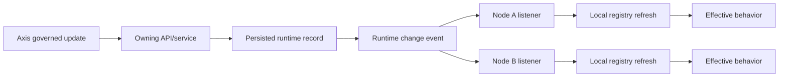

# Governed Runtime Change Capability

Governed runtime change is the Nodics capability for changing selected
application behavior while the platform is running, without asking an operator
to edit each node manually. It is important for business users because runtime
change supports faster reaction to operational needs. It is important for
developers because the change still has to respect ownership, validation,
event propagation, lifecycle state, and rollback boundaries. This page is for
beginners, administrators, developers, operators, QA owners, architects, and AI
tools that need to understand what can safely change at runtime and how that
change moves across a clustered installation.

The principle is simple: a runtime change is still a governed change. It must
have a source record, an owning capability, a validation path, a propagation
mechanism, and evidence that every affected node has refreshed the right local
state. Nodics already uses this pattern for runtime schema and router
contributions, pipeline definitions, event listeners, API key refresh, and
other behavior that is stored in local registries after startup.

## Business context

The business problem is avoiding slow and unsafe operations. In a clustered
deployment, changing a route policy, schema contribution, pipeline step, API
key, or listener on only one node creates inconsistent customer experience.
One node may accept a request that another node rejects. One node may run a
new business rule while another still uses the old one. Governed runtime
change gives Axis and backend services a controlled way to update behavior and
notify the runtime.

| Business need | Runtime-change answer |
| --- | --- |
| Change behavior without node-by-node manual work | Persist the governed record once and propagate a change event. |
| Keep customization auditable | Store source, owner, approval, actor, changed fields, and validation result. |
| Avoid uncontrolled production drift | Merge runtime records through known registries and lifecycle services. |
| Support business agility | Let approved changes become active without waiting for a full rebuild when the capability supports runtime refresh. |
| Help support teams troubleshoot | Capture runtime state, event delivery, node id, module, tenant, and validation evidence. |

## Runtime model

Nodics runtime behavior is assembled from file-based module contributions and,
where supported, persisted runtime records. `DefaultFilesLoaderService` loads
governed files from indexed modules, applies merge or replace policies, and
adds override trace metadata. Runtime registry merging records the source
module and runtime source so developers can explain why the effective behavior
looks the way it does.



Runtime schema governance supports merge and replace modes. It can remove
properties through `$override.removeProperties` and can require an explicit
breaking-change flag for risky changes. Router governance has similar
traceable behavior for route keys, methods, controllers, operations, secured
state, access groups, and removed routes. The same contract shape applies to
business-runtime records such as pipelines and event listeners: a persisted
record changes the effective in-memory registry, and event listeners refresh
or remove entries after save/update/removal.

| Runtime area | Current mechanism | What changes locally |
| --- | --- | --- |
| Schema contribution | Governed file and runtime schema registry merge | Generated model behavior, validation, collection options, and trace metadata. |
| Router contribution | Governed file and runtime router registry merge | Route availability, handler binding, security, and access groups. |
| Pipeline definition | File definitions plus persisted `PipelineModel` entries | Business flow nodes, success branches, nested pipeline calls, and error routing. |
| Event listener definition | File listeners plus persisted listener records | Local event registration, active listeners, and node-specific handling. |
| API key and configuration refresh | Domain event listeners | Local authentication or runtime configuration cache refresh. |

## Lifecycle and node safety

`DefaultRuntimeLifecycleService` owns the process lifecycle states used during
startup, readiness, degraded operation, draining, stopping, and failure. It
accepts contributors with stable order values and executes lifecycle hooks
with timeouts. Database connections and messaging clients register lifecycle
contributors so the platform can drain work and close external resources in a
controlled way.

```js
runtimeChange: {
  source: 'axis',
  owner: 'configuration',
  code: 'routerConfiguration',
  approval: 'required',
  propagation: 'event',
  rollback: 'restore-previous-version'
}
```

For operators, this means a runtime change should not be documented as only a
save operation. The documentation must say whether the change is startup-only,
runtime-refreshable, requires event propagation, requires cache invalidation,
or requires a controlled restart. If multiple nodes are running, the page must
also explain how a partial propagation failure is identified.

| Lifecycle concern | Documentation requirement |
| --- | --- |
| Startup loading | Identify file-based contributions and persisted runtime records. |
| Readiness | Explain which external clients, database connections, or registries must be ready. |
| Draining | State whether in-flight consumers, cron jobs, or pipelines must complete first. |
| Shutdown | Mention lifecycle contributor behavior when the capability owns external handles. |
| Recovery | Explain whether the next startup reloads persisted records or only file definitions. |

## Customization and extension

Developers should add runtime-customizable behavior only through an owning
capability. A project may add a new schema property, router entry, listener,
pipeline node, cache provider setting, or validation rule when the owning
service supports it. The page must identify the project-layer override path,
the runtime record type if one exists, the event that refreshes local state,
and the exact rollback action.

| Customization goal | Recommended path | Required explanation |
| --- | --- | --- |
| Add a schema property | Project-layer schema contribution or governed runtime schema record. | Merge mode, validation, collection impact, and breaking-change risk. |
| Change a route policy | Governed router contribution. | Route key, secured flag, access groups, controller operation, and propagation event. |
| Change business flow | Pipeline file or persisted pipeline model. | Start node, changed nodes, branch behavior, test scenario, and rollback. |
| Refresh local security state | Authorized API plus event listener. | Actor, affected key/configuration, nodes notified, and cache invalidation. |

## Operations and governance

Every governed runtime-change page must include an operational matrix. The
matrix helps business users understand approval impact and helps operators
avoid silent drift. A change that modifies behavior for pricing, checkout,
publication, workflow, authentication, cron responsibility, or data access is
high impact and should have explicit approval and regression evidence.

| Failure mode | Symptom | Troubleshooting step |
| --- | --- | --- |
| Event did not reach a node | Different nodes show different behavior. | Compare node id, event log, listener registration, and local registry state. |
| Breaking schema change rejected | Runtime merge warning or validation failure. | Check `$override.allowBreakingChanges` and migration readiness. |
| Route override not applied | API still uses previous handler or access policy. | Check effective router registry and override trace metadata. |
| Pipeline change stale | New branch works on one node only. | Verify persisted pipeline codes and pipeline update event handling. |
| Lifecycle drain interrupted | Consumers or connections close during active work. | Review runtime lifecycle state and contributor timeout logs. |

## Common mistakes

- Treating runtime change as a shortcut around validation.
- Updating Axis UI metadata without updating the backend-owned capability
  record.
- Forgetting that each node has local in-memory registries that must refresh.
- Documenting only the happy path and skipping rollback or partial-propagation
  checks.
- Mixing startup-only configuration with runtime-refreshable configuration.
- Hiding source ownership by using only friendly labels and no source map.
- Changing behavior that affects checkout, pricing, publication, or security
  without approval evidence.

## Verification

Verification must cover both the document and the runtime behavior. The
document must include the business problem, owning capability, source record,
flow diagram, configuration table, code example, troubleshooting matrix,
extension path, risk notes, common mistakes, and validation commands. The
implementation must prove that a saved or updated record refreshes the
effective registry and that a removed or inactive record is no longer used.

Useful focused checks include runtime override governance tests, configuration
ownership contract tests, runtime lifecycle service tests, pipeline runtime
change tests, event listener update tests, EMS message processing tests, and
documentation catalogue validation. Production-like validation should also
confirm that unauthorized users cannot trigger runtime changes, Online content
does not expose Staged records, and cluster propagation leaves every active
node with the same effective behavior.
