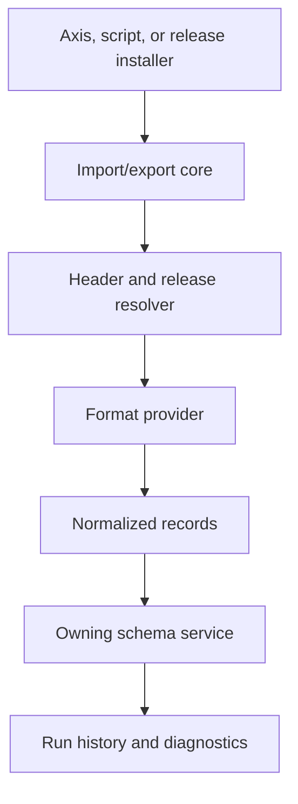

# Import and Export Provider Guides

Nodics import and export are provider-driven so developers can author data in
the format that fits the use case while business users still get one governed
operation. JavaScript object exports are preferred for module release data
because they are easy to extend record by record. JSON, CSV, and Excel remain
useful for integration, migration, reporting, and business-facing exchange.
The authority is not the file format; the authority is the target module,
schema, operation, validation, and audit trail.

## Source map

| Capability | Source location |
| --- | --- |
| Import core | `../nodics.foundation/modules/nData/nImport/import/src/service/import/` |
| Header processing | `../nodics.foundation/modules/nData/nImport/import/src/service/header/` |
| Release discovery | `../nodics.foundation/modules/nData/nImport/import/src/service/release/` |
| Import history and diagnostics | `../nodics.foundation/modules/nData/nImport/import/src/service/history/`, `../nodics.foundation/modules/nData/nImport/import/src/service/diagnostics/` |
| Media import handling | `../nodics.foundation/modules/nData/nImport/import/src/service/media/` |
| CSV import provider | `../nodics.foundation/modules/nData/nImport/csvImport/` |
| Excel import provider | `../nodics.foundation/modules/nData/nImport/excelImport/` |
| Export core | `../nodics.foundation/modules/nData/nExport/export/` |
| Export providers | `../nodics.foundation/modules/nData/nExport/csvExport/`, `../nodics.foundation/modules/nData/nExport/excelExport/`, `../nodics.foundation/modules/nData/nExport/jsExport/`, `../nodics.foundation/modules/nData/nExport/jsonExport/` |
| Provider tests | `../nodics.foundation/modules/nData/nImport/import/test/`, `../nodics.foundation/modules/nData/nExport/` |

## Provider model



For beginners, import is a controlled journey from declared source files to
backend-owned schemas. Export is the reverse journey from authorized records to
a bounded file or payload. Business users should see actions like import,
preview, validate, export, and download. Developers should see providers,
parsers, field mapping, schema names, and tests. Operators should see run
history, counts, failures, and rollback boundaries.

## JavaScript release data

JavaScript object maps are the preferred developer and AI-tool format for
module data releases:

```js
module.exports = {
  summerDress: {
    code: 'summerDress',
    tenant: 'default',
    catalogVersion: 'agoraApparelStaged',
    active: true
  }
};
```

Object maps allow customer projects to override or extend one named record
without copying an entire array. Keep files declarative. Do not call services,
read files, calculate timestamps, or branch by environment. The release folder
and generated manifest identify the release; the header identifies module,
schema, operation, data file prefix, tenants, and query.

## JSON, CSV, and Excel

| Format | Best use | Watch point |
| --- | --- | --- |
| JavaScript | Module release data and developer-maintained baselines. | No runtime logic in files. |
| JSON | API exchange, generated fixtures, and machine contracts. | Avoid large arrays that are hard to override. |
| CSV | Flat business lists, quick migration, and external feeds. | Define delimiter, headers, locale, and type conversion. |
| Excel | Business review, mapping workshops, and multi-sheet migration. | Validate sheet names, required columns, and formulas. |

All providers should normalize records before persistence so the target schema
does not care whether the source was JavaScript, JSON, CSV, or Excel. Provider
configuration should define allowed fields, required fields, masking,
duplicate handling, parser options, and maximum file size.

## Export contract

Exports must be permission-aware and privacy-aware. A business user can export
only the data allowed by role, group, permission, and lifecycle state. A
developer can add an export provider by implementing the provider contract and
registering it with the export core. Operators should verify row count, field
allow-list, masking, retention, checksum, and download audit. Generated export
files should be treated as operational artifacts, not source-of-truth data.

## Customization and extension guidance

Developers can customize import by adding provider parsers, header handlers,
validation adapters, post-import diagnostics, and migration mappers. They can
customize export by adding serializers, file writers, masking strategies, and
delivery adapters. Add tests that prove malformed input, duplicate rows,
partial failures, unauthorized fields, masked export columns, and retry
behavior. Business rules still belong to target modules and services, not the
provider parser.

## Common mistakes

- Treating CSV or Excel column names as schema authority.
- Exporting sensitive fields without a mask or permission check.
- Putting rollback logic in provider files instead of import history and
  owning services.
- Losing idempotency because a header query does not include stable keys.
- Mixing media physical file handling into normal record persistence.

## Verification

Run provider tests for JavaScript, JSON, CSV, and Excel import/export paths.
Use a fresh schema to import a release, inspect import history counts, export
the same domain with masking enabled, and compare allowed fields. Production
readiness requires friendly Axis messages, developer-visible diagnostics,
operator audit evidence, and target module validation for every imported
record.
