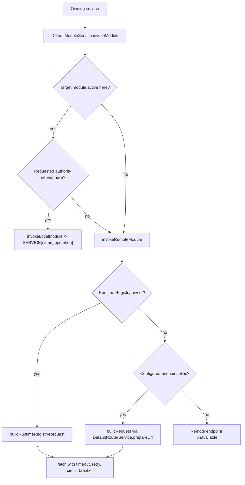

# Module-to-Module Communication

Nodics modules communicate through `DefaultModuleService` when one capability
needs data or behavior owned by another runtime. This page explains local
service invocation, remote module invocation, runtime-registry resolution,
static endpoint fallback, internal authorization headers, retries, circuit
breakers, and safe customization. It is for beginners, business users,
developers, operators, architects, QA owners, and AI tools that need to
understand how a module calls another module without stealing its authority.

The business value is clean ownership. Commerce can ask Profile for enterprise
or tenant context, BackOffice can ask WCMS or Process for setup state, and Axis
initialization can submit a release to a target runtime. The caller should not
copy another module's schema, bypass its API, or assume it owns the target
database. `DefaultModuleService.invokeModule` decides whether the target can be
called locally in the same process or remotely through an HTTP contract.

## Source map

| Runtime area | Source location | Responsibility |
| --- | --- | --- |
| Module communication service | `../nodics.foundation/modules/nService/src/service/module/defaultModuleService.js` | Builds local and remote module calls, headers, runtime-registry requests, retries, circuit breakers, and diagnostics. |
| Module endpoint configuration | `../nodics.foundation/modules/nService/src/lib/moduleConfiguration.js` | Supplies endpoint accessors consumed by router and module communication. |
| Router URL preparation | `../nodics.foundation/modules/nRouter/src/service/router/defaultRouterService.js` | Resolves configured module endpoint base URLs for static fallback. |
| Runtime registry owner resolution | `DefaultRuntimeRegistryResolverService` when available | Selects live owner endpoint and instance metadata for remote authority-aware calls. |
| Internal authentication | `NODICS.getInternalAuthToken` and authentication provider services | Supplies bearer token for internal remote module calls by tenant. |
| Transport resilience | `serviceCommunication` configuration | Controls timeout, retry, connection pool, response size, redirects, and circuit breaker behavior. |
| Contract tests | `../nodics.foundation/modules/nService/test/moduleInvocationContract.test.js` and `moduleTransportResilience.test.js` | Proves local/remote choice, registry owner path, static fallback, missing endpoints, unauthenticated opt-out, timeout, retry, and circuit breaker behavior. |

## Invocation model

For beginners, `invokeModule` is the safe doorway for calling another Nodics
module. The caller names the target module and desired operation. The service
then checks the active runtime graph and target authority.



Local invocation is an in-process service call. Remote invocation is an HTTP
call using a configured endpoint or a Runtime Registry owner endpoint. The
caller receives either the local service response, the remote response body, or
a selected piece of the response when `responseSelector` is supplied.

## Local invocation

Local invocation is used when the target module is active in the current
runtime, the caller did not set `local: false`, and the requested
`targetAuthority` matches the current runtime. The service invokes:

```js
SERVICE[options.serviceName][options.operationName](options.request)
```

Example:

```js
const reservation = await SERVICE.DefaultModuleService.invokeModule({
  moduleName: 'inventory',
  serviceName: 'DefaultInventoryService',
  operationName: 'reserve',
  request: {
    tenant: 'default',
    sku: 'SKU-1',
    quantity: 2
  }
});
```

Use local invocation when both modules are intentionally composed into one
runtime and the target behavior belongs to that runtime. Do not use it to
reach a schema that is owned by a different runtime role, such as Online
publication data from a Staged runtime.

## Remote invocation

Remote invocation is used when the target module is inactive locally, the
caller sets `local: false`, or the target authority belongs to another
runtime. Remote calls require `apiName` because the request crosses a process
boundary and must use a public or internal API contract.

```js
const enterprise = await SERVICE.DefaultModuleService.invokeModule({
  moduleName: 'profile',
  serviceName: 'DefaultEnterpriseService',
  operationName: 'get',
  apiName: '/enterprise',
  methodName: 'POST',
  request: {
    tenant: 'default',
    query: { code: 'default' }
  },
  responseSelector: response => response.result && response.result[0]
});
```

Remote invocation first asks Runtime Registry for a live owner when a resolver
is available. If Registry returns an owner endpoint, the request context is
marked as `runtime-registry` and includes owner metadata such as `instanceId`
and `runtimeRole`. If no owner is available, the service falls back to static
module endpoint configuration. If neither path exists, it fails with a clear
remote endpoint error.

## Target authority

`targetAuthority` prevents a local active module from accidentally serving a
call that was intended for another runtime role. This matters for Staged and
Online separation, Commerce operational and Commerce Staged separation, and
future clustered deployments.

```js
await SERVICE.DefaultModuleService.invokeModule({
  moduleName: 'cms',
  connectionName: 'wcmsOnline',
  targetAuthority: {
    runtimeRole: 'ONLINE'
  },
  apiName: '/sites/nexus/pages/home',
  methodName: 'GET',
  request: {
    tenant: 'default'
  }
});
```

If the current runtime role does not match the requested authority, Nodics
uses remote invocation even when the module name is active locally. This keeps
publication boundaries intact: Staged preparation does not silently read or
write Online state through local shortcuts.

## Headers and internal authentication

Remote module calls normalize headers to modern names:

| Input | Normalized output |
| --- | --- |
| `authToken` or `Authorization` | `Authorization: Bearer <token>` |
| `apiKey` or `x-api-key` | `x-api-key` |
| `entCode` or `x-enterprise-code` | `x-enterprise-code` |
| `idempotencyKey` | `Idempotency-Key` |

By default, remote module calls require an internal bearer token. The service
derives it from the tenant through `NODICS.getInternalAuthToken`. A caller may
pass its own authorization header. A public or explicitly unauthenticated
remote call must set `requireInternalAuth: false`; otherwise the absence of an
internal token is treated as a configuration problem.

```js
await SERVICE.DefaultModuleService.invokeModule({
  moduleName: 'publicCatalog',
  apiName: '/health',
  methodName: 'GET',
  request: {},
  requireInternalAuth: false
});
```

## External HTTP requests

`buildExternalRequest` exists for controlled calls to absolute external URLs.
Use it when the target is not a Nodics module endpoint, such as an approved
provider API, a discovery document, or a health endpoint managed outside the
module graph.

```js
const request = SERVICE.DefaultModuleService.buildExternalRequest({
  uri: 'https://provider.example/status',
  methodName: 'GET',
  timeoutMs: 1000,
  maxResponseBytes: 2048,
  followRedirects: false
});

const status = await SERVICE.DefaultModuleService.fetch(request);
```

External calls must be bounded. Developers should set timeout, maximum
response size, redirect policy, authentication policy, and error mapping. Do
not hide provider-specific business decisions inside `DefaultModuleService`;
provider adapters should own those decisions.

## Transport resilience and diagnostics

`DefaultModuleService` initializes shared HTTP/HTTPS agents, retry state,
circuit state, and diagnostics. The `serviceCommunication` configuration
controls connection pooling, timeout, retry attempts, retryable statuses,
retryable error codes, jitter, and circuit breaker behavior.

Retries are safe only for `GET`, `HEAD`, `OPTIONS`, or calls with an
`Idempotency-Key`. Mutating calls without idempotency evidence are attempted
once. Circuit breaker failures are partitioned by target module or origin, so
one failing remote owner does not need to block unrelated modules.

Operators can use sanitized transport diagnostics to understand request
counts, successes, failures, timeouts, retries, circuit rejections, average
latency, and the last local/remote resolution decision. Diagnostics must not
include secrets, raw payloads, or private response bodies.

## Customization and extension

Developers may customize module communication, but the contract must remain
stable.

| Need | Recommended extension | Avoid |
| --- | --- | --- |
| Change endpoint discovery | Add or override Runtime Registry resolver or module endpoint configuration. | Hardcoding URLs inside business services. |
| Add provider-specific auth | Implement the provider adapter and pass bounded headers into `buildExternalRequest`. | Teaching `DefaultModuleService` every provider's business rules. |
| Tighten timeout or response size | Override `serviceCommunication` configuration by environment or server. | Relying on default timeouts for production integrations. |
| Force remote ownership | Supply `targetAuthority` and `connectionName`. | Calling a local active module when Online or Staged ownership matters. |
| Customize fetch implementation | Override `DefaultModuleService` in a project layer while preserving `buildRequest`, `buildExternalRequest`, `invokeModule`, and `fetch`. | Changing response shape or error disclosure for one caller only. |
| Handle remote response shape | Use `responseSelector` near the calling service. | Making downstream controllers know remote response envelopes. |

Business logic remains in the owning module. If Commerce needs Profile data,
Commerce asks Profile through the module service. Commerce should not copy
Profile schemas or read Profile collections directly. If Axis needs setup
state, Axis consumes BackOffice contracts; it does not call local files or
invent module readiness.

## Developer examples

BackOffice checking a remote runtime should build an external request with
small limits:

```js
const request = SERVICE.DefaultModuleService.buildExternalRequest({
  uri: registration.healthUrl,
  methodName: 'GET',
  timeoutMs: 50,
  maxResponseBytes: 2048,
  followRedirects: false,
  header: {
    Authorization: 'Bearer ' + internalToken
  }
});

return SERVICE.DefaultModuleService.fetch(request);
```

Application initialization targeting another runtime should use
`targetAuthority` so Staged, Online, and operational roles do not collapse:

```js
return SERVICE.DefaultModuleService.invokeModule({
  moduleName: profile.target.moduleName,
  connectionName: profile.target.connectionName,
  targetAuthority: profile.target.authority,
  apiName: profile.target.apiName,
  methodName: 'POST',
  request: {
    tenant: request.tenant,
    profileCode: profile.code,
    releases: plannedReleases
  },
  idempotencyKey: request.requestId
});
```

The caller owns orchestration, idempotency, and response interpretation. The
target module owns validation, persistence, lifecycle transition, and audit.

## Operator troubleshooting

| Symptom | Likely layer | First check |
| --- | --- | --- |
| Local service unavailable | Local invocation | Confirm target module is active and `serviceName.operationName` exists in `SERVICE`. |
| Remote endpoint unavailable | Endpoint discovery | Check Runtime Registry owner, static module endpoint alias, `connectionName`, and runtime availability. |
| Internal service token unavailable | Authentication | Confirm tenant, internal token bootstrap, and whether the call is intentionally unauthenticated. |
| Remote call times out | Transport | Check target health, timeout config, retry policy, and circuit state. |
| Mutating remote call was not retried | Idempotency policy | Add an `Idempotency-Key` only when the target operation is safe to retry. |
| Wrong runtime handled the call | Authority resolution | Check `targetAuthority`, current `runtimeRole`, Registry owner metadata, and static fallback connection. |
| Error leaks too much detail | Error sanitization | Check `NodicsError.cleanContext`, response handler, and caller-facing message mapping. |

## Common mistakes

- Calling another module's generated service directly when the target is owned
  by another runtime.
- Using local invocation for Online data from a Staged or operational runtime.
- Hardcoding localhost URLs in framework or customer business services.
- Omitting `apiName` for remote invocation.
- Sending remote mutation requests without idempotency evidence and expecting
  automatic retries.
- Setting `requireInternalAuth: false` on a private internal module call.
- Copying another module's data into the caller to avoid using the module
  service contract.
- Logging authorization headers, request bodies, or remote private responses
  in diagnostics.

## Verification

Module communication changes require local and remote tests. At minimum,
verify local active invocation, missing local service error, remote static
fallback, Runtime Registry owner selection, `targetAuthority` forcing remote
calls, internal authorization header creation, explicit unauthenticated call,
missing endpoint error, timeout, retry, circuit breaker, response size limit,
redirect policy, response selector behavior, and sanitized error context.

Existing starting points are
`nService/test/moduleInvocationContract.test.js`,
`nService/test/moduleTransportResilience.test.js`,
`nService/test/moduleRequestHeaderNormalization.test.js`,
and feature tests in BackOffice, Axis initialization, Profile enterprise
resolution, and application setup. After documentation changes, regenerate and
validate the framework documentation pack:

```bash
npm --prefix nodics.docs run docs:generate
npm --prefix nodics.docs run docs:check
npm --prefix nodics.docs run validate
```

For production-like evidence, run two runtimes where the target module is not
local to the caller, confirm Runtime Registry or static endpoint selection,
inspect transport diagnostics, and prove the caller still receives a stable
business response while the target module remains the data and behavior
authority.
