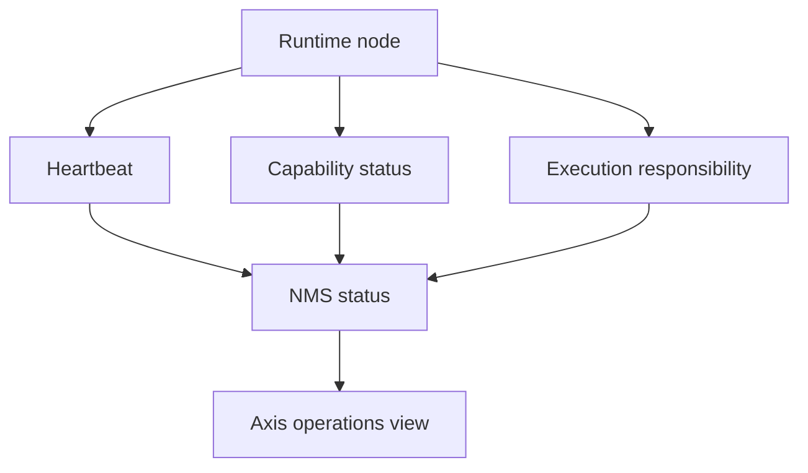

# NMS Runtime Monitoring

NMS runtime monitoring gives Nodics a source-backed view of nodes, runtime
state, health checks, topology, and recovery evidence. Axis may display this
information, but the monitoring capability owns the data collection and
status contract. For beginners, NMS answers three questions: which nodes are
running, what are they responsible for, and what needs operator attention.

## Source map

| Area | Source location |
| --- | --- |
| NMS module | `../nodics.foundation/modules/nNms/package.json` |
| Runtime configuration | `docs/pages/nodics.foundation/runtime-configuration.md` |
| DevOps runtime | `docs/pages/framework/devops-runtime.md` |
| Local verification | `docs/pages/framework/local-verification-checklist.md` |
| Process runtime evidence | `docs/pages/nodics.process/runtime-lifecycle.md` |

## Monitoring model

The business problem is operational trust. A business administrator does not
need raw process logs, but they need to know whether setup, imports,
publishing, scheduled jobs, and storefront delivery are healthy. Developers
need a contract for contributing health checks. Operators need correlation
ids, node ids, runtime roles, last heartbeat, dependency state, and recovery
actions for production incidents.

## Health contract

| Signal | Meaning | Consumer |
| --- | --- | --- |
| Node identity | Which runtime is reporting. | Operator and registry. |
| Runtime role | Commerce, CMS Staged, CMS Online, Process, or other role. | Axis and support. |
| Heartbeat | Last known liveness. | Monitoring dashboard. |
| Capability health | Whether module checks pass. | Business setup pages. |
| Responsibility | Which node owns scheduled work. | Process operations. |
| Recovery hint | Suggested safe action. | Operator runbook. |

## Customization and extension guidance

Developers can add health contributors for new modules, dependency checks,
queue checks, provider checks, and publication target checks. Health checks
should be bounded and safe to call repeatedly. Business users should see
simple statuses such as online, degraded, blocked, or needs attention.
Operators should have detail panels for technical evidence.

## Implementation handoff

A monitoring contribution should declare what it checks, how often it can be
called, which runtime role owns it, what status values mean, and what recovery
action is safe. The handoff should also identify the business journey affected
by the signal. A failed CMS Online check, for example, affects public content
delivery differently from a failed Process node that only affects scheduled
automation.

Production readiness should include both healthy and degraded snapshots. A
node that is alive but missing a required dependency should not be shown as
fully online. A node that lost scheduled-job responsibility should surface the
handoff state so operators know whether another node has accepted the work.
Metrics should include enough history to distinguish a startup delay from a
real outage.

## Common mistakes

- Treating a running process as proof that every capability is healthy.
- Showing raw dependency exceptions to business users.
- Adding expensive health checks that harm production traffic.
- Hiding node responsibility for scheduled jobs.
- Failing to carry correlation ids through setup or publication errors.

## Verification

Start a fresh local topology, inspect NMS status for each runtime, stop or
break one dependency, and confirm Axis shows a safe degraded state with
operator evidence. Run module health tests and browser checks for setup pages
that consume monitoring state before production release.
