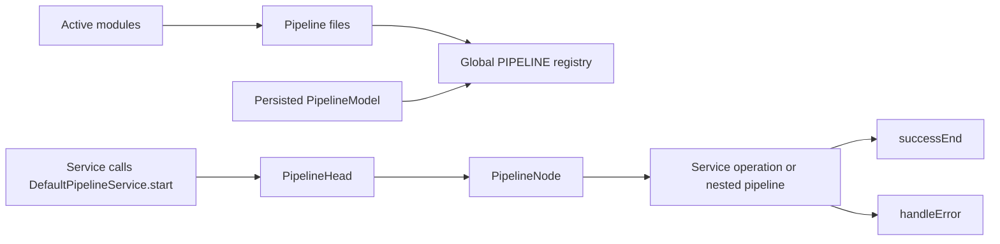

# Pipeline and Business Logic Orchestration

Pipelines are the main Nodics mechanism for composing business logic without
hiding decisions inside controllers or copying rules across services. A
pipeline is a named runtime flow made of ordered nodes. Each node calls a
service operation or another pipeline, then chooses the next success or error
path. This page is for beginners, business users, developers, the operator
role, QA owners, architects, and AI tools that need to understand how a Nodics
behavior is assembled and where project-specific customization belongs.

For business users, pipelines make complex work auditable: cart calculation,
checkout placement, schema persistence, import, cron execution, workflow
transitions, request processing, and event handling can be explained as visible
steps rather than hidden code. For developers, pipelines are the extension
point that keeps business behavior modular. A project can add validation,
enrichment, decisioning, routing, or recovery steps while preserving the
owning module contract.

## Business context

The practical business problem is change control. Enterprises need to change a
rule such as "calculate price, then promotion, then tax" or "validate data,
save, invalidate cache, publish event" without rewriting the entire API stack.
Pipelines give business teams a language for the journey and give developers a
deterministic execution model.

| Business need | Pipeline answer |
| --- | --- |
| Explain what happens during a request | Show the named pipeline, ordered nodes, decision branches, and final terminal. |
| Customize a project rule | Add or override a pipeline definition in a later project module. |
| Support governed runtime behavior | Merge persisted pipeline models when available and refresh them through events. |
| Troubleshoot a failed journey | Error metadata records pipeline name, execution id, node, handler, tenant, module, schema, event, search, or import context. |

## Runtime model

`DefaultPipelineService` loads effective pipeline definitions from every active
module by reading `/src/pipelines/pipelines.js` and the compatibility name
`/src/pipelines/pipelinesDefinition.js`. It stores the result in the global
`PIPELINE` registry. When a persisted `PipelineModel` is available, persisted
definitions are merged on top of file definitions for the default tenant.



`PipelineHead` builds executable `PipelineNode` instances from the definition,
starts at `startNode`, prepares success transitions, supports `targetNode`
branching, calls service handlers as `SERVICE[ServiceName][operation]`, and
can execute nested pipelines when a node type is not `function`. A successful
pipeline resolves through `DefaultPipelineService.handleSucessEnd`. A failed
pipeline enriches the error and rejects through `handleErrorEnd`.

| Source area | Purpose | Runtime effect |
| --- | --- | --- |
| `nPipeline/src/pipelines/pipelines.js` | Defines `defaultPipeline` terminal nodes. | Adds `successEnd` and `handleError` to concrete flows. |
| `DefaultPipelineService.loadPipelines` | Loads file and persisted definitions. | Builds the effective registry. |
| `PipelineHead.prepareNextNode` | Reads success transitions. | Moves to the next node or routes to error handling. |
| `PipelineHead.buildErrorContext` | Enriches errors from request shape. | Adds database, search, event, import, tenant, module, and handler context. |
| `DefaultPipelineChangeListenerService` | Handles runtime pipeline events. | Updates or removes registry entries without restarting every caller. |

## Data and configuration detail

Pipeline definitions are JavaScript objects contributed by modules. The
minimum concrete pipeline defines `startNode` and `nodes`. A node must define a
handler; it may define `type`, `success`, `error`, and target routing. The
default node type is `function`.

```js
module.exports = {
  commerceCartCalculationPipeline: {
    startNode: 'validateContext',
    nodes: {
      validateContext: {
        handler: 'DefaultCartCalculationPipelineService.validateContext',
        success: 'resolvePrice'
      },
      resolvePrice: {
        handler: 'DefaultCartCalculationPipelineService.resolvePrice',
        success: {
          default: 'applyPromotions',
          skipPromotions: 'calculateTax'
        }
      },
      applyPromotions: {
        handler: 'DefaultCartCalculationPipelineService.applyPromotions',
        success: 'calculateTax'
      },
      calculateTax: {
        handler: 'DefaultCartCalculationPipelineService.calculateTax',
        success: 'successEnd',
        error: 'handleError'
      }
    }
  }
};
```

| Configuration or record | Meaning | Update behavior |
| --- | --- | --- |
| File pipeline definition | Baseline module or project flow. | Loaded during startup in indexed module order. |
| Persisted `PipelineModel` | Runtime-managed pipeline override. | Merged into `PIPELINE` when the model service exists. |
| `pipelineSave` and `pipelineUpdated` events | Create or update runtime definitions. | Fetches changed codes and merges active definitions. |
| Runtime removal event | Removes inactive or deleted definitions. | Deletes matching registry entries. |

## Customization and extension

Developers should extend the owning capability pipeline, not the controller.
For example, a project-specific checkout module can add a validation node
before order placement or replace a calculation branch. The handler should live
in the project module service layer, and the pipeline contribution should live
under the project module's pipeline file so it participates in normal module
layering.

| Customization goal | Recommended path | Avoid |
| --- | --- | --- |
| Add a validation rule | Add a node before the owner decision node. | Editing generated controllers. |
| Change a business branch | Use `success` target mapping and set `response.targetNode`. | Duplicating the full flow in an unrelated module. |
| Reuse common logic | Call a nested pipeline from a node. | Copying handler code between modules. |
| Change behavior at runtime | Use persisted pipeline records plus governed events. | Editing local files on each node manually. |

## Operations and governance

The operator role should treat pipeline changes as behavior changes. They can
affect pricing, order placement, publication, import, scheduled automation, or
event processing. A pipeline change needs source evidence, permission,
validation, and rollback guidance. Runtime changes must be propagated to every
node that uses the pipeline registry before the production journey is treated
as consistent.

| Failure mode | Symptom | Troubleshooting step |
| --- | --- | --- |
| Missing pipeline name | `ERR_PIPE_00000` during `start`. | Confirm the pipeline exists in the effective `PIPELINE` registry. |
| Broken success link | Error says the pipeline link is broken. | Check `success` and `targetNode` values against node names. |
| Missing service handler | Error includes `SERVICE.<service>.<operation>`. | Confirm the service is loaded and the operation is exported. |
| Stale runtime definition | One node behaves differently after an update. | Verify pipeline update events reached all target nodes. |

## Common mistakes

- Putting business orchestration in controllers instead of pipeline nodes.
- Replacing a whole pipeline when a smaller node override is enough.
- Forgetting that `defaultPipeline` terminal nodes are merged into concrete
  pipelines.
- Returning a target branch name without configuring the matching success map.
- Treating persisted runtime pipeline changes as casual edits without audit and
  rollback.
- Hiding a failed nested pipeline by continuing when the owning behavior should
  stop.

## Verification

Run pipeline-focused tests whenever pipeline definitions, handlers, runtime
update behavior, or error context changes. At minimum verify successful flow,
invalid pipeline name, broken link, handler error, nested pipeline behavior,
target branching, persisted model merge, runtime update event, runtime removal
event, and error enrichment.

Useful evidence comes from `nPipeline` service tests, the request-pipeline
tests in `nRouter`, database model initializer pipeline tests, cron lifecycle
pipeline tests, and commerce cart calculation tests. Also regenerate and
validate the documentation content pack so the pipeline page remains available
through the governed documentation catalogue.
