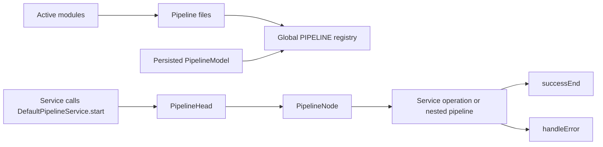
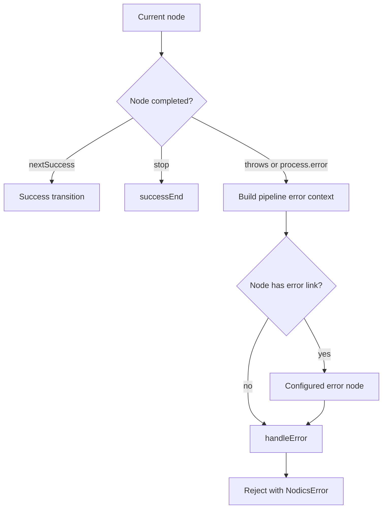

# Pipeline and Business Logic Orchestration

Pipelines are the main Nodics mechanism for composing business logic without
hiding decisions inside controllers or copying rules across services. A
pipeline is a named runtime flow made of ordered nodes. Each node calls a
service operation or another pipeline, then chooses the next success or error
path. This page is for beginners, business users, developers, the operator
role, QA owners, architects, and AI tools that need to understand how a Nodics
behavior is assembled and where project-specific customization belongs.

For business users, pipelines make complex work auditable: cart calculation,
checkout placement, schema persistence, import, cron execution, workflow
transitions, request processing, and event handling can be explained as visible
steps rather than hidden code. For developers, pipelines are the extension
point that keeps business behavior modular. A project can add validation,
enrichment, decisioning, routing, or recovery steps while preserving the
owning module contract.

This page explains the generic pipeline execution model. The HTTP entry
pipeline has its own developer guide, `API Request Lifecycle and Handler
Pipeline`, because request parsing, route exposure, authentication branching,
cache lookup, controller dispatch, response handlers, and safe HTTP
customization need to be understood as one end-to-end flow.

Use `Workflow Orchestration Patterns` when the business journey needs durable
state, human tasks, approval, retry, compensation, target-specific export
branches, or operator recovery. A product export can use pipelines inside
domain adapters, but the long-running approval and multi-target lifecycle
belongs to workflow.

## Business context

The practical business problem is change control. Enterprises need to change a
rule such as "calculate price, then promotion, then tax" or "validate data,
save, invalidate cache, publish event" without rewriting the entire API stack.
Pipelines give business teams a language for the journey and give developers a
deterministic execution model.

| Business need | Pipeline answer |
| --- | --- |
| Explain what happens during a request | Show the named pipeline, ordered nodes, decision branches, and final terminal. |
| Customize a project rule | Add or override a pipeline definition in a later project module. |
| Support governed runtime behavior | Merge persisted pipeline models when available and refresh them through events. |
| Troubleshoot a failed journey | Error metadata records pipeline name, execution id, node, handler, tenant, module, schema, event, search, or import context. |

## Runtime model

`DefaultPipelineService` loads effective pipeline definitions from every active
module by reading `/src/pipelines/pipelines.js` and the compatibility name
`/src/pipelines/pipelinesDefinition.js`. It stores the result in the global
`PIPELINE` registry. When a persisted `PipelineModel` is available, persisted
definitions are merged on top of file definitions for the default tenant.



`PipelineHead` builds executable `PipelineNode` instances from the definition,
starts at `startNode`, prepares success transitions, supports `targetNode`
branching, calls service handlers as `SERVICE[ServiceName][operation]`, and
can execute nested pipelines when a node type is not `function`. A successful
pipeline resolves through `DefaultPipelineService.handleSucessEnd`. A failed
pipeline enriches the error and rejects through `handleErrorEnd`.

| Source area | Purpose | Runtime effect |
| --- | --- | --- |
| `nPipeline/src/pipelines/pipelines.js` | Defines `defaultPipeline` terminal nodes. | Adds `successEnd` and `handleError` to concrete flows. |
| `DefaultPipelineService.loadPipelines` | Loads file and persisted definitions. | Builds the effective registry. |
| `PipelineHead.prepareNextNode` | Reads success transitions. | Moves to the next node or routes to error handling. |
| `PipelineHead.buildErrorContext` | Enriches errors from request shape. | Adds database, search, event, import, tenant, module, and handler context. |
| `DefaultPipelineChangeListenerService` | Handles runtime pipeline events. | Updates or removes registry entries without restarting every caller. |

## Pipeline lifecycle

Every pipeline run follows the same lifecycle, whether it is started by an API
request, import process, cron job, event listener, checkout flow, or a custom
project service.

| Step | Runtime action | Developer meaning |
| --- | --- | --- |
| 1. Startup discovery | Active modules contribute pipeline files into the effective registry. | Put baseline definitions in the owning module or in the project module that intentionally overrides the behavior. |
| 2. Persisted merge | Persisted `PipelineModel` records are merged when the model service is available. | Runtime-managed changes are overlays, not a second hidden framework. |
| 3. Registry ready | The named definition becomes available as `PIPELINE[pipelineName]`. | A caller can only start a concrete pipeline name, never `defaultPipeline`. |
| 4. Caller starts | A service calls `DefaultPipelineService.start(name, request, response)`. | Pass all business inputs through `request`; use `response` as the execution accumulator. |
| 5. Definition build | `defaultPipeline` terminal nodes are merged into the concrete definition. | Every concrete flow inherits `successEnd` and `handleError`. |
| 6. Node execution | `PipelineHead` executes the current node as a service function or nested pipeline. | A node handler owns one small piece of behavior. |
| 7. Transition | The node calls `process.nextSuccess`, `process.stop`, or `process.error`. | The handler must explicitly choose the next lifecycle move. |
| 8. Branching | A string `success` link goes directly to one node; an object `success` map uses `response.targetNode`. | Use branching when the same decision node can choose multiple valid routes. |
| 9. Success terminal | `successEnd` resolves the promise with `response.success`. | The caller receives the normalized success payload. |
| 10. Error terminal | Errors are enriched and routed to node-level error handling or the global `handleError`. | The caller receives a contextual Nodics error, not a raw exception. |
| 11. Runtime refresh | Pipeline update and removal events mutate the global registry. | Changes can be propagated without rewriting the caller. |

The lifecycle has one important design rule: pipeline definitions describe
orchestration, not business logic. Business logic belongs in services. The
pipeline should say "validate product", "resolve media", "save model", or
"publish event"; the handler service should contain the actual rule.

## Data and configuration detail

Pipeline definitions are JavaScript objects contributed by modules. The
minimum concrete pipeline defines `startNode` and `nodes`. A node must define a
handler; it may define `type`, `success`, `error`, and target routing. The
default node type is `function`.

```js
module.exports = {
  commerceCartCalculationPipeline: {
    startNode: 'validateContext',
    nodes: {
      validateContext: {
        handler: 'DefaultCartCalculationPipelineService.validateContext',
        success: 'resolvePrice'
      },
      resolvePrice: {
        handler: 'DefaultCartCalculationPipelineService.resolvePrice',
        success: {
          default: 'applyPromotions',
          skipPromotions: 'calculateTax'
        }
      },
      applyPromotions: {
        handler: 'DefaultCartCalculationPipelineService.applyPromotions',
        success: 'calculateTax'
      },
      calculateTax: {
        handler: 'DefaultCartCalculationPipelineService.calculateTax',
        success: 'successEnd',
        error: 'handleError'
      }
    }
  }
};
```

| Configuration or record | Meaning | Update behavior |
| --- | --- | --- |
| File pipeline definition | Baseline module or project flow. | Loaded during startup in indexed module order. |
| Persisted `PipelineModel` | Runtime-managed pipeline override. | Merged into `PIPELINE` when the model service exists. |
| `pipelineSave` and `pipelineUpdated` events | Create or update runtime definitions. | Fetches changed codes and merges active definitions. |
| Runtime removal event | Removes inactive or deleted definitions. | Deletes matching registry entries. |

## Author a pipeline

Create the definition in the module that owns the behavior, normally under
`modules/<module>/src/pipelines/pipelines.js`. A project module may contribute
the same pipeline name only when it intentionally customizes the owner flow.

```js
module.exports = {
  productImportValidationPipeline: {
    startNode: 'validateRequiredFields',
    nodes: {
      validateRequiredFields: {
        handler: 'DefaultProductImportPipelineService.validateRequiredFields',
        success: 'resolveCatalog'
      },
      resolveCatalog: {
        handler: 'DefaultProductImportPipelineService.resolveCatalog',
        success: {
          default: 'validatePrice',
          skipPrice: 'validateMedia'
        },
        error: 'markRecordRejected'
      },
      validatePrice: {
        handler: 'DefaultProductImportPipelineService.validatePrice',
        success: 'validateMedia'
      },
      validateMedia: {
        handler: 'DefaultProductImportPipelineService.validateMedia',
        success: 'successEnd'
      },
      markRecordRejected: {
        handler: 'DefaultProductImportPipelineService.markRecordRejected',
        success: 'handleError'
      }
    }
  }
};
```

Use names that describe the business step, not the implementation detail. A
good node name is `validateMedia`; a weak node name is `step3` or
`callService`. This keeps Axis diagnostics, logs, and developer support easier
to understand.

## Call a pipeline

A pipeline is started from a service, controller, cron job, event listener, or
another runtime component by calling `DefaultPipelineService.start`.

```js
const result = await SERVICE.DefaultPipelineService.start(
  'productImportValidationPipeline',
  {
    tenant: 'default',
    moduleName: 'product',
    importRun: {
      runId: request.importRun.runId
    },
    header: {
      options: {
        owningModule: 'agora.apparel',
        moduleName: 'product',
        schemaName: 'product',
        operation: 'saveAll'
      }
    },
    product: request.product
  },
  {}
);
```

| Argument | Purpose | Guidance |
| --- | --- | --- |
| `name` | The concrete pipeline key in `PIPELINE`. | Must be a non-empty string and cannot be `defaultPipeline`. |
| `request` | Readable execution input. | Put tenant, auth data, module context, schema context, import metadata, event data, and business input here. |
| `response` | Mutable execution accumulator. | Put outputs, intermediate values, target branches, success payloads, and collected errors here. |

`start` returns a promise. The promise resolves with `response.success` when
the flow reaches `successEnd`. The promise rejects with an enriched
`NodicsError` when the flow reaches `handleError` or fails before it can be
constructed.

Use `Error Handling and Status Codes` for the companion contract: which
`ERR_*` or `SUC_*` code the node should emit, how that code maps to HTTP
status, what message is safe for API callers, and what context belongs only in
logs or administrator evidence.

## Pass data through a pipeline

Nodics pipelines pass data through two plain objects.

| Object | What belongs here | What should not belong here |
| --- | --- | --- |
| `request` | Stable inputs needed by all nodes: tenant, auth data, module name, payload, schema model, search model, event, import header, file name. | Hidden mutable flags that change control flow after a handler has already run. |
| `response` | Outputs produced during the flow: resolved model, calculated totals, uploaded media path, branch choice, success payload, collected error. | Global process state or values that other concurrent executions could overwrite. |

Use explicit names in both objects. For example, prefer
`request.product`, `response.resolvedCatalog`, and
`response.preparedMediaObject` over generic fields such as `data`, `tmp`, or
`value`.

```js
module.exports = {
  validateRequiredFields: function (request, response, process) {
    if (!request.product || !request.product.code) {
      process.error(request, response, {
        code: 'ERR_PRODUCT_IMPORT_00001',
        message: 'Product code is required before product import can continue'
      });
      return;
    }
    process.nextSuccess(request, response);
  },

  resolveCatalog: function (request, response, process) {
    response.resolvedCatalog = {
      code: request.product.catalogCode,
      tenant: request.tenant
    };
    response.targetNode = request.product.skipPrice === true ? 'skipPrice' : 'default';
    process.nextSuccess(request, response);
  },

  complete: function (request, response, process) {
    process.stop(request, response, {
      productCode: request.product.code,
      catalogCode: response.resolvedCatalog.code
    });
  }
};
```

## Node handler contract

Each function node handler receives exactly three values:

```js
function nodeHandler(request, response, process) {
  // Read from request, write to response, then choose the next lifecycle move.
}
```

| Method | Meaning | When to call |
| --- | --- | --- |
| `process.nextSuccess(request, response)` | Continue through the configured success transition. | The node completed and the next normal node should run. |
| `process.stop(request, response, success)` | Stop normal processing and resolve through `successEnd`. | The node has enough information to finish the pipeline early. |
| `process.error(request, response, error)` | Enrich the error and route to configured error handling. | The node cannot safely continue. |

A handler should call one of these methods once. Calling more than one creates
unclear execution semantics. For asynchronous work, call the method inside the
promise or callback completion path.

```js
module.exports = {
  validateMedia: function (request, response, process) {
    SERVICE.DefaultMediaService.prepareImportMedia(request)
      .then(success => {
        response.preparedMediaObject = success.result;
        process.nextSuccess(request, response);
      })
      .catch(error => {
        process.error(request, response, error);
      });
  }
};
```

## Add, remove, or reorder nodes

To add a node, insert the node definition and point the previous success link
to it.

```js
module.exports = {
  productImportValidationPipeline: {
    startNode: 'validateRequiredFields',
    nodes: {
      validateRequiredFields: {
        handler: 'DefaultProductImportPipelineService.validateRequiredFields',
        success: 'validateDuplicateCode'
      },
      validateDuplicateCode: {
        handler: 'DefaultProductImportPipelineService.validateDuplicateCode',
        success: 'resolveCatalog'
      },
      resolveCatalog: {
        handler: 'DefaultProductImportPipelineService.resolveCatalog',
        success: 'successEnd'
      }
    }
  }
};
```

To remove a node, delete the node definition and reconnect the previous node to
the next valid node.

```js
module.exports = {
  productImportValidationPipeline: {
    startNode: 'validateRequiredFields',
    nodes: {
      validateRequiredFields: {
        handler: 'DefaultProductImportPipelineService.validateRequiredFields',
        success: 'resolveCatalog'
      },
      resolveCatalog: {
        handler: 'DefaultProductImportPipelineService.resolveCatalog',
        success: 'successEnd'
      }
    }
  }
};
```

When reordering nodes, check both normal `success` links and node-level
`error` links. Broken node names are detected at runtime as pipeline link
errors and should be covered by tests before release.

## Branching and target nodes

A node can define a `success` map instead of a single string. In that case the
handler chooses the branch by setting `response.targetNode`. If no target is
set, Nodics uses the `default` branch.

```js
module.exports = {
  checkoutDecisionPipeline: {
    startNode: 'evaluateCart',
    nodes: {
      evaluateCart: {
        handler: 'DefaultCheckoutPipelineService.evaluateCart',
        success: {
          default: 'placeOrder',
          requiresApproval: 'requestApproval',
          rejected: 'rejectCart'
        }
      },
      placeOrder: {
        handler: 'DefaultCheckoutPipelineService.placeOrder',
        success: 'successEnd'
      },
      requestApproval: {
        handler: 'DefaultCheckoutPipelineService.requestApproval',
        success: 'successEnd'
      },
      rejectCart: {
        handler: 'DefaultCheckoutPipelineService.rejectCart',
        success: 'handleError'
      }
    }
  }
};
```

```js
module.exports = {
  evaluateCart: function (request, response, process) {
    if (request.cart.blocked === true) {
      response.targetNode = 'rejected';
    } else if (request.cart.total > request.cart.approvalLimit) {
      response.targetNode = 'requiresApproval';
    }
    process.nextSuccess(request, response);
  }
};
```

Use `response.targetNode` only for routing. Store the business reason in a
separate field such as `response.approvalReason` so downstream nodes and logs
can explain the decision without depending on the branch key.

## Nested pipelines

When a node type is not `function`, `PipelineHead` treats the handler as the
name of another pipeline and starts it through `DefaultPipelineService.start`.

```js
module.exports = {
  fullProductImportPipeline: {
    hardStop: true,
    startNode: 'validateProduct',
    nodes: {
      validateProduct: {
        type: 'pipeline',
        handler: 'productImportValidationPipeline',
        success: 'saveProduct'
      },
      saveProduct: {
        handler: 'DefaultProductImportPipelineService.saveProduct',
        success: 'successEnd'
      }
    }
  }
};
```

The nested pipeline receives the same `request` and `response` references. On
success, its result is merged into `response.success`. On failure, the error is
added to `response.error`. If the parent pipeline sets `hardStop: true`, a
nested failure routes to error handling immediately. If `hardStop` is false,
the parent can continue through the normal success path after collecting the
nested error.

## Error lifecycle

Errors can begin in several places: an invalid pipeline name, a missing node
handler, a thrown service exception, a broken success link, a handler calling
`process.error`, or a nested pipeline rejection.



`PipelineHead.buildErrorContext` enriches the error from the request shape.
When available, the error includes pipeline name, execution id, node name,
handler, tenant, module, schema, model, collection, search index, event
metadata, import run id, data header options, and source file name. This is why
import and publication pipelines should pass proper `request.header`,
`request.importRun`, and `request.fileName` values.

| Failure | Runtime behavior | Developer fix |
| --- | --- | --- |
| Invalid pipeline name | `DefaultPipelineService.start` rejects with `ERR_PIPE_00000`. | Register the pipeline in an active module and call the exact key. |
| Missing node handler | `PipelineNode` throws during build. | Add `handler: 'Service.operation'` or a nested pipeline handler. |
| Missing service operation | `PipelineHead.next` catches the function call failure. | Ensure the service is loaded and the operation is exported. |
| Broken success link | `prepareNextNode` routes to error handling. | Update the `success` value to a valid node name or terminal. |
| Unknown branch | `nextSuccess` routes to error handling. | Ensure `response.targetNode` matches a key in the success map. |
| Handler validation failure | Handler calls `process.error`. | Return a business-safe error code and message with useful metadata. |
| Nested pipeline failure | Error is appended to `response.error`; `hardStop` decides whether to continue. | Use `hardStop: true` for mandatory subflows. |

## Customization and extension

Developers should extend the owning capability pipeline, not the controller.
For example, a project-specific checkout module can add a validation node
before order placement or replace a calculation branch. The handler should live
in the project module service layer, and the pipeline contribution should live
under the project module's pipeline file so it participates in normal module
layering.

| Customization goal | Recommended path | Avoid |
| --- | --- | --- |
| Add a validation rule | Add a node before the owner decision node. | Editing generated controllers. |
| Change a business branch | Use `success` target mapping and set `response.targetNode`. | Duplicating the full flow in an unrelated module. |
| Reuse common logic | Call a nested pipeline from a node. | Copying handler code between modules. |
| Change behavior at runtime | Use persisted pipeline records plus governed events. | Editing local files on each node manually. |

## Related developer guides

| Topic | When to use it |
| --- | --- |
| `API Request Lifecycle and Handler Pipeline` | Customize HTTP request processing before a controller receives the request. |
| `Routing and API Governance` | Decide route ownership, security, generated CRUD exposure, and controller binding. |
| `Workflow Orchestration Patterns` | Model long-running approval, export, retry, and multi-target business flows. |
| `Module-to-Module Communication` | Call another module from a pipeline or service without crossing ownership boundaries incorrectly. |

## Operations and governance

The operator role should treat pipeline changes as behavior changes. They can
affect pricing, order placement, publication, import, scheduled automation, or
event processing. A pipeline change needs source evidence, permission,
validation, and rollback guidance. Runtime changes must be propagated to every
node that uses the pipeline registry before the production journey is treated
as consistent.

| Failure mode | Symptom | Troubleshooting step |
| --- | --- | --- |
| Missing pipeline name | `ERR_PIPE_00000` during `start`. | Confirm the pipeline exists in the effective `PIPELINE` registry. |
| Broken success link | Error says the pipeline link is broken. | Check `success` and `targetNode` values against node names. |
| Missing service handler | Error includes `SERVICE.<service>.<operation>`. | Confirm the service is loaded and the operation is exported. |
| Stale runtime definition | One node behaves differently after an update. | Verify pipeline update events reached all target nodes. |

## Common mistakes

- Putting business orchestration in controllers instead of pipeline nodes.
- Putting business rules directly inside the pipeline definition instead of a
  service handler.
- Calling `process.nextSuccess`, `process.stop`, or `process.error` more than
  once from the same handler path.
- Replacing a whole pipeline when a smaller node override is enough.
- Forgetting that `defaultPipeline` terminal nodes are merged into concrete
  pipelines.
- Returning a target branch name without configuring the matching success map.
- Mutating global objects to pass data between nodes instead of using
  `request` and `response`.
- Continuing after a mandatory nested pipeline failure when `hardStop` should
  be enabled.
- Treating persisted runtime pipeline changes as casual edits without audit and
  rollback.
- Hiding a failed nested pipeline by continuing when the owning behavior should
  stop.

## Verification

Run pipeline-focused tests whenever pipeline definitions, handlers, runtime
update behavior, or error context changes. At minimum verify successful flow,
invalid pipeline name, broken link, handler error, nested pipeline behavior,
target branching, persisted model merge, runtime update event, runtime removal
event, data passed through `request` and `response`, `process.stop` behavior,
and error enrichment.

Useful evidence comes from `nPipeline` service tests, the request-pipeline
tests in `nRouter`, database model initializer pipeline tests, cron lifecycle
pipeline tests, and commerce cart calculation tests. Also regenerate and
validate the documentation content pack so the pipeline page remains available
through the governed documentation catalogue.
