# Provider and Data Access Layer

The provider and data access layer is the Nodics contract that lets business
capabilities work with models, repositories, schemas, tenants, and databases
without coupling every service to one database implementation. MongoDB is the
current concrete provider. The documentation must explain both truths
clearly: Nodics runs on MongoDB today, and the framework keeps provider logic
behind database and model adapters so another database provider can be added
through the same ownership pattern.

This page is for beginners, business users, developers, operators, QA owners,
architects, and AI tools. A business reader should understand which data is
persisted and how persistence choices affect project delivery. A developer
should understand where schemas, connections, models, indexes, validators,
repositories, transactions, and provider-specific behavior belong.

## Business context

Enterprises need persistence that is customizable but not chaotic. A customer
project may add a property to a commerce item, introduce a new operational
record, change tenant database configuration, add indexes, or later certify a
different database provider. Those changes should not require every API,
pipeline, and business service to be rewritten.

| Business need | Data-access answer |
| --- | --- |
| Add domain data without breaking framework modules | Define schema/model ownership and let the model handler build the runtime model. |
| Support tenants and enterprises | Resolve database configuration per module and tenant, with default fallback where allowed. |
| Keep provider change possible | Place provider-specific connection, schema conversion, transactions, and index logic in adapters. |
| Improve performance safely | Document indexes, cache flags, query paths, and operational validation. |
| Explain production behavior | Show which database, collection, tenant, model, validator, and repository path is used. |

## Runtime model

The database capability loads raw schema definitions, validates database
configuration, creates tenant databases, builds runtime models, and delegates
provider-specific work to configured handlers. `DefaultDatabaseConfigurationService`
collects raw schemas and database settings. `DefaultDatabaseConnectionHandlerService`
creates master and test connections, checks required connection readiness, and
registers lifecycle hooks for closing database connections. `DefaultDatabaseModelHandlerService`
builds models for active modules and tenants.

```mermaid
flowchart LR
  Schema["Module schema"] --> Config["Database configuration"]
  Config --> Connection["Connection handler"]
  Connection --> Provider["Database provider"]
  Provider --> ModelHandler["Provider model handler"]
  ModelHandler --> RuntimeModel["Runtime model registry"]
  RuntimeModel --> Repository["Repository/service access"]
  Repository --> Business["Business capability"]
```



Nodics validates that an active database module has configured options,
database type, connection handler, master URI, and database name. It then
merges tenant default configuration with module-specific database
configuration. This lets a project centralize common tenant connection rules
and only override module-level details where needed.

| Layer | Main responsibility | Current behavior |
| --- | --- | --- |
| Schema owner | Defines model properties, model flag, versioning, cache, validators, and indexes. | Loaded from module schema files and governed runtime schema where applicable. |
| Database configuration | Resolves database type, connection handler, URI, database name, and options. | Merges default tenant settings with module settings. |
| Connection handler | Opens and tracks database connections. | Creates master connection and optional test-channel connection. |
| Model handler | Converts Nodics schema into provider model structure. | Builds and registers tenant models under module runtime state. |
| Provider adapter | Implements database-specific connection, transaction, index, and validator behavior. | MongoDB adapter uses `MongoClient`, collection validators, BSON mappings, and indexes. |

## MongoDB provider detail

The MongoDB provider creates connections with `MongoClient`, lists existing
collections, discovers server capabilities, creates missing collections, and
updates validators. Its model handler converts Nodics schema properties into
MongoDB `$jsonSchema`, resolves BSON types, applies required fields, prepares
default values, validates primary-key rules, and creates indexes. It rejects
multiple primary keys and protects versioned schemas that do not have a
primary key.

```js
database: {
  commerce: {
    options: {
      databaseType: 'mongodb',
      connectionHandler: 'DefaultMongodbDatabaseConnectionHandlerService'
    },
    master: {
      URI: 'mongodb://localhost:27017',
      databaseName: 'nodics_commerce'
    }
  }
}
```

The provider also discovers transaction capabilities. MongoDB transactions
require logical sessions and a replica-set or sharded topology. That detail
must be documented for any topic that promises transactional behavior, because
local single-node development and production clustered database topology may
not behave the same way.

## Customization and extension

Developers should customize persistence through schemas, validators,
interceptors, indexes, module database configuration, provider configuration,
or repository extension. A project that adds a property to a schema must
document the business meaning, validation, default value, index impact,
publication or tenant impact, API exposure, and migration considerations. A
project that adds a new provider must implement the provider connection
handler and provider model handler rather than leaking database-specific calls
into domain services.

| Customization goal | Recommended path | Required documentation |
| --- | --- | --- |
| Add a property | Project-layer schema contribution. | Property meaning, type, default, validation, query/index impact, and migration risk. |
| Add a new model | Schema with `model: true` and owning module lifecycle. | Collection/table name, tenant scope, APIs, events, import/export, and security. |
| Change tenant database location | Tenant/module database configuration. | Active module, tenant code, default fallback, URI handling, and secret management. |
| Add MongoDB index | Schema index definition. | Query supported, uniqueness, rollout impact, and index reconciliation test. |
| Add a new database provider | Provider connection and model adapters. | Capability mapping, schema conversion, transactions, indexes, validators, and limitations. |

## Operations and governance

Operators need to know what has to be available before a capability becomes
ready. Database connections register runtime lifecycle and health readiness
contributors. Required connections must have a master connection for every
database-enabled active module and tenant. Shutdown closes provider
connections through the configured provider handler.

| Failure mode | Symptom | Troubleshooting step |
| --- | --- | --- |
| Missing database configuration | Module does not create a model registry. | Check active module database settings, database type, connection handler, URI, and database name. |
| Tenant not active | Model access fails for a tenant. | Verify enterprise and tenant activation plus default-tenant fallback rules. |
| BSON type mismatch | Collection validator rejects data. | Compare Nodics property type with provider BSON mapping. |
| Index not applied | Query is slow or uniqueness is not enforced. | Check schema index definitions and provider index reconciliation. |
| Transaction unavailable | Transactional operation fails or downgrades. | Confirm MongoDB session support and replica-set or sharded topology. |

## Common mistakes

- Calling MongoDB directly from a business service instead of using model or
  repository contracts.
- Documenting the provider as if MongoDB-specific behavior applies to every
  future provider.
- Adding schema properties without business meaning, validation, search impact,
  import/export behavior, and migration notes.
- Forgetting tenant-specific database configuration and default fallback
  behavior.
- Promising transactions without documenting provider topology requirements.
- Treating indexes as purely technical and skipping the business query they
  support.
- Updating schema configuration without regenerating runtime models and
  documentation content.

## Verification

Verification must prove both provider-independent behavior and MongoDB
provider behavior. Documentation validation must confirm that the page
contains the business context, model and configuration tables, visual data
flow, provider explanation, customization path, troubleshooting matrix, common
mistakes, and validation evidence. Implementation validation should exercise
database configuration merging, required connection readiness, runtime schema
loading, model creation, BSON type mapping, index reconciliation, validators,
transactions, and connection shutdown.

Useful focused checks include database runtime configuration contract tests,
model initializer pipeline tests, MongoDB BSON mapping tests, MongoDB index
reconciliation tests, MongoDB transaction tests, and runtime lifecycle tests.
When persistence docs change, regenerate the documentation content pack and
run the docs quality gate so Axis and Nexus receive the same backend-owned
content catalogue.
