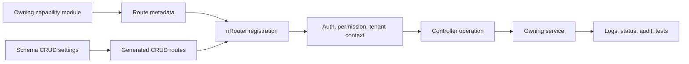

# Routing and API Governance

Routing and API Governance explains how Nodics decides which backend routes exist, which controller operation handles each request, whether authentication is required, which permission groups apply, and how generated CRUD endpoints stay aligned with schema ownership. This page is for business users, beginners, developers, operators, architects, QA owners, and AI tools that need to understand API behavior without turning Axis or Nexus into the route authority.

The business problem is predictable access. Enterprise teams need customer journeys, Axis operations, integrations, imports, and runtime administration to call APIs that are discoverable, secured, version-aware, and explainable. A route that is added in one place, hidden in another, and secured somewhere else creates audit gaps. Nodics keeps routing metadata backend-owned so route availability, security, request context, and generated behavior can be validated together.

## Business context

For business users, routing is not just a developer concern. It decides whether a customer can submit a review, whether an operator can approve a return, whether Axis can load a workbench, whether Nexus can render public documentation, and whether an integration can call an authenticated endpoint. A well-governed route tells the business what operation is exposed, who can use it, what data it accepts, and what evidence exists when it fails.

| Business question | Routing answer |
| --- | --- |
| What problem does it solve? | It makes API availability, security, ownership, and operational behavior explicit instead of scattered across frontend code and controllers. |
| Who uses it? | Developers define routes, Axis and Nexus consume them, operators monitor them, QA validates them, and business users experience the workflows they enable. |
| What decisions are supported? | Whether a route is public, authenticated, operator-only, internal, generated from schema metadata, or overridden by a customer project. |
| What changes runtime behavior? | Route metadata, generated CRUD settings, security flags, access groups, controller operation mapping, and governed runtime router records. |
| What is the business impact? | Incorrect route governance can expose private data, block legitimate users, bypass approval, or make clustered nodes behave differently. |

## Journey and ownership

The technical module is `nRouter`, but the reader-facing capability is Routing and API Governance. Functional modules declare the APIs they own. `nRouter` registers those declarations, generated route metadata, route utilities, request context, and HTTP behavior. Axis may render operations and documentation links from backend metadata. Nexus may call public Online routes. Neither frontend becomes the source of truth for route existence or access.

Use this page to decide whether a route should exist and who owns it. Use
`API Request Lifecycle and Handler Pipeline` when a developer needs the
step-by-step runtime path from Express binding through request parsing,
security branching, cache lookup, controller dispatch, response handlers, and
safe customization.



| Responsibility | Owner | Notes |
| --- | --- | --- |
| Business capability | Owning functional module | Explains why the API exists and who should use it. |
| Route registration | `nRouter` | Registers static and generated route metadata into the runtime router. |
| Controller operation | Owning module | Executes behavior through the module service/facade boundary. |
| Authentication policy | Route metadata and security services | Defines `secured`, pre-authentication, internal token, customer, or operator behavior. |
| Permission policy | Profile and capability metadata | Resolves groups, roles, permissions, enterprise, and tenant scope. |
| Axis action | Backend-declared BackOffice capability | Axis renders actions from metadata but does not invent route authority. |

## Data and configuration detail

Routing changes behavior when route metadata changes. A route definition needs a method, path, controller, operation, request processing behavior, security flag, access group or permission mapping, and generated-route relationship where applicable. Generated CRUD routes must remain tied to the schema owner so a module does not expose another module's data without a deliberate contract.

| Route detail | What to document | Verification signal |
| --- | --- | --- |
| Method and path | HTTP method, route path, version prefix, and public/internal audience. | Router registration test and API smoke test. |
| Controller binding | Controller service and operation name. | Controller/facade contract test. |
| Security mode | Public, pre-authentication, authenticated, operator, internal token, or restricted. | Authorization and denial-path tests. |
| Access policy | Permission code, group, role, tenant, enterprise, and ownership checks. | Profile permission and scoped access tests. |
| Generated CRUD | Schema owner, allowed operations, query behavior, and disabled operations. | Generated route and model contract tests. |
| Runtime override | Source record, approval, event propagation, checksum, and rollback. | Governed runtime-change tests and cluster propagation evidence. |

```js
route: {
  method: "GET",
  path: "/nodics/example/v0/items",
  controller: "DefaultExampleController",
  operation: "search",
  secured: true,
  permissionConfig: "example.item.read"
}
```

## Customization and extension

Developers should customize routing from the project layer or the owning capability, not by editing Axis links. A customer project may add a new endpoint, disable generated CRUD behavior, tighten access groups, add request processors, or replace a controller operation when it preserves the route contract and source ownership. Business users may control some route-related behavior indirectly through Axis when the backend exposes governed records, such as documentation visibility, runtime configuration, or workflow action availability.

| Customization goal | Recommended path | Avoid |
| --- | --- | --- |
| Add a customer API | Project-layer route contribution with service/facade ownership. | Adding a frontend-only URL that assumes a backend handler exists. |
| Restrict an existing API | Override route access policy through backend-owned metadata. | Hiding the button in Axis while the route remains callable. |
| Enable generated CRUD | Schema-owned generated route configuration. | Copying generic CRUD routes into a separate module. |
| Change anonymous access | Explicit route security configuration and allow-list evidence. | Treating `secured: false` as a casual convenience. |
| Refresh routes at runtime | Governed runtime router change plus propagation event. | Editing local files on one node in a cluster. |

## Related developer guides

| Topic | When to use it |
| --- | --- |
| `API Request Lifecycle and Handler Pipeline` | Explain how an accepted route is processed after Express receives the HTTP request. |
| `Pipeline and Business Logic Orchestration` | Add or adjust ordered business behavior behind a route. |
| `Module-to-Module Communication` | Call another module without copying its schema or bypassing its API authority. |
| `Error Handling and Status Codes` | Define stable status codes, HTTP statuses, safe error bodies, localization metadata, and project-specific overrides. |

## Operations and governance

Operators need to know whether a route is missing, blocked by permission, failing in controller logic, or stale on only part of a cluster. Documentation must therefore include request path, security mode, expected status codes, error shape, logs, correlation id, tenant scope, and rollback behavior. When route changes are runtime-governed, the page must also explain which event refreshes local registries and how operators prove all nodes are aligned.

| Failure mode | Symptom | Troubleshooting step |
| --- | --- | --- |
| Route not registered | Client receives not found. | Check module activation, route metadata, generated CRUD settings, and startup registration logs. |
| Wrong security mode | Public route asks for a token or private route is exposed. | Inspect route `secured` state, permission config, and pre-authentication classification. |
| Permission denied | Authenticated user cannot perform an expected action. | Verify profile groups, permission codes, tenant/enterprise scope, and Axis capability metadata. |
| Controller mismatch | Route exists but fails before service behavior. | Confirm controller name, operation name, request mapping, and facade contract. |
| Cluster drift | One node handles the route differently. | Compare runtime router registry checksums and propagation-event evidence across nodes. |

## Common mistakes

- Treating a left-navigation link as proof that an API exists.
- Making Axis hide a button but leaving the route open.
- Enabling anonymous access without documenting why the request is safe.
- Exposing generated CRUD for a schema that should only be modified through lifecycle actions.
- Forgetting tenant and enterprise context when testing APIs locally.
- Changing runtime route behavior without propagation and rollback evidence.
- Publishing documentation for a route without source evidence and security classification.

## Verification

Verification starts with the documentation page. It must include the business problem, owning capability, route metadata table, security and access rules, visual request flow, customization guidance, runtime-change behavior, common mistakes, and validation commands. The catalogue entry must include source evidence pointing to route metadata, router services, schema CRUD configuration, and related docs.

Implementation verification should include router syntax checks, generated route tests, authorization denial tests, profile permission resolution tests, request-context tests, controller/facade tests, and runtime router override tests where applicable. Public Nexus routes must be verified separately from Axis authenticated routes. Production-like validation should prove that no draft or restricted route becomes public documentation, no secret-like example is rendered, and all cluster nodes agree on the effective route registry.
