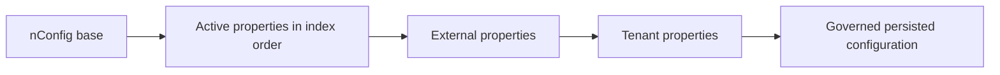

# Application Configuration and Runtime Behavior Management

Nodics supplies reusable capability defaults. A customer chooses the capabilities
and business policy it needs; an operator supplies deployment values. Keeping
those decisions separate makes a project easier to understand and upgrade.
Environment, server and node properties should express intentional differences,
not a copied configuration manual.

For beginners, start with one already working server. Identify the capability's
configuration owner, change one supported value and run preparation before
starting the runtime. Expand the change only after that smallest example works.

## Business context

A partner should be able to answer three questions before editing a value:
what behavior changes, who owns it, and which runtime should see it. For example,
changing a catalogue candidate limit is a Product policy decision; changing a
listening port is a deployment decision. Both use configuration, but they belong
at different boundaries and have different verification needs.

| Reader | Start here |
| --- | --- |
| Business evaluator | Choose the desired capability and business outcome; technical defaults should not become mandatory setup questions. |
| Application developer | Find the owning capability and its supported keys, then write the smallest customer override. |
| Administrator/operator | Supply endpoints, required secret references and deployment policy at the environment/server boundary. |
| Framework maintainer or AI tool | Prove ownership, activation, index order, merge behavior and compatibility before relocating configuration. |

## Journey and ownership

nConfig owns loading and the runtime registry. Each capability owns the meaning,
defaults and validation of its configuration. Foundation is the common framework
dependency, but that does not make every setting a Foundation-owned setting.

| Configuration or behavior | Authoritative home |
| --- | --- |
| Cookie defaults and session policy | Profile capability |
| Catalogue limits and discovery behavior | Product capability |
| Customer store identity and application choices | Customer project/application configuration |
| Shared customer administration descriptors | A project configuration module explicitly selected by the administrative runtime |
| Deployment-wide CORS and database baseline | Environment configuration |
| Active module composition, ports and isolated database names | Server configuration |
| Instance-specific differences | Node configuration |
| Shared build/start/validation mechanics | Foundation's non-runtime nTooling package |
| Development principles and contracts | Foundation's non-runtime nSetup package |
| Governed tenant/runtime changes | Existing tenant and persisted-configuration mechanisms |

A module containing only configuration does not start an independent server.
However, `runtimeModule: false` has a specific meaning: runtime discovery and
activation exclude that package. Extending Foundation does not automatically
load non-runtime children's properties. nTooling reads its own tooling
configuration through its declared entry point; that is different from runtime
capability inheritance. Do not make runtime configuration depend on activating
nTooling or nSetup.

Shared tooling should receive the selected project root, environment, server
and optional node through the existing command context. It should derive
canonical identities from package/topology metadata and resolve deployment
values from their owners. Moving customer-specific script logic into Foundation
without removing hardcoded customer names is not reusable tooling.

The established loading sequence is:

1. nConfig base properties;
2. active module `config/properties.js` files in module index order;
3. configured `externalPropertyFile` entries;
4. tenant properties through the existing enterprise/tenant mechanism;
5. persisted runtime configuration through its governed lifecycle.



The selected topology layers are project, environment, server, then optional
node. Their indexes must preserve that sequence. A custom capability under
`modules/` does not automatically precede a server: its actual index determines
when its properties load. Place shared defaults before the intended override
layers and verify the prepared runtime. Preserve the existing metadata and
loader contracts rather than introducing another configuration registry.

## Data and configuration detail

Classify every proposed setting before adding it:

| Category | Customer action | Example |
| --- | --- | --- |
| Required deployment input | Provide the real value/reference through the supported environment mechanism. | Database target or credential reference |
| Inherited default | Omit it when the owner's policy is suitable. | Profile refresh-cookie name or Product read-page limit |
| Optional advanced override | Declare only the changed key and explain the reason. | A larger Product candidate budget |
| Intentional compatibility/security pin | Keep the explicit value with an owner and review trigger. | A provider sandbox restriction during qualification |
| Generated/runtime state | Let its established lifecycle manage it. | Logs, generated files or persisted runtime settings |

Do not move development credentials, sample store names, customer URLs or
machine-local paths into reusable framework defaults. A value matching the
framework can still be wrongly owned. Correct the framework owner and preserve
that customer's choice explicitly during migration.

Omission means inheritance. It does not remove an inherited property. Current
nConfig uses Lodash `merge`; nested objects merge recursively and arrays merge
by position. For example:

```js
merge({}, {targets: ['first', 'second']}, {targets: ['replacement']});
// {targets: ['replacement', 'second']}
```

An empty or shorter array is not a universal disable/delete operation. Use the
owning capability's supported enablement/removal contract, or retain the full
intended declaration and verify the effective result. This is especially
important for reset targets, activation lists and data-package inventories.

## Customization and extension

### Customize and extend safely

Suppose an existing server already activates Product and needs a larger
catalogue candidate budget. Its override can be this small:

```js
module.exports = {
    product: {
        discovery: {
            catalogue: {maximumCandidates: 800}
        }
    }
};
```

This example shows a configuration difference, not a complete new server.
Retain that server's existing composition and deployment settings. Product's
other catalogue defaults remain inherited. Validate the resulting configuration
and measure query cost before production tuning.

For a value shared by several customer runtimes, use the owning active customer
module and an index before its intended environment/server overrides. Select
that module only where it is needed. Do not activate a WCMS or Commerce module
merely to obtain an administration descriptor, because its dependencies can
change the runtime graph. Customer administration composition may share such
descriptors while the framework retains orchestration, permissions and imports.

A later node can override one scalar without repeating the server:

```js
module.exports = {
    product: {discovery: {catalogue: {maximumCandidates: 400}}}
};
```

Build and start the intended server/node through the established project command
path. Confirm the node belongs to the selected server and verify its prepared
configuration. Configuration changes do not, by themselves, grant access,
create stores, install data or activate an application.

### Rejected placement

Copying an entire Profile configuration into an environment freezes defaults
that should be inherited. Moving a customer's application profiles into a
Foundation default makes unrelated customers inherit that customer's policy.
Replacing a large properties file with a large sibling helper retains the same
maintenance burden. Correct each case by moving data to its owner and keeping
only intentional differences at the consuming boundary.

## Operations and governance

Startup-only properties require the owning runtime's normal restart/deployment
procedure. Runtime-refreshable values use the existing governed APIs and
permissions. Editing a source file does not prove that a running process has
loaded it. Keep secret values out of logs, documentation and comparison reports.

Preserve explicit operational safeguards during refactoring:

- module activation and API exposure retain their existing authority;
- local reset opt-in, environment allowlist, confirmation and service inventory
  remain governed by their owning reset contracts;
- data-package declarations do not trigger imports on their own;
- remote endpoint declarations do not activate the remote capability locally;
- later tenant and persisted configuration remain separate from authored defaults.

### Migration and rollback

Capture the effective prepared configuration before moving values. Check every
affected runtime, including an unselected runtime and relevant optional
compositions. Compare the result after the change and account for intentional
module additions separately. Do not publish secret-bearing snapshots.

Cart and Shopping List require explicit store context and no longer consume
`customerApi.defaultStoreCode`. Keep the application's store choice at the
customer boundary and send it with operations; moving a sample identity into a
framework fallback is not valid configuration inheritance. Existing carts are
not rewritten: retain saved IDs and plan explicit migration for callers that
previously relied on fallback selection. Identifier validation does not replace
Store master-data, tenant, ownership or selling-context checks.

To roll back a configuration relocation, restore its previous declarations and
module selection together, then run preparation and focused acceptance again.
Do not remove a shared module while leaving consumers dependent on its values.
Roll back only the scoped change; preserve unrelated work and runtime data.

## Common mistakes

| Symptom | Likely cause | Recovery |
| --- | --- | --- |
| Moved defaults disappear | Their owner is inactive or non-runtime. | Check metadata and the effective module list; use the proper runtime owner. |
| A server override loses | A defaults module loads later by index. | Correct ordering and test the selected topology. |
| An unwanted array entry remains | A shorter array was merged by index. | Use supported removal semantics or a complete verified declaration. |
| Unrelated runtimes receive application profiles | A shared module was selected too broadly. | Restrict composition and verify an unselected runtime. |
| Local values appear in another environment | Deployment choices were promoted to shared defaults. | Restore the values to their environment/server owner. |
| Source looks correct but live behavior differs | The process is stale or a later runtime layer overrides it. | Inspect the actual runtime, later configuration and normal restart path. |

## Verification

From the framework repository, run the focused loading and validation contracts:

```sh
node nodics.foundation/modules/nConfig/test/configurationOwnershipContract.test.js
node nodics.foundation/modules/nConfig/test/configurationValidation.test.js
node --test nodics.commerce/modules/checkout/modules/cart/test/cartCustomerApiContract.test.js
npm run llm:generate
npm run llm:validate
npm --prefix nodics.docs test
npm run quality:docs
```

Also run the consuming project's real `prepareStart` scenarios and tests for
its explicit overrides. Preparation proves configuration resolution and module
composition; it does not prove network connectivity, database operations,
authenticated browser acceptance or a running deployment. Report those levels
of evidence separately.

Continue with Framework Startup Lifecycle for startup sequencing and Governed
Runtime Change for persisted settings and runtime permissions. The permanent
implementation rule is
`nodics.foundation/modules/nSetup/llm/contracts/customer-config-classification-contract.md`.

## Capability inventories and project tooling

A capability can declare inert maintenance metadata in its own configuration.
For Local reset, use `localResetProvider.contributions.<module>.serviceNames`
with keyed booleans. A server selects only intended modules, for example
`modules: { inventory: true, cms: false }`, and can remove an optional inherited
service with `serviceOverrides: { DefaultInventoryAdjustmentService: false }`.
Enablement, environment allowlist, service-token authority, confirmation, maximum
scope and required services remain nSystem checks. This is never an automatic
inventory of all database collections. Search targets remain explicit.

Initialization uses the existing nImport release manifests and category/destination
selection. A Foundation profile may select Core releases without copying every
capability's record definitions into server properties. Keep application-specific
bundles, labels and deployment targets in project layers.

Project command execution remains in nTooling. Applications declare their own
server aliases, customer acceptance scripts and media seeds through
`nodics.project.json` tooling commands and script ownership. Generic commands do
not assume a named storefront or website. Documentation generation uses the
application catalogue's `publication` identifiers, routes, labels and channels.
Use stable record prefixes; changing a prefix is a content-identity change rather
than a cosmetic rename. The data-manifest tool only refreshes declared development
checksums and refuses to rewrite an immutable release after content changes.

## Installed project command

Foundation's package `bin.nodics` points to the existing nTooling project bridge.
A declared compatible Foundation dependency installs `node_modules/.bin/nodics`;
normal npm scripts resolve it automatically. The bridge reads the chosen project's
`.env`, resolves its configured framework checkout or its own checkout, and dispatches
to the existing tooling registry. No project-owned JavaScript launcher is required.
Local checkout dependencies remain explicit `file:` references in package/lockfiles;
this is not an unpinned package fetch or a claim of a published npm release.

```sh
npm exec -- nodics start --env qa --server jobs --node worker1
npm exec -- nodics build --env qa --server jobs
npm exec -- nodics clean --env qa --server jobs
npm exec -- nodics project:validate
```

`--env` aliases `--environment`; `--project` aliases `--home`. Target options accept
both `--name=value` and `--name value`. Duplicate or missing target values fail.
Start resolves the explicit server through its existing package topology; optional
nodes use nConfig's existing node selector. Build/clean require a server and retain
server-owned output shared by nodes. They do not infer an environment-wide build.
CLI targets take precedence over environment-file defaults. Selection is restored
after an awaited runtime lifecycle, including failure. Credentials stay in the
existing external/environment/secret authority and are never CLI examples.

The same registry still accepts its existing command names. Customer acceptance
aliases remain opt-in `project:run` commands. Qualification/release commands retain
the framework home established by the project bridge. Changing command packaging
does not imply permission to run a deployment, release, reset or live acceptance.

## Declarative property bindings

Project, environment, server, node and tenant property contributions resolve
through nConfig at the existing load boundary before the usual layered merge.
The same resolver supplies the existing nTooling environment composition helper.
Configuration files export data; they do not execute project composition loops,
read sibling environment builders, or implement their own environment resolver.
This does not add another configuration store, provider registry or load order.

Use an explicit `$config` object only when a value needs resolution:

- `env`: `name`, optional `fallback` and `type` (`string`, `number`, `boolean`).
  Names are explicit uppercase environment variable names. Unset/empty values use
  the fallback; absent fallbacks omit the contribution. Booleans accept only
  `true`/`false`, and numbers must be finite. Secret values stay in the deployment
  environment; errors name the field without printing its value.
- `ref`: `path` as an array of keys (preferred for keys containing dots), or a
  dotted path. Reads the current contribution plus earlier effective properties,
  returns an independent value, and rejects missing/cyclic/unsafe references.
- `context`: one of `projectCode`, `environmentCode`, `serverCode`, `nodeCode`
  from the selected runtime.
- `path`: a `base` of `project`, `framework`, `environment`, `server`, `file`,
  or a binding that resolves to an absolute path, plus a `relative` string.
  This supports explicit sibling checkout paths; it is not a filesystem sandbox.
- `composition`: the selected environment profile's explicit composition `name`
  and optional `field`. Its declared `environmentVariable` chooses domains;
  `emptySelections` declares aliases, with only `none` supplied by default.
  No application identity or environment-variable name is inferred by nConfig.
- `selected`: composition `name`, array `field`, `includes`, `value`, optional
  `otherwise`. An omitted alternative omits that property/array contribution.
- `all`: a bounded nonempty `values` array of boolean values or bindings.

Bindings inside arrays may declare `spread: true` to expand an array result.
Spread is rejected outside arrays or for a non-array result. Unknown operators,
unrecognized operator fields, invalid values, unsafe paths, and resolution beyond
64 levels/250,000 nodes reject loading. These are finite value operators, not an
expression language: no script, function, arbitrary provider or code evaluation.

```js
module.exports = {
    database: {
        default: { mongodb: { master: {
            URI: { $config: 'env', name: 'DATABASE_URI' },
            databaseName: 'warehouseQa'
        } } },
        inventory: { $config: 'ref', path: ['database', 'default'] }
    },
    activeModules: { modules: [
        'warehouseRuntime',
        { $config: 'composition', name: 'business', field: 'projectPacks', spread: true }
    ] }
};
```

Later layers can replace a binding with a literal or change its referenced
source. Resolution does not mutate imported source objects, and resolved arrays
still follow the existing subsequent merge-by-index behavior. Required values
remain subject to their owning capability's validation. Validate both effective
runtime settings and rejection paths; importing a property file directly in a
test observes declarations rather than resolved settings.

Regression coverage: `configurationBindingContract.test.js` exercises the real
nConfig server/configuration load paths, nested overrides, independent copies,
custom domains, environment/conditional values, cycles and malformed bindings.
Customer acceptance should include every supported environment and composition,
ports/routes, authority maps, secret overrides and empty selections. Binding
resolution itself performs no business writes or network calls.


### Build exclusion and interrupted-build recovery

A build or clean acquires an atomic filesystem lock adjacent to the selected
server's `generated/build.json`. The lock covers entity generation, module hooks
and completion-manifest publication. A second writer for the same server fails
before cleanup; another server may proceed in a separate process. Startup also
rejects a held lock or missing/stale completion manifest.

Normal failure releases the lock and preserves the original error. A killed
process may leave the lock behind. Verify that the original writer has stopped,
remove only that server's `generated/build.json.lock` directory, and rebuild the
selected server. Never remove a live writer's lock or use a timeout to assume
that it is safe. This mechanism protects local filesystem build ownership; it
does not replace deployment rollout coordination or certify network-filesystem
locking semantics.

### Generated output containment

Build and clean first check every generated path before acquiring their server
lock or modifying files. A server must lie within the selected project, and links
below that project root cannot redirect generated output. A symlinked project
checkout itself is supported. If a generated folder or its parent is a symlink,
correct the server layout and rerun the same selected-server command; do not
remove unrelated data or bypass the check. This protects other servers and shared
framework sources while keeping one generated set for all nodes of the server.
