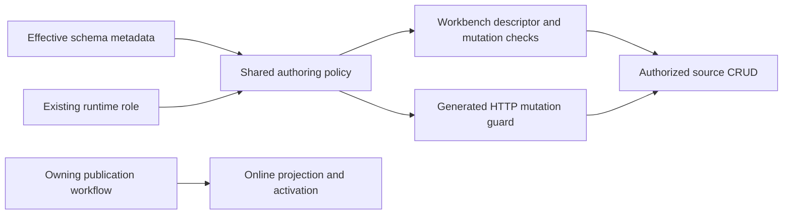
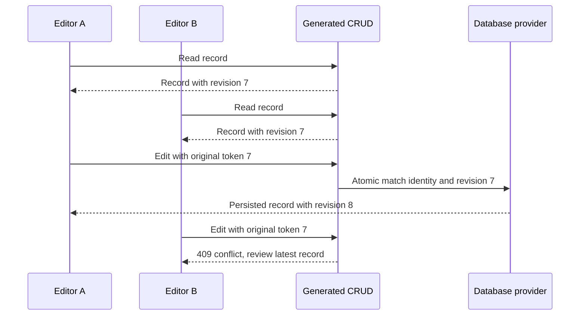
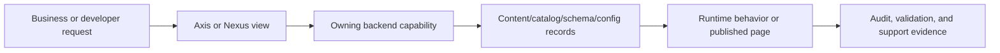

# Data Modeling and Schema Management

## Shared schema metadata for every API consumer

A module owns its data and APIs. Axis, exports, Copilot and another application
consume the same capability contracts. Foundation's existing `nDatabase` Schema
Utility service describes the effective schema; Safe Query translates bounded
search; generated controllers, facades and services retain the normal persistence
pipeline. No Workbench service, parallel registry or extra architectural layer
is required.

For an operator, this means a field added through an authorized schema extension
appears consistently in discovery, forms and search. It does not grant access to
that field or authorize a business transition. Schema access, property rules,
tenant/record ownership, publication and concurrency remain backend decisions.

| Capability | Canonical interface relative to the module endpoint | Owner |
| --- | --- | --- |
| Schema collection | `GET /schemas` | Schema Utility `listSchemas` |
| Schema detail | `GET /schemas/:schema` | Schema Utility `getSchema` |
| Resource capabilities | `GET /<schema>/capabilities` | Generated transport to the same Utility owner |
| Bounded search | `POST /<schema>/safe-search` | Safe Query and generated read |
| Create | `PUT /<schema>` with a raw model | Generated save pipeline |
| Update | `PATCH /<schema>` with query/model/options | Generated update pipeline |
| Delete impact | `POST /<schema>/delete-impact` with an identity | Utility and Reference Integrity |
| Delete | `DELETE /<schema>` with a query | Generated remove pipeline |
| Explicit bounded bulk | `POST /<schema>/bulk` | Utility and generated remove |
| Enterprise setup | `POST /enterprises` in Profile | Enterprise Management |

### Customize and extend safely

Declare fields in the owning schema through the existing module hierarchy.
Use its `backoffice` metadata for client-safe fields, forms, relationships and
permitted operations. For example:

```javascript
backoffice: {
    excludedFields: ['internalNotes'],
    form: {
        sections: {
            businessDetails: { label: 'Business details', fields: ['name', 'customerReference'] }
        }
    }
}
```

The fields must exist in the effective schema. Preserve inherited exclusions
when overriding an array. A deleted field disappears; ungrouped editable fields
remain available. Form visibility cannot bypass required input or authorization.
When metadata is insufficient, override the existing `DefaultSchemaUtilityService`
helper through ordinary module service inheritance. Do not copy a base service,
create another schema catalogue or place metadata authority in a UI.

### Failure, compatibility and operational rollout

The framework is unreleased. All `/schema/workbench` endpoints and their
controller, facade and service are removed. The owning configuration is now
`schemaApi`, with `system.schema.view` and `system.schema.manage` defaults.
Current callers, configuration and bootstrap grants move together; there are no
old-route aliases or second namespace defaults. Persisted grants from an earlier
local database need the normal governed data update before authenticated use.
This source migration does not rewrite stored records or permission documents.

Unknown, inactive, excluded and inaccessible schemas fail closed. A missing owner
is an error, not permission to load raw schema or another service implementation.
Protected filters and unbounded searches fail before reads. Rebuild and restart
affected runtimes, and verify allowed and denied identities against their actual
policy. Source composition and mocked persistence checks do not establish live
HTTP authentication, custom service overrides or persisted policy acceptance.

### Validation and remaining route migration

Canonical schema transport migration is complete in source. Contract tests cover
compiled controller/facade/service templates, active aliases, effective overrides,
field filtering, original revisions, tenant/owner scope, callbacks and no-write
rejections. Axis tests cover the actual client requests and persisted responses.
Prepared Local/Docker runtime checks inspect API coverage, permissions and OpenAPI
metadata without binding a listener. Live signed-in acceptance remains separate.

## Generated create, update and delete contracts

Controllers map declared input instead of merging arbitrary body properties into
the secured request. Authentication, tenant, enterprise, module/schema identity,
transaction and trace context stay server-owned, including non-enumerable values.
Unknown, protected and read-only top-level model fields are omitted; fixed schema
values and trusted scope are applied. Nested validation stays with schema owners.
Operator model patches such as `$set`, `$inc` and dotted paths are rejected.

Selective schema APIs use one scalar primary identity for update/delete and keep
the original revision when required. They cannot accept a broad operator query
in place of the selected record. An explicit domain create command blocks generic
create/createAll. Staged-only and read-only metadata reject writes independently
of the client's form, the route's visibility or the presence of a manage grant.

```json
{
  "query": { "code": "record-one", "revision": 4 },
  "model": { "name": "Updated label" },
  "options": { "recursive": false, "returnModified": true }
}
```

For this update, the concurrency owner compares revision 4 and computes the next
value. Missing, malformed and stale managed tokens retain the existing 428, 400
and 409 contracts. Reload and review a conflict; never automatically replace its
token with a freshly fetched revision. Advanced broad-query/by-ID interfaces,
when explicitly exposed by the owning schema, retain their separate contracts.
Internal domain/import calls use their existing policy and persistence pipeline.

### Compatibility, errors and retries

Keep the generated response envelope. A create/update client must receive one
persisted record with its identity and usable managed revision: a direct record,
a single-record array or the generated `models` result. A count, missing identity,
empty/multiple models or unusable revision is an error for record editing.
`modifiedCount: 0` can be a valid no-op when one persisted record is returned.
An invalid success response may follow an applied write; retain user input and
inspect/reload the data before retrying. Never synthesize success from form input.

Generic idempotency-key forwarding is not a durable replay ledger. Domain commands
retain their existing principal-bound key, input digest and recovery rules.
Selected bulk deletion is schema-opted-in, bounded and keyed, and retains every
identity's required revision in the remove query. It uses Reference Integrity and
the normal generated remove pipeline. The current provider contract does not
support managed-counter multi-record CAS, so those schemas do not advertise bulk
DELETE and reject it before dispatch. They remain editable one record at a time.
The governed Local reset has its separate provider-issued maintenance authority;
a caller flag or lookalike object cannot activate it.

### Canonical schema discovery

`GET /schemas` returns `{ code, data: { moduleName, schemas } }`; detail and
capabilities return `{ code, data: descriptor }`. An authorized empty module
returns an empty list. An unavailable detail returns the existing unavailable
error. Thin controller/facade adapters pass the original secured request and the
route-selected schema separately to Utility `listSchemas/getSchema`.

Discovery preserves active aliases, effective extensions, safe fields, authoring,
form/reference/concurrency metadata and prepared API routes. Collection/detail
use `schemaApi.discoveryPermission` (default `system.schema.view`), secured
`userGroup` access and exposure category `schemaApi`. Tagged resource reads use
`schemaApi.readPermission`; writes use `schemaApi.writePermission`. Change grants
through the existing identity owner. Metadata and exposure never grant access.

Axis uses the canonical collection and detail paths, or an advertised capability
route for detail. Import/export, documentation, media and other schema screens
share this typed client. Missing/disabled routes and authorization errors remain
visible. No fallback selects Workbench, another runtime or Online authoring.
Successful connections retain their identity when another connection fails.

### Selective module APIs and route-driven clients

An eligible model can opt into the existing nRouter template group without
exposing broad raw-query, by-ID or unrestricted bulk-create routes:

```javascript
router: { enabled: true, groups: { schemaOperations: true } }
```

This group contains the seven resource operations above. Effective schema access
and authoring determine which are usable. Product and PriceRow use this group;
source writes require Staged. Editorial Online projections and publication
receipts permit secured inspection while rejecting generated writes. Public
Editorial delivery continues through its sanitized business APIs.

`router.enabled: false` still disables generated routes. An explicit empty groups
object selects none; `schemaOperations: false` removes an inherited group. Unknown
groups and non-boolean entries fail configuration rather than enabling broad CRUD.
Omitting `groups` preserves the schema's existing full default-group selection.
Global module HTTP enablement remains independent; internal schema contributors
do not acquire listeners or API hosts merely by declaring a model.

`apiOperations` comes from prepared matching generated-controller routes. It is
an inert projection, not another registry. Each operation declares `method`, a
static relative `path`, `apiVersion` and `active`:

```json
{"create":{"method":"PUT","path":"/product","apiVersion":"v0","active":true}}
```

Axis validates and follows this path under the selected connection. Missing
optional route metadata uses the standard canonical resource path; no response
triggers a second transport. Disabled declarations send no request. Ambiguous
routes, unsafe paths, unsupported methods or versions fail closed. Later modules
can override the existing routes; use `active: false` to disable an inherited
operation instead of introducing a competing endpoint.

### Domain setup and confirmation

Schema `aggregateOperations` can name an existing owning controller operation;
Utility resolves its actual prepared route. Service names are not executable
client metadata and there is no generic aggregate dispatcher. Profile's declared
enterprise setup maps to `POST /enterprises` with `{ model: { ... } }` and a valid
`Idempotency-Key` header. Profile validates writable fields, keeps tenant setup
server-owned, preserves references and uses its existing activation retry logic.
A generic enterprise PUT cannot replace that business operation.

Copilot prepares Product actions at `/products/prepare` and executes through its
confirmation API. The duplicate Product execution HTTP adapter is removed.
Confirmed Product/PriceRow writes use canonical module PUT resources and retain
fresh policy, connection/tenant/target scope and key forwarding. They do not
create an automatic transaction or durable replay guarantee.

### Rollout and verification

Upgrade backend source, generated output, current clients and governed grants as
one coordinated change. Existing metadata extensions move to Schema Utility;
application identity stays in application contributions. Keep domain workflows,
original revisions, policy rejection and response errors visible. Verify default
and later-layer behavior, disabled groups/routes, allowed/denied identities,
Staged/Online, aliases, tenant isolation, conflict recovery and missing owners.
No migration silently rewrites stored data. Generated documentation and runtime
preparation evidence complement, rather than replace, authenticated live checks.

## Publication-aware Generic Authoring

Canonical owner: Foundation's `nDatabase` resolves generic authoring policy;
`nController` checks generated HTTP mutations before request-body mapping. The
owning schema declares its lifecycle in existing `backoffice` metadata. The
existing server-owned `runtimeRole.publication` supplies Staged/Online context.

```js
backoffice: {
    mutationPolicy: { lifecycle: 'PUBLISHABLE', publishRequired: true }
}
```

This source may be authored only where the runtime publication role is STAGED.
ONLINE, OPERATIONAL, unknown and missing roles do not grant authoring. Read/search
remain subject to normal access checks. Workbench removes write, bulk and
aggregate capabilities; generated HTTP mutations reject before persistence,
including saveAll and delete-by-code/id. A body field cannot override the role.

For an owner-managed projection or receipt use:

```js
backoffice: { mutationMode: 'READ_ONLY', operations: ['search', 'read'] }
```

That denies generic HTTP and Workbench mutations, not the owning publication
service. nPublish/domain providers and approved import workflows retain their
existing generated-service paths, authentication, lifecycle and tenant checks.
This boundary does not authorize arbitrary internal writes or replace approval.

CMS content, Editorial sources, and Product/Category/Variant catalogue sources
declare the publication rule. Their publication evidence and derived projections
declare read-only generic authoring. Store/Point of Service remain operational.
Do not infer publication from a module name, technical revision or native version
field. Mixed-lifecycle modules are supported intentionally.



### Customize and Extend Safely

Add the fragment above to the owning custom module's
`src/schemas/schemas.js`; retain normal fields, references and access groups.
Use its existing environment `config/properties.js` to declare
`runtimeRole: { code: 'PROJECT_STAGED', publication: 'STAGED' }`.
Do not add a separate publication-schema registry or infer authority in Axis.
A service override may extend `DefaultSchemaAuthoringPolicyService` but must
preserve fail-closed Online/missing-role behavior and the existing writer owner.

Example: promotional copy requires Staged authoring and publication, while an
order in the same module remains operational. A publication receipt must be
read-only in Workbench even for an administrator; changing its state manually is
not publishing. Reclassifying an inherited source as operational requires
removing all publication markers through schema composition and documenting a
real change in ownership, not bypassing approval for convenience.

Run `schemaAuthoringAuthorityContract.test.js`, `schemaWorkbenchContract.test.js`,
the owning publication tests and Axis Workbench tests. Verify missing role,
read-only targets, body spoofing, promise/callback errors, and no persistence on
rejection. A full Published view must read active domain projections; these
generic guards do not create a publication workflow or a source/Online diff UI.

## Technical revisions without manual arithmetic

Canonical owner: `nodics.foundation`, implemented by `nDatabase/database` and
the MongoDB provider. A technical edit counter detects two people changing the
same record. It is not a business version, a published content version, or a
data-release version. The existing effective schema declares who manages it:

```js
backoffice: {
    concurrency: { field: 'revision', managed: true }
}
```

This is schema metadata, not a new configuration file, registry, or importer.
The first migrated framework schemas are `store.store`, `store.salesChannel`,
and `store.pointOfService`. Other schemas are not automatically migrated merely
because they contain a property named `revision`.

| Operation         | Caller responsibility                                        | Framework responsibility                                           |
| ----------------- | ------------------------------------------------------------ | ------------------------------------------------------------------ |
| Create            | Supply business fields and stable identity, no counter       | Initialize counter to 1                                            |
| Edit              | Retain the original read token, send changed business fields | Compare original token atomically and increment once               |
| Save unchanged    | Retain original token                                        | Return current record without advancing counter or mutation events |
| Delete            | Retain original token and identity                           | Apply access/reference checks and conditional delete               |
| Import `saveAll`  | Author ordinary data rows without counters                   | Read original tokens and use generated CRUD                        |
| Concurrent change | Review newer data and resolve the user's intended edit       | Reject stale write; never silently overwrite                       |



### Developer service example

Use the existing generated service inside an authorized module operation. The
example assumes `tenant` and `authData` come from the authenticated request:

```js
const response = await SERVICE.DefaultPointOfServiceService.get({
  tenant,
  authData,
  query: { code: "project-web-pos" },
});
const original = response.result[0];
const saved = await SERVICE.DefaultPointOfServiceService.update({
  tenant,
  authData,
  query: { code: original.code, revision: original.revision ?? 0 },
  model: { name: "Updated web service point" },
  options: { returnModified: true },
});
const nextEditingSnapshot = saved.result.models[0];
```

Point of Service uses a string name. Other schemas may use localized objects;
always follow the effective field type. Never write `revision + 1` in the caller.
Axis carries the original token automatically and treats the returned record as
the next editing snapshot. It excludes managed counters from editable payloads.

### Conflict and recovery behavior

| Response                      | Meaning                                                                    | Recovery                                                                                          |
| ----------------------------- | -------------------------------------------------------------------------- | ------------------------------------------------------------------------------------------------- |
| 409 / `ERR_CONCURRENCY_00001` | Record changed, disappeared, or identity raced during creation             | Preserve draft, read latest through the owning service, review differences, deliberately resubmit |
| 428 / `ERR_CONCURRENCY_00002` | Existing-record edit omitted original token                                | Fix caller to retain its read result; do not manufacture a token                                  |
| 400 / `ERR_CONCURRENCY_00003` | Invalid token, broad selector, operator patch, unsupported provider/schema | Correct the contract; do not disable concurrency to suppress the error                            |

Legacy records with no counter use token 0 and a missing-field compare-and-set.
Their first changed write creates counter 1. Existing populated counters never
reset. An old token cannot succeed by supplying a newer number in the payload:
the query token takes precedence. Audit timestamps alone do not count as edits.

### Customize and extend safely

Use your existing later-loaded project module's `src/schemas/schemas.js`, not a
new revision configuration layer. For a project-owned non-versioned schema whose
writes all use generated CRUD, declare a typed technical field and metadata:

```js
module.exports = {
  projectOperations: {
    serviceDesk: {
      definition: {
        code: { type: "string", required: true, unique: true },
        editCounter: {
          type: "long",
          required: true,
          default: 1,
          description:
            "Framework-managed counter used to detect concurrent edits.",
        },
      },
      backoffice: { concurrency: { field: "editCounter", managed: true } },
    },
  },
};
```

Compose this fragment with the project's established model, access and ownership
defaults. Keep a scalar unique primary identity. Audit every writer before
migration: generated single-record save/update/delete supports plain field
patches, not `$inc`, `$set`, dotted paths, or mass updates. Domain services already
incrementing their own counters must retain that authority until deliberately
migrated. `managed: false` leaves that existing behavior intact; it is not a
concurrency bypass to apply to an already-managed shared schema.

`versionId` and `isVersionedEnabled: true` cannot use this managed-counter path.
The versioned provider and nPublish remain authoritative. A project cannot
customize away access checks, tenant selection, atomic matching, original-token
requirements, or genuine conflict rejection. Alternate providers must implement
the same atomic `compareAndSetItem` boundary and return the persisted record.

Test create, successive edits, no-op, stale/missing/malformed token, simultaneous
writers, ownership denial, legacy missing counter, deletion restrictions, and
project field-name overrides. Run `modelConcurrencyContract.test.js` under
`nDatabase/database/test` and `mongodbManagedConcurrencyContract.test.js` under
`nDatabase/mongodb/test`. In Axis, create a disposable Point of Service, edit it
twice, and verify that the counter is read-only. Never delete real business data
to test a revision migration.

This mechanism protects one record. Nested model saves and import files can
complete some writes before a later conflict; they are not transactions. Use the
existing supported database transaction or owning workflow for atomic business
operations. See the import documentation for retry and release boundaries.

How schemas define model behavior, generated services, API contracts, validation, and project-layer property extension. This page is intentionally written for beginners, business users, developers, operators, architects, QA owners, and AI tools. It explains the business problem first, then the technical ownership model, then the exact customization and verification responsibilities so nobody has to guess where a change belongs.

Customers need to add fields, validation, and domain records without bypassing generated services, route contracts, permissions, or publication behavior. Nodics uses schema metadata as the model authority. Generated controllers, services, validators, routes, and workbench screens derive from effective schema composition.

## Business context

For a business user, this topic answers what decision can be made, which operational journey is supported, and what risk is reduced. The practical value is faster delivery without losing governance: teams can understand the current capability, decide whether it applies to their project, and know when Axis, Nexus, content catalog, workflow, or runtime services are involved.

For beginners, the mental model is simple: the page title is the business capability, the table identifies who owns each part, and the diagram shows how a request or change flows. A reader should not need source-code knowledge to understand the journey, but the developer path is still available when customization is needed.

| Business question            | Answer for this topic                                                                                                                                                    |
| ---------------------------- | ------------------------------------------------------------------------------------------------------------------------------------------------------------------------ |
| What problem does it solve?  | Customers need to add fields, validation, and domain records without bypassing generated services, route contracts, permissions, or publication behavior.                |
| Who uses it?                 | Business users, administrators, developers, operators, QA owners, implementation partners, and AI-assisted delivery tools.                                               |
| What changes can it support? | Nodics uses schema metadata as the model authority. Generated controllers, services, validators, routes, and workbench screens derive from effective schema composition. |
| What must be governed?       | Permissions, validation, source ownership, publication state, runtime impact, audit evidence, and rollback boundaries.                                                   |

## Journey and ownership

Foundation schema services own schema compilation and generated artifacts. Each functional module owns its business schema definitions and allowed extension points. This keeps the reader-facing name friendly while preserving exact source ownership for developers and AI tools. Axis may render management screens or authenticated documentation, Nexus may render public Online content, and the backend content catalog remains authoritative for navigation, pages, access policies, and publication state.



| Responsibility           | Owner                               | Notes                                                                                   |
| ------------------------ | ----------------------------------- | --------------------------------------------------------------------------------------- |
| Business capability name | Data Modeling and Schema Management | Used in navigation and dashboards so readers are not exposed to raw module names first. |
| Source owner             | nodics.foundation                   | Carries exact implementation, documentation, and validation evidence.                   |
| Technical module         | nSchema                             | Holds the relevant schema, service, router, data, or contract detail where applicable.  |
| Axis experience          | Backend-declared workspace          | Axis renders metadata and actions but does not become the authority.                    |
| Public experience        | Online content delivery             | Nexus renders only records approved for public access.                                  |

## Data and configuration detail

Every topic must explain the data that changes behavior. Some topics are schema-driven, some are configuration-driven, some are publishable content, and some are operational records. The documentation must say which category applies before showing code. That keeps production operators and developers aligned on whether a change needs publication, restart, event propagation, approval, or only a project-layer override.

| Detail area            | What to document                                                               | Verification signal                             |
| ---------------------- | ------------------------------------------------------------------------------ | ----------------------------------------------- |
| Model or record        | Type code, catalog, tenant, enterprise, state, owner, and lifecycle.           | Schema contract or generated model test.        |
| Configuration key      | Default value, override location, environment scope, and runtime impact.       | Config validation and runtime refresh evidence. |
| API or event           | Route/event name, payload boundary, permission, idempotency, and failure mode. | Route, service, event, and authorization tests. |
| Publication and access | Staged/Online state, access mode, roles, groups, and permissions.              | Content-pack validation and access-policy test. |

```js
schemaExtension: { typeCode: "Product", properties: { fit: { type: "String", localized: true } } }
```

## Customization and extension

Developers should customize from the project layer first. A customer project may add properties, services, validators, pipelines, renderers, data packs, or provider configuration when the extension respects the owning capability. Business users may update governed records in Axis when the record is designed for administration. Framework source changes are reserved for improving the reusable product capability itself.

| Customization type                          | Recommended path                                                       | Avoid                                                |
| ------------------------------------------- | ---------------------------------------------------------------------- | ---------------------------------------------------- |
| Business label, navigation, or content area | Axis-managed content catalog item with publication workflow.           | Hardcoding labels or page trees in the frontend.     |
| Runtime setting                             | Module configuration with validation and governed runtime propagation. | Editing node-local files on each server by hand.     |
| Domain behavior                             | Extension service, validator, pipeline step, or provider adapter.      | Forking the standard module for customer-only logic. |
| Public visibility                           | Access policy with public/authenticated/role-based state.              | Exposing internal or draft pages through Nexus.      |

## Operations and governance

Operators need production-safe evidence, not only implementation notes. Each page must call out logging, tracing, permission checks, event propagation, data import/export, publication status, rollback behavior, and troubleshooting. If a capability affects multiple nodes, the documentation must explain how changes reach every node and how a partial failure is detected.

| Operational concern | Required documentation detail                                                      |
| ------------------- | ---------------------------------------------------------------------------------- |
| Security            | Authentication mode, permission code, role/group, tenant and enterprise isolation. |
| Audit               | Actor, timestamp, source record, checksum, approval, route/event, and result.      |
| Resilience          | Retry, idempotency, compensation, fallback, cache invalidation, and rollback.      |
| Observability       | Logs, metrics, dashboard cards, health checks, and support evidence.               |

## Common mistakes

- Treating a friendly navigation label as the technical source owner.
- Writing only developer details and skipping the business decision that the page supports.
- Updating Axis or Nexus code when the content catalog, schema, or backend capability should own the change.
- Forgetting access rules for public, authenticated, role-based, group-based, or permission-based pages.
- Skipping diagrams, comparison tables, source maps, or troubleshooting matrices because the topic feels obvious.
- Changing runtime behavior without explaining production impact, cluster propagation, and rollback.
- Leaving generated documentation without source evidence, validation commands, and maturity state.

## Verification

Verification starts with the document itself: it must include business context, technical ownership, a visual flow, data or configuration tables, customization guidance, common mistakes, and validation evidence. Developers then run the documentation generator and content-pack validator so the page becomes backend-owned data with checksum, lifecycle, navigation, access policy, publication state, and search metadata.

For implementation verification, run the owning module tests and any Axis or Nexus renderer tests that consume the page. Operators should confirm that production-like runtime behavior matches the documentation: permissions reject unauthorized access, Online pages do not expose Staged data, runtime changes propagate through governed events, and troubleshooting evidence is available without exposing secrets.

### Governed local maintenance

The governed Local reset is a separate maintenance operation. Its existing
provider-issued opaque authority permits bulk removal of configured local
models, including managed-counter schemas, through the generated remove
pipeline. Caller-supplied flags or lookalike authority objects cannot enable
this path. Ordinary generated deletes still require a scalar identity and the
original revision; no client or project may disable these checks for editing.
