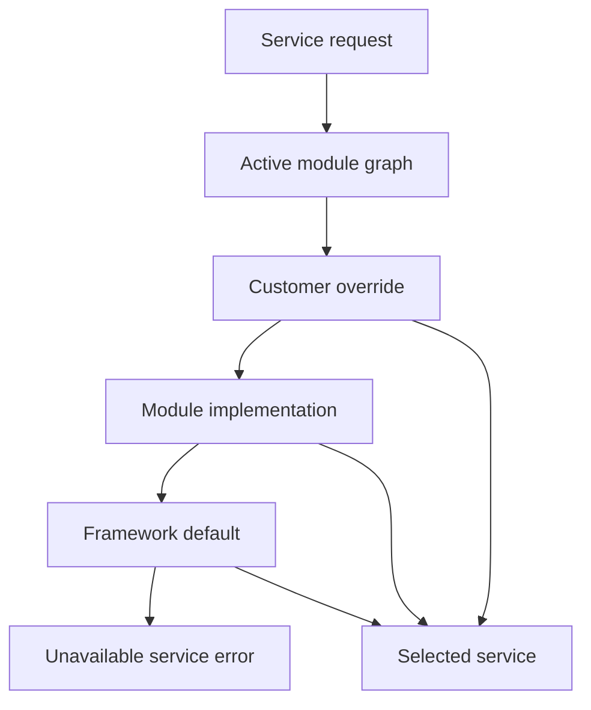

# Service Runtime and Override Precedence

Nodics services provide the runtime behavior behind schemas, routers,
pipelines, imports, publication, and business operations. Service override
precedence is what allows a customer project or module to customize behavior
without editing framework source. For beginners, the simple idea is that a
service name resolves to the most specific active implementation allowed by
the module graph.

## Source map

| Area | Source location |
| --- | --- |
| Service module | `../nodics.foundation/modules/nService/package.json` |
| Virtual service module | `../nodics.foundation/modules/nService/vService/package.json` |
| Runtime configuration docs | `docs/pages/nodics.foundation/runtime-configuration.md` |
| Extension patterns | `docs/pages/framework/module-loading-and-service-precedence.md` |
| Developer customization | `docs/pages/framework/backend-extension-patterns.md` |

## Resolution flow



The business problem is controlled customization. Customers need project-level
behavior, but the platform must remain upgradeable. Developers need a clear
rule for where overrides live. Operators need to know which implementation is
running in production when a behavior differs from the default.

## Precedence contract

Service names should remain stable. Override modules can provide an
implementation with the same service identity, but they should not change the
public contract unless the owning capability documents a new versioned
contract. Virtual services can stand in for generated or environment-provided
implementations, but they must still expose predictable init, post-init, and
operation behavior.

```js
module.exports = {
  code: 'DefaultPriceCalculationService',
  ownerModule: 'customer.commerce',
  overrides: 'DefaultPriceCalculationService',
  contract: 'commerce.priceCalculation/v1'
};
```

## Operational evidence

| Question | Evidence |
| --- | --- |
| Which service was selected? | Service registry entry and module graph order. |
| Why was it selected? | Override relationship and active module state. |
| Is it safe? | Contract tests, init result, and health status. |
| Can it be rolled back? | Disable override module or restore previous release. |

## Customization and extension guidance

Developers should extend services in the narrowest owning module. Business
logic belongs in services, handlers, policies, or workflows, not in data
records. Customer projects should add tests showing the default behavior, the
override behavior, and the fallback behavior. AI tools should inspect the
module graph before editing a service so they do not create duplicate
authority.

## Implementation handoff

A service customization is ready only when the developer can identify the
default service, the overriding module, the active runtime graph, the contract
version, and the rollback path. Business users should see the changed behavior
as a normal capability journey. Operators should see selected implementation
metadata in production logs or diagnostics. QA should run both default and
override paths so future upgrades do not silently change precedence.

## Common mistakes

- Changing a default service when a customer override is enough.
- Creating a new service name when an override contract already exists.
- Hiding selected implementation details from operators.
- Putting business decisions inside import data files.
- Forgetting init and post-init behavior for virtual services.

## Verification

Run service and module-loading tests, then start a fresh runtime and inspect
the selected service implementation for the customized capability. A production
check should show the business behavior, developer contract evidence, operator
selected-service metadata, and QA regression proof for fallback behavior.
