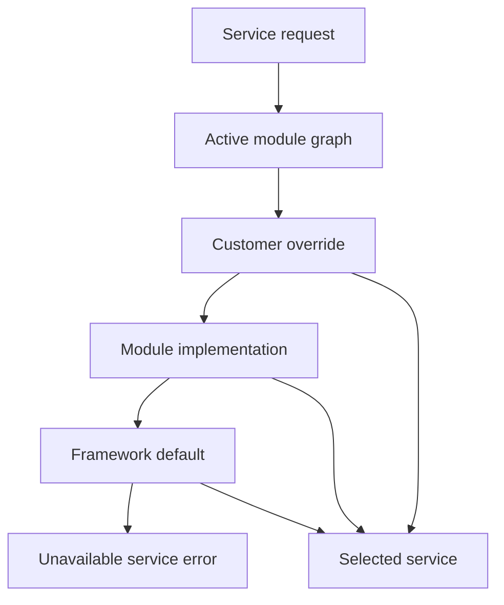

# Service Runtime and Override Precedence

Nodics services provide the runtime behavior behind schemas, routers,
pipelines, imports, publication, and business operations. Service override
precedence is what allows a customer project or module to customize behavior
without editing framework source. For beginners, the simple idea is that a
service name resolves to the most specific active implementation allowed by
the module graph.

Use this page to understand which service implementation wins. Use
`Module-to-Module Communication` when a service needs to call another module
through `DefaultModuleService`, especially when the target may be local in one
runtime and remote in another.

## Source map

| Area | Source location |
| --- | --- |
| Service module | `../nodics.foundation/modules/nService/package.json` |
| Virtual service module | `../nodics.foundation/modules/nService/vService/package.json` |
| Runtime configuration docs | `docs/pages/nodics.foundation/runtime-configuration.md` |
| Extension patterns | `docs/pages/framework/module-loading-and-service-precedence.md` |
| Developer customization | `docs/pages/framework/backend-extension-patterns.md` |

## Resolution flow



The business problem is controlled customization. Customers need project-level
behavior, but the platform must remain upgradeable. Developers need a clear
rule for where overrides live. Operators need to know which implementation is
running in production when a behavior differs from the default.

## Precedence contract

Service names should remain stable. Override modules can provide an
implementation with the same service identity, but they should not change the
public contract unless the owning capability documents a new versioned
contract. Virtual services can stand in for generated or environment-provided
implementations, but they must still expose predictable init, post-init, and
operation behavior.

```js
module.exports = {
  code: 'DefaultPriceCalculationService',
  ownerModule: 'customer.commerce',
  overrides: 'DefaultPriceCalculationService',
  contract: 'commerce.priceCalculation/v1'
};
```

## Operational evidence

| Question | Evidence |
| --- | --- |
| Which service was selected? | Service registry entry and module graph order. |
| Why was it selected? | Override relationship and active module state. |
| Is it safe? | Contract tests, init result, and health status. |
| Can it be rolled back? | Disable override module or restore previous release. |

## Related developer guides

| Topic | When to use it |
| --- | --- |
| `Module-to-Module Communication` | Build local, remote, runtime-registry, or external HTTP calls safely. |
| `API Request Lifecycle and Handler Pipeline` | Understand how incoming HTTP requests reach service-backed controllers. |
| `Module Loading and Service Precedence` | Prove why a project override or framework default was selected. |

## Customization and extension guidance

Developers should extend services in the narrowest owning module. Business
logic belongs in services, handlers, policies, or workflows, not in data
records. Customer projects should add tests showing the default behavior, the
override behavior, and the fallback behavior. AI tools should inspect the
module graph before editing a service so they do not create duplicate
authority.

## Implementation handoff

A service customization is ready only when the developer can identify the
default service, the overriding module, the active runtime graph, the contract
version, and the rollback path. Business users should see the changed behavior
as a normal capability journey. Operators should see selected implementation
metadata in production logs or diagnostics. QA should run both default and
override paths so future upgrades do not silently change precedence.

## Common mistakes

- Changing a default service when a customer override is enough.
- Creating a new service name when an override contract already exists.
- Hiding selected implementation details from operators.
- Putting business decisions inside import data files.
- Forgetting init and post-init behavior for virtual services.

## Verification

Run service and module-loading tests, then start a fresh runtime and inspect
the selected service implementation for the customized capability. A production
check should show the business behavior, developer contract evidence, operator
selected-service metadata, and QA regression proof for fallback behavior.

## Separate runtimes and Profile bootstrap

A deployed service has two different module lists: the modules it loads locally,
and protected remote capabilities it needs to call. Keep local activation in
`activeModules`. Add only remote API needs to the existing identity request:

```js
runtimeIdentity: {
    instanceCode: 'inventory-replica-1',
    remoteModules: ['profile']
}
```

This requests access; it does not approve access or load Profile. The operator
provisions a distinct Profile service principal and retained API-key proof for
each instance, then records a direct `RUNTIME_DEPLOYMENT` assignment with the
exact project, environment, server, instance, permitted modules and permissions.
First start, restart and renewal authenticate that proof against the same owner.
An endpoint declaration cannot replace the assignment. A missing remote grant
must reject issuance, and an unrelated enterprise or tenant must reject lookup.

For remote startup, include `profile` in permitted module scope and
`profile.enterprise.search` in approved permissions. The existing
`GET /enterprise/get` returns only the authenticated runtime's enterprise code,
active state, and tenant code/state/properties. Profile performs the privileged
record lookup after checking the runtime context. Tokens retain no broad user
groups and do not acquire generic schema CRUD rights. Tenant properties are
protected configuration shared only with the authorized runtime.

Authority and consumers must use the same distributed authentication namespace.
Set `authSecurity.securityStamp.cacheModuleName` to the active Foundation `auth`
module when Profile is remote, and configure `cache.auth.channels.auth` with an
enabled distributed engine and `fallback: false`. Both principal stamps and
revocation markers use that namespace. Keep `profileModuleName` unchanged: it
identifies the identity authority, not the local cache client.

Configure the listening endpoint and abstract endpoint independently. The latter
is the address callers use. A CMS-only Online runtime should declare its Online
role and enable `data.dataReleases.destinationEnforced`; it must not install
Process or Cron contributions merely because their owning source package is
available. Missing required installers remain errors on their intended target.

### Repeatable isolated runtime acceptance

The framework contains an opt-in test that creates private temporary projects,
starts its own loopback MongoDB and Redis, creates fixture-only principals and
grants through Profile, and closes its own processes and storage afterwards:

```bash
node nodics.foundation/modules/nTooling/test/projectRuntimeBootstrapLive.test.js --require-live --composition=foundation
node nodics.foundation/modules/nTooling/test/projectRuntimeBootstrapLive.test.js --require-live --composition=inventory
node nodics.foundation/modules/nTooling/test/projectRuntimeBootstrapLive.test.js --require-live --composition=commerce
node nodics.foundation/modules/nTooling/test/projectRuntimeBootstrapLive.test.js --require-live --composition=cms
node nodics.foundation/modules/nTooling/test/projectRuntimeBootstrapLive.test.js --require-live --composition=process
node nodics.foundation/modules/nTooling/test/projectRuntimeBootstrapLive.test.js --require-live --composition=cluster
```

The binaries must be on `PATH`, or explicitly selected with
`NODICS_MONGOD_BINARY` and `NODICS_REDIS_BINARY`. Optional
`NODICS_RUNTIME_ACCEPTANCE_OUTPUT` selects the sanitized evidence directory.
Without `--require-live` the test reports that live acceptance was not executed.

These scenarios exercise actual generated services, resource initialization,
Profile HTTP issuance and rejection, a separate runtime, credential renewal,
authority restart, and an injected failure after resources open. They verify
that the original failure survives cleanup and that processes exit naturally.
The CMS case is Online; Commerce startup does not prove an order, payment or
Inventory business operation. The Process composition also proves real registration, required activation data
import, Workflow admission, Cron deactivation with completion of admitted work,
and deregistration. Every composition changes the persisted deployment grant
and proves token rejection and denied renewal on the remote runtime.
Provider failover and browser acceptance retain their own tests and evidence.

A locally loaded module configured with `servers.<connection>.options.remoteOnly`
also uses remote service dispatch. This applies to connection aliases; a missing
remote owner fails instead of falling back to local business code. Use the same
topology for registration and invocation to avoid advertising or calling a remote
capability as a local owner.

Background BackOffice contract discovery persists normalized observations using
its existing repository system context. A reporting runtime keeps its restricted
service token and gains no generic BackOffice CRUD permissions. Automatic safe
classification and manual approval retain their existing revision and audit
rules; source-instance evidence remains attached to the observation.

The cluster composition starts two nodes of the same server concurrently. Each
node has its own port, configuration marker, service principal and deployment
grant. Both load the same generated directory, perform real operations through
a project-defined generated schema service, and reject credentials after their
own persisted grant is deactivated. All compositions exercise that project-only
schema with create, update, read and removal against disposable MongoDB.
