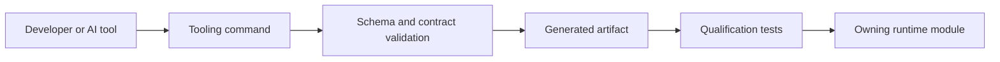

# Tooling Runtime Contracts

Nodics Tooling provides developer commands, generated manifests,
documentation validation, application builder contracts, AI context, and
quality gates. Tooling is not a runtime business authority; it prepares,
validates, and proves work that other modules own. For beginners, tooling is
the workshop: it helps create and inspect artifacts, while the runtime modules
decide business behavior.

## Business problem

The business problem is safe acceleration. Teams want AI tools, generators,
and scripts to move quickly, but a generated file should not silently become
the authority for products, pages, payments, or permissions. Tooling solves
this by enforcing contracts, source evidence, data release manifests,
documentation gates, and application builder qualification before production
use.

## Source map

| Area | Source location |
| --- | --- |
| Tooling module | `../nodics.foundation/modules/nTooling/` |
| CLI commands | `../nodics.foundation/modules/nTooling/bin/` |
| Application builder contracts | `../nodics.foundation/modules/nTooling/contracts/applicationBuilder/` |
| Documentation validation service | `../nodics.foundation/modules/nTooling/src/service/defaultApplicationDocumentationContractService.js` |
| Documentation record validation | `../nodics.foundation/modules/nTooling/src/service/defaultApplicationDocumentationRecordValidationService.js` |
| Tooling tests | `../nodics.foundation/modules/nTooling/test/` |

## Tooling flow



## Contract

Tooling commands should be deterministic, bounded, auditable, and safe to run
in local development. Generated manifests should be rebuilt from source files,
not hand maintained. Documentation validation should fail when pages lack
source evidence, audience balance, verification, visual evidence, or unsafe
wording. Application builder contracts should preserve module ownership and
avoid writing hidden business logic.

```js
const toolingResult = {
  contract: 'nodics.tooling.command/v1',
  artifact: 'data/manifest.json',
  status: 'VALIDATED',
  owner: 'nTooling'
};
```

## Customization and extension guidance

Developers can add commands, contract schemas, validators, qualification
reports, builder adapters, and source-map checks. Business users should see
tooling output only as governed setup readiness, validation reports, or
generated application options. Operators should know which artifacts were
generated, which checks passed, and which command version produced them in
production preparation.

## Operating rules

Tooling output should be reproducible from committed source, configuration,
and declared inputs. A command that edits data, documentation, or application
contracts should publish clear evidence: changed files, generated hashes,
validation result, and owner module. AI-assisted commands follow the same
rules as developer commands. They can propose or generate artifacts, but they
cannot bypass source evidence, tests, release checks, or module ownership.

For beginners, a tooling failure is usually a helpful stop sign. Fix the
authored source, catalogue metadata, command input, or generated checksum
before retrying. Do not edit generated runtime output to make the failure
disappear, because the next generator run will recreate the same mismatch.
Operators should keep failed command logs with the release evidence.

## Common mistakes

- Treating generated files as hand-authored source.
- Letting AI tools bypass validators.
- Adding a command without deterministic output and tests.
- Hiding contract failures behind generic success messages.
- Using tooling to override business ownership instead of supporting it.

## Verification

Run tooling tests, documentation validation, source coverage audit, application
builder qualification tests, and manifest generation checks. Production
readiness requires business-readable reports, developer source evidence,
operator command traceability, and QA proof that generated artifacts match the
authored source and runtime contract.
