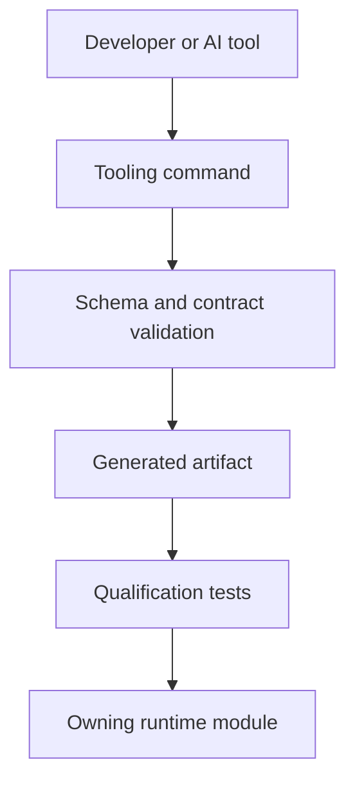
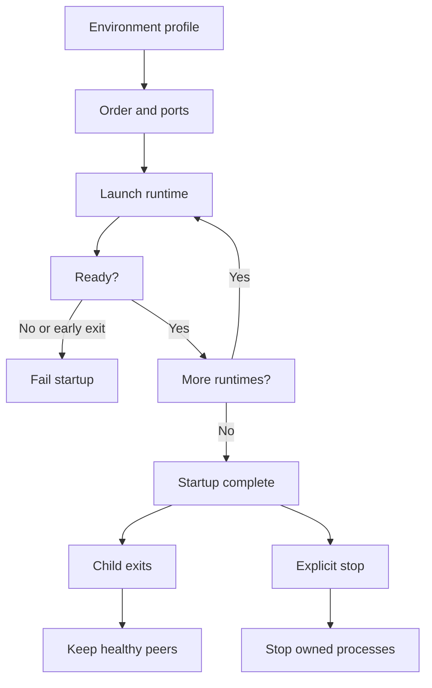

# Tooling Runtime Contracts

Nodics Tooling provides developer commands, generated manifests,
documentation validation, application builder contracts, AI context, and
quality gates. Tooling is not a runtime business authority; it prepares,
validates, and proves work that other modules own. Think of a local topology as
a set of process launch instructions: starting a process does not register or
activate every business capability it contains.

## Independent local processes

Local topology is declared in the existing environment-owned
`nodics.environment.json`. `dependsOn` controls startup ordering, not continuous
coupling between processes. A failure during the requested launch still stops
that incomplete launch and reports failure. After successful startup, a runtime
exit leaves its peers running and records the exit in supervisor diagnostics.

Use `npm run topology:status` and the affected runtime's generated log to
diagnose the failure. Required API operations remain unavailable until their
owner recovers; optional enrichment follows the owning service contract.
Use the runtime's existing start command for independent operator-owned recovery,
or explicitly stop and restart the full topology. An independently restarted
process must be stopped by its operator before a later supervised full launch.
There is no new restart-policy configuration, polling service or registry.

Verify with `projectTopologyIsolationContract.test.js` and
`projectTopologyStopContract.test.js` under nTooling. The tests use disposable
local processes and must not terminate a customer's running topology.

## Business problem

The business problem is safe acceleration. Teams want AI tools, generators,
and scripts to move quickly, but a generated file should not silently become
the authority for products, pages, payments, or permissions. Tooling solves
this by enforcing contracts, source evidence, data release manifests,
documentation gates, and application builder qualification before production
use.

## Source map

| Area | Source location |
| --- | --- |
| Tooling module | `../nodics.foundation/modules/nTooling/` |
| CLI commands | `../nodics.foundation/modules/nTooling/bin/` |
| Application builder contracts | `../nodics.foundation/modules/nTooling/contracts/applicationBuilder/` |
| Documentation validation service | `../nodics.foundation/modules/nTooling/src/service/defaultApplicationDocumentationContractService.js` |
| Documentation record validation | `../nodics.foundation/modules/nTooling/src/service/defaultApplicationDocumentationRecordValidationService.js` |
| Tooling tests | `../nodics.foundation/modules/nTooling/test/` |

## Tooling flow



## Contract

Tooling commands should be deterministic, bounded, auditable, and safe to run
in local development. Generated manifests should be rebuilt from source files,
not hand maintained. Documentation validation should fail when pages lack
source evidence, audience balance, verification, visual evidence, or unsafe
wording. Application builder contracts should preserve module ownership and
avoid writing hidden business logic.

```js
const toolingResult = {
  contract: 'nodics.tooling.command/v1',
  artifact: 'data/manifest.json',
  status: 'VALIDATED',
  owner: 'nTooling'
};
```

## Customization and extension guidance

Developers can add commands, contract schemas, validators, qualification
reports, builder adapters, and source-map checks. Business users should see
tooling output only as governed setup readiness, validation reports, or
generated application options. Operators should know which artifacts were
generated, which checks passed, and which command version produced them in
production preparation.

## Local runtime lifecycle



The distinction is the end of startup. An optional process that is explicitly
included in the requested launch must still start successfully for that launch
to succeed. Optionality means a project may omit the capability; it does not
mean tooling should report a successful launch when a selected process failed.
After startup completes, unrelated processes are not stopped when a child exits.

Local supervision is not a production orchestrator. It does not add automatic
restart, leader election, failover, continuous deep health remediation or a new
per-process restart-policy setting. Several modules in one Node process share
that process's failure boundary. Separate processes are required when process
isolation is part of the deployment requirement.

## Customize and extend safely

### Select a project-owned process layout

Owner: nTooling supplies the supervisor. The customer backend project owns
`envs/<environment>/nodics.environment.json`, its server package composition,
and the existing project launch commands. Do not copy
`defaultProjectTopologyService.mjs` into a customer script to change the layout.

The following is a **topology fragment**, to merge into an existing valid
environment profile. It assumes that `start:platform` and `start:waste` already
exist in the project's command contract and launch servers on the shown ports.
The names and ports are illustrative and must agree with the actual runtime
configuration. It is not a complete environment or a ready-to-run new project.

```json
{
  "topology": {
    "groups": {
      "backends": [
        {
          "code": "platform",
          "label": "Platform",
          "script": "start:platform",
          "port": 4300
        },
        {
          "code": "waste",
          "label": "Waste",
          "script": "start:waste",
          "port": 4370,
          "dependsOn": ["platform"]
        }
      ]
    }
  }
}
```

This example explains startup ordering only. It does not remove the protected
WCMS requirement from an Axis-enabled deployment; keep the other required
entries in the real profile. Location is not added merely because some Waste
operations use it remotely. If the project selects a Location-dependent
journey, separately supply that runtime and its governed availability.

| Existing field | Behavior | Customization check |
| --- | --- | --- |
| `topology.groups.backends` | Ordered backend processes for a launch. | Include only intended processes; preserve actual boot prerequisites. |
| `topology.groups.frontends` | Processes included when frontend launch is selected. | A running UI is not proof of backend readiness. |
| `code` | Process identity within the profile. | Keep identities stable and dependencies resolvable. |
| `script` | Existing project npm command to execute. | Verify command selection and configured server/environment. |
| `command`, `args`, `cwd` | Existing explicit command alternative and working directory. | Use a trusted project-controlled executable and directory. |
| `port` | Local listening/readiness probe target. | Match the process configuration; changing only this field does not move the server. |
| `dependsOn` | Required earlier entries in the declared launch order. | Unknown or later dependencies fail; the supervisor does not sort them for you. |
| `readyPath` | Health path; backend default is `/nodics/system/v0/health/ready`. | Use the owner's readiness endpoint, not an arbitrary page that always returns success. |
| `readinessChecks` | Additional startup HTTP checks. | Keep requests read-only and do not embed credentials in source. |
| `env` | Per-process environment entries merged over inherited environment. | Use the existing configuration/secret authority; do not log secrets. |
| `topology.stateDirectory` | Generated process state and log location. | Do not hand-edit generated PIDs or treat this as desired-state configuration. |

The readiness loop has a 90-second default per-runtime wait and bounded
five-second HTTP requests. These are current implementation defaults, not new
environment knobs. Status probes the primary readiness endpoint; passing status
is not a replay of every additional startup check or every business journey.

### Apply, verify and roll back a layout change

1. Review the selected environment and actual command definitions before
   editing. Keep the project identity in its package metadata and topology in
   the existing environment profile.
2. Change only the selected entries and legitimate startup prerequisites.
   Ensure every dependency appears earlier in the list.
3. Run the project's existing `topology:preflight` in the intended environment.
   A busy port is a stop condition, not permission to kill its occupant.
4. In an approved disposable environment, run `topology:start` or
   `topology:start:all`. The latter includes the declared frontends. Observe each
   READY message and the final startup-complete message.
5. Inspect `topology:status`, then test the actual authorized business operation.
   Starting processes does not prove activation data has been imported.
6. Roll back the project profile change through source control, then perform an
   approved stop/restart. Reverting topology source does not alter already
   running processes, imported data or persisted registrations.

Example commands for projects exposing the standard npm wrappers, run from
that project's root. Status and preflight inspect; start and stop operate
processes and require an appropriate environment and operator authorization:

```bash
npm run topology:status
npm run topology:preflight
npm run topology:start:all
```

Do not run the start command over an existing installation just to follow this
guide. Keep the active supervisor terminal available; it owns the launched
process groups. Individual environments may select their profile through their
existing launcher rather than a universal command-line flag.

### Failure and independent recovery example

Starting state: the requested topology has completed startup, then one runtime
exits. First inspect status and
`envs/<environment>/generated/local-topology/<runtime-code>.log`, unless the
profile specifies a different state directory. An exited child is recorded;
healthy peers remain running. A supervisor still running does not mean every
child is healthy.

After correcting the runtime fault, either use that runtime's existing start
command in a separate operator-owned terminal, or schedule an explicit full
stop/restart. Independent restart is not automatically adopted by the old
supervisor. Status can show a ready listening port as `EXTERNAL_OR_UNKNOWN`;
the operator must stop that process before a later full supervised launch.

If a request failed during the outage, inspect its authoritative status before
retrying a mutation. Do not infer rollback from a connection failure. Existing
approval, publication and idempotency contracts remain in force. Process
recovery does not auto-register a module, import optional data or erase records.

### Boundaries projects cannot replace

Startup ordering is not a substitute for local module inheritance or backend
authorization. Projects must not add a permissive readiness endpoint, copy the
supervisor, edit recorded PIDs, or reset storage to conceal startup failures.
There is no supported topology setting that turns a failed required business
operation into success. Additional production availability requirements belong
to the selected deployment infrastructure and owning service contracts.

## Troubleshooting matrix

| Symptom | Cause to investigate | Expected recovery |
| --- | --- | --- |
| Unknown dependency | `dependsOn` points outside the selected runtime list. | Correct the project profile; do not invent a dummy process. |
| Must be declared after dependency | Dependent entry precedes its prerequisite. | Reorder the existing entries and rerun preflight. |
| Refusing to start: ports busy | Another supervised or operator-owned process is listening. | Identify its owner; explicitly stop it only when authorized. |
| Runtime exits before READY | Selected startup command failed. | Inspect that runtime log, fix the cause and retry the incomplete launch. |
| Runtime exits after startup | Process fault isolated from healthy peers. | Restore only the failed runtime or schedule a full restart. |
| HTTP readiness timeout | Wrong endpoint, incomplete boot, or unavailable required infrastructure. | Fix the owner's readiness cause; do not bypass the check. |
| Status ready, feature unavailable | Registration, activation, permissions or secondary owner unavailable. | Diagnose in Module Registry and the owning API. |
| Stop refuses stale state or reports listening ports | State does not prove ownership, or an independently restarted process remains. | Resolve ownership explicitly; do not signal guessed PIDs. |

## Project regression examples

Run from the framework repository root. These tests create disposable fixtures
and processes rather than terminating the operator's running topology:

```bash
node --test nodics.foundation/modules/nTooling/test/projectTopologyIsolationContract.test.js
node --test nodics.foundation/modules/nTooling/test/projectTopologyStopContract.test.js
node --test nodics.foundation/modules/nTooling/test/projectTopologyRuntimeEnvContract.test.js
```

In the project repository, add a profile test asserting that selected scripts
exist, ports match configuration, dependencies precede their consumers, and
optional remote integrations have not become whole-topology prerequisites.
Exercise both an early startup failure and a post-start exit in disposable
processes. Assert the first fails the requested launch and the second preserves
an unrelated healthy peer. Keep permission and mutation-retry tests at the
owning API, not in the supervisor.

These gates prove local supervisor behavior. They do not qualify container
orchestration, distributed failover, backup restoration or production capacity.
Generated documentation validation is similarly distinct from publication:
author source, regenerate, validate, review rendering, then use the governed
documentation release lifecycle to make the content available to users.

## Operating rules

Tooling output should be reproducible from committed source, configuration,
and declared inputs. A command that edits data, documentation, or application
contracts should publish clear evidence: changed files, generated hashes,
validation result, and owner module. AI-assisted commands follow the same
rules as developer commands. They can propose or generate artifacts, but they
cannot bypass source evidence, tests, release checks, or module ownership.

For beginners, a tooling failure is usually a helpful stop sign. Fix the
authored source, catalogue metadata, command input, or generated checksum
before retrying. Do not edit generated runtime output to make the failure
disappear, because the next generator run will recreate the same mismatch.
Operators should keep failed command logs with the release evidence.

## Common mistakes

- Treating generated files as hand-authored source.
- Letting AI tools bypass validators.
- Adding a command without deterministic output and tests.
- Hiding contract failures behind generic success messages.
- Using tooling to override business ownership instead of supporting it.

## Verification

Run tooling tests, documentation validation, source coverage audit, application
builder qualification tests, and manifest generation checks. Production
readiness requires business-readable reports, developer source evidence,
operator command traceability, and QA proof that generated artifacts match the
authored source and runtime contract.


## Application Builder source and customer ownership

Application Builder uses explicit frontend and customer source roots. A project
administrator declares business presets, market choices, stores, catalogs,
frontend selections and data-pack ownership under `nodics.applicationBuilder`
in the existing customer package metadata. Each participating data module opts
in with `applicationBuilder.dataPack: true`. Developers can choose unrelated
frontend, renderer, composition and pack identifiers without changing nTooling.
Framework package metadata continues to own backend dependencies.

| Input or evidence | Meaning | Failure and recovery |
| --- | --- | --- |
| Customer composition declaration | Intended frontend/domain/renderer/data wiring | Correct the customer declaration, rediscover and review a new plan |
| Explicit source roots | Repositories available to planning | Supply missing roots; CI cannot invent replacements |
| Approved plan and source digest | Exact reviewed generation inputs | Regenerate and approve after any source metadata change |
| Generated starter tests and HTTP probes | Standalone generated output works locally | Inspect the qualification report and repair the customer output or generator |
| External deployment acceptance | Actual selected frontends, authentication, providers and imported data work together | Run the deployment's separate acceptance scenarios |

A beginner chooses a declared preset and reviews the result before generation.
A maintainer can use `--frontend`, `--customer`, or an explicit `--experience`
workspace plus `--frontend-code`. Multiple available storefronts require a
selection. A disabled sample-data choice produces empty product, price and
inventory samples. Supporting frontend wiring is generated from the selected
codes; source repositories retain their ownership.

An existing approved plan cannot silently adopt changed customer metadata or
renamed output files. Builder rejects stale bindings and existing protected
output roots. The independent-customer contract test exercises another market,
store, renderer and data module, rejects unsupported selections, and boots the
generated starter on disposable local ports. These are source and starter
checks; they do not establish deployment readiness for external applications.
