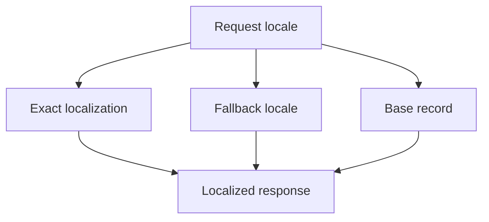

# Localization Runtime Authoring

Localization lets Nodics present content, commerce, messages, and backoffice
labels in the right language and regional format without duplicating business
objects. For beginners, the base record identifies the thing and localization
records describe how that thing should be displayed for a locale. Axis can
offer authoring journeys, but localization schemas and services own fallback,
validation, and runtime resolution.

## Source map

| Area | Source location |
| --- | --- |
| Localization core | `../nodics.localization/modules/localizationCore/package.json` |
| Localization module docs | `docs/pages/nodics.localization/localization-internationalization.md` |
| CMS localization | `../nodics.wcms/modules/cms/src/service/localization/defaultCmsContentLocalizationService.js` |
| Product localization example | `../../nodics.kickoff/modules/agora.apparel/data/sample-v001/commerce/records/` |
| Import runtime | `../nodics.foundation/modules/nData/nImport/import/src/service/import/defaultImportService.js` |

## Resolution model



The business problem is consistent customer communication. A missing locale
can break a product page, legal message, email, or content route. Developers
need a repeatable record shape. Operators need evidence for fallback behavior
in production so missing translations do not appear as broken pages.

## Authoring contract

Localization records should include the owner object code, locale, translated
fields, publication or lifecycle state where relevant, and stable query keys.
They should not copy unrelated base data or contain runtime logic.

```js
module.exports = {
  linenDressEn: {
    code: 'linenDress_en',
    productCode: 'linenDress',
    locale: 'en',
    name: 'Linen Dress',
    description: 'Lightweight woven dress'
  }
};
```

## Customization and extension guidance

Developers can add locale providers, fallback strategies, field validators,
translation workflow hooks, and locale-specific formatting. Business users
should see missing translation tasks and approval state in Axis. AI tools can
assist translation, but they must preserve stable keys, source locale, review
state, and terminology rules. Operators should track fallback rates and
missing locale counts.

## Implementation handoff

Each localized capability should document its base schema, localization schema,
fallback chain, supported locales, reviewed fields, import header, and browser
proof. Business users can then decide translation completeness, developers can
extend fields safely, operators can watch production fallback usage, and QA
owners can verify exact locale, fallback locale, and missing locale behavior.

## Evidence checklist

Every localization change should carry source locale, target locale, field
list, reviewer, fallback decision, and the consuming route or API. Production
operators should know whether a fallback was expected or caused by missing
data. Developers should include tests for partial translation because mixed
content is common during rollout. Business users should be able to see which
terms are ready for publication and which still need review.

## Common mistakes

- Duplicating entire products or pages per locale instead of localizing fields.
- Publishing translated content before business review.
- Forgetting fallback rules for emails, pages, and product cards.
- Mixing locale data with currency, pricing, or tax authority.
- Hiding missing translation counts from production monitoring.

## Verification

Import base and localized records into a fresh schema. Request exact locale,
fallback locale, and unsupported locale responses. Open Axis, Nexus, or Agora
in the browser and verify labels, pages, products, and empty states. Production
readiness requires developer tests, business review evidence, operator
fallback metrics, and QA proof for each supported locale.
